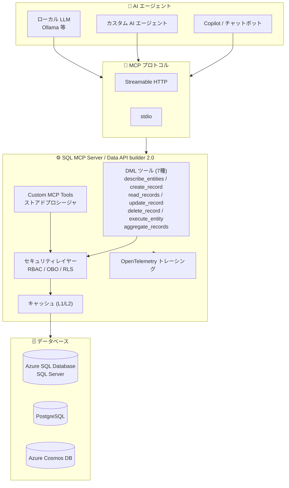

# Azure SQL Database: SQL MCP Server 一般提供開始 (GA)

**リリース日**: 2026-06-11

**サービス**: Azure SQL Database

**機能**: SQL MCP Server (General Availability)

**ステータス**: Launched (GA)

[このアップデートのインフォグラフィックを見る](https://takech9203.github.io/azure-news-summary/20260611-sql-mcp-server-ga.html)

## 概要

SQL MCP Server が一般提供 (GA) となった。SQL MCP Server は、Data API builder (DAB) に搭載された Model Context Protocol (MCP) の実装であり、AI エージェントがデータベースと安全かつ高性能にやり取りするためのプロトコル準拠ツールである。データベースを直接公開したり、脆弱な自然言語パーシング (NL2SQL) に依存したりすることなく、AI エージェントを本番データに対して制御されたアクセスで接続するためのセキュアな手段を提供する。

2026 年 3 月のパブリックプレビュー (DAB 1.7) から約 3 か月を経て GA に到達した本リリースでは、DAB 2.0 で導入された複数の新機能が含まれている。特に、集計クエリ用の `aggregate_records` ツールの追加、ストアドプロシージャをカスタム MCP ツールとして公開する機能、On-Behalf-Of (OBO) ユーザー委任認証、Auto Configuration によるスキーマ自動検出、ロール継承、および OpenTelemetry トレーシングの MCP 対応が主要な強化点である。

SQL MCP Server は SQL Server および Azure SQL Database をプライマリとしつつ、PostgreSQL および Azure Cosmos DB にも対応しており、マルチデータベース環境でのエージェンティック AI ソリューション構築を可能にする。

**アップデート前の課題 (Preview 時点)**

- DML ツールは 6 種のみで、集計クエリ (COUNT, SUM, AVG 等) を実行するにはすべての行を読み取る必要があった
- ストアドプロシージャは汎用の `execute_entity` ツールでのみ実行可能で、AI エージェントが名前で直接発見・呼び出すことができなかった
- 大規模データベースではエンティティを手動で 1 つずつ構成ファイルに追加する必要があり、構成の負担が大きかった
- MCP シナリオでの実際のユーザー識別が不透明で、行レベルセキュリティの適用が限定的だった
- パブリックプレビュー段階であり、本番環境での利用が推奨されていなかった

**アップデート後の改善**

- `aggregate_records` ツールが追加され、COUNT, SUM, AVG, MIN, MAX の集計クエリをネイティブに実行可能になった (GROUP BY, HAVING, DISTINCT 対応)
- Custom MCP Tools により、ストアドプロシージャを名前付きツールとして MCP ツールリストに直接公開可能になった
- Auto Configuration (`autoentities`) により、パターンマッチでデータベースオブジェクトを自動検出・公開できるようになった
- On-Behalf-Of (OBO) 認証により、実際の呼び出しユーザーの ID をデータベースまで透過的に伝搬し、行レベルセキュリティを正確に適用可能になった
- ロール継承により、権限設定の重複を排除し構成を簡素化できるようになった
- GA となり本番環境での利用が正式にサポートされた

## アーキテクチャ図



SQL MCP Server は AI エージェントとデータベースの間に位置し、MCP プロトコルを通じてツールを公開する。すべてのリクエストは RBAC / OBO / RLS によるセキュリティチェックを経てからデータベースに到達し、結果はキャッシュされ、全操作が OpenTelemetry でトレースされる。

## サービスアップデートの詳細

### 主要機能

#### Preview (DAB 1.7) からの継続機能

1. **6 つの DML ツール**
   - `describe_entities`: 利用可能なエンティティとその操作を返す
   - `create_record`: テーブルに新しいレコードを挿入
   - `read_records`: フィルタリング、ソート、ページネーション、フィールド選択をサポートしたクエリ
   - `update_record`: 既存レコードを更新
   - `delete_record`: 既存レコードを削除
   - `execute_entity`: ストアドプロシージャを実行

2. **NL2DAB モデル**
   - AI モデルが直接 SQL を生成するのではなく、DAB のエンティティ抽象化レイヤーを通じて決定論的な T-SQL を生成
   - 同じ入力に対して常に同じ出力が保証される

3. **RBAC 統合**
   - REST、GraphQL、MCP の全エンドポイントで一貫したロールベースアクセス制御

#### GA (DAB 2.0) での新機能

4. **`aggregate_records` ツール (新規)**
   - COUNT, SUM, AVG, MIN, MAX の集計関数をネイティブサポート
   - `groupby` パラメータによるグルーピング
   - `having` パラメータによるグループフィルタリング (eq, neq, gt, gte, lt, lte, in 演算子)
   - `distinct` パラメータによる重複除外
   - `query-timeout` 設定 (1-600 秒) による長時間クエリの制御
   - ページネーション対応 (`first`, `after` パラメータ)

5. **Custom MCP Tools (新規)**
   - ストアドプロシージャを名前付き MCP ツールとして直接登録
   - エンティティに `"custom-tool": true` を設定するだけで、`tools/list` および `tools/call` に自動公開
   - ツール名はエンティティ名から snake_case に変換 (例: `GetProductById` -> `get_product_by_id`)
   - 汎用の `execute_entity` より意味的に明確で、エージェントが目的に応じたツールを発見しやすい

6. **Auto Configuration (新規)**
   - `autoentities` パターンによるデータベースオブジェクトの自動検出と公開
   - include/exclude パターンで対象オブジェクトを制御
   - DAB 起動ごとにパターンを再評価し、新しいテーブルを自動追加
   - `dab auto-config-simulate` による事前プレビュー

7. **On-Behalf-Of (OBO) ユーザー委任認証 (新規)**
   - Microsoft Entra ID を使用したパススルー認証
   - 呼び出し元ユーザーのトークンをデータベース用トークンに交換
   - データベースが実際のユーザー ID を認識し、行レベルセキュリティを正確に適用
   - MCP シナリオでの「誰が操作しているか」の透明性を確保

8. **ロール継承 (新規)**
   - `named-role -> authenticated -> anonymous` の継承チェーン
   - 権限設定の重複を排除
   - `dab configure --show-effective-permissions` で解決済み権限を確認可能

9. **Permission-aware OpenAPI (新規)**
   - ロールごとに許可されたメソッドとフィールドのみを表示する OpenAPI ドキュメント
   - `/openapi/{role}` パスでロール別の API コントラクトを確認可能

10. **HTTP レスポンス圧縮 (新規)**
    - REST / GraphQL レスポンスの圧縮 (`optimal`, `fastest`, `none`)
    - 大規模な結果セットや低帯域幅環境で有効

11. **OpenTelemetry の MCP トレーシング対応 (新規)**
    - MCP ツール実行が REST / GraphQL と同様に OpenTelemetry トレースに含まれる
    - `dab init` でデフォルトの OTEL セクションが自動生成

## 技術仕様

| 項目 | 詳細 |
|------|------|
| MCP プロトコルバージョン | 2025-06-18 (固定デフォルト) |
| トランスポート | Streamable HTTP、stdio |
| HTTP エンドポイント | `/mcp` (デフォルトパス) |
| 対応 DAB バージョン | 1.7 以降 (GA 機能は 2.0 以降) |
| DML ツール数 | 7 (describe_entities, create_record, read_records, update_record, delete_record, execute_entity, aggregate_records) |
| カスタムツール | ストアドプロシージャを名前付きツールとして登録可能 |
| リクエストサイズ制限 (stdio) | 1 MB |
| 集計クエリタイムアウト | 1-600 秒 (設定可能) |
| キャッシュ | read_records の結果は自動キャッシュ (L1 / L2) |
| 認証 | RBAC, OBO (Entra ID), Unauthenticated, Simulator |
| テレメトリ | OpenTelemetry (OTEL) 対応 |
| ヘルスチェック | REST, GraphQL, MCP エンドポイントの統合ヘルスチェック |
| レスポンス圧縮 | optimal, fastest, none |
| ライセンス | オープンソース (無料) |

## 対応データベース

| データベース | サポート状況 |
|------|------|
| Microsoft SQL Server | 対応 |
| Azure SQL Database | 対応 |
| Azure Cosmos DB (NoSQL) | 対応 |
| PostgreSQL | 対応 |
| MySQL | 対応 |
| SQL Data Warehouse | 対応 |

## 設定方法

### 前提条件

1. Data API builder バージョン 2.0 以降がインストールされていること
2. 対応するデータベースへの接続情報
3. (OBO を使用する場合) Microsoft Entra ID アプリ登録

### DAB CLI による初期設定

```bash
# DAB 構成ファイルの初期化
dab init --database-type mssql --connection-string "<your-connection-string>" --config dab-config.json --host-mode development
```

### Auto Configuration によるエンティティ自動検出

```bash
# パターンによる自動構成
dab auto-config my-def \
  --patterns.include "dbo.%" \
  --patterns.exclude "dbo.internal%" \
  --patterns.name "{schema}_{object}" \
  --permissions "anonymous:read"

# シミュレーションで結果を事前確認
dab auto-config-simulate
```

### カスタムツールの追加 (ストアドプロシージャ)

```bash
# ストアドプロシージャを名前付き MCP ツールとして登録
dab add GetProductById \
  --source dbo.get_product_by_id \
  --source.type "stored-procedure" \
  --permissions "anonymous:execute" \
  --mcp.custom-tool true \
  --description "Returns full product details for a given product ID"
```

### OBO 認証の構成

```bash
# 環境変数の設定
export DAB_OBO_CLIENT_ID="<client-id>"
export DAB_OBO_TENANT_ID="<tenant-id>"
export DAB_OBO_CLIENT_SECRET="<client-secret>"

# OBO の有効化
dab configure --data-source.user-delegated-auth.enabled true
dab configure --data-source.user-delegated-auth.provider EntraId
dab configure --data-source.user-delegated-auth.database-audience "https://database.windows.net"
dab configure --runtime.cache.enabled false
```

### MCP ランタイム構成 (dab-config.json)

```json
{
  "runtime": {
    "mcp": {
      "enabled": true,
      "path": "/mcp",
      "dml-tools": {
        "describe-entities": true,
        "create-record": true,
        "read-records": true,
        "update-record": true,
        "delete-record": true,
        "execute-entity": true,
        "aggregate-records": {
          "enabled": true,
          "query-timeout": 30
        }
      }
    }
  }
}
```

### サーバーの起動

```bash
# HTTP トランスポートで起動
dab start

# stdio トランスポートで起動 (ローカル開発用)
dab start --mcp-stdio

# MCP Inspector によるテスト
npx -y @modelcontextprotocol/inspector http://localhost:5000/mcp
```

## メリット

### ビジネス面

- GA となったことで本番環境での利用が正式にサポートされ、エンタープライズでの採用障壁が解消された
- Auto Configuration により、大規模データベースでも最小限の構成作業で AI エージェント統合を開始できる
- OBO 認証によりコンプライアンス監査で実際のユーザー操作を追跡可能になった
- オープンソースかつ無料であり、追加ライセンスコストが発生しない

### 技術面

- `aggregate_records` ツールにより、全行読み取りの回避が可能となりパフォーマンスとコンテキストウィンドウの効率が向上
- Custom MCP Tools により、複雑なビジネスロジックをストアドプロシージャとして実装し、エージェントに安全に公開可能
- ロール継承により構成ファイルの重複が削減され、保守性が向上
- OpenTelemetry の統合トレーシングにより、REST/GraphQL/MCP 全エンドポイントを単一のダッシュボードで監視可能
- NL2DAB モデルにより決定論的なクエリ生成が保証され、デバッグとテストが容易

## デメリット・制約事項

- DDL (スキーマ変更) 操作はサポートされない (意図的設計)
- JOIN 操作は `read_records` ツールで直接サポートされない (ビューまたはストアドプロシージャで対応)
- stdio トランスポートのリクエストサイズは 1 MB に制限されている
- Auto Configuration (`autoentities`) は現時点で Microsoft SQL データベースのテーブルのみ対応
- OBO 認証使用時はキャッシュを無効にする必要がある (ユーザーごとの接続プール分離のため)
- `describe_entities` のレスポンスにデータ型や主キーインジケータは含まれない
- Custom MCP Tools の `inputSchema` は現在空の `properties` を返し、エージェントはツール説明と `describe_entities` からパラメータを推論する

## ユースケース

### ユースケース 1: エンタープライズ Copilot による安全なデータアクセス

**シナリオ**: 社内 Copilot が本番データベースに対して、実際のユーザー権限で安全にデータ照会を行う。

**実装例**:

```json
{
  "data-source": {
    "database-type": "mssql",
    "connection-string": "@env('SQL_CONNECTION_STRING')",
    "user-delegated-auth": {
      "enabled": true,
      "provider": "EntraId",
      "database-audience": "https://database.windows.net"
    }
  },
  "entities": {
    "Customers": {
      "description": "顧客マスターデータ",
      "source": { "object": "dbo.Customers", "type": "table" },
      "permissions": [
        {
          "role": "authenticated",
          "actions": [
            {
              "action": "read",
              "fields": {
                "include": ["CustomerID", "Name", "Email", "Plan"],
                "exclude": ["CreditCardNumber"]
              }
            }
          ]
        }
      ]
    }
  }
}
```

**効果**: OBO 認証により実際のユーザー ID がデータベースに伝搬され、行レベルセキュリティが正確に適用される。機密フィールドはフィールドレベルの exclude で保護される。

### ユースケース 2: 集計レポートを提供する分析エージェント

**シナリオ**: BI エージェントが売上データの集計を実行し、マネージャーにサマリーを提供する。

**実装例**:

```json
{
  "method": "tools/call",
  "params": {
    "name": "aggregate_records",
    "arguments": {
      "entity": "Sales",
      "function": "sum",
      "field": "Amount",
      "groupby": ["Region", "ProductCategory"],
      "having": { "gt": 10000 },
      "orderby": ["sum desc"],
      "first": 10
    }
  }
}
```

**効果**: 全行を読み取る必要なく、データベース側で集計処理が実行されるため、パフォーマンスが向上しエージェントのコンテキストウィンドウを節約できる。

### ユースケース 3: カスタムツールによるビジネスロジックの公開

**シナリオ**: 複雑な在庫確認ロジックをストアドプロシージャとして実装し、注文処理エージェントに公開する。

**実装例**:

```bash
dab add CheckInventory \
  --source dbo.check_inventory \
  --source.type "stored-procedure" \
  --permissions "order-agent:execute" \
  --mcp.custom-tool true \
  --description "Checks inventory availability for a product across all warehouses"
```

**効果**: エージェントは `check_inventory` ツールを名前で発見し、直接呼び出せる。複雑なビジネスロジックはストアドプロシージャ内にカプセル化され、エージェントの実装から分離される。

## 料金

SQL MCP Server は Data API builder の機能として提供される。Data API builder はオープンソースかつ無料で利用可能である。データベース自体の利用料金 (Azure SQL Database、Azure Cosmos DB、PostgreSQL 等) は別途発生する。

## 関連サービス・機能

- **Data API builder (DAB) 2.0**: SQL MCP Server の基盤となるオープンソースエンジン。REST / GraphQL / MCP エンドポイントを単一の構成ファイルで管理する
- **Azure SQL Database**: SQL MCP Server が対応するプライマリデータベースサービス
- **Azure Cosmos DB**: NoSQL データベースとして SQL MCP Server からアクセス可能
- **PostgreSQL (Azure Database for PostgreSQL)**: SQL MCP Server が対応するオープンソースデータベース
- **Microsoft Entra ID**: OBO ユーザー委任認証の ID プロバイダー
- **Azure Key Vault**: DAB の `@akv()` 関数による接続文字列などの機密値管理
- **Azure Monitor / Application Insights**: OpenTelemetry トレーシングによる MCP 操作の監視
- **Data API builder with GitHub Copilot in MSSQL Extension**: VS Code の MSSQL 拡張機能で DAB の構成を自然言語で生成する関連機能

## 参考リンク

- [インフォグラフィック](https://takech9203.github.io/azure-news-summary/20260611-sql-mcp-server-ga.html)
- [公式アップデート情報](https://azure.microsoft.com/updates?id=564734)
- [SQL MCP Server 概要 - Microsoft Learn](https://learn.microsoft.com/azure/data-api-builder/mcp/overview)
- [DML ツールリファレンス - Microsoft Learn](https://learn.microsoft.com/azure/data-api-builder/mcp/data-manipulation-language-tools)
- [Custom MCP Tools 構成ガイド - Microsoft Learn](https://learn.microsoft.com/azure/data-api-builder/mcp/how-to-configure-custom-tools)
- [Data API builder 2.0 リリースノート](https://learn.microsoft.com/azure/data-api-builder/whats-new/version-2-0)
- [Data API builder ドキュメント](https://learn.microsoft.com/azure/data-api-builder/)
- [Preview 時のレポート](./2026-03-18-sql-mcp-server.md)

## まとめ

SQL MCP Server の GA は、AI エージェントとデータベースの統合が本番環境で正式にサポートされる段階に到達したことを意味する。Preview から GA への移行で、`aggregate_records` ツールの追加、Custom MCP Tools、Auto Configuration、OBO ユーザー委任認証、ロール継承といった実運用に不可欠な機能が追加された。特に OBO 認証とロール継承は、エンタープライズ環境でのセキュリティ・コンプライアンス要件を満たすために重要である。Solutions Architect としては、Copilot やカスタム AI エージェントからの安全なデータベースアクセスが必要なシナリオにおいて、SQL MCP Server の本番採用を積極的に検討すべきタイミングである。DAB 2.0 へのアップグレードにより、最小限の構成変更で GA 品質の MCP 機能を利用開始できる。

---

**タグ**: #Azure #AzureSQLDatabase #DataAPIBuilder #MCP #ModelContextProtocol #SQLMCPServer #AIエージェント #データベース #PostgreSQL #CosmosDB #GA #一般提供
