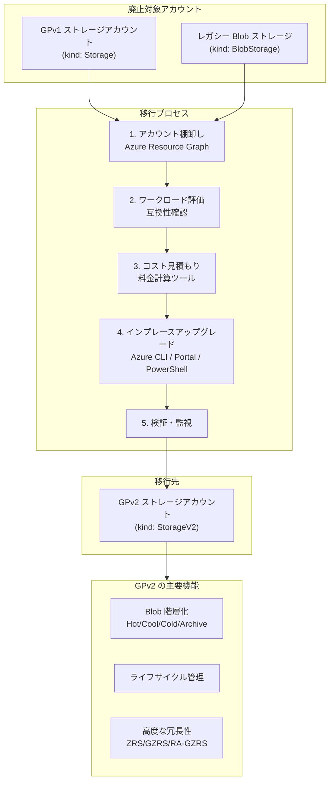

# Azure Storage: GPv1 および Legacy Blob ストレージアカウントの廃止

**リリース日**: 2026-06-11

**サービス**: Azure Storage

**機能**: GPv1 および Legacy Blob ストレージアカウントの新規作成停止・廃止

**ステータス**: Launched (廃止アナウンス)

[このアップデートのインフォグラフィックを見る](https://takech9203.github.io/azure-news-summary/20260611-storage-gpv1-legacy-blob-retirement.html)

## 概要

Microsoft は Azure Storage ポートフォリオの簡素化とパフォーマンス・スケーラビリティ・コスト効率の向上を目的として、General purpose v1 (GPv1) ストレージアカウントおよびレガシー Blob ストレージアカウントの廃止を正式に発表した。2026 年 6 月より GPv1 の新規作成がブロックされ、2026 年 10 月 13 日をもって完全廃止となる。

GPv2 は GPv1 のすべての機能を包含した上で、Blob の階層化 (Hot/Cool/Cold/Archive)、ライフサイクル管理、不変ストレージ、Event Grid 統合、ZRS などの高度な冗長性オプションをサポートしている。これらの最新機能と一貫した料金モデルの恩恵をすべての顧客に提供するため、レガシーなアカウントタイプの廃止が決定された。

GPv1 から GPv2 へのアップグレードはインプレース (その場) で実行可能であり、ダウンタイムやデータ損失のリスクはない。ただし、GPv2 ではトランザクション料金モデルが異なるため、読み取り/書き込み/リスト操作が多いワークロードではコストが増加する可能性がある。移行前にコストの見積もりと最適化計画を行うことが推奨される。

**アップデート前の課題**

- GPv1 では Blob の階層化 (Hot/Cool/Archive) が利用できず、コスト最適化が困難
- ライフサイクル管理ポリシーが使用できないため、データのティアリングを手動で行う必要がある
- GPv1 の料金メーターがリージョン間で一貫しておらず、コスト予測が複雑
- ZRS や GZRS などの高度な冗長性オプションが制限されている
- レガシー Blob ストレージアカウントではアカウントレベルの階層化のみで、Blob 単位の制御ができない

**アップデート後の改善**

- GPv2 への移行により Hot/Cool/Cold/Archive の Blob 単位の階層化が利用可能
- ライフサイクル管理ポリシーによる自動ティアリングでコスト最適化
- リージョン間で一貫した料金メーターによる予測可能なコスト管理
- ZRS/GZRS/RA-GZRS による高度な冗長性オプションの利用
- 不変ストレージ、Event Grid 統合など最新機能のフルサポート

## アーキテクチャ図



GPv1 およびレガシー Blob ストレージアカウントから GPv2 への移行フローを示す。インプレースアップグレードによりダウンタイムなしで移行が完了し、GPv2 の全機能が利用可能となる。

## サービスアップデートの詳細

### 主要変更点

1. **新規作成のブロック**
   - GPv1 ストレージアカウント: 2026 年 6 月より新規作成が無効化
   - レガシー Blob ストレージアカウント: 2026 年 3 月 3 日より新規作成が無効化済み

2. **完全廃止と自動移行**
   - 2026 年 10 月 13 日をもって GPv1 およびレガシー Blob ストレージアカウントは完全廃止
   - 期限までに移行しなかった場合、Microsoft により GPv2 へ自動移行が実施される
   - 自動移行により請求コストが増加する可能性がある

3. **Databricks DBFS アカウントの扱い**
   - Databricks マネージドリソースグループ内の DBFS アカウントはユーザー側の操作不要
   - Microsoft が廃止日前に自動的に GPv2 へ移行する

## 技術仕様

| 項目 | 詳細 |
|------|------|
| 廃止対象 (GPv1) | kind: `Storage` |
| 廃止対象 (レガシー Blob) | kind: `BlobStorage` |
| 移行先 | kind: `StorageV2` (General purpose v2) |
| 新規作成ブロック (GPv1) | 2026 年 6 月 |
| 新規作成ブロック (レガシー Blob) | 2026 年 3 月 3 日 |
| 完全廃止日 | 2026 年 10 月 13 日 |
| 移行方式 | インプレースアップグレード (ダウンタイムなし) |
| データ損失リスク | なし |
| ダウングレード可否 | 不可 (GPv2 から GPv1/Blob への戻しは不可) |
| 対象リージョン | 全 Azure リージョン (グローバル) |

### GPv1 と GPv2 の機能比較

| 機能 | GPv1 | GPv2 |
|------|------|------|
| Blob 階層化 (Hot/Cool/Archive) | 非対応 | 対応 |
| ライフサイクル管理 | 非対応 | 対応 |
| 不変 Blob ストレージ | 非対応 | 対応 |
| Event Grid 統合 | 限定的 | フル対応 |
| リージョン一貫料金メーター | 非対応 | 対応 |
| ZRS/高度な冗長性 | 限定的 | フル対応 |
| 最大 Ingress (主要リージョン) | 10 Gbps | 60 Gbps |
| 最大 Egress (US リージョン) | 20-30 Gbps | 200 Gbps |

## 設定方法

### 前提条件

1. 対象の GPv1 またはレガシー Blob ストレージアカウントの特定
2. Azure CLI 最新版、Azure PowerShell Az.Storage モジュール、または Azure Portal へのアクセス
3. ストレージアカウントへの書き込み権限

### 対象アカウントの特定 (Azure Resource Graph)

```kusto
Resources
| where type == "microsoft.storage/storageaccounts"
| where sku.name in~ ("Standard_LRS", "Standard_GRS", "Standard_ZRS", "Standard_RAGRS", "Standard_RAGZRS")
| where kind != "StorageV2"
| project name, type, tenantId, kind, location, resourceGroup, subscriptionId
```

### Azure CLI

```bash
# GPv1/レガシー Blob アカウントを GPv2 にアップグレード
az storage account update \
  -g <resource-group> \
  -n <storage-account> \
  --set kind=StorageV2 \
  --access-tier=Hot
```

### Azure PowerShell

```powershell
# GPv1/レガシー Blob アカウントを GPv2 にアップグレード
Set-AzStorageAccount `
  -ResourceGroupName <resource-group> `
  -Name <storage-account> `
  -UpgradeToStorageV2 `
  -AccessTier Hot
```

### Azure Portal

1. Azure Portal にサインイン
2. 対象のストレージアカウントに移動
3. **設定** セクションで **構成** を選択
4. **アカウントの種類** の下にある **アップグレード** を選択
5. アカウント名を入力して確認
6. **アップグレード** を選択

## メリット

### ビジネス面

- Blob 階層化とライフサイクル管理による長期的なストレージコスト削減
- 一貫した料金メーターによるコスト予測の簡素化
- 最新機能へのアクセスによる開発生産性の向上

### 技術面

- Hot/Cool/Cold/Archive の Blob 単位の細粒度な階層制御
- ライフサイクル管理ポリシーによるデータ移動の自動化
- ZRS/GZRS/RA-GZRS による高い可用性と耐障害性
- 最大 Ingress 60 Gbps、最大 Egress 200 Gbps の高いスループット (主要リージョン)
- 不変ストレージによるコンプライアンス対応
- Event Grid 統合によるイベントドリブンアーキテクチャの実現

## デメリット・制約事項

- GPv2 へのアップグレードは不可逆 (GPv1/レガシー Blob へのダウングレード不可)
- GPv2 ではトランザクション料金モデルが異なり、読み取り/書き込み/リスト操作が多いワークロードではコストが増加する可能性がある
- アップグレード時にアクセス層 (Hot/Cool) を指定しないとデフォルトで Hot が適用され、意図しない課金が発生する場合がある
- GPv2 への変換は Blob Storage の課金モデルを変更するが、Azure Files や Azure Disks の料金には影響しない

## ユースケース

### ユースケース 1: 高トランザクションワークロードの移行

**シナリオ**: 読み取り/書き込み操作が頻繁な GPv1 アカウントを GPv2 に移行する

**推奨アクション**:
- 移行前に Azure Monitor でトランザクションメトリクスのベースラインを取得
- Azure 料金計算ツールで GPv2 でのコストを事前見積もり
- 操作のバッチ化、大きなブロックサイズでの書き込み、リスト操作のスコープ限定でトランザクション数を削減
- コールドデータを Cool/Cold 層に移動するライフサイクルポリシーを設定

### ユースケース 2: アーカイブ中心のワークロードの移行

**シナリオ**: 大量の低アクセスデータを保持するレガシー Blob アカウントを GPv2 に移行する

**推奨アクション**:
- GPv2 のライフサイクル管理を活用し、一定期間アクセスされないデータを自動的に Cool → Cold → Archive に移行
- Blob 単位の階層化により、アクセスパターンに応じた最適なコスト配置を実現

## 料金

アップグレード自体は無料。ただし、GPv2 では料金モデルが以下のように変わる:

| 項目 | GPv1 | GPv2 |
|------|------|------|
| GB あたりのストレージコスト | 高め | 低め (特に Cool/Cold/Archive) |
| トランザクションコスト | シンプル | より細粒度 (層により異なる) |
| データアクセス料金 | - | Cool/Archive 層で読み取りに課金 |
| 階層変更料金 | - | Cool → Hot、Hot → Cool で課金 |

詳細な料金見積もりには [Azure 料金計算ツール](https://azure.microsoft.com/pricing/calculator/) を使用すること。

## 利用可能リージョン

本廃止は全 Azure リージョンに対してグローバルに適用される。

## 関連サービス・機能

- **Azure Blob Storage**: GPv2 アカウントで利用可能な階層化・ライフサイクル管理の主要対象
- **Azure Data Lake Storage**: GPv2 の階層型名前空間 (HNS) 機能として利用可能
- **Azure Monitor**: 移行前後のストレージメトリクス監視に活用
- **Azure Resource Graph**: 対象アカウントの棚卸しに使用
- **Azure Cost Management**: 移行後のコスト変動の監視・最適化

## 参考リンク

- [インフォグラフィック](https://takech9203.github.io/azure-news-summary/20260611-storage-gpv1-legacy-blob-retirement.html)
- [公式アップデート情報](https://azure.microsoft.com/updates?id=564441)
- [GPv1 ストレージアカウント廃止の概要 - Microsoft Learn](https://learn.microsoft.com/azure/storage/common/general-purpose-version-1-account-migration-overview)
- [レガシー Blob ストレージアカウント廃止の概要 - Microsoft Learn](https://learn.microsoft.com/azure/storage/common/legacy-blob-storage-account-migration-overview)
- [GPv2 ストレージアカウントへのアップグレード - Microsoft Learn](https://learn.microsoft.com/azure/storage/common/storage-account-upgrade)
- [ストレージアカウントの概要 - Microsoft Learn](https://learn.microsoft.com/azure/storage/common/storage-account-overview)
- [Azure Storage 料金ページ](https://azure.microsoft.com/pricing/details/storage/blobs/)

## まとめ

GPv1 およびレガシー Blob ストレージアカウントは 2026 年 10 月 13 日に完全廃止される。既に GPv1 の新規作成は 2026 年 6 月よりブロックされており、レガシー Blob は 2026 年 3 月 3 日からブロック済みである。期限までに移行しない場合、Microsoft により自動的に GPv2 へ移行されるが、事前にコスト影響を評価せずに自動移行されると予期しないコスト増加が生じる可能性がある。

**推奨される次のアクション:**
1. Azure Resource Graph を使用して対象アカウントを棚卸しする
2. Azure 料金計算ツールで GPv2 でのコストを見積もる
3. アクセス層 (Hot/Cool) を明示的に指定してインプレースアップグレードを実行する
4. ライフサイクル管理ポリシーを設定してコスト最適化を行う
5. 移行後のメトリクスを監視し、予期しないコスト変動がないか確認する

---

**タグ**: #Azure #Storage #StorageAccounts #GPv1 #GPv2 #Retirement #Migration #BlobStorage
