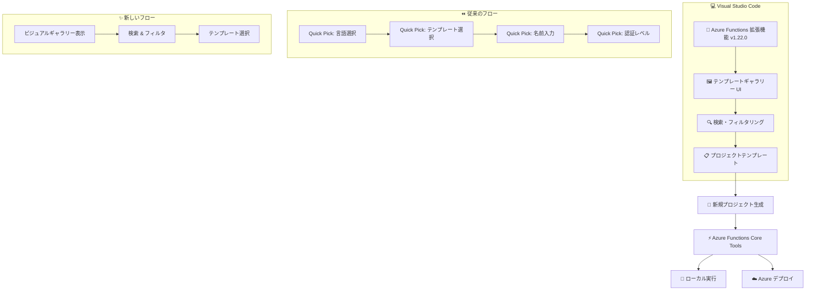

# Azure Functions: VS Code 向け新プロジェクトテンプレートとテンプレートギャラリー

**リリース日**: 2026-06-16

**サービス**: Azure Functions

**機能**: VS Code 拡張機能における新しいプロジェクトテンプレートギャラリー (Create New Project エクスペリエンスの刷新)

**ステータス**: In preview

[このアップデートのインフォグラフィックを見る](https://takech9203.github.io/azure-news-summary/20260616-functions-vscode-template-gallery.html)

## 概要

Azure Functions の VS Code 拡張機能において、新しい「Create New Project」エクスペリエンスがパブリックプレビューとして提供開始された。従来のマルチステップ Quick Pick ウィザード形式を置き換える、リッチでビジュアルなテンプレートギャラリーが導入された。

この新しいテンプレートギャラリーは、検索可能でフィルタリング可能なビューとしてプロジェクトテンプレートを表示し、開発者がより直感的に Azure Functions プロジェクトを作成できるようにする。この機能は Azure Functions VS Code 拡張機能バージョン 1.22.0 (2026-06-02 リリース) から利用可能であり、設定によるオプトインで有効化できる。

**アップデート前の課題**

- プロジェクト作成時にマルチステップの Quick Pick ウィザードを順番に進める必要があり、テンプレートの全体像が把握しにくかった
- テンプレートの検索やフィルタリングができず、目的のテンプレートを見つけるまでに複数のステップを経る必要があった
- テンプレートフィルターを「Core」や「All」に変更しないと追加のテンプレートが表示されなかった
- テンプレートの選択が逐次的で、一覧性に乏しかった

**アップデート後の改善**

- ビジュアルなテンプレートギャラリーにより、利用可能なすべてのテンプレートを一覧で確認できるようになった
- 検索機能により、キーワードで目的のテンプレートを素早く見つけられるようになった
- フィルタリング機能により、カテゴリ別にテンプレートを絞り込めるようになった
- ウィザードの複数ステップを経ることなく、ワンビューでテンプレートを選択できるようになった

## アーキテクチャ図



従来のマルチステップウィザード形式から、ビジュアルなテンプレートギャラリーへとプロジェクト作成エクスペリエンスが刷新された。開発者はギャラリー上で検索・フィルタリングを行い、目的のテンプレートを選択してプロジェクトを生成する。

## サービスアップデートの詳細

### 主要機能

1. **ビジュアルテンプレートギャラリー**
   - 従来の Quick Pick ウィザードに代わる、リッチなビジュアル UI によるテンプレート一覧表示
   - テンプレートの概要や対応言語が視覚的に確認可能

2. **検索機能**
   - キーワードによるテンプレート検索が可能
   - テンプレート名や説明文からの全文検索に対応

3. **フィルタリング機能**
   - カテゴリ別のフィルタリングによるテンプレートの絞り込み
   - v1.20.0 以降で導入されたカテゴリ別グルーピングの改善を基盤として構築

4. **オプトイン方式での有効化**
   - 設定 `azureFunctions.enableTemplateGallery` を `true` に設定することで有効化
   - 既存のウィザード方式も引き続き利用可能

## 技術仕様

| 項目 | 詳細 |
|------|------|
| 拡張機能バージョン | 1.22.0 以降 |
| 有効化設定 | `azureFunctions.enableTemplateGallery: true` |
| ステータス | パブリックプレビュー |
| 対応環境 | Visual Studio Code |
| 前提条件 | Azure Functions VS Code 拡張機能 |

## 設定方法

### 前提条件

1. Visual Studio Code がインストールされていること
2. Azure Functions 拡張機能 (v1.22.0 以降) がインストールされていること
3. Azure Functions Core Tools がインストールされていること (ローカル実行の場合)

### VS Code 設定

```json
// settings.json に以下を追加
{
    "azureFunctions.enableTemplateGallery": true
}
```

### テンプレートギャラリーの使用

1. VS Code のコマンドパレット (F1) を開く
2. `Azure Functions: Create New Project...` を実行
3. テンプレートギャラリーが表示され、検索・フィルタリングが可能
4. 目的のテンプレートを選択してプロジェクトを作成

## メリット

### ビジネス面

- 開発者の生産性向上: テンプレート選択の時間短縮によりプロジェクト立ち上げが迅速化
- オンボーディングの容易化: ビジュアルなインターフェースにより初めて Azure Functions を使う開発者でも適切なテンプレートを発見しやすい
- テンプレートの発見性向上: 存在を知らなかったテンプレートを偶然発見する機会が増加

### 技術面

- 一覧性の向上: すべてのテンプレートをワンビューで確認可能
- 効率的な検索: キーワード検索とフィルタリングにより目的のテンプレートに素早くアクセス
- 後方互換性: オプトイン方式のため、既存のワークフローに影響なし
- カテゴリ別整理: テンプレートがカテゴリ別にグルーピングされ、用途に応じた選択が容易

## デメリット・制約事項

- パブリックプレビュー段階のため、正式リリース (GA) までに仕様が変更される可能性がある
- 手動で設定を有効化する必要がある (デフォルトでは無効)
- VS Code 拡張機能 v1.22.0 以降が必要であり、古いバージョンでは利用不可

## ユースケース

### ユースケース 1: 新規サーバーレスプロジェクトの立ち上げ

**シナリオ**: 開発者が新しいイベント駆動型アプリケーションを構築する際に、HTTP トリガー、Timer トリガー、Queue トリガーなど多数のテンプレートから最適なものを選択する必要がある。

**効果**: テンプレートギャラリーの検索機能を使い、トリガータイプやユースケースに応じたテンプレートを素早く見つけてプロジェクトを開始できる。

### ユースケース 2: IoT ソリューションのプロトタイピング

**シナリオ**: IoT デバイスからのデータ処理パイプラインを Azure Functions で構築する際に、Event Hub や IoT Hub 関連のテンプレートを探す。

**効果**: カテゴリフィルタリングにより IoT 関連のテンプレートに絞り込み、適切なテンプレートを視覚的に比較しながら選択できる。

### ユースケース 3: チーム開発でのテンプレート共有

**シナリオ**: 大規模チームで Azure Functions を採用しており、メンバーが適切なテンプレートを選択できるようにしたい。

**効果**: ビジュアルなギャラリーにより、テンプレートの用途や機能が視覚的に理解でき、チーム全体の開発標準化に貢献する。

## 関連サービス・機能

- **Azure Functions Core Tools**: ローカル開発・デバッグ・デプロイメントに使用。テンプレートギャラリーで作成されたプロジェクトの実行に必要
- **Azure Functions (Flex Consumption プラン)**: v1.22.0 で同時に追加された Go 言語サポートが Flex Consumption プランに対応
- **Azure DevOps / GitHub Actions**: テンプレートギャラリーで作成したプロジェクトの CI/CD パイプライン構築に活用

## 参考リンク

- [インフォグラフィック](https://takech9203.github.io/azure-news-summary/20260616-functions-vscode-template-gallery.html)
- [公式アップデート情報](https://azure.microsoft.com/updates?id=562497)
- [Microsoft Learn - VS Code で Azure Functions を開発する](https://learn.microsoft.com/en-us/azure/azure-functions/functions-develop-vs-code)
- [Azure Functions VS Code 拡張機能 (Marketplace)](https://marketplace.visualstudio.com/items?itemName=ms-azuretools.vscode-azurefunctions)
- [GitHub リポジトリ - CHANGELOG](https://github.com/microsoft/vscode-azurefunctions/blob/main/CHANGELOG.md)

## まとめ

Azure Functions の VS Code 拡張機能に、従来のマルチステップ Quick Pick ウィザードを置き換えるビジュアルなテンプレートギャラリーがパブリックプレビューとして導入された。検索・フィルタリング可能な一覧表示により、開発者はより直感的かつ効率的にプロジェクトテンプレートを選択できるようになる。

オプトイン方式のため既存のワークフローに影響を与えることなく試用可能であり、VS Code の設定で `azureFunctions.enableTemplateGallery` を `true` にするだけで利用を開始できる。Azure Functions を日常的に使用する開発者は、早期にこの新しいエクスペリエンスを試し、フィードバックを提供することが推奨される。

---

**タグ**: #AzureFunctions #VSCode #テンプレートギャラリー #開発者体験 #パブリックプレビュー #Compute #IoT #MicrosoftBuild
