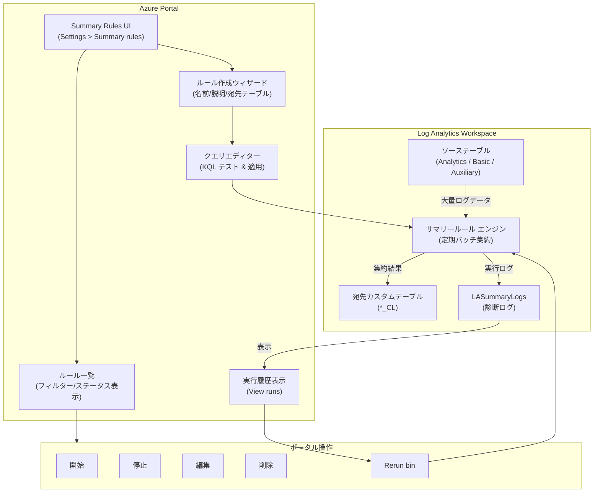

# Azure Monitor: Log Analytics サマリールールのポータルエクスペリエンスが一般提供開始

**リリース日**: 2026-06-16

**サービス**: Azure Monitor

**機能**: Log Analytics サマリールール (Summary Rules) の Azure ポータルエクスペリエンス

**ステータス**: Launched (GA)

[このアップデートのインフォグラフィックを見る](https://takech9203.github.io/azure-news-summary/20260616-log-analytics-summary-rules-experience.html)

## 概要

Azure Monitor の Log Analytics ワークスペースにおけるサマリールール (Summary Rules) の管理を行うための新しい Azure ポータルエクスペリエンスが一般提供 (GA) となった。このアップデートは、サマリールールの作成・表示・編集・停止・開始・削除などの操作を、Azure ポータルの GUI から直感的に行えるようにする UI の提供である。

サマリールールは、大量のログデータを定期的に KQL クエリで集約し、要約されたデータをカスタムテーブルに格納する機能であり、クエリパフォーマンスの向上、レポート作成の効率化、データ量の最適化を実現する。これまでサマリールールの管理は主に REST API、PowerShell、ARM テンプレートを通じて行う必要があったが、今回のポータルエクスペリエンスにより、GUI ベースでのフルライフサイクル管理が可能となった。

> **注**: 本アップデートはサマリールールのポータル UI エクスペリエンスに関するものであり、2026 年 3 月にリリースされた「手動 Retry bin」機能 (特定の失敗 bin を API 経由で再実行する機能) とは異なる。

**アップデート前の課題**

- サマリールールの作成・管理に REST API、PowerShell、ARM テンプレートの知識が必要だった
- ルールの一覧表示やステータス確認に CLI やスクリプトの実行が必要で、運用負荷が高かった
- KQL クエリのテスト・検証とルール設定を別々のインターフェースで行う必要があり、ワークフローが分断されていた
- 失敗した bin の確認やルールの再実行 (Retry bin) をポータルから視覚的に行う手段が限られていた

**アップデート後の改善**

- Azure ポータルの Log Analytics ワークスペース内「Settings > Summary rules」からルールのフルライフサイクル管理が可能に
- ウィザード形式でルール名、説明、宛先テーブル、KQL クエリ、bin サイズを設定できる
- Log Analytics のクエリエクスペリエンス内でクエリを直接テスト・検証し、そのまま適用できる
- フィルター機能付きの一覧画面でルールの状態を一目で確認できる
- ポータルから直接ルールの開始・停止・編集・削除が可能
- 失敗した bin の確認と Rerun (再実行) がポータルの GUI から実行可能

## アーキテクチャ図



Azure ポータルの Summary Rules UI は、ルールの作成ウィザードからクエリエディター、一覧管理、実行履歴の確認まで一貫した GUI エクスペリエンスを提供する。サマリールールエンジンはソーステーブルからデータを集約し、結果をカスタム宛先テーブルに格納する。

## サービスアップデートの詳細

### 主要機能

1. **ルール作成ウィザード**
   - ステップ 1: ルール名、説明、宛先テーブルを入力
   - ステップ 2: Log Analytics のクエリエクスペリエンスで KQL クエリを作成・テストし、期待される結果を確認後に Apply
   - ステップ 3: `Run summary every` (binSize) を選択し、スケジュールオプションを調整
   - ステップ 4: Review + Create で設定内容を確認し、ルールを作成

2. **ルール一覧・フィルター機能**
   - Log Analytics ワークスペースの左メニュー「Settings > Summary rules」からアクセス
   - Add Filter でルールの表示を絞り込み可能
   - 各ルールのステータス (Active / Inactive) を一目で確認

3. **ルール管理操作**
   - 各ルールの横にある省略記号 (...) メニューから操作を実行
   - Edit: ルール設定の確認・変更
   - Start: 停止中のルールを再開 (Active に変更)
   - Stop: 実行中のルールを停止 (Inactive に変更)
   - Delete: ルールを削除

4. **実行履歴と Rerun bin**
   - View runs でルールの実行履歴を表示
   - フィルターで Failed runs を絞り込み
   - 失敗した bin を選択し、GUI から Rerun this bin を実行可能

5. **displayName サポート**
   - ポータルで作成したルールには `displayName` (ユーザーフレンドリーな表示名) を設定可能
   - API で使用する `name` プロパティとは別に管理される

## 技術仕様

| 項目 | 詳細 |
|------|------|
| API バージョン | `2025-07-01` |
| ポータルアクセスパス | Log Analytics ワークスペース > Settings > Summary rules |
| サポートされる binSize | 20, 30, 60, 120, 180, 360, 720, 1440 (分) |
| ワークスペースあたりの最大ルール数 | 100 (アクティブルール) |
| 宛先テーブル名の形式 | `*_CL` (カスタムログテーブル) |
| 利用可能環境 | パブリッククラウドのみ |
| KQL クエリ制約 | クロスリソースクエリ不可、`union *` / `isfuzzy=true` 不可 |
| timeSelector | `TimeGenerated` のみ |
| binDelay デフォルト | 3.5 分 ~ binSize の 10% |

## 設定方法

### Azure ポータルでのサマリールール作成手順

1. [Azure Portal](https://portal.azure.com) で対象の Log Analytics ワークスペースに移動する
2. 左メニューの「Settings」から「Summary rules」を選択する
3. 「+ Create」をクリックして新しいサマリールールの作成を開始する
4. **Basics** ステップ:
   - Rule name: ルール名を入力 (ワークスペース内で一意)
   - Description: ルールの説明を入力
   - Destination table: 集約結果の格納先テーブル名を指定 (`_CL` サフィックスが必要)
5. 「Next: Set rule logic」をクリックする
6. **Rule logic** ステップ:
   - Log Analytics のクエリエクスペリエンスで KQL クエリを記述する
   - クエリを実行して結果を確認する (時間フィルターは不要)
   - 期待通りの結果が得られたら「Apply」をクリックする
7. 「Run summary every」で binSize を選択する (例: 60 分)
8. 必要に応じてスケジュールオプションを調整する
9. 「Next: Review + create」をクリックする
10. 設定内容を確認し、「Create」をクリックする

### 前提条件

- `Microsoft.Operationalinsights/workspaces/summarylogs/write` 権限 (Log Analytics Contributor ロール等)
- `Microsoft.OperationalInsights/workspaces/tables/write` 権限 (宛先テーブル作成に必要)
- `Microsoft.OperationalInsights/workspaces/query/read` 権限 (クエリ実行に必要)

## メリット

### ビジネス面

- コードや CLI の知識がなくても、運用担当者がサマリールールを管理できるようになり、運用の民主化が進む
- ルール作成から検証までのリードタイムが短縮され、新しい集約ルールの展開が迅速になる
- 一覧画面でルールの状態を可視化でき、運用状況の把握が容易になる

### 技術面

- KQL クエリのテストとルール作成が同一インターフェースで完結し、ワークフローの分断が解消される
- ウィザード形式のガイドにより、パラメータの設定ミスが減少する
- ポータルから直接 Rerun bin を実行でき、失敗した集約の修復が容易になる
- displayName により、API 名とは別にユーザーフレンドリーな表示名を管理できる

## デメリット・制約事項

- サマリールールはパブリッククラウドでのみ利用可能であり、Azure Government や Azure China では使用できない
- ワークスペースあたり最大 100 アクティブルールの制限がある
- クロスリソースクエリ (`workspaces()`, `app()`, `resource()`) はサポートされていない
- Lighthouse を介したクロステナントクエリには対応していない
- 宛先テーブルへのワークスペース変換 (workspace transformation) の追加はサポートされていない
- `union *` や `isfuzzy=true` はクエリ内で使用できない
- ユーザー定義関数はクエリ内で使用できない (Microsoft 提供のシステム関数のみ対応)

## ユースケース

### ユースケース 1: コンテナログの集約ルール作成

**シナリオ**: インフラチームが ContainerLogV2 テーブルの大量ログデータを集約して、分析用の軽量なサマリーテーブルをポータルから作成する。

**手順**:
1. Summary rules 画面で「+ Create」をクリック
2. 宛先テーブルに `ContainerLogsSummary_CL` を指定
3. Rule logic でクエリを入力:
```kusto
ContainerLogV2
| summarize Count = count() by Computer, ContainerName, PodName, PodNamespace, LogSource, LogLevel
```
4. binSize を 60 分に設定して作成

**効果**: Basic テーブルに低コストで生ログを保持しつつ、集約データで効率的な分析が可能になる。

### ユースケース 2: セキュリティログの月次レポート用サマリー

**シナリオ**: セキュリティチームがサインインログを月次監査レポート用に集約するルールを、CLI の知識なしにポータルから作成・管理する。

**手順**:
1. Summary rules 画面でルール一覧を確認し、新規ルールを作成
2. クエリエディターで集約クエリをテストし、結果を確認後に Apply
3. 運用中に失敗した bin があれば View runs から確認し、Rerun this bin で修復

**効果**: セキュリティ運用チームが自律的にサマリーデータの品質を管理でき、レポートの信頼性が向上する。

## 料金

サマリールールのポータルエクスペリエンス自体に追加料金は発生しない。サマリールールの実行に関する通常の料金モデルが適用される。

| ソーステーブルプラン | クエリコスト | サマリー結果の取り込みコスト |
|------|------|------|
| Analytics | 無料 | Analytics ログの取り込み料金 |
| Basic / Auxiliary | データスキャン料金 | Analytics ログの取り込み料金 |

詳細は [Azure Monitor の料金ページ](https://azure.microsoft.com/pricing/details/monitor/) を参照。

## 関連サービス・機能

- **Azure Monitor**: サマリールールを提供する親サービスであり、メトリクス、ログ、アラートの統合監視基盤
- **Log Analytics ワークスペース**: サマリールールが動作する基盤であり、ソーステーブルと宛先テーブルをホストする
- **LASummaryLogs テーブル**: サマリールールの実行状態を記録する診断テーブルで、失敗 bin の検出に使用される
- **データエクスポートルール**: サマリーデータをカスタムテーブルから Storage Account や Event Hubs にエクスポートして外部統合に利用できる
- **Log Analytics サマリールール手動 Retry bin (2026-03-12 GA)**: 失敗した bin を API 経由で手動再実行する機能。今回のポータルエクスペリエンスでは GUI から Rerun bin を実行可能

## 参考リンク

- [インフォグラフィック](https://takech9203.github.io/azure-news-summary/20260616-log-analytics-summary-rules-experience.html)
- [公式アップデート情報](https://azure.microsoft.com/updates?id=562027)
- [Microsoft Learn ドキュメント - サマリールール](https://learn.microsoft.com/en-us/azure/azure-monitor/logs/summary-rules)
- [Azure Monitor 料金ページ](https://azure.microsoft.com/pricing/details/monitor/)

## まとめ

Log Analytics サマリールールの Azure ポータルエクスペリエンスの GA リリースは、サマリールールの運用管理を大幅に簡素化する重要なアップデートである。これまで REST API や PowerShell の知識が必要だったルールの作成・管理が、ウィザード形式の GUI を通じて直感的に行えるようになった。特に、KQL クエリのテストとルール設定を同一画面で完結できるワークフロー、フィルター付きの一覧画面でのステータス管理、そして失敗 bin の GUI からの Rerun 機能は、運用効率を大きく向上させる。大量のログデータを扱う環境でコスト最適化やレポート作成を行っている組織は、このポータルエクスペリエンスを活用してサマリールールの管理をより多くのチームメンバーに委譲することを推奨する。

---

**タグ**: #Azure #AzureMonitor #LogAnalytics #SummaryRules #PortalExperience #GA #Monitoring #DataAggregation #KQL #ManagementAndGovernance
