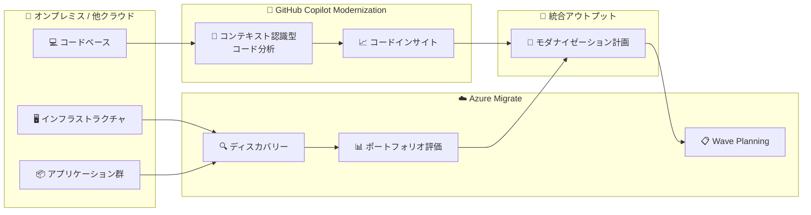

# Azure Migrate: GitHub Copilot Modernization 統合によるスケーラブルなコード評価

**リリース日**: 2026-06-17

**サービス**: Azure Migrate

**機能**: GitHub Copilot Modernization 統合 (スケーラブルなコード評価)

**ステータス**: In preview (パブリックプレビュー)

[このアップデートのインフォグラフィックを見る](https://takech9203.github.io/azure-news-summary/20260617-azure-migrate-copilot-modernization.html)

## 概要

Azure Migrate に GitHub Copilot Modernization との統合機能がパブリックプレビューとして追加された。この統合により、大規模なコードベースに対するコードインサイトをスケーラブルに提供できるようになる。

この機能は、Azure Migrate のポートフォリオレベルのディスカバリーおよびアセスメント機能と、GitHub Copilot のコンテキスト認識型コード分析を組み合わせたものである。これにより、オンプレミスや他のクラウドからのマイグレーションにおいて、インフラストラクチャの評価だけでなく、アプリケーションコードレベルでのモダナイゼーション評価が可能になる。

**アップデート前の課題**

- Azure Migrate の評価はインフラストラクチャ (VM、SQL、App Service) レベルが中心で、アプリケーションコードの詳細な分析には別途ツールが必要だった
- 大規模なマイグレーションプロジェクトにおいて、数百〜数千のアプリケーションのコードベースを個別に評価するのは膨大な工数が必要だった
- インフラ評価とコード評価が分断されており、ポートフォリオ全体の統合的なモダナイゼーション計画を策定しにくかった

**アップデート後の改善**

- Azure Migrate のポートフォリオレベルのディスカバリーと GitHub Copilot のコード分析が統合され、スケーラブルなコード評価が可能になった
- コンテキスト認識型のコード分析により、アプリケーションの依存関係やモダナイゼーションの難易度を自動的に評価できる
- インフラ評価とコード評価を一元的に管理し、統合的なマイグレーション計画の策定を支援する

## アーキテクチャ図

Azure Migrate がインフラストラクチャとアプリケーションのディスカバリーを担当し、GitHub Copilot Modernization がコードベースのコンテキスト認識型分析を行う。両者の結果が統合され、ポートフォリオ全体のモダナイゼーション計画として出力される。

## サービスアップデートの詳細

### 主要機能

1. **スケーラブルなコードインサイト**
   - 大規模なアプリケーションポートフォリオに対して、一括でコード評価を実施
   - 個別のリポジトリ単位ではなく、ポートフォリオレベルでのコード分析が可能

2. **ポートフォリオレベルのディスカバリーとの統合**
   - Azure Migrate の既存のディスカバリー機能 (サーバー、データベース、Web アプリ) と連携
   - インフラ情報とコード分析結果を組み合わせた包括的な評価

3. **コンテキスト認識型コード分析**
   - GitHub Copilot のAI 機能を活用し、コードの依存関係、アーキテクチャパターン、モダナイゼーションの複雑さを分析
   - アプリケーション固有のコンテキストを考慮した具体的な推奨事項の提供

## 技術仕様

| 項目 | 詳細 |
|------|------|
| ステータス | パブリックプレビュー |
| 対象ワークロード | オンプレミスおよび他クラウドのアプリケーション |
| 統合先 | GitHub Copilot Modernization |
| 評価スコープ | ポートフォリオレベル (大規模対応) |
| 分析タイプ | コンテキスト認識型コード分析 |

## メリット

### ビジネス面

- 大規模マイグレーションプロジェクトにおけるコード評価工数の大幅な削減
- ポートフォリオ全体を俯瞰した優先順位付けとバッチ分けの意思決定支援
- モダナイゼーション計画の精度向上によるリスク低減

### 技術面

- AI によるコンテキスト認識型分析で、手動レビューでは見落としがちな依存関係や技術的負債を検出
- Azure Migrate の Wave Planning 機能と組み合わせることで、評価結果を直接マイグレーション実行計画に反映可能
- インフラ評価とコード評価の統合により、リフト&シフトとモダナイゼーションの最適な組み合わせを判断可能

## デメリット・制約事項

- パブリックプレビュー段階であり、本番環境での利用には注意が必要
- GitHub Copilot のライセンスが別途必要になる可能性がある (詳細は公式ドキュメント確認を推奨)
- プレビュー期間中は機能や仕様が変更される可能性がある

## ユースケース

### ユースケース 1: 大規模エンタープライズのクラウドマイグレーション

**シナリオ**: 数百のオンプレミスアプリケーションを Azure に移行する大規模プロジェクトにおいて、各アプリケーションのモダナイゼーション戦略 (リフト&シフト vs リファクタリング vs リビルド) を効率的に判断する必要がある。

**効果**: Azure Migrate のインフラ評価と GitHub Copilot のコード分析を統合することで、アプリケーションごとの最適なマイグレーション戦略を自動的に推奨。Wave Planning と組み合わせることで、段階的なマイグレーション実行計画を策定できる。

### ユースケース 2: レガシーアプリケーションのモダナイゼーション優先度判定

**シナリオ**: 技術的負債を抱えた多数のレガシーアプリケーションの中から、モダナイゼーションの投資対効果が高いものを特定したい。

**効果**: コード分析による技術的負債の定量評価と、インフラ評価によるランニングコスト分析を組み合わせ、ポートフォリオ全体の優先順位付けを支援する。

## 関連サービス・機能

- **Azure Migrate Discovery and Assessment**: インフラストラクチャレベルの検出と評価を提供。VM、SQL、App Service への移行準備状況と最適なサイジングを評価する
- **Azure Migrate Wave Planning**: 大規模マイグレーションを管理可能なウェーブ (バッチ) に分割し、計画・実行・追跡を行う機能。コード評価結果をウェーブ計画に反映可能
- **GitHub Copilot**: AI ベースのコード支援ツール。IDE でのコード補完、コードレビュー、エージェントモードでの自律的なタスク実行など幅広い機能を提供
- **Azure App Service Assessment**: Web アプリの Azure App Service、Azure Spring Apps、AKS への移行評価

## 参考リンク

- [インフォグラフィック](https://takech9203.github.io/azure-news-summary/20260617-azure-migrate-copilot-modernization.html)
- [公式アップデート情報](https://azure.microsoft.com/updates?id=566145)
- [Azure Blog: Modernize your data with Azure Storage](https://azure.microsoft.com/en-us/blog/modernize-your-data-with-azure-storage-plan-and-migrate-with-confidence/) (関連: ストレージのマイグレーションとモダナイゼーション)
- [Microsoft Learn: Azure Migrate 概要](https://learn.microsoft.com/azure/migrate/overview)
- [Microsoft Learn: Azure Migrate 評価の概要](https://learn.microsoft.com/azure/migrate/concepts-assessment-overview)
- [GitHub Copilot 機能一覧](https://github.com/features/copilot)

## まとめ

Azure Migrate と GitHub Copilot Modernization の統合は、大規模マイグレーションプロジェクトにおけるコード評価の自動化という重要なギャップを埋めるアップデートである。従来、インフラストラクチャの評価とアプリケーションコードの評価は別々のプロセスで実施する必要があったが、本統合によりポートフォリオ全体を統合的に評価できるようになる。

Solutions Architect にとっての推奨アクションとしては、パブリックプレビューの段階で本機能を試験的に評価し、既存のマイグレーションプロジェクトにおけるコード評価ワークフローへの組み込みを検討することが望ましい。特に、Wave Planning と組み合わせた大規模マイグレーションの計画精度向上に大きな効果が期待できる。

---

**タグ**: #AzureMigrate #GitHubCopilot #Modernization #CodeAssessment #Migration #PublicPreview
