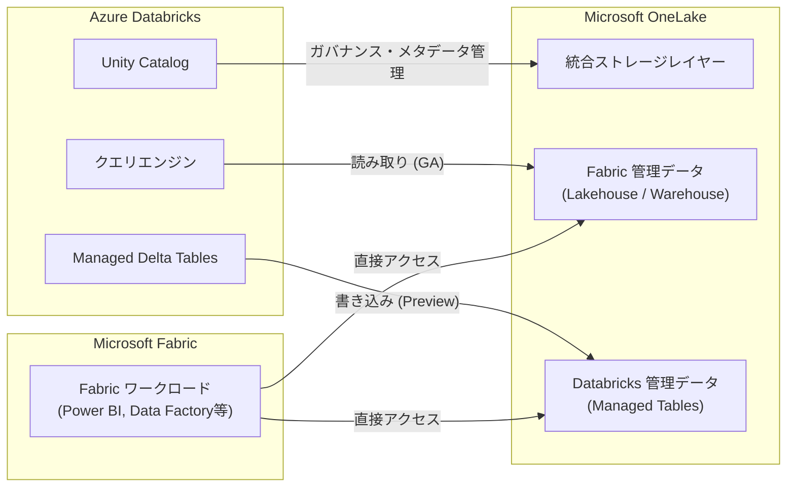

# Azure Databricks: OneLake ネイティブアクセス (読み取り GA / 書き込みプレビュー)

**リリース日**: 2026-06-17

**サービス**: Azure Databricks

**機能**: OneLake ネイティブ読み取りアクセス (GA) / OneLake ネイティブ書き込み (パブリックプレビュー)

**ステータス**: Launched (GA) / In preview

[このアップデートのインフォグラフィックを見る](https://takech9203.github.io/azure-news-summary/20260617-databricks-onelake-native-access.html)

## 概要

Azure Databricks において、Microsoft OneLake に対するネイティブアクセス機能が大幅に拡充された。Unity Catalog を通じた OneLake データへのネイティブ読み取りアクセスが一般提供 (GA) となり、さらに Azure Databricks のマネージド Delta テーブルを OneLake にネイティブに書き込む機能がパブリックプレビューとして提供開始された。

読み取り機能 (GA) により、顧客は OneLake に格納されたデータをコピーや移動なしに直接クエリ・分析できるようになり、Fabric で管理されたデータセットへの高速アクセスが実現される。書き込み機能 (プレビュー) により、OneLake を Azure Databricks ワークロードの統合ストレージレイヤーとして使用でき、別途ストレージアカウントを管理する必要がなくなる。これにより、Databricks と Microsoft Fabric のワークロード間でデータを統合的に管理できるようになる。

本アップデートは、2026 年 3 月にパブリックプレビューとして発表された [OneLake Catalog Federation](2026-03-19-databricks-onelake-catalog-federation.md) の発展形に位置付けられる。Catalog Federation が「Fabric 側のデータを Databricks から読む」ためのカタログ同期機能であったのに対し、今回のアップデートは Unity Catalog 管理下のテーブルを OneLake 上にネイティブに配置する機能を追加し、双方向のデータ統合を実現する。

**アップデート前の課題**

- OneLake Catalog Federation では読み取り専用アクセスに限定されており、Databricks から OneLake への書き込みはサポートされていなかった
- Databricks のマネージドテーブルを Fabric 側から利用するには、別途データコピーやミラーリングの設定が必要だった
- Databricks と Fabric で別々のストレージアカウントを管理する必要があり、運用コストとデータサイロ化が発生していた
- OneLake の読み取りアクセスはプレビュー段階であり、本番ワークロードでの SLA が保証されていなかった

**アップデート後の改善**

- OneLake 読み取りアクセスが GA となり、本番環境での安定した利用が保証された
- Databricks のマネージド Delta テーブルを OneLake にネイティブに書き込み可能となり、双方向のデータ統合が実現
- OneLake を統合ストレージレイヤーとして使用することで、ストレージアカウントの個別管理が不要に
- Databricks で作成・管理するデータを Microsoft Fabric ワークロードから直接利用可能に

## アーキテクチャ図



Azure Databricks が Unity Catalog を通じて OneLake に対してネイティブな読み取り (GA) と書き込み (プレビュー) を実行する。OneLake が統合ストレージレイヤーとして機能し、Databricks と Fabric の双方のワークロードから同一データにアクセス可能となる。

## サービスアップデートの詳細

### 主要機能

1. **OneLake ネイティブ読み取りアクセス (GA)**
   - Unity Catalog を通じて OneLake に格納されたデータを直接クエリ・分析
   - データのコピーや移動が不要で、Fabric 管理データセットへの即座のアクセスが可能
   - OneLake Catalog Federation の仕組みを利用し、Foreign Catalog 経由でスキーマ・テーブルを自動同期
   - GA 昇格により本番ワークロードでの利用が正式にサポート

2. **OneLake ネイティブ書き込み (パブリックプレビュー)**
   - Azure Databricks のマネージド Delta テーブルを OneLake にネイティブに格納
   - OneLake を Unity Catalog のマネージドストレージロケーションとして構成可能
   - 別途 Azure Data Lake Storage アカウントを管理する必要がなくなる
   - Databricks で作成したデータを Microsoft Fabric ワークロードから直接利用可能

3. **統合ストレージレイヤーとしての OneLake**
   - 単一のストレージ基盤で Databricks と Fabric のデータを一元管理
   - データサイロの解消とストレージ運用の簡素化
   - Unity Catalog のガバナンス (アクセス制御、監査、リネージ) を OneLake 上のデータに適用

### 読み取り機能と書き込み機能の比較

| 項目 | 読み取り (GA) | 書き込み (Preview) |
|------|--------------|-------------------|
| ステータス | 一般提供 (GA) | パブリックプレビュー |
| 方向 | OneLake → Databricks | Databricks → OneLake |
| 仕組み | Catalog Federation (Foreign Catalog) | Managed Storage Location |
| 対象データ | Fabric Lakehouse / Warehouse のテーブル | Databricks Managed Delta Tables |
| ユースケース | Fabric データの分析・ML 利用 | Fabric からの Databricks データ利用 |

## 技術仕様

| 項目 | 詳細 |
|------|------|
| 読み取りステータス | 一般提供 (GA) |
| 書き込みステータス | パブリックプレビュー |
| 認証方式 | Azure Managed Identity (推奨)、Azure Service Principal |
| 読み取り対象データ | Fabric Lakehouse、Fabric Warehouse |
| 書き込みフォーマット | Delta テーブル |
| コンピュート要件 | Databricks Runtime 18.0 以上 (Standard アクセスモード) |
| SQL Warehouse 要件 | バージョン 2025.40 以上 |
| Unity Catalog | 必須 (ワークスペースで有効化されていること) |
| クロステナント認証 | Service Principal 方式でサポート |
| OneLake エンドポイント | `abfss://<workspace>@onelake.dfs.fabric.microsoft.com/` |

## 設定方法

### 前提条件

1. Unity Catalog が有効化された Azure Databricks ワークスペース
2. Databricks Runtime 18.0 以上のコンピュートリソース (Standard アクセスモード)
3. Azure Databricks 用 Access Connector (Managed Identity) または Service Principal
4. Fabric テナント側で以下の設定が有効化されていること:
   - 「Service principals can use Fabric APIs」テナント設定
   - 「Allow apps running outside of Fabric to access data via OneLake」テナント設定
   - 「Use short-lived user-delegated SAS tokens」テナント設定
5. Fabric ワークスペースで「Authenticate with OneLake user-delegated SAS tokens」が有効
6. Managed Identity / Service Principal に Fabric ワークスペースの Member 以上のロール

### 読み取りアクセスの設定 (GA)

**Step 1: Storage Credential の作成**

Unity Catalog で Access Connector を参照する Storage Credential を作成する。

**Step 2: Connection の作成**

```sql
CREATE CONNECTION onelake_conn TYPE onelake
OPTIONS (
  workspace '<fabric-workspace-id>',
  credential '<storage-credential-name>'
);
```

**Step 3: Foreign Catalog の作成**

```sql
CREATE FOREIGN CATALOG fabric_data USING CONNECTION onelake_conn
OPTIONS (
  data_item '<fabric-lakehouse-id>',
  item_type 'Lakehouse'
);
```

**Step 4: クエリの実行**

```sql
SELECT * FROM fabric_data.<schema>.<table>;
```

### 書き込みアクセスの設定 (プレビュー)

**Step 1: External Location の作成**

OneLake パスを指す External Location を作成する。

**Step 2: Catalog の Managed Storage Location を OneLake に設定**

```sql
CREATE CATALOG databricks_onelake
MANAGED LOCATION 'abfss://<workspace-id>@onelake.dfs.fabric.microsoft.com/<lakehouse-id>.lakehouse/Tables';
```

**Step 3: マネージドテーブルの作成**

```sql
CREATE TABLE databricks_onelake.default.my_table AS
SELECT * FROM source_data;
```

作成されたテーブルのデータは OneLake に直接格納され、Fabric 側からも参照可能となる。

## メリット

### ビジネス面

- データのコピー・ETL パイプラインが不要となり、ストレージコストと運用工数を削減
- Fabric と Databricks 双方への投資を最大限に活用し、各プラットフォームの強みを使い分け可能
- データの鮮度向上により、リアルタイムに近いデータ駆動型の意思決定が可能
- ストレージアカウントの統合管理により、インフラ運用コストを削減

### 技術面

- Unity Catalog のガバナンス (アクセス制御、監査、リネージ) を OneLake 上のデータに適用可能
- Delta テーブル形式による ACID トランザクション保証のもとでの書き込み
- 読み取りの GA 昇格により SLA に基づいた本番環境での運用が可能
- オブジェクトストレージ直接アクセスによる高いクエリパフォーマンス (JDBC プッシュダウンのオーバーヘッドなし)
- OneLake の ABFS エンドポイントとの互換性により、既存の Spark ワークロードとの統合が容易

## デメリット・制約事項

- 書き込み機能はパブリックプレビュー段階であり、本番環境での利用には SLA の確認が必要
- 読み取りアクセスでは複合データ型 (配列、マップ、構造体) がサポートされていない
- マテリアライズドビューおよびビューは読み取り対象外
- Dedicated アクセスモードのコンピュートはサポートされていない
- Databricks Runtime 18.0 以上が必須であり、古いランタイムバージョンでは利用不可
- OneLake ストレージは Azure Data Lake Storage と比較して、バンドル型の料金モデルの場合に読み取りで最大 2 倍、書き込みで最大 2.6 倍のコストが発生する可能性がある (従量課金モデル推奨)
- Connection 作成後にワークスペース等のオプション変更ができない
- 同一テーブルパスに対する複数エンジンからの同時書き込みは競合の原因となるため、ワンライターパターンを推奨

## ユースケース

### ユースケース 1: Fabric BI + Databricks ML の統合データ基盤

**シナリオ**: 組織で Microsoft Fabric を Power BI レポーティングに、Azure Databricks を機械学習モデルの学習・推論に使用している。Databricks で生成した予測結果を Fabric の Power BI ダッシュボードに即座に反映したい。

**実装例**:

```sql
-- Databricks で ML 推論結果を OneLake に直接書き込み
CREATE TABLE onelake_catalog.ml_output.predictions
MANAGED LOCATION 'abfss://<workspace>@onelake.dfs.fabric.microsoft.com/<lakehouse>.lakehouse/Tables'
AS SELECT customer_id, prediction, confidence_score
FROM ml_pipeline.inference_results;
```

**効果**: Databricks の ML パイプライン出力が OneLake に直接格納されるため、Fabric 側でのデータコピーやインジェスト処理が不要となり、予測結果のダッシュボード反映までのリードタイムを大幅に短縮可能。

### ユースケース 2: ストレージ統合によるデータサイロ解消

**シナリオ**: 複数の Azure Data Lake Storage アカウントと OneLake にデータが分散しており、データのガバナンスと検索性が課題。OneLake を統合ストレージとして標準化し、Databricks と Fabric 双方からアクセスする構成に移行したい。

**効果**: ストレージアカウントの管理対象を削減し、Unity Catalog によるメタデータ・ガバナンスの統合を実現。組織全体でのデータ発見性とセキュリティコンプライアンスが向上する。

### ユースケース 3: 段階的な Fabric + Databricks 統合

**シナリオ**: 既存の Fabric Lakehouse にビジネスデータが蓄積されており、高度な分析 (機械学習、大規模 ETL) のために Databricks を導入したい。まず読み取りでデータを活用し、将来的に Databricks からの出力も OneLake に統合する。

**効果**: 読み取り (GA) を使って既存 Fabric データを Databricks から即座に利用開始し、書き込み (プレビュー) を段階的に導入することで、リスクを最小化しながら統合データ基盤を構築可能。

## 料金

OneLake の利用料金は Microsoft Fabric の容量モデルに基づく。Databricks からのアクセスにおける料金上の注意点:

| 項目 | 詳細 |
|------|------|
| OneLake ストレージ | Fabric 容量に含まれる (従量課金推奨) |
| トランザクションコスト (読み取り) | バンドルモデルの場合、ADLS 比で最大 2 倍 |
| トランザクションコスト (書き込み) | バンドルモデルの場合、ADLS Premium Tier 比で最大 2.6 倍 |
| Databricks コンピュート | 通常の DBU 料金が適用 |

Microsoft は従量課金 (Pay-as-you-go) の Fabric 料金モデルを推奨しており、ストレージとコンピュートの柔軟な選択が可能となる。

## 関連サービス・機能

- **OneLake Catalog Federation**: Unity Catalog と OneLake 間のカタログ同期機能。今回の読み取り GA はこの仕組みを基盤とする
- **Unity Catalog**: Azure Databricks の統合データ・AI ガバナンスソリューション。ストレージ認証とアクセス制御の基盤
- **Microsoft Fabric OneLake**: Microsoft のユニファイドデータレイク。全 Fabric ワークロードの共通ストレージ基盤
- **Databricks Mirroring**: Fabric から Databricks Unity Catalog のデータにアクセスする逆方向の連携機能
- **Azure Data Lake Storage Gen2**: 従来の Databricks 推奨ストレージ。OneLake との比較検討が必要

## 参考リンク

- [インフォグラフィック](https://takech9203.github.io/azure-news-summary/20260617-databricks-onelake-native-access.html)
- [公式アップデート情報 - 読み取り GA](https://azure.microsoft.com/updates?id=565733)
- [公式アップデート情報 - 書き込みプレビュー](https://azure.microsoft.com/updates?id=565706)
- [Microsoft Learn - OneLake Catalog Federation](https://learn.microsoft.com/en-us/azure/databricks/query-federation/onelake)
- [Microsoft Learn - OneLake と Azure Databricks の統合](https://learn.microsoft.com/en-us/fabric/onelake/onelake-azure-databricks)
- [Microsoft Learn - Unity Catalog クラウドストレージ接続](https://learn.microsoft.com/en-us/azure/databricks/connect/unity-catalog/cloud-storage/)
- [Microsoft Learn - Managed Storage Location](https://learn.microsoft.com/en-us/azure/databricks/connect/unity-catalog/cloud-storage/managed-storage)
- [関連レポート - OneLake Catalog Federation プレビュー (2026-03-19)](2026-03-19-databricks-onelake-catalog-federation.md)

## まとめ

Azure Databricks の OneLake ネイティブアクセスが読み取り GA と書き込みプレビューの同時発表により、Databricks と Microsoft Fabric 間の双方向データ統合が本格的に実現可能となった。3 月のカタログフェデレーション (読み取り専用プレビュー) から GA 昇格したことで本番ワークロードでの信頼性が保証され、さらに書き込み機能の追加により OneLake を統合ストレージレイヤーとして位置付ける構成が現実的になった。

Solutions Architect としては以下の対応を推奨する:

1. **読み取り (GA)**: Fabric Lakehouse にデータを持つ組織では、即座に Catalog Federation の本番導入を検討可能。読み取り専用の制約と複合データ型非対応を確認の上、本番ワークロードへの適用を進める
2. **書き込み (プレビュー)**: OneLake への書き込みは開発・検証環境で評価を開始する。特にコスト面 (バンドルモデルでの ADLS 比較) と、ワンライターパターンの遵守を検証する
3. **統合戦略**: Databricks + Fabric の統合データ基盤を検討する際は、従量課金 (Pay-as-you-go) の Fabric モデルを選択し、ADLS と OneLake のコスト比較を行った上で、ユースケースに応じたストレージ戦略を策定する

---

**タグ**: #AzureDatabricks #OneLake #UnityCatalog #MicrosoftFabric #GA #Preview #Analytics #AI #MachineLearning #DataIntegration
