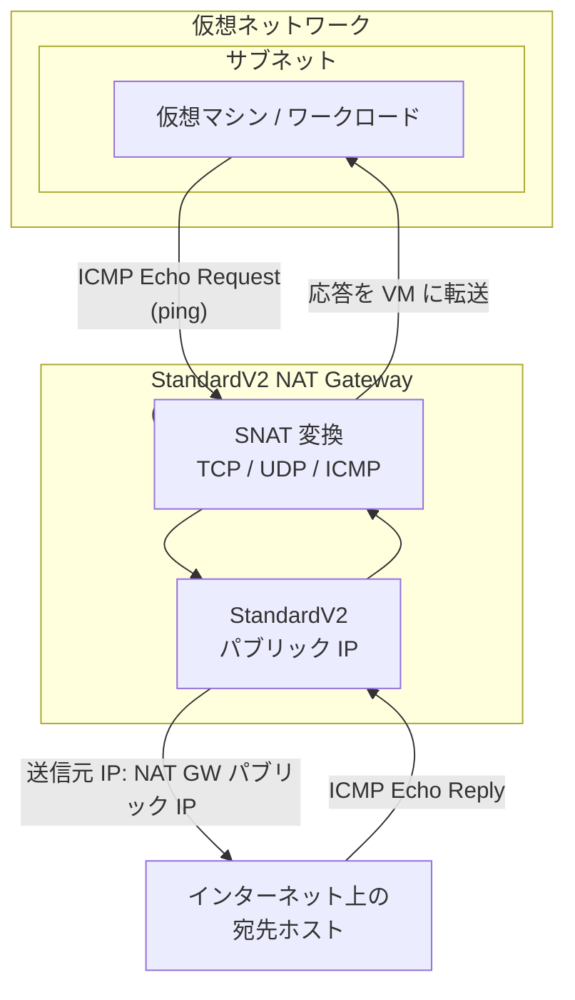

# Azure NAT Gateway: StandardV2 NAT Gateway で ICMP サポートが一般提供開始

**リリース日**: 2026-06-17

**サービス**: Azure NAT Gateway

**機能**: StandardV2 NAT Gateway における ICMP Echo Request / Echo Reply のサポート

**ステータス**: Launched (GA)

[このアップデートのインフォグラフィックを見る](https://takech9203.github.io/azure-news-summary/20260617-nat-gateway-v2-icmp-support.html)

## 概要

Azure StandardV2 NAT Gateway が、アウトバウンド方向の ICMP Echo Request および Echo Reply トラフィックをサポートするようになった。これにより、StandardV2 NAT Gateway の背後にあるワークロードから `ping` コマンドを使用してアウトバウンド接続性の検証やネットワーク問題のトラブルシューティングが可能になる。

この機能はデフォルトで有効であり、追加の構成は不要である。IPv4 および IPv6 の両方で ICMP Echo (ping) をサポートしている。従来、Azure NAT Gateway (Standard SKU) では ICMP プロトコルがサポートされておらず、ping による接続性検証が行えなかったが、StandardV2 NAT Gateway でこの制約が解消された。

**アップデート前の課題**

- NAT Gateway の背後にあるワークロードから `ping` コマンドを使用したアウトバウンド接続性の検証ができなかった
- ネットワーク到達性の確認に TCP ベースのツール (PsPing、curl、nc など) を使用する必要があり、トラブルシューティングの手順が煩雑だった
- 一般的なネットワーク診断の第一歩である ICMP ping が使えないことで、問題切り分けに時間を要していた

**アップデート後の改善**

- StandardV2 NAT Gateway を経由した ICMP Echo Request / Echo Reply (ping) が可能になり、アウトバウンド接続性を即座に検証できる
- 追加構成不要でデフォルト有効のため、既存の StandardV2 NAT Gateway 環境ですぐに利用可能
- IPv4 と IPv6 の両方で ICMP をサポートし、デュアルスタック環境でも一貫した診断が可能

## アーキテクチャ図



この図は、StandardV2 NAT Gateway を経由した ICMP トラフィックの流れを示している。ワークロードから発信された ICMP Echo Request は NAT Gateway で SNAT 変換され、パブリック IP を送信元としてインターネット上の宛先に到達する。宛先からの Echo Reply は NAT Gateway を経由して元のワークロードに返される。

## サービスアップデートの詳細

### 主要機能

1. **アウトバウンド ICMP Echo Request / Echo Reply のサポート**
   - StandardV2 NAT Gateway の背後にあるワークロードから外部ホストへの `ping` が可能
   - Echo Request (Type 8) と Echo Reply (Type 0) の両方をサポート
   - アウトバウンド接続に対する応答パケットのみが通過する (NAT Gateway の既存のセキュリティモデルを維持)

2. **追加構成不要 (デフォルト有効)**
   - StandardV2 NAT Gateway に ICMP サポートがデフォルトで組み込まれている
   - NSG やルートテーブルで ICMP をブロックしていない限り、追加の設定変更は不要
   - 既存の StandardV2 NAT Gateway デプロイメントで即座に利用可能

3. **IPv4 / IPv6 デュアルスタック対応**
   - IPv4 と IPv6 の両方の ICMP Echo をサポート
   - デュアルスタック環境で一貫した接続性検証が可能

## 技術仕様

| 項目 | 詳細 |
|------|------|
| 対象 SKU | StandardV2 NAT Gateway のみ |
| サポートされる ICMP タイプ | Echo Request (Type 8) / Echo Reply (Type 0) |
| IPv4 サポート | あり |
| IPv6 サポート | あり |
| 追加構成 | 不要 (デフォルト有効) |
| Standard NAT Gateway での ICMP | 非サポート (従来通り) |
| インバウンド ICMP | 非サポート (アウトバウンド起点の応答のみ) |

## メリット

### ビジネス面

- ネットワーク問題のトラブルシューティング時間が短縮され、ダウンタイムの低減に寄与する
- 運用チームが使い慣れた `ping` コマンドで接続性を検証できるため、運用負荷が低減する
- 障害切り分けの迅速化により、MTTR (平均復旧時間) の改善が期待できる

### 技術面

- NAT Gateway 経由のアウトバウンド接続性を最も基本的なレイヤー (ICMP) で検証可能になった
- TCP/UDP に加えて ICMP もサポートされたことで、NAT Gateway のプロトコルカバレッジが向上
- ネットワーク監視ツールや自動化スクリプトで ping ベースのヘルスチェックを NAT Gateway 配下のワークロードから実行可能
- RTT (ラウンドトリップタイム) の計測による外部ホストへのレイテンシ確認が可能

## デメリット・制約事項

- Standard NAT Gateway (従来の SKU) では引き続き ICMP は非サポート。ICMP を利用するには StandardV2 NAT Gateway への移行が必要
- Standard NAT Gateway から StandardV2 NAT Gateway への直接アップグレードはできない。新規に StandardV2 NAT Gateway を作成し、サブネットの NAT Gateway を置き換える必要がある
- StandardV2 NAT Gateway は StandardV2 SKU のパブリック IP のみをサポートするため、既存の Standard SKU パブリック IP からの移行 (再 IP) が必要
- インバウンド方向の ICMP (外部からの ping) は引き続きサポートされない。NAT Gateway はアウトバウンド起点の通信に対する応答のみを許可する
- 一部のリージョン (Canada East、Chile Central、Indonesia Central、Israel Northwest、Malaysia West、Qatar Central、Sweden South、West India) では StandardV2 NAT Gateway が利用不可

## ユースケース

### ユースケース 1: アウトバウンド接続性の迅速な検証

**シナリオ**: NAT Gateway 配下のワークロードから外部 API への接続障害が報告された際に、ネットワークレイヤーでの到達性を即座に確認したい。

**実装例**:

```bash
# VM から外部ホストへの接続性を確認
ping -c 4 8.8.8.8

# IPv6 での接続性確認
ping6 -c 4 2001:4860:4860::8888

# 特定の外部 API エンドポイントへの到達性確認
ping -c 4 api.example.com
```

**効果**: DNS 解決の問題なのか、ネットワーク到達性の問題なのか、アプリケーションレイヤーの問題なのかを ICMP ping で素早く切り分けられる。従来は TCP ベースのツールを使用する必要があったが、ping で基本的な到達性を即座に確認可能になった。

### ユースケース 2: ネットワーク監視の自動化

**シナリオ**: NAT Gateway 配下のワークロードから重要な外部サービスへの接続性を定期的に監視し、到達不能を検知した際にアラートを発報したい。

**実装例**:

```bash
# シンプルな監視スクリプト
#!/bin/bash
TARGETS=("8.8.8.8" "1.1.1.1" "api.partner.com")
for target in "${TARGETS[@]}"; do
    if ! ping -c 3 -W 5 "$target" > /dev/null 2>&1; then
        echo "ALERT: $target is unreachable via NAT Gateway"
    fi
done
```

**効果**: ICMP ping ベースのヘルスチェックにより、NAT Gateway 経由のアウトバウンド接続に問題が発生した場合を早期に検知でき、TCP レベルの接続テストよりも軽量かつ高速に実行可能。

## 料金

ICMP サポートの追加による料金変更はない。StandardV2 NAT Gateway と Standard NAT Gateway の料金は同一である。

| 項目 | 料金 |
|------|------|
| NAT Gateway リソース時間 | リソースがデプロイされている時間に基づく課金 |
| データ処理 | NAT Gateway を経由して処理されたデータ量に基づく課金 |

ICMP トラフィックも通常のデータ処理として課金される。

詳細な料金については、[Azure NAT Gateway の料金ページ](https://azure.microsoft.com/pricing/details/azure-nat-gateway/)を参照されたい。

## 利用可能リージョン

StandardV2 NAT Gateway が利用可能なすべてのリージョンで ICMP サポートが提供される。以下のリージョンでは StandardV2 NAT Gateway 自体が未サポートのため、利用できない:

- Canada East
- Chile Central
- Indonesia Central
- Israel Northwest
- Malaysia West
- Qatar Central
- Sweden South
- West India

## 関連サービス・機能

- **Azure NAT Gateway (Standard SKU)**: 従来の SKU。ICMP は引き続き非サポート。StandardV2 への移行により ICMP を利用可能
- **Azure Virtual Network**: NAT Gateway が関連付けられるサブネットの基盤サービス
- **Azure Network Watcher**: VNet フローログや接続モニターによるネットワーク診断。StandardV2 NAT Gateway のフローログと組み合わせて活用可能
- **Azure Kubernetes Service (AKS)**: StandardV2 NAT Gateway をアウトバウンドタイプとして利用可能。AKS ノードからの ping による接続性検証にも活用できる
- **Azure Monitor**: NAT Gateway メトリクスの監視。ICMP を含むトラフィックの可視化に利用

## 参考リンク

- [インフォグラフィック](https://takech9203.github.io/azure-news-summary/20260617-nat-gateway-v2-icmp-support.html)
- [公式アップデート情報](https://azure.microsoft.com/updates?id=565487)
- [Microsoft Learn - Azure NAT Gateway の概要](https://learn.microsoft.com/en-us/azure/nat-gateway/nat-overview)
- [Microsoft Learn - NAT Gateway リソース](https://learn.microsoft.com/en-us/azure/nat-gateway/nat-gateway-resource)
- [Microsoft Learn - NAT Gateway のトラブルシューティング](https://learn.microsoft.com/en-us/troubleshoot/azure/nat-gateway/troubleshoot-nat)
- [Azure NAT Gateway 料金ページ](https://azure.microsoft.com/pricing/details/azure-nat-gateway/)

## まとめ

StandardV2 NAT Gateway での ICMP サポートの一般提供は、日常的なネットワーク運用・トラブルシューティングにおいて実用的な改善をもたらす。従来、NAT Gateway 配下では ping コマンドによる接続性検証ができず、TCP ベースのツールに頼る必要があったが、本アップデートによりネットワークエンジニアが最も頻繁に使用する診断手法が利用可能になった。

Solutions Architect への推奨アクションとして、既に StandardV2 NAT Gateway を使用している環境では追加構成なしで即座に利用可能であるため、運用手順書やトラブルシューティングガイドに ping による接続性検証手順を追加することを推奨する。Standard NAT Gateway を使用している環境で ICMP ping による診断を必要とする場合は、StandardV2 NAT Gateway への移行を検討されたい。ただし、直接アップグレードは不可のため、新規作成と切り替えが必要である点に留意すること。

---

**タグ**: #Azure #NATGateway #StandardV2 #ICMP #Ping #Networking #Troubleshooting #GA
