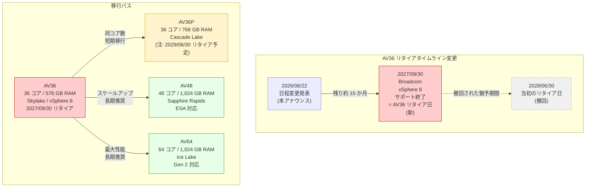

# Azure VMware Solution: AV36 ノードのリタイア日前倒し (2027 年 9 月 30 日)

**リリース日**: 2026-06-22

**サービス**: Azure VMware Solution

**機能**: AV36 ノードのリタイア日程変更 (前倒し)

**ステータス**: Retirement

[このアップデートのインフォグラフィックを見る](https://takech9203.github.io/azure-news-summary/20260622-vmware-solution-av36-retirement-date-change.html)

## 概要

Microsoft は、Azure VMware Solution の AV36 ノードタイプのリタイア日を、当初発表の 2028 年 6 月 30 日から **2027 年 9 月 30 日に前倒し**することを発表した。これは VMware (Broadcom) のロードマップとの整合性を取るための変更であり、リタイアまでの猶予期間が約 9 か月短縮される重大な変更である。

Broadcom は、現行 AV36 ノードが使用する vSphere 8 のサポートを 2027 年 9 月 30 日に終了する予定であり、AV36 SKU は次期 vSphere 9 との互換性がない。vSphere 8 のサポート終了と AV36 のリタイアが同日 (2027 年 9 月 30 日) となるため、当初想定されていた猶予期間が事実上なくなった形である。

AV36 は Skylake マイクロアーキテクチャ (Intel Xeon Gold 6140) を採用した Azure VMware Solution の初期ノードタイプであり、36 物理コア、576 GB RAM の構成である。後継ノード (AV36P、AV48、AV64) への早急な移行が必要となる。

**アップデート前 (当初のスケジュール)**

- AV36 ノードのリタイア日は 2028 年 6 月 30 日と発表されていた
- vSphere 8 サポート終了 (2027 年 9 月 30 日) 後も約 9 か月の猶予期間があった
- 移行計画に 2 年以上の余裕があると想定されていた

**アップデート後 (変更されたスケジュール)**

- AV36 ノードのリタイア日が 2027 年 9 月 30 日に前倒しされた
- vSphere 8 サポート終了と同時にリタイアとなり、猶予期間がない
- 移行計画の実行期限が約 9 か月短縮され、残り約 15 か月 (2026 年 6 月時点) で移行を完了する必要がある

## アーキテクチャ図

AV36 ノードのリタイアタイムラインと後継ノードへの移行パスを示している。当初の 2028 年 6 月 30 日から 2027 年 9 月 30 日に前倒しされたため、移行の緊急度が大幅に増している。

## サービスアップデートの詳細

### リタイア日変更の背景

1. **Broadcom vSphere 8 サポート終了 (2027 年 9 月 30 日)**
   - Broadcom は vSphere 8 のサポートを 2027 年 9 月 30 日に終了する
   - サポート終了後はセキュリティパッチやバグ修正が提供されなくなる
   - AV36 SKU は vSphere 8 上で動作しており、vSphere 9 との互換性がない

2. **AV36 と vSphere 9 の非互換性**
   - AV36 は Skylake 世代 (Intel Xeon Gold 6140) の CPU を使用している
   - vSphere 9 は AV36 のハードウェア構成をサポートしない
   - このため、vSphere のアップグレードによる延命が不可能である

3. **リタイア日の前倒し (2028 年 6 月 30 日 → 2027 年 9 月 30 日)**
   - 当初のリタイア日は vSphere 8 サポート終了後に約 9 か月の猶予があった
   - VMware/Broadcom のロードマップ変更に伴い、猶予期間が撤回された
   - vSphere 8 サポート終了と AV36 リタイアが同日 (2027 年 9 月 30 日) となった

### 影響の緊急度

| 観点 | 当初計画 | 変更後 | 影響 |
|------|---------|--------|------|
| リタイア日 | 2028/06/30 | 2027/09/30 | 9 か月前倒し |
| 残り期間 (2026/06 時点) | 約 24 か月 | 約 15 か月 | 37.5% 短縮 |
| vSphere 8 終了後の猶予 | 約 9 か月 | 0 か月 | 猶予なし |
| 移行の緊急度 | 中 | 高 | 即時対応推奨 |

## 技術仕様

| 項目 | AV36 (リタイア対象) | AV36P (後継候補) | AV48 (後継候補) | AV64 (後継候補) |
|------|------|------|------|------|
| CPU | Intel Xeon Gold 6140 (Skylake) | Intel Xeon Gold 6240 (Cascade Lake) | Intel Xeon Gold 6442Y (Sapphire Rapids) | Intel Xeon Platinum 8370C (Ice Lake) |
| 物理コア数 | 36 (18 x 2) | 36 (18 x 2) | 48 (24 x 2) | 64 (32 x 2) |
| 論理コア数 | 72 | 72 | 96 | 128 |
| クロック (ベース/ターボ) | 2.3 GHz / - | 2.6 GHz / 3.9 GHz | 2.6 GHz / 4.0 GHz | 2.8 GHz / 3.5 GHz |
| RAM | 576 GB | 768 GB | 1,024 GB | 1,024 GB |
| vSAN アーキテクチャ | OSA | OSA | ESA | OSA / ESA |
| vSAN キャッシュ層 | 3.2 TB (NVMe) | 1.5 TB (Intel Cache) | N/A | 3.84 TB (NVMe) / N/A |
| vSAN 容量層 | 15.20 TB (SSD) | 19.20 TB (NVMe) | 25.6 TB (NVMe) | 15.36 TB / 19.25 TB (NVMe) |
| ネットワーク | 100 Gbps | 100 Gbps | 100 Gbps | 100 Gbps |
| リタイア日 | 2027/09/30 | 2029/06/30 | - | - |

## 推奨される対応

### 前提条件

1. 現在使用している AV36 ノード数とクラスター構成を把握していること
2. ワークロードの CPU、メモリ、ストレージ要件を棚卸ししていること
3. 予約インスタンス (RI) の有効期限を確認していること

### 移行先の選定ガイドライン

**AV36 から AV36P への移行 (短期的な選択肢):**

- コア数が同じ 36 のため、ワークロードの互換性が最も高い
- RAM が 576 GB から 768 GB に増加し、メモリ制約が緩和される
- ストレージが SSD から NVMe に変更され、I/O 性能が向上する
- 注意: AV36P も 2029 年 6 月 30 日にリタイアが予定されているため、長期的な選択肢としては非推奨。二重の移行コストが発生する

**AV36 から AV48 への移行 (長期推奨):**

- コア数が 36 から 48 に増加 (33% 増)、RAM は 576 GB から 1,024 GB に増加 (78% 増)
- vSAN Express Storage Architecture (ESA) に対応しており、ストレージ効率が大幅に向上
- Sapphire Rapids 世代の最新 CPU で、シングルスレッド性能も向上
- リタイア予定日が設定されておらず、長期的に安定した運用が可能

**AV36 から AV64 への移行 (長期推奨):**

- コア数が 36 から 64 に大幅増加 (78% 増)、コンピューティング集約型ワークロードに最適
- Azure VMware Solution Generation 2 に対応し、Azure Virtual Network への直接接続が可能
- AV64 はベースクラスター (AV36、AV36P、AV48、AV52) が前提条件として必要 (Generation 1 での拡張時)
- 7 つの vSAN フォルトドメインによる高い可用性

### 移行手順の概要

1. 現在の AV36 クラスターの構成 (ノード数、ストレージ使用量、ワークロード特性) を棚卸しする
2. 移行先ノードタイプを決定する (長期視点では AV48 または AV64 を推奨)
3. 予約インスタンス (RI) の有効期限とリタイア日の整合性を確認する
4. Azure Portal でプライベートクラウドに新しいクラスターを追加する
5. VMware HCX または vMotion を使用してワークロードを移行する
6. 移行完了後、AV36 クラスターのノードを削除する

### 移行時の注意事項 (EVC 互換性)

AV36 (Skylake) から AV48 (Sapphire Rapids) や AV64 (Ice Lake) への移行では、Enhanced vMotion Compatibility (EVC) の互換性に注意が必要である。

- AV36 から AV48/AV64 への vMotion: 低い EVC モードから高い EVC モードへの移行のため、通常は問題なく動作する
- AV48/AV64 から AV36 への vMotion: 上位ノードで作成または電源再投入した VM は EVC 互換性エラーで失敗する可能性がある
- 対策: VM レベルの EVC モードを低い方のクラスターに合わせて設定するか、コールドマイグレーションを使用する

## デメリット・制約事項

- リタイア日が約 9 か月前倒しされたため、移行計画の見直しと加速が必要である
- vSphere 8 サポート終了と AV36 リタイアが同日であるため、サポート終了前に移行を完了することが強く推奨される
- AV36P への移行は最も容易だが、AV36P 自体も 2029 年 6 月 30 日にリタイア予定であり、二重の移行コストが発生する
- AV64 の利用 (Generation 1 での拡張時) にはベースクラスター (AV36、AV36P、AV48、AV52) が前提条件として必要
- 異なる世代の CPU 間での EVC 互換性に注意が必要
- 残り約 15 か月 (2026 年 6 月時点) での大規模移行は、十分なテスト期間の確保が課題となる

## 関連サービス・機能

- **Azure VMware Solution Generation 2**: AV64 SKU で利用可能な新しいアーキテクチャ。VMware vSphere ホストが Azure Virtual Network に直接接続される
- **VMware HCX**: ワークロードのモビリティ、マイグレーション、ネットワーク拡張サービスを提供。ノード移行時に活用可能
- **VMware vMotion**: 仮想マシンのライブマイグレーション機能。クラスター間のワークロード移行に使用
- **Azure NetApp Files / Azure Elastic SAN**: Azure VMware Solution のデータストア容量を vSAN 以外に拡張するためのストレージサービス

## 参考リンク

- [インフォグラフィック](https://takech9203.github.io/azure-news-summary/20260622-vmware-solution-av36-retirement-date-change.html)
- [公式アップデート情報](https://azure.microsoft.com/updates?id=503883)
- [Azure VMware Solution の概要 - Microsoft Learn](https://learn.microsoft.com/en-us/azure/azure-vmware/introduction)
- [プライベートクラウドとクラスターのアーキテクチャ - Microsoft Learn](https://learn.microsoft.com/en-us/azure/azure-vmware/architecture-private-clouds)
- [Azure VMware Solution リソースのリージョン間移行 - Microsoft Learn](https://learn.microsoft.com/en-us/azure/azure-vmware/move-azure-vmware-solution-across-regions)
- [関連レポート: AV36P および AV52 ノードのリタイア (2029 年 6 月)](reports/2026/2026-03-17-vmware-solution-av36p-av52-retirement.md)

## まとめ

Azure VMware Solution の AV36 ノードのリタイア日が、当初の 2028 年 6 月 30 日から **2027 年 9 月 30 日に前倒し**された。この変更は Broadcom が vSphere 8 のサポートを 2027 年 9 月 30 日に終了し、AV36 が vSphere 9 と非互換であることに起因する。移行猶予期間が約 9 か月短縮され、2026 年 6 月時点で残り約 15 か月となっているため、移行の緊急度が大幅に増している。

Solutions Architect としては、以下のアクションを推奨する:

1. **即時対応**: 現在の AV36 ノード利用状況と RI 有効期限を棚卸しし、移行先ノードタイプを決定する
2. **2026 年内**: 移行計画を策定し、テスト環境での検証を完了する
3. **2027 年前半**: 本番環境のワークロード移行を段階的に実行する
4. **2027 年 9 月 30 日**: AV36 の最終リタイア日。この日までに必ず移行を完了する

長期的な視点では、AV36P への移行は短期的な回避策に過ぎず (2029 年 6 月リタイア)、AV48 (Sapphire Rapids、ESA 対応) または AV64 (Ice Lake、Generation 2 対応) への直接移行が望ましい。移行に際しては VMware HCX を活用し、EVC 互換性に注意しながらライブマイグレーションを実施すること。

---

**タグ**: #Azure #AzureVMwareSolution #VMware #Compute #AV36 #Retirement #Migration #Broadcom #vSphere #DateChange
