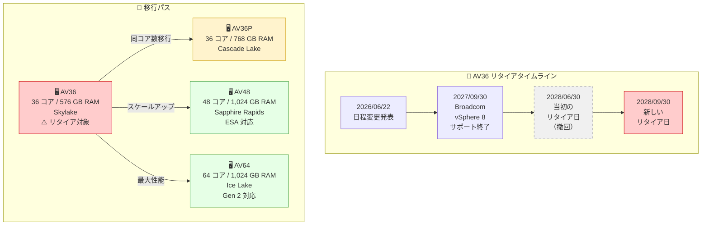

# Azure VMware Solution: AV36 ノードのリタイア日変更 (2028 年 9 月 30 日)

**リリース日**: 2026-06-22

**サービス**: Azure VMware Solution

**機能**: AV36 ノードのリタイア日程変更

**ステータス**: Retirement

[このアップデートのインフォグラフィックを見る](https://takech9203.github.io/azure-news-summary/20260622-vmware-solution-av36-retirement-date-update.html)

## 概要

Microsoft は、Azure VMware Solution の AV36 ノードタイプのリタイア日を、当初発表の 2028 年 6 月 30 日から 2028 年 9 月 30 日に変更することを発表した。この変更は、VMware (Broadcom) のロードマップとの整合性を取るためのものである。

Broadcom は、AV36 ノードが使用する vSphere 8 のサポートを 2027 年 9 月 30 日に終了する予定であり、AV36 SKU はそれ以降のバージョンの vSphere との互換性がない。そのため、AV36 ノードは vSphere 8 のサポート終了後、最大 1 年間の猶予期間を経て 2028 年 9 月 30 日にリタイアとなる。

AV36 は Skylake マイクロアーキテクチャ (Intel Xeon Gold 6140) を採用した初期の Azure VMware Solution ノードタイプであり、36 物理コア、576 GB RAM の構成である。後継ノード (AV36P、AV48、AV64) への移行が必要となる。

**リタイア日変更の経緯**

- 当初の発表: AV36 ノードのリタイア日は 2028 年 6 月 30 日
- 今回の変更: 2028 年 9 月 30 日に延長
- 理由: VMware/Broadcom のロードマップとの整合性確保

**必要なアクション**

- 2028 年 9 月 30 日までに AV36 ノードから後継ノード (AV36P、AV48、AV64) への移行を完了する
- 予約インスタンス (RI) の有効期限を確認し、移行計画と整合させる
- vSphere 8 のサポート終了 (2027 年 9 月 30 日) 以降はセキュリティパッチが提供されない可能性があるため、早期移行を推奨

## アーキテクチャ図

AV36 ノードから後継ノードへの移行パスとリタイアタイムラインを示している。Broadcom による vSphere 8 サポート終了後、約 1 年の猶予期間内に移行を完了する必要がある。

## サービスアップデートの詳細

### リタイア日変更の背景

1. **Broadcom vSphere 8 サポート終了 (2027 年 9 月 30 日)**
   - Broadcom は vSphere 8 のサポートを 2027 年 9 月 30 日に終了する
   - AV36 SKU は vSphere 8 上で動作しており、後続バージョンの vSphere との互換性がない
   - サポート終了後はセキュリティパッチやバグ修正が提供されなくなる

2. **リタイア日の延長 (2028 年 6 月 30 日 → 9 月 30 日)**
   - 当初発表されたリタイア日は 2028 年 6 月 30 日であった
   - VMware/Broadcom のロードマップとの整合性を確保するため、3 か月延長された
   - これにより、vSphere 8 サポート終了後、ちょうど 1 年間の移行猶予期間が確保される

3. **AV36 ノードの制約**
   - Skylake 世代の CPU を使用しており、最も古いノードタイプである
   - vSphere の次期バージョンと互換性がなく、プラットフォーム更新ができない
   - 後継ノードと比較してコア性能、メモリ容量ともに劣る

## 技術仕様

| 項目 | AV36 (リタイア対象) | AV36P (後継候補) | AV48 (後継候補) | AV64 (後継候補) |
|------|------|------|------|------|
| CPU | Intel Xeon Gold 6140 (Skylake) | Intel Xeon Gold 6240 (Cascade Lake) | Intel Xeon Gold 6442Y (Sapphire Rapids) | Intel Xeon Platinum 8370C (Ice Lake) |
| 物理コア数 | 36 (18 x 2) | 36 (18 x 2) | 48 (24 x 2) | 64 (32 x 2) |
| 論理コア数 | 72 | 72 | 96 | 128 |
| RAM | 576 GB | 768 GB | 1,024 GB | 1,024 GB |
| vSAN アーキテクチャ | OSA | OSA | ESA | OSA / ESA |
| vSAN キャッシュ層 | 3.2 TB (NVMe) | 1.5 TB (Intel Cache) | N/A | 3.84 TB (NVMe) / N/A |
| vSAN 容量層 | 15.20 TB (SSD) | 19.20 TB (NVMe) | 25.6 TB (NVMe) | 15.36 TB / 19.25 TB (NVMe) |
| ネットワーク | 100 Gbps | 100 Gbps | 100 Gbps | 100 Gbps |
| リタイア日 | 2028/09/30 | 2029/06/30 | - | - |

## 推奨される対応

### 移行先の選定ガイドライン

**AV36 から AV36P への移行:**

- コア数が同じ 36 のため、ワークロードの互換性が最も高い
- RAM が 576 GB から 768 GB に増加し、メモリ制約が緩和される
- ストレージが SSD から NVMe に変更され、I/O 性能が向上する
- ただし AV36P も 2029 年 6 月 30 日にリタイアが予定されているため、長期的な選択肢としては AV48 または AV64 を推奨

**AV36 から AV48 への移行:**

- コア数が 36 から 48 に増加 (33% 増)、RAM は 576 GB から 1,024 GB に増加 (78% 増)
- vSAN Express Storage Architecture (ESA) に対応しており、ストレージ効率が大幅に向上
- Sapphire Rapids 世代の最新 CPU で、シングルスレッド性能も向上
- リタイア予定日が設定されておらず、長期的に安定した運用が可能

**AV36 から AV64 への移行:**

- コア数が 36 から 64 に大幅増加 (78% 増)、コンピューティング集約型ワークロードに最適
- Azure VMware Solution Generation 2 に対応し、Azure Virtual Network への直接接続が可能
- AV64 はベースクラスター (AV36、AV36P、AV48、AV52) が前提条件として必要 (Generation 1 での拡張時)
- 7 つの vSAN フォルトドメインによる高い可用性

### 移行手順の概要

1. 現在の AV36 クラスターの構成 (ノード数、ストレージ使用量、ワークロード特性) を棚卸しする
2. 移行先ノードタイプを決定する (長期視点では AV48 または AV64 を推奨)
3. 予約インスタンス (RI) の有効期限とリタイア日の整合性を確認する
4. Azure Portal でプライベートクラウドに新しいクラスターを追加する
5. VMware HCX または vMotion を使用してワークロードを移行する
6. 移行完了後、AV36 クラスターのノードを削除する

### 移行時の注意事項 (EVC 互換性)

AV36 (Skylake) から AV64 (Ice Lake) への移行では、Enhanced vMotion Compatibility (EVC) の互換性に注意が必要である。AV36 クラスターには明示的な EVC モードが設定されていないが、AV64 クラスターは Ice Lake EVC モードを使用する。

- AV36 から AV64 への vMotion: 低い EVC モードから高い EVC モードへの移行のため、通常は問題なく動作する
- AV64 から AV36 への vMotion: AV64 上で作成または電源再投入した VM は EVC 互換性エラーで失敗する可能性がある
- 対策: VM レベルの EVC モードを低い方のクラスターに合わせて設定するか、コールドマイグレーションを使用する

## デメリット・制約事項

- AV36P への移行は同コア数で移行しやすいが、AV36P 自体も 2029 年 6 月 30 日にリタイア予定であり、二重の移行が必要になる可能性がある
- AV36 (576 GB RAM) から AV48/AV64 (1,024 GB RAM) への移行では RAM 容量は増加するが、ノードあたりのコスト増加を考慮する必要がある
- AV64 の利用にはベースクラスター (AV36、AV36P、AV48、AV52) が前提条件として必要な場合がある (Generation 1 での拡張時)
- 異なる世代の CPU 間での EVC 互換性に注意が必要
- vSphere 8 サポート終了 (2027 年 9 月 30 日) 後から AV36 リタイア日 (2028 年 9 月 30 日) までの期間はセキュリティリスクが増大する

## 関連サービス・機能

- **Azure VMware Solution Generation 2**: AV64 SKU で利用可能な新しいアーキテクチャ。VMware vSphere ホストが Azure Virtual Network に直接接続される
- **VMware HCX**: ワークロードのモビリティ、マイグレーション、ネットワーク拡張サービスを提供。ノード移行時に活用可能
- **VMware vMotion**: 仮想マシンのライブマイグレーション機能。クラスター間のワークロード移行に使用
- **Azure NetApp Files / Azure Elastic SAN**: Azure VMware Solution のデータストア容量を vSAN 以外に拡張するためのストレージサービス

## 参考リンク

- [インフォグラフィック](https://takech9203.github.io/azure-news-summary/20260622-vmware-solution-av36-retirement-date-update.html)
- [公式アップデート情報](https://azure.microsoft.com/updates?id=503883)
- [Azure VMware Solution の概要 - Microsoft Learn](https://learn.microsoft.com/en-us/azure/azure-vmware/introduction)
- [プライベートクラウドとクラスターのアーキテクチャ - Microsoft Learn](https://learn.microsoft.com/en-us/azure/azure-vmware/architecture-private-clouds)
- [関連レポート: AV36P および AV52 ノードのリタイア (2029 年 6 月)](reports/2026/2026-03-17-vmware-solution-av36p-av52-retirement.md)

## まとめ

Azure VMware Solution の AV36 ノードのリタイア日が、当初の 2028 年 6 月 30 日から 2028 年 9 月 30 日に変更された。この変更は Broadcom が vSphere 8 のサポートを 2027 年 9 月 30 日に終了することに伴い、VMware のロードマップとの整合性を取るためのものである。

AV36 は Skylake 世代の最も古いノードタイプであり、vSphere の次期バージョンとの互換性がない。Solutions Architect としては、以下のアクションを推奨する:

1. **即時**: 現在の AV36 ノード利用状況と RI 有効期限を棚卸しする
2. **2027 年前半まで**: 移行先ノードタイプを決定し、移行計画を策定する (AV36P は短期的選択肢、AV48/AV64 は長期的推奨)
3. **2027 年 9 月 30 日まで**: vSphere 8 サポート終了前に移行を完了することを推奨 (セキュリティリスク軽減)
4. **2028 年 9 月 30 日**: AV36 の最終リタイア日。この日までに必ず移行を完了する

なお、AV36P も 2029 年 6 月 30 日にリタイアが予定されているため、長期的な視点では AV48 または AV64 への移行が望ましい。

---

**タグ**: #Azure #AzureVMwareSolution #VMware #Compute #AV36 #Retirement #Migration #Broadcom #vSphere
