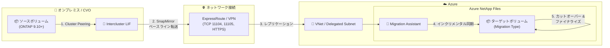

# Azure NetApp Files: Migration Assistant の一般提供開始

**リリース日**: 2026-06-23

**サービス**: Azure NetApp Files

**機能**: Migration Assistant (with SnapMirror)

**ステータス**: Generally Available (GA)

[このアップデートのインフォグラフィックを見る](https://takech9203.github.io/azure-news-summary/20260623-netapp-files-migration-assistant.html)

## 概要

Azure NetApp Files の Migration Assistant が一般提供 (GA) として正式リリースされた。この機能は、ONTAP の組み込みレプリケーションエンジン (SnapMirror) を活用し、オンプレミスの NetApp ONTAP ストレージまたは Cloud Volumes ONTAP (CVO) / 他のクラウドプロバイダーから Azure NetApp Files (ANF) への効率的かつコスト効果の高いデータ移行を実現する。

Migration Assistant は、ボリュームのコンテンツ (ディレクトリ、ファイル、ファイルメタデータ、既存のスナップショット) をすべてコピーし、ストレージ最適化されたデータ移行により、ベースラインおよびインクリメンタル更新のネットワークコストを削減する。最小限のカットオーバーウィンドウで高速な最終同期を実現し、ダウンタイムを最小化する。

**アップデート前の課題**

- オンプレミス ONTAP から Azure への移行には、サードパーティツールやファイルコピーベースの移行が必要で、時間とコストがかかっていた
- 大規模データの移行ではネットワーク帯域幅の消費が大きく、ベースライン転送後の差分同期が効率的に行えなかった
- 移行中のダウンタイムが長く、ビジネスへの影響が大きかった
- 既存のスナップショットやファイルメタデータ (所有者情報、作成日、変更日) が移行時に失われるリスクがあった

**アップデート後の改善**

- ONTAP ネイティブの SnapMirror レプリケーションエンジンを活用した効率的なブロックレベル移行が可能に
- ストレージ最適化された転送により、ベースラインおよびインクリメンタル更新のネットワークコストを大幅に削減
- 最小限のカットオーバーウィンドウにより、ダウンタイムを最小化
- 既存のボリュームスナップショットを含めたデータ整合性の確保
- Azure Portal および REST API からの統合的な移行管理が可能に
- ドライラン機能によりカットオーバー前のアプリケーションテストが可能に

## アーキテクチャ図

オンプレミスまたは CVO の ONTAP クラスターから、ExpressRoute/VPN を経由して SnapMirror レプリケーションにより Azure NetApp Files へデータを移行するフローを示す。Migration Assistant がクラスターピアリング、SVM ピアリング、ベースライン転送、差分同期、カットオーバーのライフサイクルを管理する。

## サービスアップデートの詳細

### 主要機能

1. **SnapMirror ベースのブロックレベルレプリケーション**
   - ONTAP の組み込みレプリケーションエンジンを使用し、変更されたブロックのみを転送
   - ベースライン転送後はインクリメンタル更新のみ送信し、ネットワーク帯域幅を最適化

2. **完全なデータ保全**
   - ディレクトリ、ファイル、ファイルメタデータ (所有者、作成日、変更日) をすべてコピー
   - 既存のボリュームスナップショットも含めて移行

3. **ドライラン機能**
   - カットオーバー前にボリュームを読み書き可能にし、アプリケーションテストが可能
   - ドライラン後に再開すると、ドライラン中のデータは消去され同期が継続

4. **Azure Portal 統合管理**
   - NetApp アカウントの Migration Assistant ビューから一元管理
   - 移行の作成、同期、ドライラン、カットオーバー、ファイナライズの各操作を GUI で実行可能

5. **REST API / PowerShell サポート**
   - REST API による自動化対応
   - PowerShell サンプルスクリプト提供による自動化ワークフロー構築が可能

6. **柔軟なレプリケーションスケジュール**
   - ソースボリュームとターゲットボリューム間の同期頻度を選択可能

## 技術仕様

| 項目 | 詳細 |
|------|------|
| ソース要件 | ONTAP 9.10.0 以降 |
| ライセンス要件 | SnapMirror ライセンス (Azure Technology Specialist が適用) |
| ネットワーク機能 | Standard ネットワーク機能が必須 |
| 必要なファイアウォールルール | ICMP, TCP 11104, TCP 11105, HTTPS (双方向) |
| 委任サブネット最小空き IP | 7 個 (クラスターピアリング用 6 + データアクセス用 1) |
| ピアリングタイムアウト | 60 分以内にオンプレミス側で承認が必要 |
| サポートされるプロトコル | NFS, SMB, デュアルプロトコル |
| ボリュームタイプ | FlexVol (FlexGroup は非対応) |
| ターゲットボリュームサイズ推奨 | ソースの 120% 以上 (論理容量サイズ) |

## 設定方法

### 前提条件

1. ONTAP 9.10.0 以降が稼働するオンプレミスクラスターまたは Cloud Volumes ONTAP
2. SnapMirror ライセンスの取得と適用 (Azure Technology Specialist に依頼)
3. ExpressRoute または VPN によるオンプレミスと Azure 間のネットワーク接続
4. Azure NetApp Files の委任サブネットに 7 つ以上の空き IP アドレス
5. Standard ネットワーク機能を使用する Azure NetApp Files ボリューム
6. スナップショットロックの無効化 (ソースボリューム)

### Azure Portal

1. NetApp アカウントの **Migration assistant** を選択
2. **New migration** を選択し、ソース情報を入力:
   - Cluster Name: ソースクラスター名
   - SVM Name: ソース SVM 名
   - Source volume name: 移行元ボリューム名
   - Volume size: ボリュームサイズ (ソースの 120% 以上推奨)
   - Replication schedule: 同期頻度
3. ターゲットボリュームのプロトコル・エクスポートポリシーを設定
4. **Review + Create** でボリューム作成
5. **Migration** タブから **Configure Peering** を選択
6. Intercluster LIF アドレスを入力してクラスターピアリングを実行
7. オンプレミス側で peering コマンドとパスフレーズを実行
8. SVM ピアリングコマンドをオンプレミス側で実行
9. ベースライン転送の完了を待機
10. 必要に応じて **Dry run** でテスト
11. **Cut over** でレプリケーション関係を切断
12. **Finalize migration** で移行を完了

## メリット

### ビジネス面

- 移行に伴うダウンタイムの最小化により、ビジネス継続性を維持
- サードパーティの移行ツールのライセンスコストが不要
- ストレージ最適化された転送によるネットワークコスト削減
- ドライラン機能によりリスクを最小化した移行計画が可能

### 技術面

- ブロックレベルのインクリメンタルレプリケーションによる高効率な転送
- ファイルメタデータとスナップショットの完全な保全
- Azure Portal および REST API からの統合管理
- ONTAP ネイティブのレプリケーションエンジンによる信頼性の高い転送
- 移行後は通常の Azure NetApp Files ボリュームとして即時利用可能

## デメリット・制約事項

- FlexGroup ボリュームは Azure NetApp Files Large Volumes への移行に非対応
- クラスターピアリングリクエストは 60 分以内に承認が必要 (超過するとやり直し)
- 単一ソースクラスターからの移行は 1 つの Azure サブスクリプションずつ完了する必要がある
- 移行中はバックアップなどの機能を有効化しないこと
- Standard ネットワーク機能のみ対応 (Basic ネットワーク機能は非対応)
- SnapMirror ライセンスの取得が必要 (Azure Technology Specialist の関与が必要)
- LDAP または Active Directory の設定はユーザー責任
- 同一ゾーン内では一度に 1 つのアクティブなサブスクリプションのみ移行可能

## ユースケース

### ユースケース 1: オンプレミス ONTAP から Azure への大規模データ移行

**シナリオ**: エンタープライズ環境でオンプレミスの NetApp ONTAP ストレージ上に数十 TB のファイルデータがあり、Azure へのリフト&シフト移行を計画している。ダウンタイムを最小限に抑えつつ、ファイルの権限やメタデータを保持したまま移行する必要がある。

**効果**: SnapMirror のブロックレベルレプリケーションにより、初回のベースライン転送後は差分のみ同期。最終カットオーバー時のダウンタイムは最終差分転送の時間のみに短縮される。

### ユースケース 2: Cloud Volumes ONTAP (他クラウド) から Azure への移行

**シナリオ**: 他のクラウドプロバイダーで Cloud Volumes ONTAP を利用しているが、Azure NetApp Files のネイティブパフォーマンスとコスト効率を活用するために移行したい。

**効果**: CVO から直接 SnapMirror レプリケーションで移行でき、中間ステップなしでシームレスな移行を実現。既存のスナップショットやメタデータも保持される。

### ユースケース 3: DR/テスト目的でのドライラン検証

**シナリオ**: 本番移行前に、アプリケーションが Azure NetApp Files 上で正しく動作するかをドライラン機能で検証したい。

**効果**: ドライラン中はボリュームが読み書き可能になり、アプリケーションテストやパフォーマンス検証が可能。問題があれば再開して同期を継続し、本番カットオーバーのリスクを最小化できる。

## 料金

Migration Assistant 自体の追加料金はなく、Azure NetApp Files の標準的な容量プール料金が適用される。

移行中のレプリケーションデータ転送については、クロスリージョンレプリケーションと同様の課金モデルが適用される可能性がある。詳細は公式料金ページを参照のこと。

Azure NetApp Files の料金は容量プールのサイズとサービスレベルに基づき、以下の 5 つのパフォーマンスティアが利用可能:

| サービスレベル | 特徴 |
|------|------|
| Elastic (ゾーン冗長) | ゾーン冗長対応の最新ティア |
| Ultra | 最高パフォーマンス |
| Premium | 高パフォーマンス |
| Standard | 標準パフォーマンス |
| Flexible | 柔軟なスループット設定 |

容量プールの最小サイズは 1 TiB、最大サイズは 2,048 TiB。

詳細な料金情報: [Azure NetApp Files 料金ページ](https://azure.microsoft.com/pricing/details/netapp/)

## 関連サービス・機能

- **Azure NetApp Files Cross-Region Replication**: リージョン間のデータレプリケーションによる DR 対策。移行後の継続的な保護に活用可能
- **Azure NetApp Files Cross-Zone Replication**: アベイラビリティゾーン間のレプリケーション。移行先での高可用性構成に使用
- **Azure ExpressRoute**: オンプレミスと Azure 間の専用接続。Migration Assistant の高速で安定したデータ転送に推奨
- **Azure VPN Gateway**: ExpressRoute の代替としてのネットワーク接続オプション
- **Cloud Volumes ONTAP**: 他クラウドプロバイダーでの ONTAP 環境。Migration Assistant のソースとして対応
- **Azure NetApp Files Snapshots & Backup**: 移行完了後のデータ保護機能

## 参考リンク

- [インフォグラフィック](https://takech9203.github.io/azure-news-summary/20260623-netapp-files-migration-assistant.html)
- [公式アップデート情報](https://azure.microsoft.com/updates?id=565480)
- [Microsoft Learn - Migrate volumes to Azure NetApp Files](https://learn.microsoft.com/azure/azure-netapp-files/migrate-volumes)
- [Microsoft Learn - Migrating data into Azure NetApp Files volumes](https://learn.microsoft.com/azure/azure-netapp-files/migrate-data)
- [Microsoft Learn - Azure NetApp Files の概要](https://learn.microsoft.com/azure/azure-netapp-files/azure-netapp-files-introduction)
- [Microsoft Learn - Azure NetApp Files Replication](https://learn.microsoft.com/azure/azure-netapp-files/replication)
- [料金ページ](https://azure.microsoft.com/pricing/details/netapp/)
- [PowerShell Migration Assistant Workflow サンプルスクリプト](https://github.com/Azure-Samples/azure-docs-powershell-samples/blob/main/migration-assistant/migration-assistant-workflow.ps1)

## まとめ

Azure NetApp Files Migration Assistant の GA リリースにより、オンプレミスの ONTAP 環境や他クラウドの Cloud Volumes ONTAP から Azure NetApp Files への移行が大幅に簡素化された。ONTAP ネイティブの SnapMirror レプリケーションエンジンを活用することで、ブロックレベルの効率的なデータ転送、メタデータとスナップショットの完全保全、最小限のカットオーバーダウンタイムを実現する。

**推奨される次のアクション:**
- オンプレミスの ONTAP バージョンが 9.10.0 以降であることを確認
- ExpressRoute または VPN によるネットワーク接続を計画・構築
- SnapMirror ライセンスの取得について Azure Technology Specialist に相談
- 移行対象ボリュームの棚卸しと、FlexGroup ボリュームの有無を確認
- ドライラン機能を活用した段階的な移行計画を策定

---

**タグ**: #AzureNetAppFiles #Migration #SnapMirror #Storage #ONTAP #DataMigration #GA
