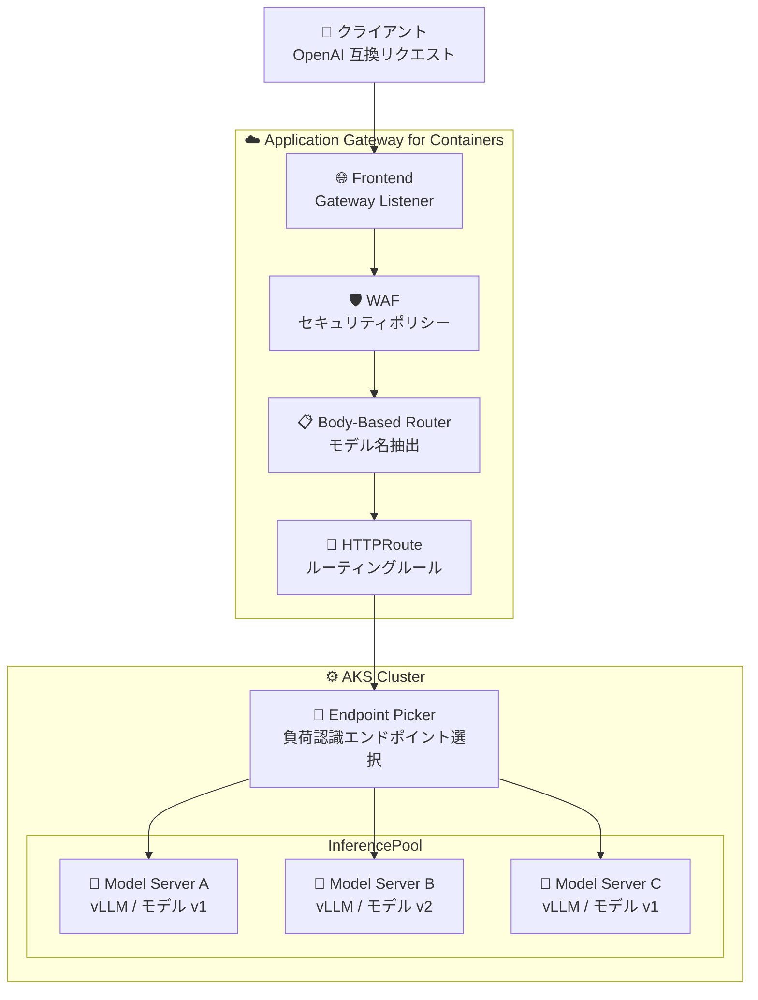

# Application Gateway for Containers: Inference Gateway (AI ゲートウェイ機能)

**リリース日**: 2026-06-24

**サービス**: Application Gateway for Containers

**機能**: Inference Gateway (推論ゲートウェイ)

**ステータス**: In preview

[このアップデートのインフォグラフィックを見る](https://takech9203.github.io/azure-news-summary/20260624-appgw-containers-inference-gateway.html)

## 概要

Application Gateway for Containers に、AI 推論ワークロード向けの新しいゲートウェイ機能「Inference Gateway (推論ゲートウェイ)」がパブリックプレビューとして追加された。この機能は、Kubernetes Gateway API Inference Extension を Application Gateway for Containers に統合し、セルフホスト型のモデルサーバーに対するモデル認識ルーティングやロードアウェアなエンドポイント選択を実現する。

AI 推論リクエストは従来のステートレスな HTTP アプリケーションとは異なり、モデル固有であり、長時間実行され、GPU リソースを大量に消費し、アクセラレータの可用性やキュー深度、KV キャッシュ使用率などのランタイムシグナルに敏感である。Inference Gateway はこれらの特性に対応し、汎用的なロードバランシングではなくモデルサーバーのシグナルに基づくルーティングを行うことで、Time to First Token (TTFT) の短縮、負荷時のタイムアウト削減、GPU 効率の向上を実現する。

また、Application Gateway for Containers の既存の Web Application Firewall (WAF) 機能と組み合わせることで、推論トラフィックに対する OWASP 準拠のセキュリティ保護を適用でき、悪意のあるリクエストが高価な GPU バックエンドに到達する前にブロックできる。

**アップデート前の課題**

- Kubernetes 上でセルフホスト型 LLM を運用する際、推論リクエストのモデル認識ルーティングを実現するには別途カスタムプロキシやルーティングレイヤーを構築する必要があった
- GPU リソースの効率的な利用のため、モデルサーバーの負荷状況 (キュー深度、KV キャッシュ使用率) に基づくインテリジェントなルーティングが標準的なロードバランサーでは不可能だった
- AI 推論エンドポイントのセキュリティ保護 (WAF) とトラフィック管理を統合的に行う手段がなかった
- モデルのカナリアデプロイやブルーグリーンデプロイ時のトラフィック分割を Kubernetes ネイティブに管理する方法が限られていた

**アップデート後の改善**

- Gateway API Inference Extension の InferencePool / InferenceObjective リソースにより、Kubernetes ネイティブな API でモデルサーバーへの推論トラフィックを管理可能に
- Body-Based Router (BBR) がマネージドコンポーネントとして提供され、OpenAI 互換リクエストボディからモデル名を自動抽出してルーティング
- Endpoint Picker (EPP) によるロードアウェアなエンドポイント選択で、最も負荷の低いレプリカに自動ルーティング
- WAF との統合により、推論トラフィックのセキュリティ保護をエッジで実施し、GPU リソースの無駄な消費を防止

## アーキテクチャ図



クライアントからの推論リクエストは、Application Gateway for Containers の Frontend で受信され、WAF でセキュリティ検査を受けた後、BBR がリクエストボディからモデル名を抽出する。HTTPRoute が適切な InferencePool を選択し、EPP がモデルサーバーのテレメトリに基づいて最適なエンドポイントにリクエストを転送する。

## サービスアップデートの詳細

### 主要機能

1. **Gateway API Inference Extension サポート**
   - Kubernetes Gateway API の Inference Extension (InferencePool, InferenceObjective) をネイティブサポート
   - 標準的な Gateway API リソース (Gateway, HTTPRoute, ReferenceGrant) との完全な互換性を維持
   - InferencePool v1alpha1 および InferenceObjective v1alpha1 をサポート

2. **Body-Based Router (BBR) - マネージドコンポーネント**
   - OpenAI 互換リクエストボディ (`/v1/chat/completions`, `/v1/completions`, `/v1/models`) から `model` フィールドを自動抽出
   - 抽出したモデル名を `X-Gateway-Model-Name` ヘッダーとして注入し、HTTPRoute でのルーティングに使用
   - Azure マネージドサービスとして提供されるため、別途デプロイ・スケーリング・パッチ適用は不要

3. **Endpoint Picker (EPP) - インテリジェントなエンドポイント選択**
   - クラスター内で動作するカスタマー提供の拡張コンポーネント
   - モデルサーバーのテレメトリ (キュー深度、KV キャッシュ使用率) に基づくスコアリング
   - プレフィックスキャッシュ親和性により、同じプロンプトプレフィックスを共有するリクエストを同一レプリカにルーティング
   - FailOpen / FailClose の障害モード設定をサポート

4. **モデル認識ルーティング**
   - リクエストボディ内のモデル名に基づくルーティング
   - 複数モデルバージョンへのトラフィック分割 (カナリア/ブルーグリーンデプロイ)
   - HTTPRoute の weighted backendRefs による段階的ロールアウト

5. **リクエスト優先度とオーバーロード保護**
   - InferenceObjective リソースによる提供優先度の定義
   - `x-gateway-inference-objective` リクエストヘッダーによる優先度指定
   - モデルサーバー飽和時に低優先度リクエストを優先的にシェッド

6. **WAF との統合によるセキュア推論**
   - OWASP 準拠の保護を AI トラフィックに適用
   - マネージドエッジでのポリシー適用により、不正リクエストが GPU リソースを消費する前にブロック

## 技術仕様

| 項目 | 詳細 |
|------|------|
| API バージョン | Gateway API v1.5, Inference Extension v1alpha1 |
| サポートする Gateway API リソース | GatewayClass, Gateway, HTTPRoute, GRPCRoute, ReferenceGrant, InferencePool, InferenceObjective |
| BBR 対応 API 形式 | OpenAI 互換 HTTP API (`/v1/chat/completions`, `/v1/completions`, `/v1/models`) |
| モデル名抽出元 | リクエストボディの `model` フィールド |
| モデル名ヘッダー | `X-Gateway-Model-Name` |
| EPP 障害モード | FailOpen (可用性優先), FailClose (正確性優先) |
| リスナーポート | 80, 443 |
| 対応プロトコル | HTTP, HTTPS, gRPC, AI inference |
| ストリーミング | Server-Sent Events (SSE) サポート |
| デプロイ戦略 | BYO (Bring Your Own) または ALB Controller マネージド |

## 設定方法

### 前提条件

1. AKS クラスター (Application Gateway for Containers がサポートされるリージョン)
2. ALB Controller がクラスターにデプロイされていること
3. Application Gateway for Containers リソースが作成済みであること
4. Gateway API Inference Extension CRDs がクラスターにインストールされていること
5. Endpoint Picker (EPP) のデプロイ
6. モデルサーバー (vLLM など) が GPU ノードプールで稼働していること

### Kubernetes リソース設定例

```yaml
# InferencePool の定義
apiVersion: inference.networking.x-k8s.io/v1alpha1
kind: InferencePool
metadata:
  name: my-llm-pool
spec:
  targetPortNumber: 8000
  selector:
    matchLabels:
      app: vllm-server
  endpointPickerConfig:
    extensionRef:
      name: my-epp
    failureMode: FailOpen
---
# HTTPRoute で InferencePool をバックエンドに指定
apiVersion: gateway.networking.k8s.io/v1
kind: HTTPRoute
metadata:
  name: inference-route
spec:
  parentRefs:
  - name: my-gateway
  rules:
  - matches:
    - path:
        type: PathPrefix
        value: /v1
    backendRefs:
    - group: inference.networking.x-k8s.io
      kind: InferencePool
      name: my-llm-pool
```

## メリット

### ビジネス面

- GPU リソースの効率的な活用により、セルフホスト型 LLM の運用コストを削減
- モデルのカナリアデプロイにより、安全な段階的ロールアウトが可能
- リクエスト優先度管理により、重要なワークロード (対話型チャットなど) の SLA を保護

### 技術面

- Kubernetes ネイティブ API (Gateway API Inference Extension) による標準的な設定モデル
- BBR がマネージドサービスとして提供されるため、運用負荷が軽減
- ロードアウェアルーティングにより Time to First Token (TTFT) を短縮
- プレフィックスキャッシュ親和性によりキャッシュヒット率向上
- WAF 統合によるセキュリティとトラフィック管理の一元化
- 既存の Application Gateway for Containers の機能 (TLS 終端、mTLS、ヘッダーリライト等) をそのまま利用可能

## デメリット・制約事項

- パブリックプレビュー段階であり、本番ワークロードでの SLA 保証はない
- EPP はカスタマー自身がデプロイ・管理する必要があり、リクエストパス上のクリティカルコンポーネントとなる
- セルフホスト型推論ワークロードのみが対象。パブリックまたはマネージドモデルプロバイダーエンドポイントへの直接ルーティングはスコープ外
- Gateway API Inference Extension は Application Gateway for Containers とは独立して進化するため、API バージョンと CRD の互換性管理が必要
- BBR はモデル名を抽出できない場合にリクエストを拒否する (サイレントに誤ルーティングしない設計)
- GPU ノードプール、デバイスプラグイン、モデルダウンロード資格情報の事前準備が必要

## ユースケース

### ユースケース 1: マルチモデルサービングとバージョンロールアウト

**シナリオ**: 企業が複数の LLM バージョン (GPT-4o 相当のモデル v1 と v2) をセルフホストしており、新バージョンへの段階的移行を行いたい。

**実装例**:

```yaml
apiVersion: gateway.networking.k8s.io/v1
kind: HTTPRoute
metadata:
  name: model-rollout
spec:
  parentRefs:
  - name: inference-gateway
  rules:
  - matches:
    - headers:
      - name: X-Gateway-Model-Name
        value: my-model-v2
    backendRefs:
    - group: inference.networking.x-k8s.io
      kind: InferencePool
      name: model-v2-pool
      weight: 20
    - group: inference.networking.x-k8s.io
      kind: InferencePool
      name: model-v1-pool
      weight: 80
```

**効果**: カナリアデプロイにより、新モデルバージョンへのトラフィックを段階的に増加させ、品質やレイテンシの問題を早期検出できる。

### ユースケース 2: レイテンシクリティカルなトラフィックの優先制御

**シナリオ**: 対話型チャットアプリケーション (低レイテンシ必須) とバッチ処理ジョブ (スループット重視) が同じモデルサーバープールを共有している。

**実装例**:

```yaml
apiVersion: inference.networking.x-k8s.io/v1alpha1
kind: InferenceObjective
metadata:
  name: high-priority-chat
spec:
  targetRef:
    name: shared-llm-pool
  priority: Critical
---
apiVersion: inference.networking.x-k8s.io/v1alpha1
kind: InferenceObjective
metadata:
  name: low-priority-batch
spec:
  targetRef:
    name: shared-llm-pool
  priority: Default
```

**効果**: モデルサーバーが飽和状態になった際、バッチジョブのリクエストが優先的にシェッドされ、対話型チャットのレイテンシ SLA が保護される。

## 料金

Application Gateway for Containers の料金体系に準拠する。Inference Gateway 機能固有の追加料金については、プレビュー期間中の公式情報を確認する必要がある。

詳細は [Application Gateway 料金ページ](https://azure.microsoft.com/pricing/details/application-gateway/) を参照。

## 利用可能リージョン

Application Gateway for Containers がサポートされる全リージョンで利用可能:

- Australia East
- Brazil South
- Canada Central
- Central India
- Central US
- East Asia
- East US
- East US 2
- France Central
- Germany West Central
- Korea Central
- North Central US
- North Europe
- Norway East
- South Central US
- Southeast Asia
- Sweden Central
- Switzerland North
- UAE North
- UK South
- West US
- West US 2
- West US 3
- West Europe

## 関連サービス・機能

- **Azure Kubernetes Service (AKS)**: Inference Gateway が稼働するコンピュート基盤。GPU ノードプールでモデルサーバーをホスト
- **Application Gateway for Containers WAF**: 推論トラフィックに対する OWASP 準拠のセキュリティ保護
- **Gateway API Inference Extension**: Kubernetes SIG-Network が策定する推論ゲートウェイの標準仕様
- **vLLM**: サポートされる代表的なモデルサーバーランタイム (OpenAI 互換 API を提供)
- **KEDA / Horizontal Pod Autoscaler**: 推論シグナル (キュー深度、KV キャッシュ使用率) に基づくモデルサーバーのオートスケーリング

## 参考リンク

- [インフォグラフィック](https://takech9203.github.io/azure-news-summary/20260624-appgw-containers-inference-gateway.html)
- [公式アップデート情報](https://azure.microsoft.com/updates?id=566516)
- [Azure Blog: From insight to action: The next phase of agentic cloud operations](https://azure.microsoft.com/en-us/blog/from-insight-to-action-the-next-phase-of-agentic-cloud-operations/)
- [Microsoft Learn: Application Gateway for Containers 概要](https://learn.microsoft.com/en-us/azure/application-gateway/for-containers/overview)
- [Microsoft Learn: Inference Gateway](https://learn.microsoft.com/en-us/azure/application-gateway/for-containers/inference-gateway)
- [Gateway API Inference Extension](https://gateway-api-inference-extension.sigs.k8s.io/)
- [料金ページ](https://azure.microsoft.com/pricing/details/application-gateway/)

## まとめ

Application Gateway for Containers の Inference Gateway は、Kubernetes 上でセルフホスト型 LLM を運用する組織にとって重要な機能追加である。従来は推論トラフィックのインテリジェントなルーティングにカスタムソリューションが必要だったが、Gateway API Inference Extension という標準仕様に基づき、モデル認識ルーティング、ロードアウェアなエンドポイント選択、リクエスト優先度管理が Kubernetes ネイティブに実現可能になった。

Solutions Architect として推奨される次のアクション:
- セルフホスト型 AI 推論ワークロードを持つプロジェクトで、プレビュー環境での検証を開始する
- 既存の Application Gateway for Containers 環境がある場合、Inference Extension CRDs の追加と EPP のデプロイを計画する
- モデルサーバー (vLLM 等) が OpenAI 互換 API を公開していることを確認し、BBR によるモデル名抽出の動作を検証する

---

**タグ**: #ApplicationGateway #Containers #InferenceGateway #AI #Kubernetes #GatewayAPI #LLM #AKS #Networking #Preview
