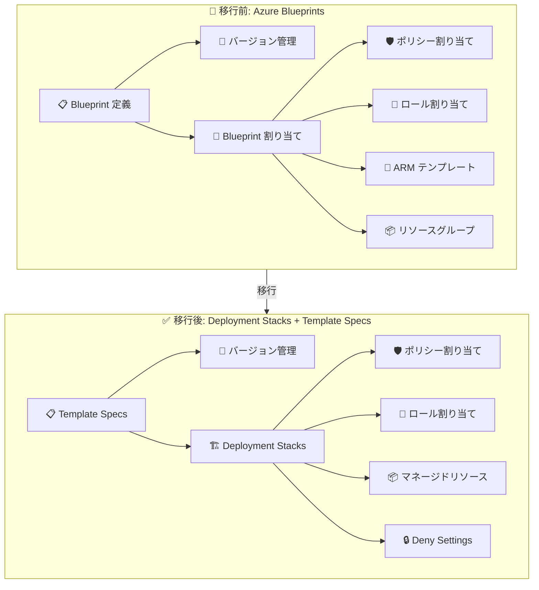

# Azure Blueprints: 廃止タイムラインの延長 (2027 年 1 月 31 日まで)

**リリース日**: 2026-06-25

**サービス**: Azure Blueprints

**機能**: サービス廃止スケジュールの延長と段階的廃止計画

**ステータス**: Retirement

[このアップデートのインフォグラフィックを見る](https://takech9203.github.io/azure-news-summary/20260625-azure-blueprints-retirement-extension.html)

## 概要

Azure Blueprints (Preview) の廃止タイムラインが延長された。当初 2023 年 9 月に発表された廃止日 (2026 年 7 月 11 日) が **2027 年 1 月 31 日** に延期され、**2026 年 7 月 31 日** から段階的に機能制限が開始される。

Azure Blueprints は、Azure リソースのデプロイメントにおけるガバナンス (ポリシー、RBAC、ARM テンプレートなどのパッケージ化・バージョン管理・割り当て) を一元管理するサービスとして提供されてきた。今回の変更により、ユーザーは推奨される移行先である **Azure Deployment Stacks** と **Template Specs** へ十分な移行期間をもって移行できるようになる。

**アップデート前の課題**

- 当初の廃止日 (2026 年 7 月 11 日) までに移行を完了する必要があり、大規模環境では時間が不足する懸念があった
- Blueprint 定義・割り当てのエクスポートと移行手順が複雑で、段階的に移行する指針が不明確だった

**アップデート後の改善**

- 廃止日が 2027 年 1 月 31 日まで約 6 か月延長された
- 段階的な廃止スケジュールが明確化され、フェーズごとに何が利用停止になるかが事前に公開された
- 移行先 (Deployment Stacks + Template Specs) への具体的な移行ガイドがドキュメント化された

## アーキテクチャ図



Azure Blueprints の機能は、Template Specs (定義のストレージ・バージョン管理) と Deployment Stacks (デプロイ・ライフサイクル管理・ロック) の 2 つのサービスに分割して移行する。

## サービスアップデートの詳細

### 段階的廃止タイムライン

| フェーズ | 日付 | 変更内容 |
|---------|------|---------|
| **フェーズ 1** | 2026 年 7 月 31 日 | 新しい Blueprint 定義とバージョンの作成が不可に |
| **フェーズ 2** | 2026 年 10 月 31 日 | 既存 Blueprint 定義の変更・新規割り当ての作成が不可に |
| **フェーズ 3** | 2026 年 12 月 31 日 | 既存 Blueprint 割り当ての変更が不可に |
| **フェーズ 4** | 2027 年 1 月 31 日 | サービス完全廃止。API 停止、ポータルから削除、エクスポートされていない定義は永久削除 |

### 主要機能の代替

1. **Azure Deployment Stacks (推奨移行先)**
   - リソースコレクションを単一のユニットとして管理
   - Deny Settings によるリソース保護 (Blueprint ロックの代替)
   - リソースグループ、サブスクリプション、管理グループスコープで作成可能
   - ActionOnUnmanage によるライフサイクル管理

2. **Template Specs**
   - ARM テンプレートを Azure 上に保存・バージョン管理
   - Blueprint 定義のストレージ・共有機能の代替
   - Deployment Stacks と組み合わせて使用

## 技術仕様

| 項目 | 詳細 |
|------|------|
| 影響対象 | Azure Blueprints (Preview) を使用しているすべてのサブスクリプション・管理グループ |
| 段階的廃止開始 | 2026 年 7 月 31 日 |
| 完全廃止日 | 2027 年 1 月 31 日 |
| 推奨移行先 | Azure Deployment Stacks + Template Specs |
| Blueprint ロック代替 | Deployment Stacks の Deny Settings |
| 必要なツールバージョン | Azure PowerShell 12.0.0 以降、Azure CLI 2.61.0 以降 |

## 設定方法

### 前提条件

1. Azure Blueprints の既存定義・割り当てを特定する (Azure Advisor または Blueprint ブレードで確認)
2. Azure PowerShell 12.0.0 以降または Azure CLI 2.61.0 以降をインストール
3. Blueprint 定義をエクスポートする (2027 年 1 月 31 日までに必須)

### Azure CLI

```bash
# Deployment Stacks の作成 (Blueprint 割り当ての代替)
az stack sub create \
  --name 'my-governance-stack' \
  --location 'japaneast' \
  --template-file 'main.bicep' \
  --action-on-unmanage 'detachAll' \
  --deny-settings-mode 'denyDelete'
```

### Azure PowerShell

```powershell
# Deployment Stacks の作成 (サブスクリプションスコープ)
New-AzSubscriptionDeploymentStack `
  -Name "my-governance-stack" `
  -Location "japaneast" `
  -TemplateFile "main.bicep" `
  -ActionOnUnmanage "detachAll" `
  -DenySettingsMode "DenyDelete"
```

## メリット

### ビジネス面

- 移行期間が約 6 か月延長され、計画的な移行が可能に
- 段階的廃止により、移行の優先順位を付けやすくなった
- 業務影響を最小限に抑えた移行計画を立案できる

### 技術面

- Deployment Stacks は GA であり、Blueprint (Preview) より安定している
- Deny Settings は Blueprint ロックよりも柔軟なリソース保護が可能
- Bicep ファイルによる IaC が利用でき、ARM テンプレートのみだった Blueprint より開発体験が向上
- Git リポジトリでの管理により、PR レビュー・CI/CD パイプラインとの統合が容易

## デメリット・制約事項

- 2027 年 1 月 31 日以降はエクスポートされていない Blueprint データが永久削除される
- Deployment Stacks のポータル GUI は一部未実装の機能がある
- Blueprint の「パッケージ + 割り当て」を 1 つのサービスで完結できなくなり、Template Specs + Deployment Stacks の 2 つを組み合わせる必要がある
- Deny Settings は Control Plane のみに適用され、Data Plane 操作 (Blob の作成、Secret の追加等) には効かない

## ユースケース

### ユースケース 1: 既存 Blueprint 定義の Deployment Stacks への移行

**シナリオ**: 組織で Blueprint による標準環境デプロイを行っている場合

**実装例**:

```bash
# 1. 既存 Blueprint 定義をエクスポート
az stack group export \
  --name 'existing-blueprint-stack' \
  --resource-group 'governance-rg'

# 2. エクスポートした ARM テンプレートを Bicep に変換
az bicep decompile --file exported-template.json

# 3. Deployment Stacks として再デプロイ
az stack sub create \
  --name 'migrated-governance-stack' \
  --location 'japaneast' \
  --template-file 'main.bicep' \
  --action-on-unmanage 'detachAll' \
  --deny-settings-mode 'denyDelete'
```

**効果**: Blueprint の定義・割り当て・ロックを Deployment Stacks で再現し、GA サービスによる安定した運用を実現

### ユースケース 2: Template Specs を使用した定義の共有

**シナリオ**: 複数チームで共通のガバナンステンプレートを共有したい場合

**実装例**:

```bash
# Template Spec の作成
az ts create \
  --name 'standard-landing-zone' \
  --version '1.0.0' \
  --resource-group 'templates-rg' \
  --template-file 'landing-zone.bicep'

# Template Spec を使った Deployment Stack の作成
az stack sub create \
  --name 'team-a-landing-zone' \
  --location 'japaneast' \
  --template-spec '/subscriptions/{sub-id}/resourceGroups/templates-rg/providers/Microsoft.Resources/templateSpecs/standard-landing-zone/versions/1.0.0' \
  --action-on-unmanage 'detachAll' \
  --deny-settings-mode 'denyWriteAndDelete'
```

**効果**: テンプレートのバージョン管理・共有を Template Specs で行い、デプロイとリソース保護を Deployment Stacks で実現

## 料金

Azure Deployment Stacks および Template Specs の使用に追加料金は発生しない。これらはリソース管理のためのコントロールプレーン機能であり、管理対象のリソース自体の料金のみが課金される。

## 利用可能リージョン

Azure Deployment Stacks と Template Specs はすべての Azure パブリックリージョンおよび Azure Government で利用可能。

## 関連サービス・機能

- **Azure Deployment Stacks**: Blueprint 割り当てのリソースグルーピング・ライフサイクル管理・Deny Settings の代替
- **Template Specs**: Blueprint 定義のストレージ・バージョン管理の代替
- **Azure Policy**: ガバナンスポリシーの定義と適用 (Blueprint と独立して利用可能)
- **Azure RBAC**: ロール割り当て (ARM/Bicep テンプレート内で定義可能)
- **Azure Advisor**: Blueprints の利用箇所を自動検出する推奨事項を提供

## 参考リンク

- [インフォグラフィック](https://takech9203.github.io/azure-news-summary/20260625-azure-blueprints-retirement-extension.html)
- [公式アップデート情報](https://azure.microsoft.com/updates?id=564806)
- [Azure Blueprints 廃止ドキュメント](https://learn.microsoft.com/azure/governance/blueprints/blueprint-retirement)
- [Azure Deployment Stacks ドキュメント](https://learn.microsoft.com/azure/azure-resource-manager/bicep/deployment-stacks)
- [Template Specs ドキュメント](https://learn.microsoft.com/azure/azure-resource-manager/bicep/template-specs)
- [Blueprint から Template Specs への移行ガイド](https://learn.microsoft.com/azure/governance/blueprints/migrate-to-template-specs)
- [Blueprint から Deployment Stacks への移行ガイド](https://learn.microsoft.com/azure/azure-resource-manager/bicep/migrate-blueprint)

## まとめ

Azure Blueprints の廃止日が 2027 年 1 月 31 日に延長され、段階的な廃止スケジュールが明確化された。2026 年 7 月 31 日から新規定義の作成が不可となるため、早急に Azure Deployment Stacks + Template Specs への移行計画を策定・実行する必要がある。特に、エクスポートされていない Blueprint データは完全廃止後に永久削除されるため、**2027 年 1 月 31 日までに全定義のエクスポートを完了**することが最優先のアクション。

---

**タグ**: #Azure #Blueprints #Retirement #DeploymentStacks #TemplateSpecs #Governance #Migration
