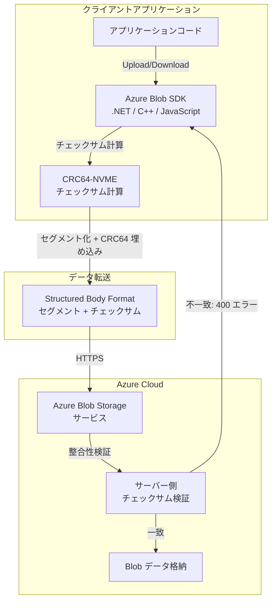

# Azure Blob Storage: クライアント側データ整合性保護 (CRC64-NVME SDK 統合)

**リリース日**: 2026-06-30

**サービス**: Azure Blob Storage

**機能**: Client-side data integrity protections (クライアント側データ整合性保護)

**ステータス**: Launched (GA)

[このアップデートのインフォグラフィックを見る](https://takech9203.github.io/azure-news-summary/20260630-blob-storage-client-side-data-integrity.html)

## 概要

Azure Blob Storage のクライアント側データ整合性保護が一般提供 (GA) となった。CRC64-NVME チェックサムが最新の Azure Blob SDK (.NET、C++、JavaScript) に統合され、アップロードおよびダウンロード操作時のデータ整合性を自動的に検証できるようになった。

Azure Blob Storage は従来から MD5 ハッシュによるデータ整合性検証をサポートしていたが、2019 年に CRC64-NVME サポートが REST API レベルで追加された。今回のアップデートでは、この CRC64-NVME が SDK レベルで統合され、開発者がアプリケーションコードで明示的にチェックサムを計算・管理する必要なく、転送中のデータ破損を自動的に検出できるようになった。

SDK は Structured Body Format を使用してデータをセグメント化し、各セグメントに CRC64-NVME チェックサムを埋め込むことで、大容量データのストリーミング転送中でもインクリメンタルに整合性を検証できる。

**アップデート前の課題**

- CRC64-NVME チェックサムを利用するには、開発者が REST API レベルでヘッダー (`x-ms-content-crc64`) を明示的に設定する必要があった
- MD5 ハッシュは計算コストが高く、大容量データでのパフォーマンスに影響があった
- ブロック単位のアップロードでは各ブロックの整合性検証を個別に実装する必要があった

**アップデート後の改善**

- SDK が自動的に CRC64-NVME チェックサムを計算・検証するため、開発者の実装負担が大幅に軽減
- Structured Body Format により、ストリーミング転送中でもセグメント単位で整合性を検証可能
- `StorageChecksumAlgorithm.Auto` 設定で SDK が最適なアルゴリズムを自動選択 (SDK v12.28.0 以降では CRC64 がデフォルト)

## アーキテクチャ図



クライアント SDK がデータを Structured Body Format でセグメント化し、各セグメントに CRC64-NVME チェックサムを付与する。サーバー側でも独立にチェックサムを計算し、不一致の場合は 400 エラーを返却してデータ破損を防止する。

## サービスアップデートの詳細

### 主要機能

1. **自動チェックサム計算と検証**
   - SDK がアップロード・ダウンロード時に自動的に CRC64-NVME チェックサムを計算
   - サーバー側でも独立にチェックサムを計算し、クライアント送信値と比較検証
   - 不一致の場合は `RequestFailedException` (ステータスコード 400、エラーコード `Crc64Mismatch`) をスロー

2. **Structured Body Format によるストリーミング整合性検証**
   - データを 4MiB セグメントに分割し、各セグメントにチェックサムを付与
   - セグメント単位での検証により、大容量ファイルでもインクリメンタルに整合性を確認
   - メッセージ全体のトレーラーチェックサムによる完全な end-to-end 検証

3. **柔軟なアルゴリズム選択**
   - `Auto`: SDK が最適なアルゴリズムを自動選択 (v12.28.0 以降では CRC64)
   - `StorageCrc64`: CRC64-NVME を明示的に指定
   - `MD5`: 従来の MD5 ハッシュ
   - `None`: チェックサムを無効化

4. **クライアント・メソッドレベルでの設定**
   - `BlobClientOptions` でクライアント全体にデフォルト設定を適用
   - `BlobUploadOptions` / `BlobDownloadOptions` でメソッド単位でオーバーライド可能

## 技術仕様

| 項目 | 詳細 |
|------|------|
| チェックサムアルゴリズム | CRC64-NVME (Rocksoft variant) |
| 多項式 | 0xad93d23594c93659 (非ビット反転形式) |
| 特性 | ビット反転方式、入出力ビット反転 |
| セグメントサイズ (デフォルト) | 4 MiB |
| 最大セグメント数 | 65,535 |
| Structured Body Format バージョン | v1 |
| サポート SDK (.NET) | Azure.Storage.Blobs v12.28.0 以降 |
| REST API バージョン | 2025-01-05 以降 (Structured Body) |
| 対応操作 | Put Blob, Put Block, Get Blob, Read File |

## 設定方法

### 前提条件

1. Azure Storage アカウント (汎用 v2 または Blob Storage)
2. 対応 SDK バージョン: Azure.Storage.Blobs v12.28.0 以降 (.NET)

### .NET SDK での実装

```csharp
// パッケージインストール
// dotnet add package Azure.Storage.Blobs

using Azure.Storage.Blobs;
using Azure.Storage.Blobs.Models;

// アップロード時の転送検証オプション設定
var validationOptions = new UploadTransferValidationOptions
{
    ChecksumAlgorithm = StorageChecksumAlgorithm.Auto
};

var uploadOptions = new BlobUploadOptions()
{
    TransferValidation = validationOptions
};

// ファイルアップロード (CRC64-NVME 自動検証)
BlobClient blobClient = containerClient.GetBlobClient("myblob.dat");
using FileStream fileStream = File.OpenRead(localFilePath);
await blobClient.UploadAsync(fileStream, uploadOptions);
```

### クライアントレベルでのデフォルト設定

```csharp
// クライアント全体に CRC64 検証を適用
var clientOptions = new BlobClientOptions();
clientOptions.TransferValidation = new TransferValidationOptions
{
    Upload = new UploadTransferValidationOptions
    {
        ChecksumAlgorithm = StorageChecksumAlgorithm.StorageCrc64
    },
    Download = new DownloadTransferValidationOptions
    {
        ChecksumAlgorithm = StorageChecksumAlgorithm.StorageCrc64
    }
};

var blobServiceClient = new BlobServiceClient(
    new Uri($"https://{accountName}.blob.core.windows.net"),
    new DefaultAzureCredential(),
    clientOptions);
```

## メリット

### ビジネス面

- データ破損による業務障害リスクの大幅な低減
- コンプライアンス要件 (データ整合性保証) への対応が容易に
- 破損データの早期検出による復旧コストの削減

### 技術面

- MD5 と比較して CRC64-NVME は計算効率が高く、大容量データでのスループットへの影響が最小限
- SDK レベルでの自動化により、開発者が整合性検証ロジックを個別に実装する必要がない
- Structured Body Format によるセグメント単位検証で、部分的なリトライが可能
- ハードウェアアクセラレーション (NVMe コントローラー) との親和性が高い CRC 多項式を採用

## デメリット・制約事項

- 対応 SDK は .NET、C++、JavaScript のみ (Python、Java、Go は今回の GA 対象外)
- Structured Body Format のオーバーヘッド (ヘッダー・チェックサム分のバイト増加) が発生
- 古い SDK バージョンでは利用不可 (.NET の場合 v12.28.0 以降が必要)
- CRC64-NVME と MD5 の同時指定は不可 (リクエスト失敗: 400 Bad Request)

## ユースケース

### ユースケース 1: 大容量メディアファイルのアップロード

**シナリオ**: 映像制作ワークフローで数 GB のメディアファイルを Azure Blob Storage にアップロードする際、ネットワーク経路上でのデータ破損を確実に検出したい。

**実装例**:

```csharp
var transferOptions = new StorageTransferOptions
{
    MaximumConcurrency = 4,
    MaximumTransferSize = 4 * 1024 * 1024 // 4 MiB ブロック
};

var uploadOptions = new BlobUploadOptions()
{
    TransferOptions = transferOptions,
    TransferValidation = new UploadTransferValidationOptions
    {
        ChecksumAlgorithm = StorageChecksumAlgorithm.StorageCrc64
    }
};

await blobClient.UploadAsync(largeFileStream, uploadOptions);
```

**効果**: 各 4MiB セグメントで CRC64 検証が行われ、破損が検出された場合は即座にエラーが返却される。データ破損を転送完了前に検出できるため、再アップロードの範囲を最小化できる。

### ユースケース 2: IoT/エッジデバイスからのデータ収集

**シナリオ**: 不安定なネットワーク環境にある IoT デバイスから Azure Blob Storage にテレメトリデータをアップロードする際、データの完全性を保証したい。

**効果**: SDK の自動 CRC64 検証により、ネットワーク品質が低い環境でもデータ破損を確実に検出し、正常なデータのみがストレージに保存される。

## 料金

クライアント側データ整合性保護機能自体に追加料金は発生しない。通常の Azure Blob Storage の料金 (ストレージ容量、トランザクション、データ転送) のみが適用される。

Structured Body Format のオーバーヘッドにより Content-Length がわずかに増加するが、課金対象はあくまで Blob データサイズであり、エンコーディングオーバーヘッド分は課金されない。

## 関連サービス・機能

- **Azure Blob Storage**: CRC64-NVME チェックサムの計算・検証対象となるストレージサービス
- **Azure Storage SDK (.NET, C++, JavaScript)**: クライアント側の自動チェックサム計算を実装する SDK
- **Structured Body Format**: データをセグメント化しチェックサムを埋め込む転送フォーマット
- **Azure Blob Storage REST API**: `x-ms-content-crc64` ヘッダーおよび `x-ms-structured-body` ヘッダーによる低レベル整合性検証

## 参考リンク

- [インフォグラフィック](https://takech9203.github.io/azure-news-summary/20260630-blob-storage-client-side-data-integrity.html)
- [公式アップデート情報](https://azure.microsoft.com/updates?id=566895)
- [Microsoft Learn - Blob アップロード時の転送検証オプション](https://learn.microsoft.com/en-us/azure/storage/blobs/storage-blob-upload)
- [Microsoft Learn - Structured Body Format](https://learn.microsoft.com/en-us/rest/api/storageservices/structured-body-format)
- [Microsoft Learn - Put Blob REST API](https://learn.microsoft.com/en-us/rest/api/storageservices/put-blob)

## まとめ

Azure Blob Storage の CRC64-NVME クライアント側データ整合性保護の GA により、.NET、C++、JavaScript SDK を使用する開発者は、最小限のコード変更で転送中のデータ整合性を自動的に検証できるようになった。特に大容量データの転送や、ネットワーク品質が不安定な環境でのデータアップロードにおいて、データ破損の早期検出と防止に大きく貢献する。

推奨アクション:
1. 使用中の Azure.Storage.Blobs パッケージを v12.28.0 以降にアップデート
2. `StorageChecksumAlgorithm.Auto` の設定を有効化 (新規 SDK バージョンではデフォルトで有効)
3. 既存の MD5 ベースの整合性検証を CRC64-NVME に移行することで、パフォーマンス向上を検討

---

**タグ**: #AzureBlobStorage #DataIntegrity #CRC64-NVME #SDK #GA #Storage
