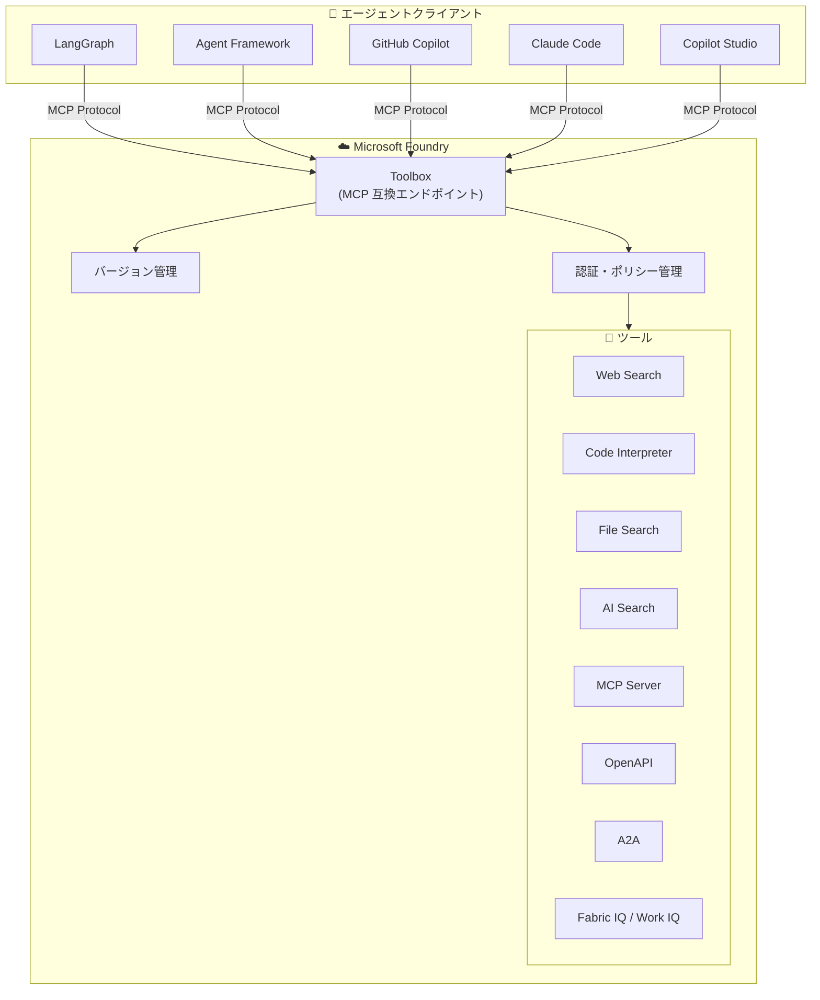

# Microsoft Foundry: Toolboxes の一般提供開始 (GA)

**リリース日**: 2026-06-30

**サービス**: Microsoft Foundry

**機能**: Toolboxes

**ステータス**: Launched (GA)

[このアップデートのインフォグラフィックを見る](https://takech9203.github.io/azure-news-summary/20260630-foundry-toolboxes-ga.html)

## 概要

Microsoft Foundry において Toolboxes 機能が一般提供 (GA) となった。Toolboxes は、キュレーションされたツールセットを一度定義し、Foundry 内で一元管理し、単一の MCP 互換エンドポイントとして公開するマネージドリソースである。

従来、各エージェントチームが同じタスクを解決するために独自のツールリストを手動で組み立てており、共有アーキテクチャが存在しなかった。Toolboxes はこの課題を解消し、ツールの再利用性、ガバナンス、認証管理を統一的に提供する。プラットフォームが資格情報の注入、トークンの更新、エンタープライズポリシーの適用をランタイムで処理するため、開発者はツールの接続管理から解放される。

**アップデート前の課題**

- 各エージェントチームが同じツールを独自に実装し、重複作業が発生
- 認証情報の管理が分散し、セキュリティガバナンスが困難
- ツールの変更が各エージェントに個別に反映される必要があり、運用負荷が高い
- フレームワーク間でのツール共有メカニズムが存在しない

**アップデート後の改善**

- ツールを一度定義すれば、全エージェントから MCP 互換エンドポイント経由で利用可能
- 認証・認可がプラットフォームレベルで一元管理される
- バージョン管理により、変更の影響を制御しながら安全にロールアウト可能
- LangGraph、Agent Framework、GitHub Copilot、Claude Code など任意の MCP 互換クライアントから利用可能

## アーキテクチャ図



Toolboxes は MCP プロトコルに準拠した単一エンドポイントを公開し、任意の MCP 互換エージェントランタイムがツールの検出と呼び出しを動的に行える構成となっている。

## サービスアップデートの詳細

### 主要機能

1. **単一 MCP 互換エンドポイント**
   - Toolbox を作成すると MCP プロトコル準拠のエンドポイントが生成される
   - `tools/list` でツール一覧の取得、`tools/call` でツール呼び出しが可能
   - 任意の MCP 互換クライアント (LangGraph、Agent Framework、GitHub Copilot、Claude Code、Copilot Studio) から利用可能

2. **バージョン管理**
   - 各 Toolbox はイミュータブルなバージョンスナップショットとして作成される
   - `default_version` を指定することで、コンシューマーエンドポイントが返すバージョンを制御
   - 新バージョンのテスト後、本番昇格する明示的なワークフローをサポート

3. **一元的な認証管理**
   - Key ベース、Microsoft Entra (マネージド ID)、OAuth2、ユーザー Entra トークン、エージェント ID による認証をサポート
   - プラットフォームがトークンリフレッシュと資格情報注入をランタイムで処理

4. **豊富なツールタイプサポート**
   - MCP ツール、Web Search、AI Search、Code Interpreter、File Search、OpenAPI、A2A、Fabric IQ、Work IQ、Browser Automation、Guardrail (RAI ポリシー)、Skill references をサポート

5. **Tool Search (インテントベースルーティング)**
   - `toolbox_search_preview` を含めると、プラットフォームが `tool_search` と `call_tool` メタツールを注入
   - 大量のツールがある場合でも、意図に基づいて適切なツールを自動選択

6. **ツール承認制御**
   - ツールごとに `require_approval` を `always` または `never` に設定可能
   - エージェントがユーザー確認を要求するかどうかを制御

## 技術仕様

| 項目 | 詳細 |
|------|------|
| プロトコル | MCP (Model Context Protocol) 2025-03-26 |
| API バージョン | v1 |
| 必須ヘッダー | `Foundry-Features: Toolboxes=V1Preview` |
| トークンスコープ | `https://ai.azure.com/.default` |
| SDK サポート | Python, .NET, JavaScript, Azure Developer CLI |
| エンドポイント (開発用) | `{project_endpoint}/toolboxes/{name}/versions/{version}/mcp?api-version=v1` |
| エンドポイント (本番用) | `{project_endpoint}/toolboxes/{name}/mcp?api-version=v1` |
| ツールタイプ数 | 12 種類 |
| 同一タイプの複数インスタンス | `name` フィールドで一意に識別 (無名は各タイプ1つまで) |

## 設定方法

### 前提条件

1. アクティブな Microsoft Foundry プロジェクト
2. プロジェクトに対する **Foundry User** RBAC ロール
3. サポートされるリージョン
4. SDK パッケージのインストール

### Python SDK

```python
from azure.identity import DefaultAzureCredential
from azure.ai.projects import AIProjectClient
from azure.ai.projects.models import MCPTool, ToolboxSearchPreviewTool, WebSearchTool

endpoint = "https://<your-foundry-account>.services.ai.azure.com/api/projects/<your-project>"
project = AIProjectClient(endpoint=endpoint, credential=DefaultAzureCredential())

# Toolbox バージョンの作成
toolbox_version = project.toolboxes.create_toolbox_version(
    name="my-toolbox",
    description="Web 検索と MCP サーバーを含む Toolbox",
    tools=[
        WebSearchTool(),
        MCPTool(
            server_label="myserver",
            server_url="https://your-mcp-server.example.com",
            require_approval="never",
            project_connection_id="my-key-auth-connection",
        ),
        ToolboxSearchPreviewTool(),
    ],
)
```

### Azure Developer CLI

```bash
# Foundry 拡張のインストール
azd ext install microsoft.foundry

# プロジェクトエンドポイントの設定
azd ai project set $PROJECT_ENDPOINT

# 接続の作成
azd ai connection create my-conn \
  --kind remote-tool \
  --target https://your-mcp-server.example.com \
  --auth-type custom-keys \
  --custom-key "Authorization=Bearer $TOKEN"

# YAML ファイルから Toolbox を作成
azd ai toolbox create my-toolbox --from-file ./my-toolbox.yaml
```

### Toolbox YAML 定義ファイル

```yaml
description: エージェント向け共通ツールセット
connections:
  - name: my-mcp-connection
tools:
  - type: web_search
    name: web
  - type: code_interpreter
    container: { type: auto }
    name: code
  - type: toolbox_search_preview
policies:
  rai_config:
    rai_policy_name: my-safety-policy
```

### エージェントからの利用 (LangGraph)

```python
from langchain_azure_ai.tools import AzureAIProjectToolbox

toolbox = AzureAIProjectToolbox(toolbox_name="my-toolbox")
tools = await toolbox.get_tools()
```

## メリット

### ビジネス面

- ツールの重複実装が排除され、開発コストが削減される
- 一元的なガバナンスにより、コンプライアンス監査が容易になる
- バージョン管理により、ツール変更のリスクを最小化しながら段階的にロールアウト可能
- フレームワーク非依存のため、チーム間の技術選択の自由度が維持される

### 技術面

- MCP プロトコル準拠により、エコシステム全体との相互運用性が確保される
- プラットフォームレベルでの認証管理により、セキュリティが強化される
- イミュータブルなバージョンスナップショットにより、再現性と安定性が保証される
- Tool Search によるインテントベースルーティングで、大規模ツールセットの効率的な利用が可能

## デメリット・制約事項

- 各リクエストに `Foundry-Features: Toolboxes=V1Preview` ヘッダーが必要
- 同一ツールタイプの無名インスタンスは1つまでに制限
- MCP 通信はストリーミングモードが必須 (非ストリーミングの `tools/call` は 500 エラー)
- `send_ping()` はサポートされていない (500 エラーを返す)
- `prompts/list` はサポートされていない (`load_prompts=False` の指定が必要)
- OAuth ベースの MCP ツールは初回接続時にブラウザでの同意フローが必要

## ユースケース

### ユースケース 1: 組織横断のツール標準化

**シナリオ**: 大規模組織で複数のエージェントチームが、Web 検索、社内ナレッジベース検索、コード実行など共通のツールセットを必要としている。

**実装例**:

```python
# 組織共通の Toolbox を定義
toolbox_version = project.toolboxes.create_toolbox_version(
    name="org-standard-toolbox",
    description="組織標準ツールセット",
    tools=[
        WebSearchTool(),
        AISearchTool(index_connection_id="knowledge-base", index_name="org-docs"),
        CodeInterpreterTool(),
        ToolboxSearchPreviewTool(),
    ],
)
```

**効果**: 各チームがツール接続を個別に管理する必要がなくなり、セキュリティポリシーの一貫した適用が実現される。

### ユースケース 2: マルチフレームワーク環境での統一ツールアクセス

**シナリオ**: 組織内で LangGraph、Agent Framework、GitHub Copilot など複数のフレームワークが利用されており、全てのエージェントが同一のツールセットにアクセスする必要がある。

**効果**: MCP プロトコル準拠の単一エンドポイントにより、フレームワークに依存しない統一的なツールアクセスが実現される。

## 関連サービス・機能

- **Microsoft Foundry Agent Service**: Toolboxes はエージェントにツールを提供するコアインフラストラクチャ
- **Responses API**: エージェントがモデル推論とツールオーケストレーションにアクセスする統一エントリポイント
- **MCP (Model Context Protocol)**: Toolboxes が準拠するオープンプロトコル標準
- **Foundry IQ**: ナレッジベースをエージェントに接続する関連機能
- **Azure AI Search**: Toolbox 内で利用可能な検索ツールの一つ

## 参考リンク

- [インフォグラフィック](https://takech9203.github.io/azure-news-summary/20260630-foundry-toolboxes-ga.html)
- [公式アップデート情報](https://azure.microsoft.com/updates?id=563481)
- [Microsoft Learn - Toolbox ドキュメント](https://learn.microsoft.com/en-us/azure/foundry/agents/how-to/tools/toolbox)
- [Microsoft Foundry Agent Service 概要](https://learn.microsoft.com/en-us/azure/foundry/agents/overview)
- [Microsoft Foundry ドキュメント](https://learn.microsoft.com/en-us/azure/foundry/)

## まとめ

Microsoft Foundry の Toolboxes GA は、AI エージェント開発における「ツール管理の断片化」という根本的な課題を解消するアップデートである。MCP プロトコルに準拠した単一エンドポイントを通じて、ツールの定義・管理・公開を一元化し、フレームワークに依存しないツール共有を実現する。

Solutions Architect にとって推奨される次のアクションは、組織内で共通利用されるツールを特定し、Toolbox として定義・一元管理に移行すること、および既存のエージェントを MCP 互換エンドポイント経由での Toolbox 利用に切り替えることである。

---

**タグ**: #Microsoft-Foundry #AI #Toolboxes #MCP #エージェント #GA #Microsoft-Build
