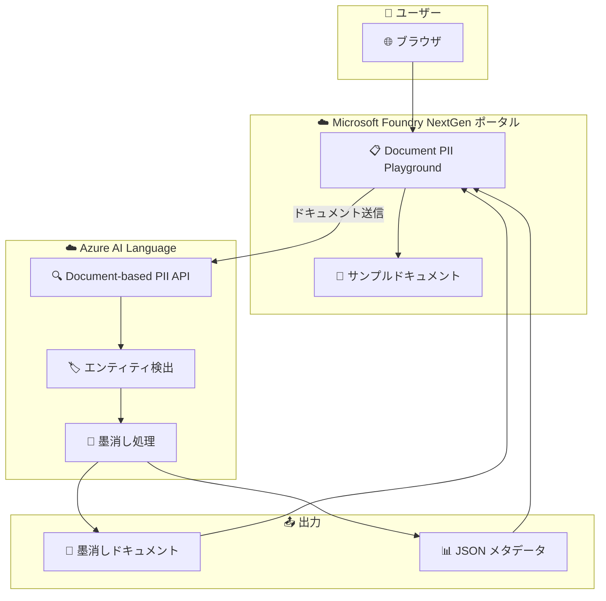

# Azure AI Language: Document PII Playground (Microsoft Foundry NextGen)

**リリース日**: 2026-07-01

**サービス**: Azure AI Language

**機能**: Document PII Playground (Microsoft Foundry NextGen ポータル)

**ステータス**: Public Preview / Launched (GA)

[このアップデートのインフォグラフィックを見る](https://takech9203.github.io/azure-news-summary/20260701-ai-language-document-pii-playground.html)

## 概要

Azure AI Language の Document-based PII (個人情報検出) 機能に、Microsoft Foundry NextGen ポータル上で利用可能な Playground エクスペリエンスが追加された。本アップデートは 2 つのアナウンスで構成される。

1. **Public Preview**: Document PII playground サンプルが Microsoft Foundry NextGen ポータルに初期実装された。Playground にはサンプルドキュメントがプリロードされており、Document-based PII 機能を通じて実行し、墨消し (redacted) された出力結果を確認できる。
2. **一般提供 (GA)**: Document PII NextGen Playground がリフレッシュされた UI で一般提供開始となった。キュレーションされたサンプル入出力が用意されており、コードを書くことなく PII 検出機能を迅速に評価できる。

Document-based PII は、PDF、Word (.docx)、テキスト (.txt) などのネイティブドキュメントファイルから個人情報を検出・墨消しする非同期 API ベースの機能である。従来はテキスト抽出パイプラインの構築が必要だったが、ドキュメントの構造とフォーマットを保持したまま直接処理できる点が特徴である。

**アップデート前の課題**

- Document-based PII 機能を試すには、Azure リソースの作成、ストレージの準備、API リクエストの構築が必要で、初期評価に時間がかかった
- サンプルドキュメントが提供されていなかったため、テスト用ドキュメントをユーザー自身で準備する必要があった
- 非同期 API のワークフローを理解するために開発者向けドキュメントを読み込む必要があった

**アップデート後の改善**

- Microsoft Foundry NextGen ポータル上で、コードなしで Document PII 機能を即座に試せるようになった
- プリロードされたサンプルドキュメントにより、準備不要で機能評価を開始できる
- 墨消し結果がビジュアルに表示されるため、ステークホルダーへの機能デモが容易になった
- GA リリースにより本番環境からの Playground 利用が安定的にサポートされた

## アーキテクチャ図



Microsoft Foundry NextGen ポータルの Playground からサンプルドキュメントを Document-based PII API に送信し、検出・墨消し処理の結果をポータル上で確認するフローを示す。

## サービスアップデートの詳細

### 主要機能

1. **Playground サンプル体験 (Public Preview)**
   - Microsoft Foundry NextGen ポータルに統合された初期 Playground エクスペリエンス
   - プリロードされたサンプルドキュメントによる即時デモ
   - Document-based PII 機能の墨消し出力をビジュアルで確認

2. **リフレッシュされた GA Playground**
   - キュレーションされたサンプル入出力のセットが用意
   - コードなしで PII 検出の評価が可能
   - 本番ワークロード向けの安定した API バージョン (2026-05-01 GA) に対応

3. **Document-based PII の基盤機能**
   - ネイティブドキュメント (PDF, DOCX, TXT) の直接処理
   - ドキュメント構造・フォーマット (フォント、間隔、色) の保持
   - 墨消しドキュメント + 構造化 JSON メタデータの出力
   - 設定可能なマスキングポリシー (文字マスク、エンティティラベル、合成置換)

## 技術仕様

| 項目 | 詳細 |
|------|------|
| 対応ファイル形式 | PDF (.pdf)、Microsoft Word (.docx)、テキスト (.txt) |
| 処理方式 | 非同期 API (ジョブ送信 → ポーリング → 結果取得) |
| 1 リクエストあたりの最大ドキュメント数 | 40 |
| 1 リクエストあたりの最大コンテンツサイズ | 10 MB |
| GA API バージョン | 2026-05-01 |
| Preview API バージョン | 2026-05-15-preview |
| 出力形式 | 墨消しドキュメント + JSON 結果ファイル |

### GA (2026-05-01) で追加された機能

| 機能 | 説明 |
|------|------|
| 出力品質改善 | フォント、色、フォーマットを保持した墨消し出力 |
| 画像墨消し (ブラー) | 画像ベースのドキュメントシナリオ向けブラー処理 |
| PDF サポート | デジタル PDF を含む PDF ファイル対応 |
| Word サポート | .docx ファイルの処理 |

### Preview (2026-05-15-preview) 限定機能

| 機能 | 説明 |
|------|------|
| ブラックマーカー墨消し | 黒塗りスタイルの墨消し |
| 匿名化 / 合成置換 | PII を合成データで置換するマスキングポリシー |
| エンティティラベルマスキング | [Address] のようなラベルで置換 |
| 信頼度スコア閾値 | 墨消し対象のエンティティを信頼度で制御 |
| エンティティバリデーション無効化 | レイテンシ重視のワークフロー向け |
| エンティティシノニム | 顧客固有の語彙を標準 PII カテゴリにマッピング |
| 値除外ポリシー | 特定用語を墨消し対象から除外 |

## 設定方法

### 前提条件

1. Azure サブスクリプション
2. Azure AI Language リソース (Foundry Tools)
3. Microsoft Foundry ポータルへのアクセス

### Azure Portal (Playground 利用)

1. [Microsoft Foundry](https://ai.azure.com/) にアクセスしサインイン
2. Azure AI Language の PII 検出機能を選択
3. Document PII Playground タブを選択
4. サンプルドキュメントを使用するか、独自ドキュメントをアップロード
5. 墨消し結果と検出されたエンティティを確認

### API 利用 (非同期ワークフロー)

```bash
# 1. ジョブの送信
curl -X POST "{endpoint}/language/analyze-documents/jobs?api-version=2026-05-01" \
  -H "Ocp-Apim-Subscription-Key: {key}" \
  -H "Content-Type: application/json" \
  -d '{
    "tasks": [{
      "kind": "PiiEntityRecognition",
      "parameters": {
        "sourceContainerUrl": "{source-sas-url}",
        "targetContainerUrl": "{target-sas-url}"
      }
    }]
  }'

# 2. ジョブステータスのポーリング
curl -X GET "{operation-location}" \
  -H "Ocp-Apim-Subscription-Key: {key}"

# 3. 完了後、ターゲットコンテナから墨消しドキュメントと JSON を取得
```

## メリット

### ビジネス面

- コンプライアンスチームが即座に PII 検出の精度を評価可能 (コード不要)
- PoC フェーズの大幅短縮 (サンプルドキュメントによる即時デモ)
- ステークホルダーへの機能提案時にビジュアルで結果を提示可能
- GA リリースにより本番環境での安定利用が保証

### 技術面

- テキスト抽出・再構成パイプラインの自前構築が不要
- ドキュメント構造を保持したまま PII 検出・墨消しが可能
- 単一の非同期 API で抽出・検出・墨消しを一括処理
- 墨消しドキュメントと構造化 JSON メタデータの 2 種類の出力

## デメリット・制約事項

- 対応ファイル形式は PDF、DOCX、TXT の 3 種類に限定 (Excel、PowerPoint 等は非対応)
- 1 リクエストあたり最大 40 ドキュメント、10 MB のサイズ制限
- 非同期 API のため、リアルタイム処理には Text PII を使用する必要がある
- Preview 限定の高度な機能 (合成置換、信頼度閾値等) は GA では利用不可

## ユースケース

### ユースケース 1: コンプライアンス部門での評価

**シナリオ**: 金融機関のコンプライアンス部門が、顧客ドキュメントの PII 墨消し機能を導入検討する際に、Playground で迅速に精度評価を行う。

**効果**: 開発者の支援なしに、数分で機能評価を完了し、意思決定のスピードが向上する。

### ユースケース 2: 法務ドキュメントの自動墨消し

**シナリオ**: 法律事務所が裁判記録や契約書の個人情報を自動的に検出・墨消しし、情報公開請求に対応する。

**効果**: 手動での墨消し作業に比べ、処理時間の大幅短縮とヒューマンエラーの削減が実現する。

### ユースケース 3: AI/ML パイプラインの前処理

**シナリオ**: AI モデルの学習データとして使用するドキュメントから、事前に PII を除去してプライバシーを保護する。

**効果**: ドキュメント構造を保持したまま PII が除去されるため、後段の AI 処理の精度に影響を与えない。

## 料金

Document-based PII は Azure AI Language の料金体系に基づく。詳細は [Azure AI Language 料金ページ](https://aka.ms/unifiedLanguagePricing) を参照。

## 関連サービス・機能

- **Text PII**: 文字列ベースのリアルタイム PII 検出。リクエスト時処理向け
- **Conversation PII**: ターンベースのチャット・音声書き起こし向け PII 検出
- **Microsoft Foundry**: AI サービスのポータル体験を統合するプラットフォーム
- **Azure Blob Storage**: Document-based PII のソース/ターゲットストレージとして使用

## 参考リンク

- [インフォグラフィック](https://takech9203.github.io/azure-news-summary/20260701-ai-language-document-pii-playground.html)
- [公式アップデート情報 (Public Preview)](https://azure.microsoft.com/updates?id=563331)
- [公式アップデート情報 (GA)](https://azure.microsoft.com/updates?id=564382)
- [Microsoft Learn - PII 検出の概要](https://learn.microsoft.com/en-us/azure/ai-services/language-service/personally-identifiable-information/overview)
- [Microsoft Learn - Document-based PII の概要](https://learn.microsoft.com/en-us/azure/ai-services/language-service/personally-identifiable-information/document-based-pii-overview)
- [Microsoft Foundry ポータル](https://ai.azure.com/)
- [Azure AI Language 料金](https://aka.ms/unifiedLanguagePricing)

## まとめ

Azure AI Language の Document-based PII 機能に Microsoft Foundry NextGen ポータル上の Playground エクスペリエンスが追加され、Public Preview と GA が同日にアナウンスされた。これにより、PDF や Word ドキュメントの PII 検出・墨消し機能をコードなしで即座に試用・評価できるようになった。

コンプライアンス要件のあるドキュメント処理パイプラインを検討している組織には、まず Playground でサンプルドキュメントを用いた評価を行い、検出精度と墨消し品質を確認した上で、本番導入の検討を進めることを推奨する。GA API バージョン (2026-05-01) を本番環境に使用し、高度なマスキングポリシーが必要な場合は Preview API の利用を検討されたい。

---

**タグ**: #AzureAILanguage #PII #DocumentPII #MicrosoftFoundry #Playground #コンプライアンス #個人情報保護 #GA #PublicPreview
