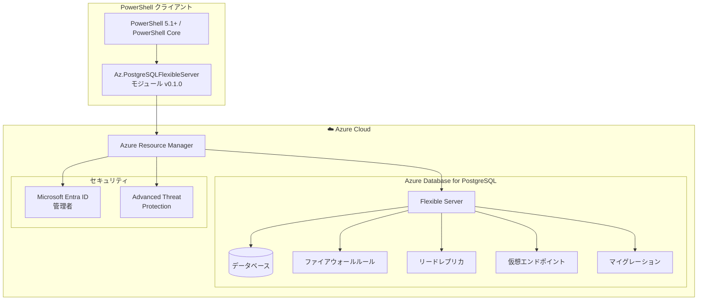

# Azure Database for PostgreSQL: 新しい PowerShell モジュール Az.PostgreSQLFlexibleServer が一般提供開始

**リリース日**: 2026-07-01

**サービス**: Azure Database for PostgreSQL

**機能**: 新しい PowerShell モジュール Az.PostgreSQLFlexibleServer

**ステータス**: Launched (GA)

[このアップデートのインフォグラフィックを見る](https://takech9203.github.io/azure-news-summary/20260701-postgresql-flexible-server-powershell-module.html)

## 概要

Microsoft は、Azure Database for PostgreSQL Flexible Server を PowerShell で管理するための新しい専用モジュール「Az.PostgreSQLFlexibleServer」の一般提供を発表した。これは従来の Az.PostgreSql モジュールから Flexible Server 関連のコマンドレットを分離・リネームしたもので、よりストリームライン化された管理エクスペリエンスを提供する。

従来の Az.PostgreSql モジュールは、廃止された Single Server と現行の Flexible Server の両方のコマンドレットを含んでおり、名前空間が混在していた。新モジュールは Flexible Server に特化することで、より直感的で機能豊富な PowerShell 管理体験を実現している。

新モジュールでは、Microsoft Entra ID 管理、Advanced Threat Protection、マイグレーション管理、仮想エンドポイント、チューニングオプションなど、従来モジュールにはなかった多数の新しいコマンドレットが追加されている。

**アップデート前の課題**

- Az.PostgreSql モジュールに Single Server と Flexible Server のコマンドレットが混在し、わかりにくかった
- Flexible Server 固有の高度な管理機能（Entra ID 管理者、Threat Protection、マイグレーションなど）に対応する PowerShell コマンドレットが不足していた
- モジュール名からどのデプロイメントモデルに対応しているか判別しづらかった

**アップデート後の改善**

- Flexible Server に特化した専用モジュールにより、名前空間が明確になった
- 40 以上のコマンドレットで Flexible Server の包括的な管理が可能になった
- Microsoft Entra ID 管理、Advanced Threat Protection、マイグレーション、仮想エンドポイント、チューニングなど新機能に対応
- ネットワークモード移行（VNet から Private Link への移行）が PowerShell から実行可能になった

## アーキテクチャ図



PowerShell クライアントから Az.PostgreSQLFlexibleServer モジュールを介して Azure Resource Manager に接続し、Flexible Server の各種リソース（データベース、ファイアウォール、レプリカ、仮想エンドポイント、マイグレーション）およびセキュリティ設定を管理する構成を示している。

## サービスアップデートの詳細

### 主要機能

1. **サーバー管理**
   - サーバーの作成、更新、削除、起動、停止、再起動が可能
   - サーバー名の可用性チェック（リージョン単位・グローバル）

2. **Microsoft Entra ID 管理者管理**
   - Entra ID プリンシパルに関連付けられたサーバー管理者の作成・取得・削除
   - `New-AzPostgreSqlFlexibleServerAdministratorsMicrosoftEntra` コマンドレットで設定

3. **Advanced Threat Protection**
   - 脅威保護設定の取得と作成
   - サーバーレベルでのセキュリティ強化

4. **マイグレーション管理**
   - マイグレーションの作成・監視・キャンセル
   - マイグレーション名の可用性チェック

5. **仮想エンドポイント**
   - 仮想エンドポイントペアの作成・更新・削除・取得
   - 高可用性構成のサポート

6. **ネットワークモード移行**
   - VNet 統合から Private Link モデルへのネットワーク移行
   - `Move-AzPostgreSqlFlexibleServerNetworkMode` コマンドレットで実行

7. **チューニングオプション**
   - サーバーのチューニングオプションと推奨事項の取得
   - パフォーマンス最適化のためのインサイト

8. **バックアップ管理**
   - 自動バックアップとオンデマンドバックアップの取得・削除
   - キャプチャされたログのリスト表示

## 技術仕様

| 項目 | 詳細 |
|------|------|
| モジュール名 | Az.PostgreSqlFlexibleServer |
| バージョン | 0.1.0 |
| リリース日 | 2026年6月2日 (PowerShell Gallery) |
| 最小 PowerShell バージョン | 5.1 |
| 対応エディション | Core, Desktop |
| 依存モジュール | Az.Accounts 5.4.0 以上 |
| コマンドレット数 | 40+ |
| 対応 Az モジュールバージョン | azps-16.0.0 |

## 設定方法

### 前提条件

1. PowerShell 5.1 以上 (Core または Desktop エディション)
2. Az.Accounts モジュール 5.4.0 以上がインストール済みであること
3. Azure サブスクリプションと適切な権限

### インストール

```powershell
# PowerShellGet を使用したインストール
Install-Module -Name Az.PostgreSqlFlexibleServer

# PSResourceGet を使用したインストール
Install-PSResource -Name Az.PostgreSqlFlexibleServer
```

### サーバー作成の例

```powershell
# Azure にログイン
Connect-AzAccount

# 新しい Flexible Server を作成
New-AzPostgreSqlFlexibleServer `
    -ResourceGroupName "myResourceGroup" `
    -Name "mypostgresqlserver" `
    -Location "japaneast"
```

### ファイアウォールルールの追加

```powershell
# ファイアウォールルールを作成
New-AzPostgreSqlFlexibleServerFirewallRule `
    -ResourceGroupName "myResourceGroup" `
    -ServerName "mypostgresqlserver" `
    -FirewallRuleName "AllowMyIP" `
    -StartIPAddress "203.0.113.1" `
    -EndIPAddress "203.0.113.1"
```

### Microsoft Entra ID 管理者の設定

```powershell
# Entra ID 管理者を追加
New-AzPostgreSqlFlexibleServerAdministratorsMicrosoftEntra `
    -ResourceGroupName "myResourceGroup" `
    -ServerName "mypostgresqlserver"
```

## メリット

### ビジネス面

- PowerShell による自動化で運用効率が向上し、DBA の反復作業を削減
- Infrastructure as Code (IaC) パターンでの PostgreSQL 管理が容易になり、DevOps プラクティスの導入を促進
- マイグレーション管理のコマンドレットにより、Single Server からの移行プロジェクトを効率化

### 技術面

- Flexible Server に特化した直感的なコマンドレット名により、スクリプト作成の学習コストが低減
- 40 以上のコマンドレットによる包括的な管理カバレッジ
- VNet から Private Link へのネットワークモード移行が PowerShell ワンコマンドで実行可能
- チューニングオプションの取得により、パフォーマンス最適化のためのデータドリブンな意思決定が可能

## デメリット・制約事項

- 現時点ではプレビューモジュールのステータスであり、本番環境での使用は推奨されていない（Microsoft Learn のドキュメントに記載あり）
- 従来の Az.PostgreSql モジュールからの移行が必要（コマンドレット名の変更を含む）
- Az.Accounts 5.4.0 以上が必要であり、既存環境では依存モジュールのアップデートが必要になる可能性がある

## ユースケース

### ユースケース 1: CI/CD パイプラインでの自動デプロイ

**シナリオ**: 開発チームが新しい環境を構築する際に、PostgreSQL Flexible Server とその関連リソースを自動的にプロビジョニングする。

**実装例**:

```powershell
# 環境構築スクリプト
$rgName = "myapp-prod-rg"
$serverName = "myapp-prod-pg"
$location = "japaneast"

# サーバー作成
New-AzPostgreSqlFlexibleServer `
    -ResourceGroupName $rgName `
    -Name $serverName `
    -Location $location

# データベース作成
New-AzPostgreSqlFlexibleServerDatabase `
    -ResourceGroupName $rgName `
    -ServerName $serverName `
    -Name "appdb"

# ファイアウォールルール設定
New-AzPostgreSqlFlexibleServerFirewallRule `
    -ResourceGroupName $rgName `
    -ServerName $serverName `
    -FirewallRuleName "AllowAzureServices" `
    -StartIPAddress "0.0.0.0" `
    -EndIPAddress "0.0.0.0"
```

**効果**: 手動作業を排除し、一貫性のある環境構築を数分で完了可能にする。

### ユースケース 2: ネットワークモデルの移行

**シナリオ**: セキュリティ要件の変更により、VNet 統合モデルから Private Link モデルへの移行が必要になった場合。

**実装例**:

```powershell
# VNet 統合から Private Link への移行
Move-AzPostgreSqlFlexibleServerNetworkMode `
    -ResourceGroupName "myResourceGroup" `
    -ServerName "mypostgresqlserver"
```

**効果**: 複雑なネットワーク構成変更をコマンド一つで実行でき、ダウンタイムとリスクを最小化する。

### ユースケース 3: マイグレーション管理の自動化

**シナリオ**: Single Server から Flexible Server への大規模マイグレーションプロジェクトで、複数サーバーの移行状況を一元管理する。

**実装例**:

```powershell
# マイグレーションの作成
New-AzPostgreSqlFlexibleServerMigration `
    -ResourceGroupName "myResourceGroup" `
    -TargetDbServerName "target-flexible-server"

# マイグレーション状況の確認
Get-AzPostgreSqlFlexibleServerMigration `
    -ResourceGroupName "myResourceGroup" `
    -TargetDbServerName "target-flexible-server"
```

**効果**: 複数サーバーの移行進捗をスクリプトで監視・管理し、プロジェクト全体の可視性を向上させる。

## 料金

Az.PostgreSQLFlexibleServer モジュール自体は無料で利用可能。料金は管理対象の Azure Database for PostgreSQL Flexible Server のリソース使用量に基づいて発生する。

## 関連サービス・機能

- **Azure Database for PostgreSQL Flexible Server**: 本モジュールが管理する対象サービス。高可用性、スケーラビリティ、セキュリティ機能を備えた PostgreSQL マネージドサービス
- **Az.PostgreSql (旧モジュール)**: Single Server と Flexible Server の両方を含んでいた従来のモジュール。azps-15.6.0 で提供
- **Azure PowerShell (Az モジュール)**: 本モジュールの親フレームワーク。azps-16.0.0 で Az.PostgreSqlFlexibleServer を含む
- **Microsoft Entra ID**: Flexible Server の認証・管理者管理に使用される ID プラットフォーム

## 参考リンク

- [インフォグラフィック](https://takech9203.github.io/azure-news-summary/20260701-postgresql-flexible-server-powershell-module.html)
- [公式アップデート情報](https://azure.microsoft.com/updates?id=566209)
- [関連ブログ: The performance dividend: Optimizing PostgreSQL on Azure directly in Visual Studio Code](https://azure.microsoft.com/en-us/blog/the-performance-dividend-optimizing-postgresql-on-azure-directly-in-visual-studio-code/)
- [Microsoft Learn ドキュメント: Az.PostgreSqlFlexibleServer Module](https://learn.microsoft.com/en-us/powershell/module/az.postgresqlflexibleserver/)
- [PowerShell Gallery: Az.PostgreSqlFlexibleServer](https://www.powershellgallery.com/packages/Az.PostgreSqlFlexibleServer)

## まとめ

Az.PostgreSQLFlexibleServer は、Azure Database for PostgreSQL Flexible Server の PowerShell 管理を大幅に改善する新しい専用モジュールである。従来の Az.PostgreSql モジュールから Flexible Server 機能を分離・拡張し、40 以上のコマンドレットで包括的な管理を実現している。

特に、Microsoft Entra ID 管理、Advanced Threat Protection、マイグレーション管理、ネットワークモード移行など、従来モジュールにはなかった機能が多数追加されている点が注目に値する。

推奨される次のアクション:
1. 現在 Az.PostgreSql モジュールを使用している場合は、新モジュールへの移行計画を立てる
2. `Install-Module -Name Az.PostgreSqlFlexibleServer` でモジュールをインストールし、既存スクリプトの互換性を確認する
3. ただし、現時点ではプレビューステータスであるため、本番環境への適用は GA 後を推奨する

---

**タグ**: #Azure #PostgreSQL #FlexibleServer #PowerShell #Az.PostgreSqlFlexibleServer #データベース #自動化 #IaC #GA
