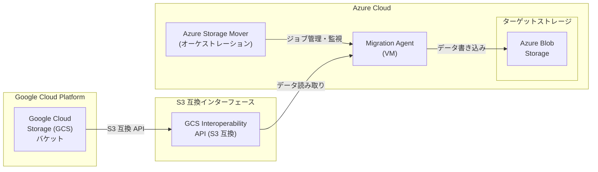

# Azure Storage Mover: Google Cloud Storage (GCS) からの移行サポート (パブリックプレビュー)

**リリース日**: 2026-07-01

**サービス**: Azure Storage Mover

**機能**: Google Cloud Storage (GCS) から Azure Blob Storage へのクラウド間データ移行

**ステータス**: In preview

[このアップデートのインフォグラフィックを見る](https://takech9203.github.io/azure-news-summary/20260701-storage-mover-gcs-migration.html)

## 概要

Azure Storage Mover に、Google Cloud Storage (GCS) から Azure Blob Storage へのクラウド間データ移行機能がパブリックプレビューとして追加された。S3 互換インターフェースを利用することで、GCS バケット内のデータを Azure Blob Storage に移行でき、マルチクラウド環境から Azure への統合を簡素化する。

Azure Storage Mover はこれまで AWS S3 バケットからの移行をサポートしていたが、今回のアップデートにより Google Cloud Storage もソースとしてサポートされるようになった。GCS が提供する S3 互換 API (Interoperability API) を活用することで、既存の S3 移行パイプラインと同様のメカニズムで GCS からのデータ移行が実現される。

**アップデート前の課題**

- GCS から Azure Blob Storage へのデータ移行には、手動でのデータパイプライン構築やサードパーティツールの利用が必要だった
- マルチクラウド環境 (Google Cloud + Azure) でのデータ統合に一貫した移行ツールが存在しなかった
- GCS から Azure への移行を一元管理・監視する仕組みが限られていた

**アップデート後の改善**

- Azure Storage Mover のフルマネージドサービスとして、GCS から Azure Blob Storage への移行が可能になった
- S3 互換インターフェースを利用するため、追加のカスタム開発が不要
- プロジェクト単位・ジョブ単位での移行進捗管理と監視が一元化された
- マルチクラウド統合を Azure 上に集約するシナリオが簡素化された

## アーキテクチャ図

Google Cloud Storage の S3 互換インターフェース (Interoperability API) を経由して、Azure Storage Mover の Migration Agent がデータを読み取り、Azure Blob Storage に書き込む。Azure Storage Mover クラウドサービスがジョブのオーケストレーションと進捗管理を担当する。

## サービスアップデートの詳細

### 主要機能

1. **S3 互換インターフェースによる GCS 接続**
   - Google Cloud Storage が提供する S3 互換 API (Interoperability API) を利用してデータにアクセス
   - AWS S3 と同様の移行メカニズムを GCS に適用

2. **クラウド間データ移行**
   - GCS バケットから Azure Blob コンテナへの直接的なクラウド間データ転送
   - オンプレミスのインフラストラクチャを中継点として利用する必要がない

3. **フルマネージドオーケストレーション**
   - Azure Storage Mover のプロジェクト・ジョブ定義・ジョブ実行の階層構造で移行を管理
   - 移行の進捗とコピー結果を Azure Monitor メトリクスおよびコピーログで追跡可能

4. **差分転送サポート**
   - 初回のフルコピー後、差分のみを転送する繰り返し実行に対応
   - メタデータのみが変更されたファイルは、メタデータのみを更新

## 技術仕様

| 項目 | 詳細 |
|------|------|
| ソース | Google Cloud Storage バケット (S3 互換インターフェース経由) |
| ターゲット | Azure Blob コンテナ (FNS / HNS 対応) |
| 接続方式 | GCS Interoperability API (S3 互換) |
| エージェント | Migration Agent VM (Hyper-V / VMware) |
| ステータス | パブリックプレビュー |

## メリット

### ビジネス面

- マルチクラウド (Google Cloud + Azure) 環境から Azure への統合・集約を加速できる
- サードパーティ移行ツールのライセンスコストやカスタム開発コストを削減できる
- フルマネージドサービスにより、移行プロジェクトの管理工数を軽減できる

### 技術面

- S3 互換インターフェースを利用するため、GCS 側の特別な設定や API 開発が最小限で済む
- 単一の Storage Mover リソースで GCS、AWS S3、オンプレミスなど複数ソースからの移行を一元管理できる
- 差分転送により、繰り返し実行時のデータ転送量とコストを最小化できる
- Azure Monitor との統合により、移行状況の可視化とアラート設定が可能

## デメリット・制約事項

- 本機能はパブリックプレビューであり、本番ワークロードでの利用は慎重に検討する必要がある
- GCS の S3 互換インターフェース (Interoperability API) の有効化と HMAC キーの設定が前提となる
- プレビュー期間中は機能やサポート範囲が変更される可能性がある
- AWS S3 と同様に、アーカイブストレージクラスのデータは復元が必要な場合がある

## ユースケース

### ユースケース 1: Google Cloud から Azure へのクラウド移行

**シナリオ**: Google Cloud Platform を利用していた組織が Azure への移行を決定し、GCS バケットに蓄積された大量の非構造化データを Azure Blob Storage に移行する。

**効果**: Azure Storage Mover のフルマネージド機能を活用し、手動パイプラインの構築なしに移行を実行できる。プロジェクト単位での進捗管理により、大規模移行でも全体の状況を把握しやすい。

### ユースケース 2: マルチクラウドデータ統合

**シナリオ**: Google Cloud と Azure の両方を利用するマルチクラウド環境において、GCS 上のデータを Azure Blob Storage に集約し、Azure 上のデータ分析基盤 (Synapse Analytics、Databricks など) で統合的に活用する。

**効果**: クラウド間のデータサイロを解消し、Azure 上での統合分析を実現しつつ、移行の自動化と一元管理でオペレーション負荷を低減できる。

## 料金

Azure Storage Mover サービスの利用自体は、現時点では無料で提供されている。ただし、以下のコストが発生する可能性がある。

| 項目 | 詳細 |
|------|------|
| Storage Mover サービス利用料 | 無料 (将来の機能追加で変更の可能性あり) |
| ターゲット Azure Storage 利用料 | ストレージトランザクションおよびストレージ容量に基づく従量課金 |
| ネットワーク利用料 | Azure へのアップロードトラフィックに対する通常のネットワーク料金 |
| GCS 側のデータ転送料 | Google Cloud のデータ転送 (Egress) 料金が別途発生 |

## 関連サービス・機能

- **Azure Blob Storage**: データ移行のターゲットストレージ。FNS および HNS (ADLS Gen2) 対応コンテナをサポート
- **Azure Storage Mover (AWS S3 ソース)**: 既存の AWS S3 からの移行機能。GCS サポートは同じ S3 互換メカニズムを利用
- **Azure Data Box**: 大規模データの初期バルク移行に使用し、Storage Mover でオンライン差分同期を行う組み合わせが可能
- **Google Cloud Interoperability API**: GCS が提供する S3 互換 API。HMAC キーによる認証で S3 プロトコルでのアクセスを可能にする

## 参考リンク

- [インフォグラフィック](https://takech9203.github.io/azure-news-summary/20260701-storage-mover-gcs-migration.html)
- [公式アップデート情報](https://azure.microsoft.com/updates?id=566948)
- [Microsoft Learn - Azure Storage Mover ドキュメント](https://learn.microsoft.com/en-us/azure/storage-mover/)
- [Microsoft Learn - Azure Storage Mover の概要](https://learn.microsoft.com/en-us/azure/storage-mover/service-overview)
- [Microsoft Learn - Azure Storage Mover の料金](https://learn.microsoft.com/en-us/azure/storage-mover/billing)
- [Microsoft Learn - リソース階層](https://learn.microsoft.com/en-us/azure/storage-mover/resource-hierarchy)

## まとめ

Azure Storage Mover に Google Cloud Storage (GCS) からの移行サポートがパブリックプレビューとして追加された。S3 互換インターフェースを利用することで、GCS バケットから Azure Blob Storage へのクラウド間データ移行がフルマネージドサービスとして実現される。

Google Cloud から Azure へのクラウド移行や、マルチクラウド環境でのデータ統合を検討している組織にとって、本機能はサードパーティツールに頼らない効率的な移行手段となる。プレビュー段階であるため、本番利用にあたっては GA リリースを待つことが望ましいが、検証環境での評価を早期に開始することを推奨する。

---

**タグ**: #AzureStorageMover #Migration #Storage #GoogleCloudStorage #GCS #S3Compatible #PublicPreview #DataMigration #MultiCloud #CloudConsolidation
