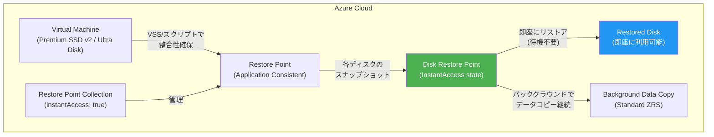

# Azure VM Restore Points: Instant Access (パブリックプレビュー)

**リリース日**: 2026-07-01

**サービス**: Azure Virtual Machines / Azure Disk Storage

**機能**: アプリケーション整合性リストアポイントによる Instant Access

**ステータス**: In preview

[このアップデートのインフォグラフィックを見る](https://takech9203.github.io/azure-news-summary/20260701-vm-restore-points-instant-access.html)

## 概要

Azure VM Restore Points に Instant Access 機能がパブリックプレビューとして導入された。これにより、リストアポイント作成後、バックグラウンドデータレプリケーションの完了を待たずに、即座にディスクをリストアすることが可能になる。

従来、Premium SSD v2 や Ultra Disk をデータディスクとして使用する VM のリストアポイントでは、スナップショット作成後にバックグラウンドでのデータコピーが完了するまでディスクのリストアができなかった。この待ち時間は、障害発生時の復旧時間 (RTO) を増加させる大きな要因となっていた。

Instant Access を有効にすることで、リストアポイント作成直後からディスクの復元操作を開始でき、RTO を大幅に短縮できる。

**アップデート前の課題**

- Premium SSD v2 / Ultra Disk のリストアポイントは、バックグラウンドコピー完了までディスク復元不可
- 障害発生時の復旧に長時間の待機が必要 (RTO が高い)
- データコピー完了状況を監視しながら復旧タイミングを判断する運用負荷

**アップデート後の改善**

- リストアポイント作成直後にディスクを即座に復元可能
- RTO の大幅な短縮 (バックグラウンドコピー待ち不要)
- 復元されたディスクはパフォーマンス影響を最小限に抑えて高速にハイドレーション

## アーキテクチャ図



Instant Access が有効な場合、Disk Restore Point は作成直後から InstantAccess 状態に入り、バックグラウンドコピーの完了を待たずにディスクの復元が可能。指定した期間 (60-300 分) が経過すると、通常の Standard ZRS スナップショットに移行する。

## サービスアップデートの詳細

### 主要機能

1. **即時ディスクリストア**
   - リストアポイント作成直後にディスクを復元可能
   - バックグラウンドデータレプリケーションの完了を待つ必要がない
   - 復元されたディスクは最小限のパフォーマンス影響で高速にハイドレーション

2. **アプリケーション整合性の維持**
   - VSS (Windows) またはプレ/ポストスクリプト (Linux) を使用
   - アプリケーションデータのフラッシュ後にスナップショットを取得
   - 整合性を確保しつつ即時アクセスを実現

3. **時間制限付き Instant Access**
   - `instantAccessDurationMinutes` パラメータで期間指定 (60-300 分)
   - 指定期間経過後は Standard ZRS スナップショットに自動移行
   - 長期保存と即時復旧のバランスを実現

4. **スナップショットアクセス状態の監視**
   - `snapshotAccessState` プロパティで各ディスクリストアポイントの状態を確認
   - InstantAccess / AvailableWithInstantAccess / Available / Pending の状態遷移

## 技術仕様

| 項目 | 詳細 |
|------|------|
| 対象ディスクタイプ | Premium SSD v2 / Ultra Disk (データディスク) |
| 整合性モード | アプリケーション整合性のみ (クラッシュ整合性は非対応) |
| Instant Access 期間 | 60-300 分 (デフォルト: 300 分) |
| API バージョン | 2025-04-01 以降 |
| サブスクリプション当たりの制限 | リージョンあたり最大 50 個の同時 Instant Access リストアポイント作成 |
| VM あたりのリストアポイント上限 | 500 個 (全コレクション・全整合性タイプ合計) |
| スロットリング | VM あたり 1 時間に 3 回 (Application Consistent PUT) |

## 設定方法

### 前提条件

1. Azure サブスクリプションでの機能フラグ登録が必要
2. Premium SSD v2 または Ultra Disk をデータディスクとして使用する VM
3. API バージョン 2025-04-01 以降を使用

### 機能フラグの登録

```powershell
# Cloud Shell (PowerShell) で実行
Register-AzProviderFeature -FeatureName 'AppConsistentInstantAccessSnapshotForDirectDriveDisks' -ProviderNamespace 'Microsoft.Compute'
```

### リストアポイントコレクションの作成 (Instant Access 有効)

Restore Point Collection の作成時に `instantAccess` プロパティを `true` に設定する。

### リストアポイントの作成

リストアポイント作成時に `instantAccessDurationMinutes` プロパティで Instant Access の期間を指定する (60-300 分)。

### 状態の確認

```bash
# Disk Restore Point の Instant Access 状態を確認
az resource show --ids <disk-restore-point-id> --query "properties.snapshotAccessState" --output tsv
```

## メリット

### ビジネス面

- 障害発生時の復旧時間 (RTO) を大幅に短縮し、ビジネス継続性を向上
- ミッションクリティカルなワークロードの SLA 達成を支援
- 復旧待ち時間の削減によるダウンタイムコストの低減

### 技術面

- バックグラウンドコピー完了を待たずに即座にディスク復元可能
- 復元されたディスクは高速ハイドレーションにより最小限のパフォーマンス影響
- 既存の Restore Point API / CLI / ARM テンプレートとの互換性

## デメリット・制約事項

- アプリケーション整合性リストアポイントのみ対応 (クラッシュ整合性は非対応)
- Premium SSD v2 / Ultra Disk のデータディスクのみが対象
- Instant Access 状態中はソースディスクの可用性に依存し、ディスク障害やゾーン障害に対する保護は提供されない
- クロスリージョンコピーおよびデータダウンロードはバックグラウンドコピー完了後のみ可能
- サブスクリプションあたりリージョンごとに最大 50 個の同時作成制限
- 現時点では REST API、Azure SDK、CLI、ARM テンプレートでのみ利用可能

## ユースケース

### ユースケース 1: ミッションクリティカルデータベースの高速復旧

**シナリオ**: Premium SSD v2 上で稼働する大規模データベース VM に障害が発生し、直前のリストアポイントから即座に復旧が必要。

**効果**: バックグラウンドコピーの完了を待たずにデータディスクを即座に復元でき、RTO を数時間から数分に短縮。

### ユースケース 2: 定期的なリストアポイントによる継続的保護

**シナリオ**: Ultra Disk を使用する高性能ワークロードで、定期的にアプリケーション整合性リストアポイントを取得し、いつでも即座に復元可能な状態を維持。

**効果**: 常に最新の復旧ポイントから即座にリストア可能な体制を構築し、RPO と RTO の両方を最小化。

## 料金

Instant Access スナップショットは使用量ベースの課金モデルで、2 種類の料金が発生する。

| 項目 | 料金 |
|------|------|
| スナップショットストレージ | ソースディスクからの変更データ量に基づく従量課金 (作成直後はゼロコスト) |
| リストア操作 | リストア時のディスクプロビジョニングサイズに基づく一回限りの料金 |

スナップショットストレージ料金は、ソースディスクのデータが変更された分のみ課金される増分モデル。ソースディスクに変更がなければ追加のストレージ料金は発生しない。

## 利用可能リージョン

パブリックプレビュー時点では以下のリージョンで利用可能:

- West Central US
- West US
- North Central US
- West US 2
- South Central US

## 関連サービス・機能

- **Azure Disk Storage**: Instant Access の対象となる Premium SSD v2 / Ultra Disk の管理
- **Azure Backup**: VM レベルのバックアップソリューション。Restore Points はより低レベルのディスクスナップショット機能
- **Azure Site Recovery**: DR ソリューション。Restore Points は補完的な復旧手段として利用可能
- **Incremental Snapshots**: Instant Access は増分スナップショットの拡張機能として動作

## 参考リンク

- [インフォグラフィック](https://takech9203.github.io/azure-news-summary/20260701-vm-restore-points-instant-access.html)
- [公式アップデート情報](https://azure.microsoft.com/updates?id=565758)
- [Microsoft Learn - VM Restore Points](https://learn.microsoft.com/en-us/azure/virtual-machines/virtual-machines-create-restore-points)
- [Microsoft Learn - Instant Access Snapshots](https://learn.microsoft.com/en-us/azure/virtual-machines/disks-instant-access-snapshots)
- [料金ページ - Managed Disks](https://azure.microsoft.com/pricing/details/managed-disks/)

## まとめ

Azure VM Restore Points の Instant Access 機能は、Premium SSD v2 および Ultra Disk を使用するミッションクリティカルなワークロードにおける復旧時間を大幅に短縮するプレビュー機能である。従来はバックグラウンドデータコピーの完了を待つ必要があったが、本機能により作成直後にディスクリストアを開始でき、RTO を劇的に改善する。

現時点では米国リージョン (5 リージョン) でのプレビュー提供であり、本番環境での利用前にはプレビューの制約事項を十分に確認することを推奨する。特に、Instant Access 状態中はソースディスクの可用性に依存する点、およびクロスリージョンコピーが即時には利用できない点に注意が必要である。

---

**タグ**: #Azure #VirtualMachines #DiskStorage #RestorePoints #InstantAccess #DisasterRecovery #Preview #PremiumSSDv2 #UltraDisk
