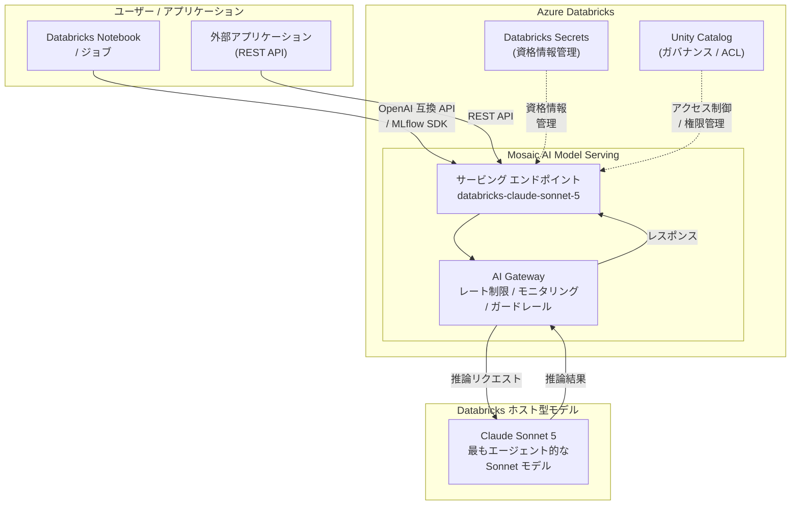

# Azure Databricks: Anthropic Claude Sonnet 5 の一般提供開始

**リリース日**: 2026-07-02

**サービス**: Azure Databricks

**機能**: Anthropic Claude Sonnet 5 on Azure Databricks (Generally Available)

**ステータス**: Launched (GA)

[このアップデートのインフォグラフィックを見る](https://takech9203.github.io/azure-news-summary/20260702-databricks-claude-sonnet-5.html)

## 概要

Microsoft は、Azure Databricks の Mosaic AI Model Serving を通じて Anthropic Claude Sonnet 5 が一般提供 (GA) されたことを発表した。Claude Sonnet 5 は Anthropic の「最もエージェント的な Sonnet モデル」として位置付けられ、Opus レベルに近い知能を Sonnet のコスト効率と速度で実現するモデルである。

Azure Databricks では `databricks-claude-sonnet-5` として Databricks ホスト型ファウンデーションモデルの形で提供され、pay-per-token (従量課金) 方式で利用できる。これにより、Azure Databricks ユーザーは追加のインフラ構築なしに、エージェント型タスクに最適化された最新の Claude モデルを既存のデータパイプラインやワークフロー内から直接活用できるようになった。

なお、2026 年 6 月 29 日には「Claude in Microsoft Foundry」の一般提供も発表されており、Azure 上での Anthropic モデルの利用基盤が急速に拡充されている。Azure Databricks 経由の提供は、Databricks のデータガバナンスやモデル管理機能と組み合わせた利用を可能にする点で差別化される。

**アップデート前の課題**

- Azure Databricks 環境でエージェント型タスクに最適化された Sonnet モデルを利用するには、従来の Sonnet 4 系モデルを使用する必要があり、複雑なエージェント処理での精度に限界があった
- Opus レベルの知能が必要なタスクでは Opus モデルを選択する必要があり、コストと速度のトレードオフが発生していた
- エージェント型ワークフローの構築において、コスト効率と高い推論能力を両立するモデル選択肢が限られていた

**アップデート後の改善**

- Claude Sonnet 5 により、Opus レベルに近い知能を Sonnet のコスト効率と速度で利用可能になった
- エージェント型タスクに特化した設計により、ツール呼び出しや多段階推論の精度が向上した
- Databricks ホスト型モデルとして提供されるため、エンドポイント作成のみで即座に利用を開始できる
- pay-per-token 方式により、使用量に応じた柔軟なコスト管理が可能になった

## アーキテクチャ図



Azure Databricks の Mosaic AI Model Serving を通じて、Databricks ホスト型ファウンデーションモデルとして Claude Sonnet 5 が提供される。ユーザーは OpenAI 互換 API でアクセスし、AI Gateway によるガバナンス機能と Unity Catalog によるアクセス制御が適用される。

## サービスアップデートの詳細

### 主要機能

1. **最もエージェント的な Sonnet モデル**
   - Claude Sonnet 5 は Anthropic がリリースした Sonnet 系モデルの中で最もエージェント型タスクに最適化されたモデルである
   - ツール呼び出し (Function Calling) や多段階の自律的推論において、従来の Sonnet モデルを大幅に上回る性能を発揮する
   - Opus レベルに近い知能を持ちながら、Sonnet のコスト効率と応答速度を維持している

2. **Databricks ホスト型ファウンデーションモデルとしての提供**
   - `databricks-claude-sonnet-5` として pay-per-token エンドポイントで利用可能
   - 外部 API キーの管理が不要で、Databricks の課金に統合される
   - エンドポイント作成なしで即座に利用を開始できる (ビルトインエンドポイント)

3. **AI Gateway によるガバナンス**
   - レート制限: エンドポイントごとの呼び出し回数やトークン数の制限を設定可能
   - 使用量トラッキング: モデルの利用状況をリアルタイムで監視
   - ガードレール: 入力・出力に対する安全性フィルタリングの適用が可能

4. **OpenAI 互換 API とストリーミング対応**
   - OpenAI 互換の REST API および SDK で利用可能
   - ストリーミングレスポンスに対応
   - `llm/v1/chat` タスクタイプをサポート

## 技術仕様

| 項目 | 詳細 |
|------|------|
| モデル名 (Databricks) | databricks-claude-sonnet-5 |
| プロバイダー | Anthropic |
| モデル特性 | 最もエージェント的な Sonnet モデル / Near-Opus 知能 |
| 提供形態 | Databricks ホスト型ファウンデーションモデル (pay-per-token) |
| サポートタスク | `llm/v1/chat` |
| API 形式 | OpenAI 互換 REST API |
| ストリーミング | 対応 |
| Function Calling | 対応 (tools パラメーター) |

## 設定方法

### 前提条件

1. Azure Databricks ワークスペースが利用可能であること
2. サポート対象リージョンにワークスペースが配置されていること
3. Model Serving エンドポイントの利用権限を持っていること

### Python SDK を使用したクエリ (OpenAI SDK)

```python
from openai import OpenAI

client = OpenAI(
    api_key="dapi-your-databricks-token",
    base_url="https://<workspace-url>/serving-endpoints"
)

response = client.chat.completions.create(
    model="databricks-claude-sonnet-5",
    messages=[
        {"role": "user", "content": "このデータセットの異常値を分析し、改善策を提案してください。"}
    ],
    temperature=0.7
)
print(response.choices[0].message.content)
```

### Function Calling を活用したエージェント型利用

```python
from openai import OpenAI

client = OpenAI(
    api_key="dapi-your-databricks-token",
    base_url="https://<workspace-url>/serving-endpoints"
)

response = client.chat.completions.create(
    model="databricks-claude-sonnet-5",
    messages=[
        {"role": "user", "content": "過去1ヶ月の売上トレンドを分析し、異常値があれば原因を調査してください。"}
    ],
    tools=[
        {
            "type": "function",
            "function": {
                "name": "query_data",
                "description": "データウェアハウスに対して SQL クエリを実行する",
                "parameters": {
                    "type": "object",
                    "properties": {
                        "sql": {"type": "string", "description": "実行する SQL クエリ"}
                    },
                    "required": ["sql"]
                }
            }
        }
    ]
)
```

## メリット

### ビジネス面

- Opus レベルに近い精度をコスト効率の高い Sonnet 価格帯で利用でき、AI 活用の ROI が向上する
- エージェント型タスクの精度向上により、複雑な業務プロセスの自動化範囲が拡大する
- pay-per-token 方式により、初期投資なしで利用を開始でき、使用量に応じたコスト管理が可能
- Azure Databricks のデータ基盤上で最新の AI モデルを直接活用でき、データと AI の統合が促進される

### 技術面

- OpenAI 互換 API により、既存のコードベースやツールチェーンを変更せずに導入できる
- Databricks ホスト型モデルとして提供されるため、外部 API キー管理の複雑さが軽減される
- Unity Catalog と統合されたアクセス制御により、きめ細かい権限管理が可能
- AI Gateway によるレート制限・モニタリング機能で、本番環境での安定運用が容易

## デメリット・制約事項

- 一部リージョンではクロスジオルーティングが必要となり、レイテンシーが増加する可能性がある
- Databricks ホスト型モデルの料金体系は Anthropic 直接契約と異なる場合がある
- pay-per-token 方式のため、大量のトークン消費が発生するワークロードではコスト管理に注意が必要
- Sonnet 5 は Opus モデルほどの最大知能は持たないため、最も複雑なタスクには引き続き Opus が適する場合がある

## ユースケース

### ユースケース 1: エージェント型データ分析パイプライン

**シナリオ**: データエンジニアリングチームが、Databricks 上のデータレイクに対して自然言語による質問に基づく多段階の分析を自動実行する AI エージェントを構築したい。

**実装例**:

```python
from openai import OpenAI

client = OpenAI(
    api_key="dapi-your-databricks-token",
    base_url="https://<workspace-url>/serving-endpoints"
)

# Claude Sonnet 5 のエージェント能力を活用した多段階分析
response = client.chat.completions.create(
    model="databricks-claude-sonnet-5",
    messages=[
        {
            "role": "system",
            "content": "あなたはデータ分析エージェントです。必要に応じてツールを呼び出し、多段階の分析を自律的に実行してください。"
        },
        {
            "role": "user",
            "content": "顧客セグメント別の離脱率を分析し、高リスクセグメントに対するリテンション施策を提案してください。"
        }
    ],
    tools=[
        {
            "type": "function",
            "function": {
                "name": "run_sql",
                "description": "Unity Catalog テーブルに対して SQL クエリを実行",
                "parameters": {
                    "type": "object",
                    "properties": {
                        "query": {"type": "string"}
                    },
                    "required": ["query"]
                }
            }
        }
    ]
)
```

**効果**: Claude Sonnet 5 のエージェント特化設計により、ツール呼び出しの適切な判断と多段階推論が高精度で実行され、人手を介さない自律的なデータ分析が実現できる。

### ユースケース 2: コスト効率の高い大規模文書処理

**シナリオ**: 法務部門が大量の契約書から特定条項を抽出・分類したいが、Opus モデルではコストが高すぎる。

**効果**: Claude Sonnet 5 は Opus に近い理解力を持ちながら Sonnet の価格帯で利用できるため、大量文書のバッチ処理において高い精度とコスト効率を両立できる。

## 料金

Azure Databricks で Claude Sonnet 5 を利用する場合、pay-per-token (従量課金) 方式が適用される。

| 項目 | 説明 |
|------|------|
| 課金方式 | Pay-per-token (トークン消費量に基づく従量課金) |
| 提供形態 | Databricks ホスト型ファウンデーションモデル |
| AI Gateway | ガバナンス機能の利用に伴う追加課金の可能性あり |

詳細な料金については [Databricks Model Serving 料金ページ](https://www.databricks.com/product/pricing/model-serving) を参照。

## 利用可能リージョン

### ネイティブサポート (クロスジオルーティング不要)

- centralus
- eastus
- eastus2
- northcentralus
- southcentralus
- westus
- westus2

### クロスジオルーティング必要

- australiaeast
- francecentral
- germanywestcentral
- japaneast
- northeurope
- swedencentral
- switzerlandnorth
- westeurope

## 関連サービス・機能

- **Mosaic AI Model Serving**: Azure Databricks の AI/ML モデル デプロイメント基盤。Databricks ホスト型モデルおよび外部モデルの統一的な管理・提供を実現する
- **AI Gateway**: Model Serving エンドポイントに対するレート制限、使用量モニタリング、ガードレールなどのガバナンス機能を提供する
- **Unity Catalog**: データおよびモデルの統合ガバナンス レイヤー。サービング エンドポイントへのアクセス制御を管理する
- **Claude in Microsoft Foundry**: Azure 上で Claude モデルを直接利用できるサービス。NVIDIA GB300 Blackwell Ultra インフラストラクチャ上で稼働する
- **他の Databricks ホスト型 Claude モデル**: databricks-claude-sonnet-4-6、databricks-claude-opus-4-8 など、用途に応じたモデル選択が可能

## 参考リンク

- [インフォグラフィック](https://takech9203.github.io/azure-news-summary/20260702-databricks-claude-sonnet-5.html)
- [公式アップデート情報](https://azure.microsoft.com/updates?id=567194)
- [Microsoft Learn - Databricks ホスト型ファウンデーションモデル](https://learn.microsoft.com/azure/databricks/machine-learning/foundation-models/)
- [Microsoft Learn - Mosaic AI Model Serving](https://learn.microsoft.com/azure/databricks/machine-learning/model-serving/)
- [Microsoft Learn - AI Gateway](https://learn.microsoft.com/azure/databricks/ai-gateway/)
- [Databricks Model Serving 料金](https://www.databricks.com/product/pricing/model-serving)

## まとめ

Azure Databricks の Mosaic AI Model Serving で Anthropic Claude Sonnet 5 が一般提供 (GA) となった。Claude Sonnet 5 は「最もエージェント的な Sonnet モデル」として、Opus レベルに近い知能を Sonnet のコスト効率と速度で実現する。Databricks ホスト型ファウンデーションモデルとして pay-per-token 方式で提供され、エンドポイント作成のみで即座に利用を開始できる。エージェント型タスク (ツール呼び出し、多段階推論) に最適化されており、Azure Databricks 上でコスト効率の高い AI エージェントの構築を検討している場合に特に推奨される。利用可能リージョンは米国リージョンがネイティブサポート、日本を含むその他リージョンはクロスジオルーティングで対応している。

---

**タグ**: #Azure #AzureDatabricks #Anthropic #ClaudeSonnet5 #AI #MachineLearning #LLM #ModelServing #Agentic #GA
