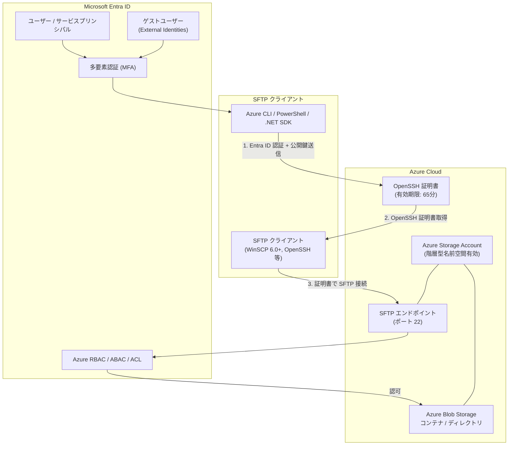

# Azure Blob Storage: SFTP における Microsoft Entra ID ベースのアクセス (一般提供開始)

**リリース日**: 2026-07-06

**サービス**: Azure Blob Storage

**機能**: SFTP における Microsoft Entra ID ベースのアクセス

**ステータス**: Launched (GA)

[このアップデートのインフォグラフィックを見る](https://takech9203.github.io/azure-news-summary/20260706-blob-storage-sftp-entra-id-ga.html)

## 概要

Azure Blob Storage の SFTP エンドポイントにおける Microsoft Entra ID ベースのアクセスが、全リージョンで一般提供 (GA) 開始となった。2026 年 3 月にパブリックプレビューとして発表されたこの機能が、本番ワークロードでの利用に正式に対応した。

この機能により、従来のローカルユーザー (パスワードまたは SSH 鍵) に加え、Microsoft Entra ID の ID (ユーザー、サービスプリンシパル、ゲストユーザー) を使用して Azure Blob Storage に SFTP 接続が可能になる。Entra External Identities を利用したゲストユーザーによるセキュアな SFTP アクセスもサポートされる。

プレビュー段階では本番環境での使用が推奨されなかったが、GA により SLA の対象となり、エンタープライズ環境での本格採用が可能になった。また、プレビュー時に部分サポートであった ABAC (属性ベースアクセス制御) が正式にサポートされるようになった。

**アップデート前の課題**

- ストレージアカウントごとにローカルユーザーの作成・管理が必要であった
- パスワードや SSH 鍵の配布・ローテーションの運用負荷が高かった
- ローカルユーザーは Azure RBAC や ABAC と相互運用できず、アクセス制御モデルが分離していた
- 外部ユーザーへの SFTP アクセス付与には、別途ローカルユーザーの管理が必要であった
- プレビュー段階では本番ワークロードでの利用が非推奨であった

**アップデート後の改善**

- Microsoft Entra ID の既存 ID (ユーザー、グループ、サービスプリンシパル) をそのまま SFTP 認証に利用可能
- Azure RBAC、ABAC、ACL による統一的なアクセス制御が SFTP にも適用される
- 多要素認証 (MFA) によるセキュリティ強化が SFTP 接続でも利用可能
- Entra External Identities によるゲストユーザーへのセキュアな SFTP アクセス提供が可能
- GA により SLA が適用され、本番ワークロードでの利用が正式にサポートされる
- 全リージョンで利用可能

## アーキテクチャ図



Microsoft Entra ID で認証後、OpenSSH 証明書を取得し、その証明書を使用して SFTP エンドポイントに接続する。認可は Azure RBAC、ABAC、ACL に基づいて行われ、REST API や SDK 経由のアクセスと同一の権限モデルが適用される。

## サービスアップデートの詳細

### プレビューからの主な変更点

- **ステータス変更**: パブリックプレビュー から 一般提供 (GA) へ移行
- **ABAC サポート**: プレビュー時は部分サポートであったが、GA では正式にサポート
- **SLA 適用**: GA により Microsoft の SLA 対象となり、本番ワークロードでの利用が正式にサポート
- **全リージョン対応**: 全 Azure リージョンで利用可能

### 主要機能

1. **Microsoft Entra ID 認証の統合**
   - ユーザー、サービスプリンシパル、ゲストユーザーが Entra ID の ID で SFTP に接続可能
   - Azure CLI (`az sftp cert`)、Azure PowerShell (`New-AzSftpCertificate`)、.NET SDK で OpenSSH 証明書を取得
   - マネージド ID は非サポート

2. **OpenSSH 証明書ベースの認証**
   - Entra ID 認証後、65 分間有効な OpenSSH 証明書が発行される
   - RSA 鍵のみサポート (ECDSA は非サポート)
   - 標準的な SFTP クライアント (WinSCP 6.0 以降、OpenSSH 等) で利用可能

3. **Azure RBAC / ABAC / ACL との統合**
   - Storage Blob Data Contributor や Storage Blob Data Owner などの既存ロールが SFTP にも適用される
   - ABAC (属性ベースアクセス制御) が正式にサポート
   - POSIX スタイルの ACL による細粒度のアクセス制御をサポート
   - REST API、SDK、Portal 経由のアクセスと同じ権限モデルを SFTP でも利用可能

4. **外部コラボレーション (Entra External Identities)**
   - ゲストユーザーを Microsoft Entra ID に招待し、SFTP アクセスを付与可能
   - 外部パートナーやベンダーとの安全なファイル転送を実現
   - 別の ID 管理システムの構築が不要

## 技術仕様

| 項目 | 詳細 |
|------|------|
| ステータス | 一般提供 (GA) |
| 認証方式 | OpenSSH 証明書 (RSA のみ) |
| 証明書の有効期限 | 65 分 |
| サポートされる ID | ユーザー、サービスプリンシパル、ゲストユーザー |
| 非サポートの ID | マネージド ID |
| 必要なストレージアカウント | 汎用 v2 または Premium ブロック Blob アカウント |
| 前提条件 | 階層型名前空間 (HNS) の有効化 |
| アクセス制御 | Azure RBAC、ABAC、ACL |
| SFTP ポート | 22 |
| 対応ツール | Azure CLI (`az sftp`)、Azure PowerShell (`Az.Sftp`)、.NET SDK |
| パスワード認証 | 非サポート (SFTP クライアント側に Entra ID ネイティブ統合がないため) |
| 利用可能リージョン | 全リージョン |

## 設定方法

### 前提条件

1. 汎用 v2 または Premium ブロック Blob ストレージアカウント (階層型名前空間有効)
2. ストレージアカウントで SFTP サポートが有効化されていること
3. Azure CLI または Azure PowerShell がインストールされていること
4. 適切な Azure RBAC ロール (Storage Blob Data Contributor 等) が割り当てられていること

### Azure CLI

```bash
# 1. Entra ID で認証
az login

# 2. SSH 鍵ペアの生成 (RSA のみサポート)
ssh-keygen -t rsa

# 3. OpenSSH 証明書の取得
az sftp cert --public-key-file ~/.ssh/id_rsa.pub --file ~/.ssh/my_cert.pub

# 4. SFTP 接続
sftp -o PubkeyAcceptedKeyTypes="rsa-sha2-256-cert-v01@openssh.com,rsa-sha2-256" \
     -o IdentityFile="~/.ssh/id_rsa" \
     -o CertificateFile="~/.ssh/my_cert.pub" \
     <storageaccountname>.<username>@<storageaccountname>.blob.core.windows.net
```

```bash
# Azure CLI で証明書取得と接続を一括実行
az sftp connect --storage-account <account_name>
```

### Azure PowerShell

```powershell
# 1. Entra ID で認証
Connect-AzAccount

# 2. OpenSSH 証明書の取得
New-AzSftpCertificate -PublicKeyFile "$HOME\.ssh\id_rsa.pub" -CertificatePath "$HOME\.ssh\my_cert.pub"

# 3. SFTP 接続
Connect-AzSftp -StorageAccount "<account_name>" -CertificateFile "$HOME\.ssh\my_cert.pub"
```

### サービスプリンシパルでの認証

```bash
# クライアントシークレットで認証
az login --service-principal -u <application_id> -p <secret_value> --tenant <tenant_id>

# 証明書で認証
az login --service-principal -u <application_id> --tenant <tenant_id> --certificate <path_to_certificate>

# OpenSSH 証明書の取得
az sftp cert --public-key-file ~/.ssh/id_rsa.pub --file ~/.ssh/my_cert.pub
```

## メリット

### ビジネス面

- ローカルユーザーの作成・管理が不要になり、運用コストが削減される
- 既存の企業 ID 基盤 (Entra ID) を活用でき、ID 管理の一元化が実現する
- 外部パートナーとのファイル共有に Entra External Identities を利用でき、コラボレーションが容易になる
- SFTP ワークフローの初期セットアップ時間が短縮される
- GA により SLA の対象となり、ミッションクリティカルなワークロードに適用可能

### 技術面

- Azure RBAC / ABAC / ACL による統一的なアクセス制御モデルが SFTP にも適用される
- 多要素認証 (MFA) によるセキュリティ強化が可能
- OpenSSH 証明書の有効期限が 65 分と短く、長期間有効な認証情報のリスクが軽減される
- サービスプリンシパルによる自動化ワークフローの実装が容易
- REST API、SDK、Portal と同一の認可モデルにより管理の一貫性が向上

## デメリット・制約事項

- パスワード認証は非サポート (OpenSSH 証明書のみ)
- RSA 鍵のみサポートされ、ECDSA は利用不可
- マネージド ID による認証は非サポート
- ホームディレクトリの設定は非サポート。接続後に cd コマンドでコンテナに移動する必要がある
- 接続文字列にコンテナ名を含めることができない
- 証明書の有効期限が 65 分であるため、長時間のファイル転送には証明書の更新が必要
- Default ACL および追加の Access ACL (名前付きユーザー・グループ) が設定されたディレクトリでは SFTP 操作が失敗する
- 階層型名前空間 (HNS) の有効化が必須であり、既存のフラット名前空間のストレージアカウントでは利用不可

## ユースケース

### ユースケース 1: レガシーシステムとの統合

**シナリオ**: 既存のレガシーシステムが SFTP を使用してファイルを転送しているが、ローカルユーザー管理の負荷を削減し、セキュリティポスチャを向上させたい場合。

**実装例**:

```bash
# サービスプリンシパルで認証し、自動化ワークフローで SFTP 接続
az login --service-principal -u <app_id> -p <secret> --tenant <tenant_id>
az sftp connect --storage-account <account_name>
```

**効果**: サービスプリンシパルを使用して Entra ID で認証し、Azure RBAC で細粒度のアクセス制御を適用できる。ローカルユーザーの管理が不要になり、運用負荷が大幅に削減される。

### ユースケース 2: 外部パートナーとのセキュアなファイル共有

**シナリオ**: 外部のビジネスパートナーやベンダーに対して SFTP でファイルアクセスを提供する必要がある場合。

**効果**: Entra External Identities でゲストユーザーとして招待し、適切な RBAC ロールを付与することで、別の ID 管理システムを構築することなくセキュアなファイル共有が実現される。MFA も適用でき、企業のセキュリティポリシーに準拠したアクセス制御が可能。

### ユースケース 3: マルチテナント環境での統一的なアクセス管理

**シナリオ**: 複数のストレージアカウントに対して SFTP アクセスを提供する必要があり、各アカウントのローカルユーザー管理が煩雑になっている場合。

**効果**: Entra ID の ID を全ストレージアカウントで共通利用でき、Azure RBAC によるロール割り当てで一元管理が可能になる。ユーザーのオンボーディング・オフボーディングも Entra ID のライフサイクル管理に統合される。

## 料金

SFTP エンドポイントの有効化には時間単位のコストが発生する。Entra ID ベースのアクセス自体に追加料金は発生しない。

通常の SFTP 料金およびストレージのトランザクション・容量・ネットワーク料金が適用される。SFTP トランザクションはストレージアカウントの Read、Write、Other トランザクションに変換される。

SFTP を常時有効にすると継続的にコストが発生するため、データ転送時のみ有効にすることが推奨されている。

詳細な料金については [Azure Blob Storage の料金ページ](https://azure.microsoft.com/pricing/details/storage/blobs/) を参照。

## 利用可能リージョン

全 Azure リージョンで利用可能。

## 関連サービス・機能

- **Microsoft Entra ID**: SFTP 接続の認証・認可基盤として使用される
- **Microsoft Entra External Identities**: 外部ユーザー (ゲストユーザー) への SFTP アクセス提供に使用される
- **Azure Data Lake Storage Gen2**: 階層型名前空間 (HNS) の基盤技術。SFTP サポートには HNS の有効化が必須
- **Azure Blob Storage SFTP (ローカルユーザー)**: 従来のローカルユーザーベースの SFTP 認証。Entra ID ベースのアクセスと共存可能

## 参考リンク

- [インフォグラフィック](https://takech9203.github.io/azure-news-summary/20260706-blob-storage-sftp-entra-id-ga.html)
- [公式アップデート情報](https://azure.microsoft.com/updates?id=567085)
- [Microsoft Learn - Authorize SFTP access using Microsoft Entra ID](https://learn.microsoft.com/en-us/azure/storage/blobs/secure-file-transfer-protocol-support-entra-id-based-access)
- [Microsoft Learn - SFTP support for Azure Blob Storage](https://learn.microsoft.com/en-us/azure/storage/blobs/secure-file-transfer-protocol-support)
- [Microsoft Learn - SFTP の制限事項と既知の問題](https://learn.microsoft.com/en-us/azure/storage/blobs/secure-file-transfer-protocol-known-issues)
- [料金ページ](https://azure.microsoft.com/pricing/details/storage/blobs/)
- [プレビュー時のレポート](./2026-03-16-blob-storage-sftp-entra-id.md)

## まとめ

Azure Blob Storage SFTP における Microsoft Entra ID ベースのアクセスが一般提供 (GA) となり、全リージョンで本番ワークロードでの利用が可能になった。2026 年 3 月のパブリックプレビューから約 4 か月で GA に到達し、ABAC の正式サポートや SLA の適用など、エンタープライズ環境での本格採用に必要な要素が揃った。

従来のローカルユーザー管理の課題を解決し、企業の既存 ID 基盤 (Entra ID) による統一的な認証・認可を SFTP にも適用できる点は、セキュリティポスチャの向上と運用負荷の軽減に大きく貢献する。特に、外部パートナーとのファイル共有シナリオでは Entra External Identities の活用により、別の ID 管理システムを構築することなくセキュアなコラボレーションが実現される。

SFTP を利用している組織には、ローカルユーザーから Entra ID ベースのアクセスへの移行計画を策定し、段階的な移行を開始することが推奨される。

---

**タグ**: #Azure #BlobStorage #SFTP #EntraID #認証 #セキュリティ #GA #一般提供 #ExternalIdentities #RBAC #ABAC #ACL
