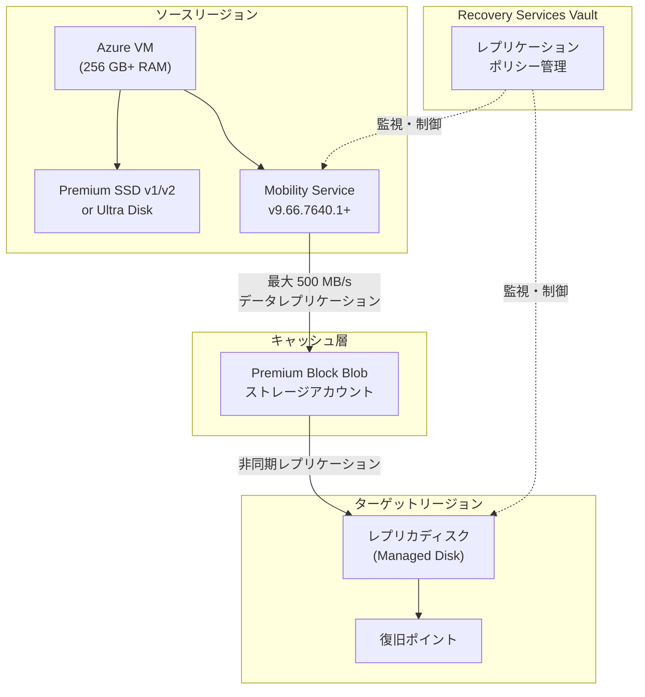

# Azure Site Recovery: 5 倍チャーンサポート (500 MB/s per VM)

**リリース日**: 2026-07-06

**サービス**: Azure Site Recovery

**機能**: 5x チャーンサポート (500 MB/s per VM)

**ステータス**: Launched (GA)

[このアップデートのインフォグラフィックを見る](https://takech9203.github.io/azure-news-summary/20260706-site-recovery-5x-churn.html)

## 概要

Azure Site Recovery の High Churn オプションが大幅に強化され、仮想マシンあたり最大 500 MB/s のデータ変更レート (チャーン) をサポートするようになりました。これは従来の High Churn オプション (100 MB/s per VM) から 5 倍の向上であり、Normal Churn オプション (54 MB/s per VM) と比較すると約 9 倍の性能向上となります。

この機能強化により、データベースや高 IOPS ワークロードなど、大量のデータ書き込みが発生するアプリケーションに対しても、Azure Site Recovery による堅牢なディザスタリカバリ (DR) 保護を適用できるようになりました。高チャーン環境でもより良い RPO (Recovery Point Objective) を達成できます。

High Churn は Premium Block Blob ストレージアカウントをキャッシュストレージとして使用し、Mobility Service バージョン 9.66.7640.1 以降が必要です。

**アップデート前の課題**

- High Churn オプションでも VM あたり最大 100 MB/s、Normal Churn では 54 MB/s に制限されていた
- データベースや高 IOPS アプリケーションではレプリケーションが追いつかず、RPO が悪化する場合があった
- 高チャーンワークロードに対して Azure Site Recovery を適用することが困難だった

**アップデート後の改善**

- VM あたり最大 500 MB/s のチャーンをサポート (従来の 5 倍)
- ディスクあたり最大 250 MB/s のチャーンをサポート
- 高 IOPS データベースワークロードでも堅牢な DR 保護が可能に
- より良い RPO を達成可能

## アーキテクチャ図

この図は、High Churn (5x) 構成における Azure Site Recovery のレプリケーションフローを示しています。ソース VM の Mobility Service がデータ変更を Premium Block Blob キャッシュストレージ経由でターゲットリージョンへ最大 500 MB/s でレプリケートします。

## サービスアップデートの詳細

### 主要機能

1. **5 倍のチャーンサポート (500 MB/s per VM)**
   - 従来の High Churn (100 MB/s) から 5 倍に向上
   - Normal Churn (54 MB/s) と比較すると約 9 倍の性能
   - VM あたり 500 MB/s、ディスクあたり最大 250 MB/s

2. **RAM ベースのティア制チャーン制限**
   - 256 GB 以上の RAM: 最大 500 MB/s per VM
   - 32 GB 以上 256 GB 未満の RAM: 最大 100 MB/s per VM
   - 32 GB 未満の RAM: 最大 54 MB/s per VM (Normal Churn)

3. **ディスクサイズ別の詳細なチャーン制限**
   - 大容量ディスクほど高いチャーンレートをサポート
   - 8,192 GiB 以上のディスクで最大 250 MB/s (256 KB+ I/O サイズ)

4. **既存保護 VM のアップグレードパス**
   - Mobility Service を 9.66.7640.1 以降にアップグレードし、VM を再起動することで 500 MB/s 制限が有効化
   - 新規保護 VM は要件を満たせば自動的に 500 MB/s が適用

## 技術仕様

| 項目 | 詳細 |
|------|------|
| 最大チャーン (per VM) | 500 MB/s |
| 最大チャーン (per ディスク) | 250 MB/s |
| 必要 RAM | 256 GB 以上 (500 MB/s の場合) |
| 対応ディスクタイプ | Premium SSD v1, Premium SSD v2, Ultra Disk |
| キャッシュストレージ | Premium Block Blob ストレージアカウント |
| 必要 Mobility Service バージョン | 9.66.7640.1 以降 |
| 対応 OS (500 MB/s) | Windows 全バージョン、Linux (RHEL 9, SLES 15, Ubuntu 24.04) |
| 対応 OS (100 MB/s) | Windows 全バージョン、全サポート対象 Linux ディストリビューション |
| 対応シナリオ | Azure-to-Azure (A2A) ディザスタリカバリ |
| ディスク要件 | マネージドディスクのみ |

## 設定方法

### 前提条件

1. VM の RAM が 256 GB 以上であること (500 MB/s を達成する場合)
2. ソースディスクが Premium SSD v1, Premium SSD v2, または Ultra Disk であること
3. マネージドディスクを使用していること
4. ソースおよびターゲットリージョンが Enhanced churn サポート対象であること
5. Mobility Service バージョン 9.66.7640.1 以降がインストールされていること
6. 十分なネットワーク帯域幅と CPU リソースが確保されていること (ASR のピーク CPU 使用率は最大 18%)

### Azure Portal

**Recovery Services Vault から設定する場合:**

1. ソース仮想マシンを選択し、レプリケーションを有効化する標準手順に従う
2. **Replication Settings** > **Storage** で **View/edit storage configuration** を選択
3. **Churn for the VM** で **High Churn** を選択
4. キャッシュストレージとして Premium Block Blob ストレージアカウントを選択
5. その他の設定を構成してレプリケーションを有効化

**VM のディザスタリカバリ画面から設定する場合:**

1. Azure Portal で対象 VM を選択
2. **Operations** > **Disaster recovery** を選択
3. ターゲットリージョンを選択し、**Next: Advanced settings** をクリック
4. **Storage settings** > **Show details** を展開
5. **Churn for the VM** で **High Churn** を選択
6. **Review + Start replication** で確認して開始

## メリット

### ビジネス面

- 高 IOPS データベースワークロード (SQL Server, Oracle, SAP HANA など) に対して包括的な DR 保護が可能に
- RPO の改善により、災害発生時のデータ損失リスクが大幅に低減
- ミッションクリティカルなアプリケーションの事業継続性が向上
- Azure Site Recovery 単体で高チャーン環境をカバーでき、追加の DR ソリューションが不要に

### 技術面

- VM あたり 500 MB/s のデータ変更に追従可能なレプリケーション性能
- ディスクあたり 250 MB/s まで対応し、複数ディスク構成でも十分な帯域を確保
- Premium Block Blob ストレージによる高速キャッシュ処理
- 既存保護 VM もエージェントアップグレード + 再起動で新機能を利用可能

## デメリット・制約事項

- 500 MB/s を達成するには 256 GB 以上の RAM が必要 (大型 VM に限定)
- ソースディスクが Premium SSD v1/v2 または Ultra Disk でなければならない
- Enhanced churn (500 MB/s) は一部リージョンでのみ利用可能
- Linux での 500 MB/s サポートは RHEL 9, SLES 15, Ubuntu 24.04 に限定
- キャッシュストレージに Premium Block Blob を使用するため、Standard ストレージアカウントより高コスト
- 既存の保護を Normal Churn から High Churn に切り替えるにはレプリケーションの無効化・再有効化が必要
- ASR のピーク CPU 使用率が最大 18% に達する可能性がある
- Site Recovery は RAM の最大 6.25% を予約する (Windows の場合 High Churn で最大 16 GB)

## ユースケース

### ユースケース 1: 大規模データベースの DR 保護

**シナリオ**: SQL Server や SAP HANA などの大規模データベースが稼働する VM (256 GB+ RAM, Premium SSD v2) で、ピーク時のデータ変更レートが 300 MB/s を超える場合

**効果**: 従来の 100 MB/s 制限ではレプリケーションが追いつかず RPO が悪化していたが、500 MB/s サポートにより安定した RPO を維持可能

### ユースケース 2: 高 IOPS トランザクションシステム

**シナリオ**: 金融系トランザクション処理や EC サイトの注文処理など、大量の書き込み I/O が発生するシステムのディザスタリカバリ

**効果**: 書き込み集中型ワークロードでも Azure Site Recovery で保護でき、サードパーティの DR ソリューションに頼る必要がなくなる

### ユースケース 3: 大規模データ分析ワークロード

**シナリオ**: ETL 処理やリアルタイムデータパイプラインで大量のデータ書き込みが発生する分析基盤

**効果**: データ処理中の高チャーン期間でも DR 保護が途切れることなく、事業継続性を確保

## 料金

Azure Site Recovery の基本料金は、保護対象インスタンスごとの月額課金です。High Churn オプションでは、キャッシュストレージに Premium Block Blob ストレージアカウントを使用するため、Normal Churn (Standard ストレージアカウント) と比較してストレージコストが増加します。また、高チャーンによりレプリケーションデータ量が増加するため、ネットワーク転送コストも高くなる可能性があります。

詳細な料金については [Azure Site Recovery の料金ページ](https://azure.microsoft.com/pricing/details/site-recovery/) を参照してください。

## 利用可能リージョン

Enhanced churn (500 MB/s) は以下のリージョンでサポートされています (ソースとターゲットの両方が対象リージョンである必要があります):

Australia Central, Australia Central 2, Australia East, Australia Southeast, Brazil South, Brazil Southeast, Canada East, Central India, Central US, East Asia, East US 2, France Central, France South, Germany North, Germany West Central, Israel Central, Italy North, Japan East, Japan West, Korea Central, Korea South, New Zealand North, North Central US, North Europe, Norway East, Qatar Central, South Africa North, South Africa West, South Central US, South Central US 2, South India, Southeast Asia, Southeast US, Southeast US 5, Southwest US, Switzerland West, Taiwan North, Taiwan Northwest, UAE Central, UAE North, UK South, UK West, West Central US, West Europe, West US, West US 2, West US 3

High Churn (100 MB/s) は Azure Site Recovery がサポートされ、Premium Block Blob ストレージアカウントが利用可能な全リージョンで利用可能です。

## 関連サービス・機能

- **Azure Site Recovery (Normal Churn)**: 54 MB/s までの標準チャーンサポート。Standard ストレージアカウントをキャッシュに使用
- **Premium Block Blob Storage**: High Churn のキャッシュストレージとして使用される高性能ストレージ
- **Azure Managed Disks (Premium SSD v2, Ultra Disk)**: 500 MB/s チャーンの前提条件となるソースディスクタイプ
- **Recovery Services Vault**: レプリケーションポリシーの管理とフェイルオーバーのオーケストレーション

## 参考リンク

- [インフォグラフィック](https://takech9203.github.io/azure-news-summary/20260706-site-recovery-5x-churn.html)
- [公式アップデート情報](https://azure.microsoft.com/updates?id=566966)
- [Microsoft Learn ドキュメント: High Churn support](https://learn.microsoft.com/en-us/azure/site-recovery/concepts-azure-to-azure-high-churn-support)
- [Microsoft Learn ドキュメント: Azure-to-Azure support matrix](https://learn.microsoft.com/en-us/azure/site-recovery/azure-to-azure-support-matrix)
- [料金ページ](https://azure.microsoft.com/pricing/details/site-recovery/)

## まとめ

Azure Site Recovery の 5 倍チャーンサポート (500 MB/s per VM) は、高 IOPS ワークロードを実行する組織にとって重要なアップデートです。従来の 100 MB/s 制限では対応困難だったデータベースや大規模トランザクションシステムに対しても、Azure Site Recovery による包括的なディザスタリカバリ保護を適用できるようになりました。

**推奨される次のアクション:**
1. 高チャーンワークロードを持つ VM を特定し、サポートマトリクス要件 (256 GB+ RAM, Premium SSD v1/v2 or Ultra Disk) を確認
2. Mobility Service を最新バージョン (9.66.7640.1 以降) にアップグレード
3. 既存の保護 VM は再起動して新しいチャーン制限を有効化
4. 新規 VM は High Churn オプションを選択してレプリケーションを有効化
5. ソースおよびターゲットリージョンが Enhanced churn 対象リージョンであることを確認

---

**タグ**: #AzureSiteRecovery #DisasterRecovery #HighChurn #BCDR #AzureVM #レプリケーション #ディザスタリカバリ #GA
