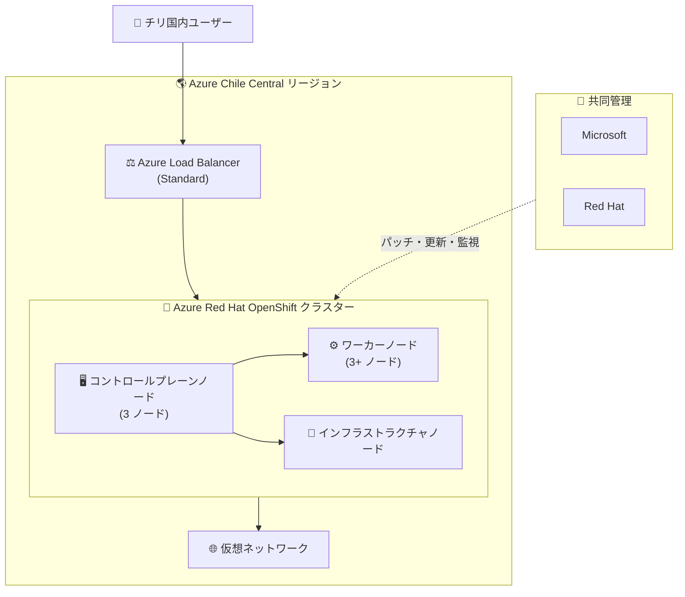

# Azure Red Hat OpenShift: Chile Central リージョンで一般提供開始

**リリース日**: 2026-07-07

**サービス**: Azure Red Hat OpenShift (ARO)

**機能**: Chile Central リージョンでの一般提供 (GA)

**ステータス**: Launched (GA)

[このアップデートのインフォグラフィックを見る](https://takech9203.github.io/azure-news-summary/20260707-aro-chile-central.html)

## 概要

Azure Red Hat OpenShift (ARO) が Azure Chile Central リージョンで一般提供 (GA) を開始した。これは Microsoft 初のチリにおける Azure リージョンであり、南米地域での OpenShift デプロイメントのリージョン可用性が拡大された。

ARO はフルマネージドの OpenShift サービスであり、Red Hat と Microsoft が共同でエンジニアリング、運用、サポートを提供する。顧客は仮想マシンの運用やパッチ適用を行う必要がなく、コントロールプレーン、インフラストラクチャ、アプリケーションノードは Red Hat と Microsoft が代わりにパッチ適用、更新、監視を行う。

Chile Central リージョンの追加により、南米のチリを拠点とする企業や、チリの顧客にサービスを提供する企業が、データレジデンシー要件を満たしながらフルマネージドの OpenShift クラスターを運用できるようになった。

**アップデート前の課題**

- 南米地域で ARO を利用する場合、ブラジル南部など他のリージョンを選択する必要があり、チリからのレイテンシーが高くなる可能性があった
- チリ国内のデータレジデンシー要件を満たすために、ARO を利用できなかった
- 南米西海岸地域にはフルマネージドの OpenShift サービスを提供する Azure リージョンがなかった

**アップデート後の改善**

- チリ国内でフルマネージドの OpenShift クラスターを直接デプロイ可能になった
- チリ国内のデータレジデンシー要件に準拠したコンテナワークロードの実行が可能
- 南米西海岸地域のユーザーに低レイテンシーでサービスを提供可能

## アーキテクチャ図



Azure Red Hat OpenShift は Chile Central リージョン内の仮想ネットワークにデプロイされ、Red Hat と Microsoft が共同でクラスターの管理・運用を行う。

## サービスアップデートの詳細

### 主要機能

1. **フルマネージドの OpenShift クラスター**
   - コントロールプレーン、インフラストラクチャ、アプリケーションノードのパッチ適用・更新・監視を Red Hat と Microsoft が代行
   - 仮想マシンの運用が不要

2. **Microsoft Entra ID との統合**
   - 統合されたサインオンエクスペリエンス
   - Kubernetes RBAC によるアクセス制御

3. **柔軟なデプロイオプション**
   - 既存の仮想ネットワークへのデプロイが可能
   - 可用性ゾーン間の自動分散（リージョンが対応している場合）
   - カスタムドメインの指定が可能

4. **エンタープライズグレードの SLA**
   - 99.95% の可用性 SLA を提供

## 技術仕様

| 項目 | 詳細 |
|------|------|
| 最小コア数 | 44 コア（ブートストラップ 8 + コントロールプレーン 24 + ワーカー 12） |
| 運用時コア数 | 36 コア（ブートストラップ削除後） |
| 最大ワーカーノード数 | 250 ノード |
| ノードあたり最大 Pod 数 | 250 |
| クラスターあたり最大 Pod 数 | 62,500（250 ノード x 250 Pod） |
| デフォルト VM サイズ（マスター） | Standard_D8s_v5 |
| デフォルト VM サイズ（ワーカー） | Standard_D4s_v5 |
| クラスター作成時間 | 約 45 分 |
| SLA | 99.95% |

## 設定方法

### 前提条件

1. Azure CLI バージョン 2.67.0 以上
2. Azure サブスクリプションで最低 44 コアの vCPU クォータ
3. `Microsoft.RedHatOpenShift`、`Microsoft.Compute`、`Microsoft.Storage`、`Microsoft.Authorization` リソースプロバイダーの登録
4. Contributor および User Access Administrator 権限、または Owner 権限

### Azure CLI

```bash
# リソースプロバイダーの登録
az provider register --namespace Microsoft.RedHatOpenShift --wait
az provider register --namespace Microsoft.Compute --wait
az provider register --namespace Microsoft.Storage --wait
az provider register --namespace Microsoft.Authorization --wait

# 変数の設定
LOCATION=chilecentral
RESOURCEGROUP=aro-chile-rg
CLUSTER=my-aro-cluster
VIRTUALNETWORK=aro-vnet

# リソースグループの作成
az group create \
  --name $RESOURCEGROUP \
  --location $LOCATION

# 仮想ネットワークの作成
az network vnet create \
  --resource-group $RESOURCEGROUP \
  --name $VIRTUALNETWORK \
  --address-prefixes 10.0.0.0/22

# マスターノード用サブネットの作成
az network vnet subnet create \
  --resource-group $RESOURCEGROUP \
  --vnet-name $VIRTUALNETWORK \
  --name master-subnet \
  --address-prefixes 10.0.0.0/23

# ワーカーノード用サブネットの作成
az network vnet subnet create \
  --resource-group $RESOURCEGROUP \
  --vnet-name $VIRTUALNETWORK \
  --name worker-subnet \
  --address-prefixes 10.0.2.0/23

# クラスターの作成
az aro create \
  --resource-group $RESOURCEGROUP \
  --name $CLUSTER \
  --vnet $VIRTUALNETWORK \
  --master-subnet master-subnet \
  --worker-subnet worker-subnet
```

### Azure Portal

1. Azure Portal で「Azure Red Hat OpenShift clusters」を検索
2. 「作成」を選択
3. 基本設定でリージョンに「Chile Central」を選択
4. クラスター名、ドメイン名、VM サイズを設定
5. 認証タブでサービスプリンシパルと Red Hat pull secret を設定
6. ネットワークタブで仮想ネットワークとサブネットを構成
7. 「確認と作成」で検証後にデプロイを開始

## メリット

### ビジネス面

- チリ国内のデータレジデンシー要件への準拠が可能
- 南米西海岸地域の顧客への低レイテンシーサービス提供
- Red Hat と Microsoft の統合サポートによるエンタープライズグレードの運用

### 技術面

- フルマネージドによる運用負荷の軽減（パッチ適用、更新、監視が自動化）
- 99.95% SLA による高可用性の保証
- Microsoft Entra ID との統合による統一的なアイデンティティ管理
- 既存の仮想ネットワークへのデプロイによる柔軟なネットワーク設計

## デメリット・制約事項

- クラスター作成に最低 44 コアの vCPU クォータが必要（新規サブスクリプションのデフォルトでは不足する場合がある）
- 同一クラスター内で複数の Azure リージョンにノードを配置することは不可
- テナント間やサブスクリプション間のクラスター移動は非対応
- サービスプリンシパルからマネージド ID への既存クラスターの移行は非対応（新規作成が必要）
- コントロールプレーンノードの削除・置換・追加・変更はサポート対象外

## ユースケース

### ユースケース 1: チリ国内のデータレジデンシー準拠

**シナリオ**: チリの金融機関がデータ主権要件に準拠しながら、コンテナベースのアプリケーションを運用する必要がある。

**効果**: Chile Central リージョンで ARO を利用することで、データがチリ国内に留まり、規制要件を満たしながらフルマネージドの OpenShift 環境でアプリケーションを実行できる。

### ユースケース 2: 南米西海岸向け低レイテンシーサービス

**シナリオ**: チリ、ペルー、コロンビアなど南米西海岸の顧客にサービスを提供する SaaS プロバイダーが、低レイテンシーでアプリケーションを配信したい。

**効果**: Chile Central リージョンにデプロイすることで、南米西海岸のエンドユーザーに対するレスポンス時間を短縮し、ユーザー体験を向上させることができる。

## 料金

料金の詳細は [Azure Red Hat OpenShift 料金ページ](https://azure.microsoft.com/en-us/pricing/details/openshift/)を参照。

ARO の料金はアプリケーションノード（ワーカーノード）単位で課金される。コントロールプレーンノードおよびインフラストラクチャノードの ARO サービス料金は無料で、基盤となる Azure インフラストラクチャ（VM、ストレージ、ネットワーク）の料金が別途発生する。Red Hat OpenShift のライセンス費用は ARO サービス料金に含まれている。

## 利用可能リージョン

Azure Red Hat OpenShift が利用可能なリージョンの最新の一覧は [Azure のリージョン別利用可能製品ページ](https://azure.microsoft.com/global-infrastructure/services/?products=openshift)を参照。今回のアップデートにより、**Chile Central** が新たに利用可能リージョンに追加された。

## 関連サービス・機能

- **Azure Kubernetes Service (AKS)**: Azure 上のマネージド Kubernetes サービス。ARO は OpenShift ベースの代替選択肢
- **Microsoft Entra ID**: ARO クラスターとの統合サインオンに利用
- **Azure Monitor**: クラスターの監視とメトリクス収集に利用可能
- **Azure Virtual Network**: ARO クラスターのネットワーク基盤
- **Azure Load Balancer (Standard)**: ARO クラスターのトラフィック分散に使用

## 参考リンク

- [インフォグラフィック](https://takech9203.github.io/azure-news-summary/20260707-aro-chile-central.html)
- [公式アップデート情報](https://azure.microsoft.com/updates?id=566732)
- [Azure Red Hat OpenShift 概要 - Microsoft Learn](https://learn.microsoft.com/en-us/azure/openshift/intro-openshift)
- [Azure Red Hat OpenShift クラスターの作成 - Microsoft Learn](https://learn.microsoft.com/en-us/azure/openshift/create-cluster)
- [Azure Red Hat OpenShift サポートポリシー - Microsoft Learn](https://learn.microsoft.com/en-us/azure/openshift/support-policies-v4)
- [Azure Red Hat OpenShift FAQ - Microsoft Learn](https://learn.microsoft.com/en-us/azure/openshift/openshift-faq)
- [料金ページ](https://azure.microsoft.com/en-us/pricing/details/openshift/)
- [リージョン別利用可能製品](https://azure.microsoft.com/global-infrastructure/services/?products=openshift)

## まとめ

Azure Red Hat OpenShift の Chile Central リージョンでの一般提供開始は、Microsoft 初のチリにおける Azure リージョン開設に伴うサービス拡張の一環である。南米地域、特にチリを拠点とする企業にとって、データレジデンシー要件を満たしながらフルマネージドの OpenShift 環境を活用できる重要なアップデートである。

Solutions Architect として推奨されるアクションは以下の通り:
- チリまたは南米西海岸地域にワークロードがある場合、Chile Central リージョンへの ARO デプロイを検討する
- vCPU クォータの増加申請が必要な場合は事前に対応する
- 既存の他リージョンの ARO クラスターから移行を検討する場合、クラスター間の移動は非対応のため新規作成が必要であることに注意する

---

**タグ**: #Azure #ARO #RedHatOpenShift #ChileCentral #RegionExpansion #SouthAmerica #GA
