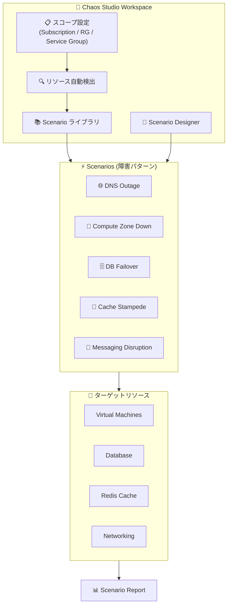

# Azure Chaos Studio: Workspaces and Scenarios (パブリックプレビュー)

**リリース日**: 2026-07-07

**サービス**: Azure Chaos Studio

**機能**: Workspaces and Scenarios

**ステータス**: In preview

[このアップデートのインフォグラフィックを見る](https://takech9203.github.io/azure-news-summary/20260707-chaos-studio-workspaces-scenarios.html)

## 概要

Azure Chaos Studio に Workspaces と Scenarios が新たにパブリックプレビューとして追加された。これはアプリケーション中心のアプローチで、ワークロードが実際の障害時にどのように動作するかを迅速に検証するための新しい方法である。Workspace にアプリケーションのスコープ (サブスクリプション、リソースグループ、またはサービスグループ) を指定すると、Chaos Studio がリソースを自動検出し、そのリソースに対して実行可能な Scenario を提示する。

従来の Experiment (実験) モデルでは、ステップ、ブランチ、アクション、ターゲット、セレクタを個別に定義する必要があり、カオスエンジニアリングの専門知識が求められた。新しい Workspaces と Scenarios は、事前構成されたレジリエンステストテンプレートを提供し、手動でアクションを組み立てる手間を大幅に削減する。DNS 障害、ゾーンダウン、データベースフェイルオーバー、キャッシュスタンピードなど、実際に発生しうる障害パターンを再現するシナリオがあらかじめ用意されている。

Mark Russinovich (Azure CTO) による関連ブログ記事「Proving application resilience on Azure with Chaos Studio」(2026年7月1日) では、Azure 上のアプリケーションレジリエンスを検証するために Chaos Studio を活用する方法が解説されている。

**アップデート前の課題**

- カオス実験の設計にはステップ、ブランチ、アクション、ターゲット、セレクタを個別に構成する専門知識が必要だった
- 障害パターンの再現には、個々のフォールト (障害) を手動で組み合わせる必要があった
- 対象リソースのオンボーディングやターゲット設定を手動で行う必要があった
- テスト結果のレポートを別途作成する必要があった

**アップデート後の改善**

- Workspace のスコープを指定するだけでリソースが自動検出される
- 事前構成された Scenario テンプレートにより、設定不要でレジリエンステストを開始できる
- Scenario designer でカスタムシナリオを視覚的に作成可能
- Scenario report により、テスト結果の構造化されたレポートが自動生成される
- Workspace のマネージド ID が自動的にロール割り当てを行い、権限設定が簡素化される

## アーキテクチャ図



Workspace がスコープ内のリソースを自動検出し、適用可能な Scenario テンプレートをライブラリに表示する。Scenario 実行後は構造化されたレポートが自動生成される。

## サービスアップデートの詳細

### 主要機能

1. **Workspace (ワークスペース)**
   - アプリケーションのスコープ (サブスクリプション、リソースグループ、サービスグループ) を定義
   - スコープ内のリソースを自動検出
   - チーム、環境 (本番/検証)、コンプライアンス境界ごとに整理可能
   - マネージド ID による自動ロール割り当て

2. **Scenario (シナリオ)**
   - 実際の障害パターンを再現する事前構成テスト
   - 個々のアクションの組み合わせ、リソース検出、シーケンシングを自動処理
   - 実行後に構造化された Scenario report を生成

3. **Scenario Designer**
   - Azure ポータル上のビジュアルデザイナー
   - テンプレートをベースにアクションやパラメータをカスタマイズ
   - 複数の名前付き構成を保存可能

4. **Chaos Studio AI Plugin (startchaos)**
   - GitHub Copilot CLI のインタラクティブスキルとして動作
   - MCP (Model Context Protocol) サーバーとして自律エージェントから呼び出し可能
   - Azure Monitor メトリクス、ログ、アクティビティログとの相関分析

### 対応 Scenario テンプレート

| Scenario | カテゴリ | 対象リソース |
|----------|---------|-------------|
| DNS Outage | Networking | NSG, Virtual Network |
| Microsoft Entra ID Outage | Networking / Identity | NSG, Virtual Network |
| Compute Zone Down | Zone / Datacenter | VM, VMSS |
| Compute Zone Down + PostgreSQL Failover | Zone + Data | VM, VMSS, PostgreSQL Flexible Server |
| Compute Zone Down + SQL MI Failover | Zone + Data | VM, VMSS, SQL Managed Instance |
| Cache Stampede | Cache / Load | Azure Managed Redis, MySQL, App Service |
| Cache Stampede with Process Crash | Cache / Load | Azure Managed Redis, MySQL, App Service (Windows) |
| Event-Driven Messaging Disruption | Messaging | Service Bus, Event Hubs |

## 技術仕様

| 項目 | 詳細 |
|------|------|
| API バージョン | `2026-05-01-preview` |
| リソースタイプ | `Microsoft.Chaos/workspaces/scenarios` |
| スコープ単位 | サブスクリプション、リソースグループ、サービスグループ |
| アクション ID 形式 | `{publisher}-{service}-{action}/{version}` |
| 期間形式 | ISO 8601 (例: `PT30M`) |
| パラメータ型 | string, number, boolean, array, object |
| マクロ構文 | `%%{parameters.<name>}%%` |
| フォールトタイプ | Service-direct (エージェント不要), Agent-based (VM 内) |

## 設定方法

### Azure Portal

1. Azure ポータルで Chaos Studio を開く
2. **Workspace** を新規作成し、スコープ (サブスクリプション/リソースグループ/サービスグループ) を指定
3. リソースが自動検出され、適用可能な Scenario がライブラリに表示される
4. 実行したい Scenario を選択し、パラメータ (対象ゾーン、期間など) を設定
5. **Run** をクリックして Scenario を実行
6. 実行完了後、Scenario report で結果を確認

### カスタム Scenario の作成 (Scenario Designer)

1. Workspace 内の **Designer** を選択
2. テンプレートを検索・参照し、**Use Template** をクリック
3. キャンバスでアクションと実行順序を確認・編集
4. **Configure scenario** ペインでシナリオ名、構成名、パラメータを設定
5. **Create** をクリックして保存

### Bicep による定義

```bicep
resource customScenario 'Microsoft.Chaos/workspaces/scenarios@2026-05-01-preview' = {
  parent: workspace
  name: 'zone-down-then-db-failover'
  properties: {
    description: 'Shut down a zone, then fail over the database.'
    parameters: [
      {
        name: 'zone'
        type: 'string'
        required: true
        description: 'Availability zone to take down.'
      }
    ]
    actions: [
      {
        name: 'shutdown-zone'
        actionId: 'microsoft-compute-shutdown/1.0'
        duration: 'PT10M'
        parameters: [
          { key: 'zones', value: '%%{parameters.zone}%%' }
        ]
      }
      {
        name: 'db-failover'
        actionId: 'microsoft-azurePostgreSql-failover/1.0'
        duration: 'PT5M'
        runAfter: {
          behavior: 'All'
          items: [
            { type: 'Action', name: 'shutdown-zone', onActionLifecycle: 'Running' }
          ]
        }
      }
    ]
  }
}
```

## メリット

### ビジネス面

- **コンプライアンス対応**: Scenario report が DORA などの運用レジリエンスフレームワークのエビデンスとして使用可能
- **迅速なレジリエンス検証**: 専門知識がなくてもすぐにカオステストを開始できる
- **ステークホルダーコミュニケーション**: 構造化されたレポートによりレトロスペクティブや報告が容易
- **インシデント再現**: 障害発生後に同じパターンを再現し、修正の効果を検証可能

### 技術面

- **自動リソース検出**: スコープ内のリソースを自動的に発見し、適用可能なシナリオを提示
- **アクション組み合わせの自動化**: 複数のフォールトの構成、順序制御、依存関係管理が自動化
- **カスケード障害の再現**: `runAfter` プロパティでアクション間の依存関係を定義し、連鎖障害を再現
- **リソース除外機能**: 重要なリソース (本番DB、ジャンプボックスなど) をシナリオから除外可能
- **AI Plugin との統合**: 会話型インターフェースで Workspace の作成、Scenario 実行、結果分析が可能

## デメリット・制約事項

- パブリックプレビュー段階のため、GA 前に機能変更が発生する可能性がある
- Cache Stampede with Process Crash シナリオは Windows App Service のみサポート (Linux 非対応)
- カスタム Scenario では全ての Action を手動で構成する必要がある (テンプレート外のパターン)
- Agent-based フォールトには VM 内に Chaos Studio エージェントのインストールが必要
- 既存の Experiment (classic) モデルとは別のリソースタイプ (`Microsoft.Chaos/workspaces/scenarios`) で管理

## ユースケース

### ユースケース 1: ゾーン障害への対応検証

**シナリオ**: マルチゾーンデプロイされた E コマースアプリケーションが可用性ゾーンの障害時に正常にフェイルオーバーするかを検証する。

**実装**: Workspace のスコープにアプリケーションのリソースグループを指定し、「Compute Zone Down + PostgreSQL Failover」シナリオを実行。RTO (目標復旧時間) 内にサービスが回復することを確認。

**効果**: 定期的なゲームデーテストにより、本番環境の障害耐性を継続的に検証し、SLA を維持。

### ユースケース 2: CI/CD パイプラインへの組み込み

**シナリオ**: デプロイメントゲートとして Scenario を実行し、レジリエンスのリグレッションを本番到達前に検出する。

**実装**: Bicep で Scenario を定義し、CI/CD パイプラインのステージとして組み込む。デプロイ後に自動的にレジリエンステストを実行。

**効果**: コード変更によるレジリエンス低下を早期に検出し、品質を維持。

### ユースケース 3: キャッシュ障害耐性の検証

**シナリオ**: Redis キャッシュの障害時にバックエンドデータベースが過負荷にならないかを検証する。

**実装**: 「Cache Stampede」シナリオを実行し、Redis フラッシュ + DB リスタート + App Service リスタートを同時に発生させ、リクエスト合体、バックオフ、ロードシェディングのロジックを検証。

**効果**: キャッシュスタンピード問題を事前に発見し、対策を実装。

## 料金

Azure Chaos Studio の課金は、実験アクションの実行時間に基づく。

詳細な料金情報は公式料金ページを参照: [Azure Chaos Studio の料金](https://azure.microsoft.com/pricing/details/chaos-studio/)

## 利用可能リージョン

料金ページで確認できるリージョンには以下が含まれる:

- 米国: Central US, East US, East US 2, North Central US, South Central US, West Central US, West US, West US 2, West US 3
- ヨーロッパ: North Europe, West Europe, UK South, UK West, France Central, France South, Germany West Central, Germany North, Switzerland North, Switzerland West, Sweden Central, Norway East, Italy North, Spain Central, Denmark East, Poland Central, Belgium Central, Austria East
- アジア太平洋: East Asia, Southeast Asia, Japan East, Japan West, Australia East, Australia Southeast, Australia Central, Korea Central, Korea South, Central India, South India, West India, Indonesia Central, Malaysia West, New Zealand North
- その他: Brazil South, Brazil Southeast, Canada Central, Canada East, South Africa North, UAE North, Qatar Central, Mexico Central, Chile Central, Israel Central

詳細は [Azure Chaos Studio の利用可能リージョン](https://azure.microsoft.com/pricing/details/chaos-studio/) を参照。

## 関連サービス・機能

- **Azure Monitor**: Scenario 実行中のメトリクスとログを相関分析し、障害の影響を可視化
- **Azure Managed Redis**: Cache Stampede シナリオのターゲットリソース
- **Azure Database for PostgreSQL / SQL Managed Instance**: データベースフェイルオーバーシナリオの対象
- **Azure Service Bus / Event Hubs**: メッセージング障害シナリオの対象
- **Microsoft Entra ID**: 認証障害シナリオのターゲット
- **GitHub Copilot / MCP**: AI Plugin (startchaos) による会話型インターフェースでの操作

## 参考リンク

- [インフォグラフィック](https://takech9203.github.io/azure-news-summary/20260707-chaos-studio-workspaces-scenarios.html)
- [公式アップデート情報](https://azure.microsoft.com/updates?id=567184)
- [Azure Blog: Proving application resilience on Azure with Chaos Studio](https://azure.microsoft.com/en-us/blog/proving-application-resilience-on-azure-with-chaos-studio/)
- [Microsoft Learn: What is Azure Chaos Studio?](https://learn.microsoft.com/azure/chaos-studio/chaos-studio-overview)
- [Microsoft Learn: Scenarios in Azure Chaos Studio](https://learn.microsoft.com/azure/chaos-studio/chaos-studio-scenarios)
- [Microsoft Learn: Permissions and security for Azure Chaos Studio](https://learn.microsoft.com/azure/chaos-studio/chaos-studio-permissions-security)
- [料金ページ](https://azure.microsoft.com/pricing/details/chaos-studio/)
- [Chaos Studio Plugin リポジトリ](https://github.com/microsoft/chaos-studio-plugin)

## まとめ

Azure Chaos Studio の Workspaces と Scenarios は、カオスエンジニアリングのアプローチを大幅に簡素化する重要なアップデートである。従来の Experiment モデルでは専門知識が必要だった障害テストの設計が、Workspace のスコープ指定と事前構成 Scenario の選択だけで開始できるようになった。DNS 障害、ゾーンダウン、データベースフェイルオーバー、キャッシュスタンピード、メッセージング障害など、実環境で発生しうる主要な障害パターンがテンプレートとして提供されている。

Solutions Architect としては、まず検証環境で Workspace を作成し、既存アプリケーションに対して適用可能な Scenario を確認することを推奨する。特に、Scenario report によるコンプライアンスエビデンスの自動生成や、CI/CD パイプラインへの組み込みによる継続的レジリエンス検証は、運用成熟度の向上に直結する機能である。

---

**タグ**: #Azure #ChaosStudio #Resilience #ChaosEngineering #FaultInjection #DisasterRecovery
