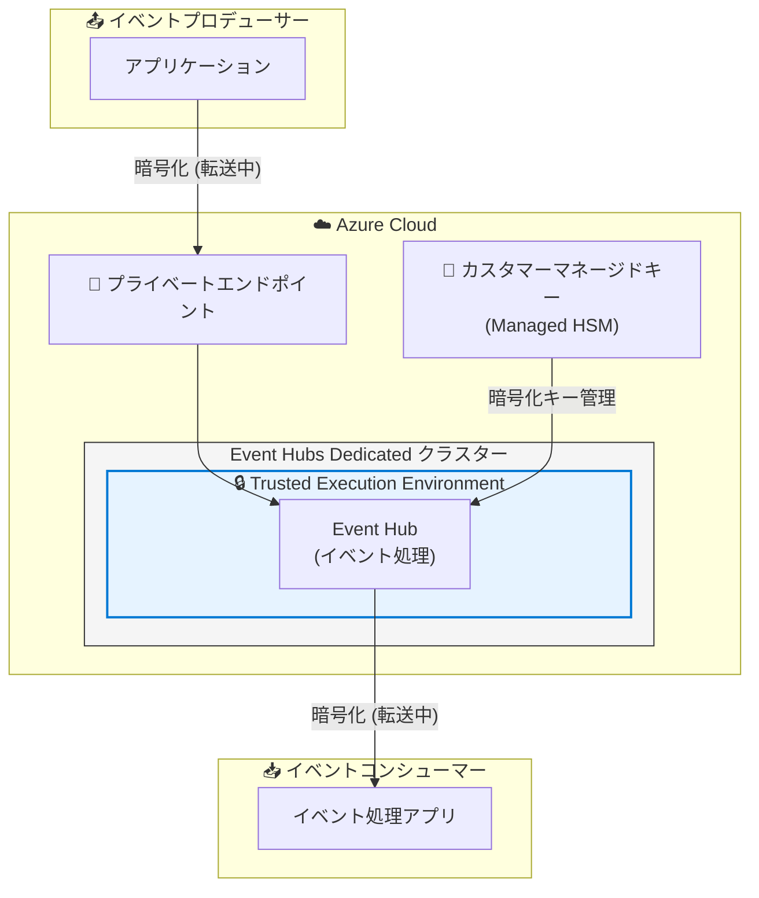

# Azure Event Hubs: Confidential Computing サポート (Dedicated tier)

**リリース日**: 2026-07-07

**サービス**: Azure Event Hubs

**機能**: Confidential Computing support for Azure Event Hubs Dedicated

**ステータス**: Launched (GA)

[このアップデートのインフォグラフィックを見る](https://takech9203.github.io/azure-news-summary/20260707-event-hubs-confidential-computing.html)

## 概要

Azure Event Hubs Dedicated が Confidential Computing をサポートし、一般提供 (GA) となった。この機能により、ハードウェアベースの Trusted Execution Environment (TEE) を活用して、イベントデータがメモリ上で処理されている間も保護できるようになる。

Azure では従来から保存時 (at rest) と転送中 (in transit) のデータ暗号化を提供していたが、今回のアップデートにより「使用中のデータ (data in use)」の保護が Event Hubs に追加された。これにより、クラウドオペレーターを含む非認可のアクターからのアクセスを防止し、ハードウェアレベルでの分離を実現する。

Confidential Computing は namespace レベルで有効化でき、アプリケーションやイベント処理パターンを変更することなく利用できる。既存の Event Hubs セキュリティ機能 (カスタマーマネージドキー、プライベートエンドポイント、マネージド ID) と組み合わせた多層防御が可能となる。

**アップデート前の課題**

- イベントストリーミングデータはメモリ上で処理される際に保護されていなかった
- 機密データや規制対象データを扱う組織は、処理中のデータへの非認可アクセスリスクに対応する追加措置が必要だった
- クラウドオペレーターレベルでのデータアクセスを技術的に防止する手段がなかった

**アップデート後の改善**

- TEE によるハードウェアレベルでのメモリ分離により、処理中のデータが保護される
- コード変更不要で namespace レベルで Confidential Computing を有効化可能
- カスタマーマネージドキー + Managed HSM との組み合わせにより、保存時・転送中・使用中すべてのデータ保護を実現

## アーキテクチャ図



Event Hubs Dedicated クラスター内の TEE がハードウェアレベルでイベントデータを分離し、処理中のデータを保護する。カスタマーマネージドキーとプライベートエンドポイントを組み合わせることで、データライフサイクル全体での保護を実現する。

## サービスアップデートの詳細

### 主要機能

1. **ハードウェアベースの Trusted Execution Environment (TEE)**
   - ハードウェアルート・オブ・トラストを使用し、クラウドプロバイダーが制御しない環境でデータを処理
   - メモリ上のデータへの非認可アクセスや改ざんを防止

2. **コード変更不要の有効化**
   - namespace レベルの設定のみで Confidential Computing を有効化
   - 既存のアプリケーションやイベント処理パターンの変更は不要

3. **既存セキュリティ機能との統合**
   - カスタマーマネージドキー (Azure Key Vault Managed HSM)
   - プライベートエンドポイント
   - マネージド ID

4. **Azure Policy によるガバナンス強化**
   - カスタムポリシー定義により、組織内の全 Dedicated クラスターで Confidential Computing を強制可能
   - Deny / Audit モードに対応

## 技術仕様

| 項目 | 詳細 |
|------|------|
| 対象ティア | Event Hubs Dedicated のみ |
| 有効化タイミング | namespace 作成時のみ (既存 namespace への後付け不可) |
| API バージョン | 2025-05-01-preview |
| プラットフォーム機能プロパティ | `platformCapabilities.confidentialCompute.mode: Enabled` |
| クラスタースケーリング | `supportsScaling: true` に対応 |
| CU (Capacity Unit) あたりのスループット | 100 MB/sec ~ 200 MB/sec (self-serve scalable cluster) |

## 設定方法

### 前提条件

1. Azure Event Hubs Dedicated ティアの利用
2. サポート対象リージョン (Korea Central または UAE North) でのデプロイ
3. カスタマーマネージドキーと組み合わせる場合はユーザー割り当てマネージド ID が必要

### Azure Portal

1. Azure Portal で Event Hubs namespace 作成ページを開く
2. 価格ティアで **Dedicated** を選択
3. ロケーションでサポート対象リージョンを選択
4. **Confidential compute** で **Enabled** を選択
5. 残りの必須フィールドを入力
6. **Review + create** → **Create** でデプロイ

### Bicep テンプレート

```bicep
resource eventHubCluster 'Microsoft.EventHub/clusters@2025-05-01-preview' = {
  name: clusterName
  location: location  // 'koreacentral' or 'uaenorth'
  sku: {
    name: 'Dedicated'
    capacity: capacity
  }
  properties: {
    supportsScaling: true
    platformCapabilities: {
      confidentialCompute: {
        mode: 'Enabled'
      }
    }
  }
}
```

## メリット

### ビジネス面

- 金融、医療、政府機関など規制の厳しい業界のコンプライアンス要件への対応が容易になる
- クラウドオペレーターからのデータアクセスを技術的に防止でき、データ主権の要件を満たせる
- Azure Policy による組織全体でのセキュリティポリシー統一が可能

### 技術面

- アプリケーションコードの変更なしで保護を追加できる
- 保存時 (CMK) + 転送中 (TLS) + 使用中 (TEE) のフルスタック暗号化を実現
- 既存の Event Hubs SDK / Apache Kafka API をそのまま使用可能
- ハードウェアルート・オブ・トラストによる強固なセキュリティ境界

## デメリット・制約事項

- **Dedicated ティア限定**: Standard / Premium ティアでは利用不可 (Dedicated は最もコストが高いティア)
- **作成時のみ有効化可能**: 既存の namespace に後から Confidential Computing を有効化できない (再作成が必要)
- **リージョン制限**: 現時点で Korea Central と UAE North の 2 リージョンのみ対応
- **既存クラスターの移行不可**: レガシークラスターから self-serve scalable クラスターへの自動移行は未サポート

## ユースケース

### ユースケース 1: 金融機関のリアルタイムトランザクション処理

**シナリオ**: 銀行が決済トランザクションデータをリアルタイムで Event Hubs に送信し、不正検知やリスク分析を行う。TEE により、メモリ上のトランザクションデータがクラウドオペレーターからも保護される。

**効果**: 金融規制 (PCI DSS、データ保護規制) への準拠を技術的に証明可能

### ユースケース 2: 医療データのストリーミング分析

**シナリオ**: 医療機関が患者のバイタルデータや電子カルテ情報をストリーミング処理する際、HIPAA 等の規制に対応するため処理中のデータ保護が必要。

**効果**: 患者データの完全な保護を維持しながらリアルタイム分析を実現

### ユースケース 3: 政府機関の機密データイベント処理

**シナリオ**: 政府機関がセンシティブな通信データや監視データをイベントストリームとして処理する。Azure Policy で Confidential Computing を強制し、組織全体でセキュリティ基準を統一する。

**効果**: データ主権要件を満たしつつ、クラウドのスケーラビリティを活用

## 料金

Event Hubs Dedicated ティアの料金に準ずる。Confidential Computing の有効化による追加料金については、公式料金ページを参照。

- Dedicated クラスターは Capacity Unit (CU) 単位で課金
- 最低利用時間: 4 時間
- Self-serve scalable クラスターは 1 ~ 10 CU で構成可能

詳細: [Event Hubs 料金ページ](https://azure.microsoft.com/pricing/details/event-hubs/)

## 利用可能リージョン

| リージョン |
|----------|
| Korea Central |
| UAE North |

## 関連サービス・機能

- **Azure Confidential Computing**: TEE のプラットフォーム基盤。Confidential Computing Consortium (CCC) の定義に基づくハードウェアベースの保護
- **Azure Key Vault Managed HSM**: カスタマーマネージドキーの保管。Confidential Computing と組み合わせて最大限のデータ保護を実現
- **Azure Service Bus (Confidential Computing)**: 同様の TEE ベース保護を提供するメッセージングサービス
- **Azure Private Link**: プライベートエンドポイントによるネットワークレベルの分離
- **Azure Policy**: 組織全体での Confidential Computing 有効化の強制

## 参考リンク

- [インフォグラフィック](https://takech9203.github.io/azure-news-summary/20260707-event-hubs-confidential-computing.html)
- [公式アップデート情報](https://azure.microsoft.com/updates?id=567212)
- [Microsoft Learn - Event Hubs with Confidential Computing](https://learn.microsoft.com/azure/event-hubs/confidential-computing)
- [Microsoft Learn - Azure Confidential Computing Overview](https://learn.microsoft.com/azure/confidential-computing/overview)
- [Microsoft Learn - Event Hubs Dedicated Overview](https://learn.microsoft.com/azure/event-hubs/event-hubs-dedicated-overview)
- [Event Hubs 料金ページ](https://azure.microsoft.com/pricing/details/event-hubs/)

## まとめ

Azure Event Hubs Dedicated における Confidential Computing サポートの GA は、ストリーミングデータの「使用中 (in use)」保護を実現する重要なマイルストーンである。TEE によるハードウェアレベルの分離により、クラウドオペレーターを含む非認可アクセスからイベントデータを保護でき、金融・医療・政府機関など規制の厳しい業界での採用が見込まれる。

ただし、現時点では Dedicated ティア限定かつ 2 リージョンのみの提供であり、コストと地理的な制約が大きい。また、既存 namespace への後付け有効化ができないため、新規デプロイ時に計画的に導入する必要がある。今後のリージョン拡大に注目したい。

---

**タグ**: #Azure #EventHubs #ConfidentialComputing #Security #GA #TEE #Dedicated
