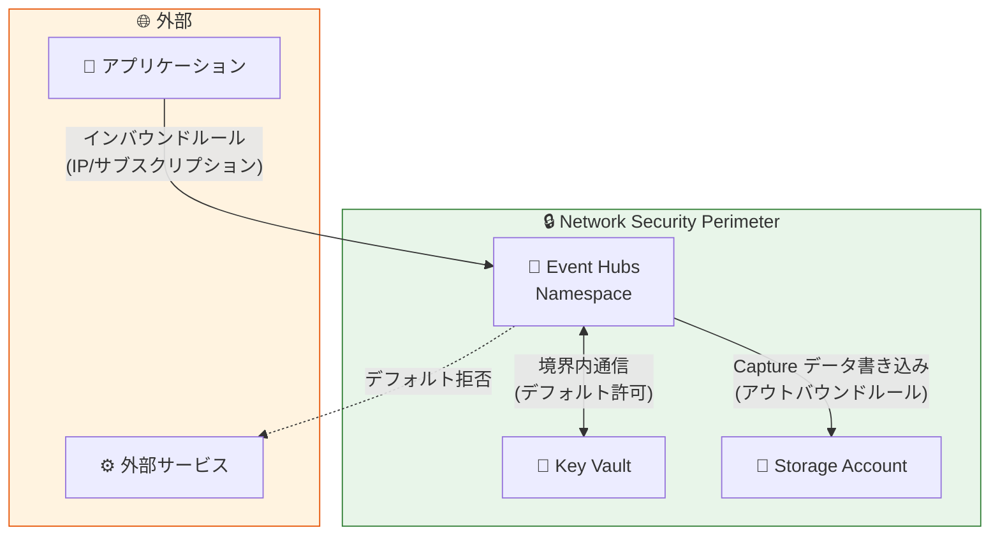

# Azure Event Hubs: Network Security Perimeter サポートの一般提供開始

**リリース日**: 2026-07-07

**サービス**: Azure Event Hubs

**機能**: Network Security Perimeter (NSP) サポート

**ステータス**: Launched (GA)

[このアップデートのインフォグラフィックを見る](https://takech9203.github.io/azure-news-summary/20260707-event-hubs-network-security-perimeter.html)

## 概要

Azure Event Hubs が Network Security Perimeter (NSP) を正式にサポートし、一般提供 (GA) が開始されました。Network Security Perimeter は、仮想ネットワークの外部にデプロイされた PaaS リソースに対して論理的なネットワーク境界を定義し、パブリックネットワークアクセスを境界ベースのアクセスルールで制御できるネットワーク分離機能です。

この機能により、Event Hubs 名前空間を NSP に関連付けることで、境界内の Azure PaaS リソース間のセキュアな通信を実現しながら、外部からの不正アクセスをデフォルトで拒否できます。Azure Private Link サービスの配下で動作し、仮想ネットワーク外にデプロイされた PaaS サービスのセキュアな通信を促進します。

従来、Event Hubs のネットワークセキュリティは個々のサービスファイアウォールやプライベートエンドポイントで管理する必要がありましたが、NSP を使用することで、複数の PaaS リソースにまたがる統一的なネットワークセキュリティポリシーを一元管理できるようになります。

**アップデート前の課題**

- Event Hubs のネットワークアクセス制御は、サービス単位のファイアウォール設定やプライベートエンドポイントに依存しており、複数サービスをまたぐ場合の管理が煩雑だった
- PaaS リソース間の通信において、データの外部流出 (データエクスフィルトレーション) を防ぐための統一的な境界制御が難しかった
- 各サービスのネットワーク設定を個別に管理する必要があり、セキュリティポリシーの一貫性を維持するのが困難だった

**アップデート後の改善**

- NSP により、Event Hubs を含む複数の PaaS リソースを論理的な境界内に配置し、一元的にネットワークアクセスを制御可能に
- 境界内リソース間の通信はデフォルトで許可され、外部アクセスはデフォルトで拒否されるため、データエクスフィルトレーション防止が容易に
- プロファイルベースの管理により、環境 (開発/ステージング/本番) ごとに異なるアクセスルールセットを適用可能に

## アーキテクチャ図

Network Security Perimeter は Event Hubs を含む PaaS リソースを論理的な境界で囲み、境界内の通信を許可しつつ外部アクセスを明示的なルールで制御します。

## サービスアップデートの詳細

### 主要機能

1. **インバウンドアクセスルール**
   - 外部リソース、IP アドレス、サブスクリプションからの Event Hubs 名前空間へのアクセスを制御
   - IP ベースのルールとサブスクリプションベースのルールをサポート

2. **アウトバウンドアクセスルール**
   - Event Hubs 名前空間が通信可能な外部リソースを定義
   - FQDN (完全修飾ドメイン名) ベースのルールをサポート
   - Azure Storage への Capture データ書き込みや Key Vault への BYOK 暗号化アクセスに利用

3. **プロファイルベースの管理**
   - 異なるアクセスルールセットを異なるリソースに適用
   - 環境別 (開発/ステージング/本番) のルール管理が可能

4. **診断ログ**
   - ネットワークアクセス試行の監視
   - セキュリティイベントの監査

## 技術仕様

| 項目 | 詳細 |
|------|------|
| リソースタイプ | Microsoft.EventHub/namespaces |
| アクセスモード | Transition モード (学習) / Enforced モード (強制) |
| インバウンドルールタイプ | サブスクリプションベース、IP ベース |
| アウトバウンドルールタイプ | FQDN ベース |
| NSP あたりのプロファイル上限 | 200 (推奨) |
| プロファイルあたりのルール上限 | インバウンド/アウトバウンド各 200 (ハード制限) |
| サブスクリプションあたりの NSP 数上限 | 100 (推奨) |
| NSP あたりの関連付け PaaS リソース数上限 | 1000 (推奨) |

## 設定方法

### 前提条件

1. 既存の Azure Event Hubs 名前空間
2. Azure サブスクリプション内に既存の Network Security Perimeter (NSP)
3. NSP 内に Event Hubs 名前空間と関連付けるプロファイルが構成済み
4. Event Hubs 名前空間に対する **Contributor** ロール以上の権限
5. NSP に対する **Network Security Perimeter Contributor** ロール以上の権限

### Azure Portal

1. Azure Portal にサインインする
2. 検索ボックスで「Event Hubs」を検索し、対象の名前空間を選択
3. 左メニューの **設定** > **ネットワーク** を選択
4. **パブリックアクセス** タブを選択
5. **Network security perimeter** セクションで **Associate NSP** を選択
6. 関連付けページで以下を設定:
   - **Network security perimeter**: ドロップダウンから対象の NSP を選択 (Event Hubs 名前空間と同じリージョンの NSP のみ表示)
   - **Profile**: NSP 内のプロファイルを選択
7. **Associate** を選択して関連付けを完了
8. 関連付けが完了するまで数分待機
9. Event Hubs 名前空間の **Network security perimeter** セクションに NSP が表示されることを確認

## メリット

### ビジネス面

- **コンプライアンス対応の強化**: 明確なネットワーク境界の定義により、規制要件への適合が容易になる
- **セキュリティガバナンスの一元化**: 複数 PaaS リソースのネットワークポリシーを単一のコンソールから管理可能
- **運用コストの削減**: 個別サービスごとのファイアウォール管理が不要になり、管理オーバーヘッドを軽減

### 技術面

- **データエクスフィルトレーション防止**: 境界外への不正なデータ送出をデフォルトでブロック
- **PaaS 間のセキュア通信**: 同一境界内の Azure サービス間通信を追加設定なしで許可
- **段階的な導入が可能**: Transition モード (学習モード) で既存のアクセスパターンを把握し、Enforced モードへ安全に移行可能
- **プライベートエンドポイントとの共存**: プライベートエンドポイント経由のトラフィックは明示的なアクセスルールなしで許可

## デメリット・制約事項

- **Geo-disaster Recovery との非互換**: Event Hubs の Geo-disaster Recovery 機能は NSP と併用できない
- **SAS 認証の制限**: 境界内通信およびサブスクリプションベースのインバウンドルールでは、Shared Access Signature (SAS) 認証が動作しない。Microsoft Entra ID 認証の使用が必要
- **リージョン制約**: NSP は Event Hubs 名前空間と同じリージョンに存在する必要がある
- **リソース名の長さ制限**: ポータルからの関連付け作成時、リソース名は 44 文字以内に制限される (関連付け名のフォーマット `{resourceName}-{perimeter-guid}` が 80 文字上限のため)
- **サービスエンドポイント非対応**: サービスエンドポイント経由のトラフィックはサポートされていない。IaaS から PaaS への通信にはプライベートエンドポイントの使用が推奨される
- **Microsoft Sentinel との非互換**: NSP が有効なワークスペースでは分析ルールが自動的に無効化される

## ユースケース

### ユースケース 1: Kafka ワークロードのセキュア化

**シナリオ**: Event Hubs の Kafka インターフェースを使用したイベントストリーミング基盤において、NSP によりセキュリティ境界を確立しつつ、Kafka プロトコルでのデータストリーミングを維持する。

**効果**: Kafka ワークロードのセキュリティを強化しながら、既存のアプリケーションコードの変更を最小限に抑えられる。

### ユースケース 2: Event Hubs Capture とストレージの統合

**シナリオ**: Event Hubs Capture でイベントデータを Azure Storage または Azure Data Lake Storage に書き込む構成において、アウトバウンドルールでストレージアカウントへのアクセスを許可し、その他の外部宛先への通信はブロックする。

**効果**: データキャプチャ機能を維持しつつ、意図しない外部へのデータ流出を防止できる。

### ユースケース 3: カスタマーマネージドキー (BYOK) 暗号化

**シナリオ**: Event Hubs の暗号化に Azure Key Vault のカスタマーマネージドキーを使用する場合、Key Vault と Event Hubs を同一 NSP 内に配置し、境界内でのセキュアな通信を実現する。

**効果**: 暗号化キーへのアクセスを境界内に限定し、鍵管理のセキュリティを強化できる。

## 料金

Network Security Perimeter 自体の追加料金に関する公式情報は確認できませんでした。Event Hubs の料金については以下のリンクを参照してください。

- [Azure Event Hubs の料金ページ](https://azure.microsoft.com/pricing/details/event-hubs/)

## 利用可能リージョン

Network Security Perimeter は以下のリージョンで一般提供されています:

- **Azure パブリッククラウド**: すべてのリージョン
- **Azure Government**: US Gov Virginia、US Gov Texas、US Gov Arizona、US DoD East、US DoD Central

なお、Event Hubs の NSP サポートは Azure パブリッククラウドでの一般提供であり、Government クラウドでの提供状況は確認できませんでした。

## 関連サービス・機能

- **Azure Private Link**: NSP は Private Link サービスの配下で動作し、PaaS リソースのネットワーク分離を実現
- **Azure Key Vault**: BYOK 暗号化のために Event Hubs と同一境界内に配置して利用
- **Azure Storage**: Event Hubs Capture のデータ書き込み先として、アウトバウンドルールで通信を許可
- **Azure Service Bus**: 同様に NSP をサポートする関連メッセージングサービス (GA)
- **Azure Monitor**: NSP の診断ログの収集先として利用可能
- **Microsoft Entra ID**: NSP 環境下で完全な機能を利用するために推奨される認証方式

## 参考リンク

- [インフォグラフィック](https://takech9203.github.io/azure-news-summary/20260707-event-hubs-network-security-perimeter.html)
- [公式アップデート情報](https://azure.microsoft.com/updates?id=567203)
- [Microsoft Learn - Network Security Perimeter for Azure Event Hubs](https://learn.microsoft.com/azure/event-hubs/network-security-perimeter)
- [Microsoft Learn - Associate Network Security Perimeter with Event Hubs](https://learn.microsoft.com/azure/event-hubs/associate-network-security-perimeter)
- [Microsoft Learn - Network Security Perimeter の概念](https://learn.microsoft.com/azure/private-link/network-security-perimeter-concepts)
- [料金ページ](https://azure.microsoft.com/pricing/details/event-hubs/)

## まとめ

Azure Event Hubs の Network Security Perimeter サポートが GA となり、PaaS リソースのネットワークセキュリティを境界レベルで統一的に管理できるようになりました。従来の個別ファイアウォール管理からの脱却により、複数サービスにまたがるセキュリティポリシーの一貫性が向上します。

推奨される次のアクションとして、まず Transition モードで NSP を Event Hubs 名前空間に関連付け、既存のアクセスパターンを把握した上で Enforced モードへの移行を計画することを推奨します。また、SAS 認証を使用している環境では Microsoft Entra ID 認証への移行を検討してください。Geo-disaster Recovery を利用中の場合は現時点では NSP との併用ができない点に注意が必要です。

---

**タグ**: #Azure #EventHubs #NetworkSecurityPerimeter #Security #GA #Networking #PaaS
