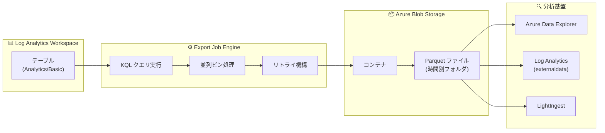

# Azure Monitor: Log Analytics Export Jobs (Public Preview)

**リリース日**: 2026-07-07

**サービス**: Azure Monitor (Log Analytics)

**機能**: Export Jobs による履歴データエクスポート

**ステータス**: Public Preview

[このアップデートのインフォグラフィックを見る](https://takech9203.github.io/azure-news-summary/20260707-log-analytics-export-jobs.html)

## 概要

Azure Monitor の Log Analytics ワークスペースから、過去に蓄積された履歴データを Azure Blob Storage にエクスポートできる新機能「Export Jobs」がパブリックプレビューとして提供開始された。Kusto Query Language (KQL) クエリと時間範囲を指定して、必要なデータのみを Parquet 形式で Azure Blob Storage にオンデマンドでエクスポートできる非同期ジョブ機能である。

Export Jobs は、既存の「Data Export Rules」(新規データを連続的にストリーミングする機能) を補完する位置付けで、既にワークスペースに取り込まれた過去のデータを遡ってエクスポートするギャップを埋める。数百テラバイト規模のデータを並列処理で効率的にエクスポートする設計で、ワークスペースのインジェストやクエリパフォーマンスに影響を与えない独立したコンピュートで実行される。

**アップデート前の課題**

- Log Analytics に蓄積された過去の履歴データを大規模にエクスポートする専用の仕組みがなかった
- 既存の Data Export Rules は新規到着データのみが対象で、過去のデータを遡ってエクスポートできなかった
- REST API や Logic Apps による代替方法ではログクエリの制限に依存し、大規模エクスポートに適していなかった
- PowerShell スクリプトによるローカルマシンへのエクスポートはスケーラビリティに制約があった

**アップデート後の改善**

- KQL クエリと時間範囲を指定して必要なデータのみを選択的にエクスポート可能に
- Parquet 形式で出力され、Azure Data Explorer や各種分析ツールとの連携が容易に
- 数百テラバイト規模のデータを並列処理で効率的にエクスポート可能
- ワークスペースのインジェストやクエリ体験に影響を与えない独立したコンピュートで実行
- 失敗時のリトライ機構により、重複なくデータ完全性を確保

## アーキテクチャ図



Export Job は Log Analytics ワークスペースのテーブルに対して KQL クエリを実行し、並列処理でデータを Parquet 形式で Azure Blob Storage に書き込む。エクスポートされたデータは Azure Data Explorer や Log Analytics の externaldata オペレーターで直接クエリ可能。

## サービスアップデートの詳細

### 主要機能

1. **KQL クエリベースのフィルタリングエクスポート**
   - テーブル全体のエクスポートだけでなく、KQL クエリで特定の条件に合致するレコードのみをエクスポート可能
   - Search Jobs と同じ KQL 構文をサポート

2. **Parquet 形式での出力**
   - 列指向フォーマットにより、分析ワークロードで高い圧縮率とクエリ性能を実現
   - 時間別フォルダにパーティショニングされて保存

3. **大規模データの並列エクスポート**
   - 数百テラバイト規模に対応する並列ビン処理
   - ワークスペースのインジェストやクエリ処理に影響しない独立コンピュート

4. **リトライ機構によるデータ完全性**
   - 一時障害に対するビルトインリトライ
   - 失敗時の手動リトライ (ジョブ完了から 7 日以内、最大 5 回)
   - リトライ時は成功済みデータをスキップし重複を防止

5. **複数ストレージアカウント対応**
   - 1 ジョブあたり最大 10 ストレージアカウントを指定可能
   - ストレージレート制限の分散に有効

## 技術仕様

| 項目 | 詳細 |
|------|------|
| 同時実行ジョブ数 | ワークスペースあたり最大 5 (リトライジョブ含む) |
| ジョブタイムアウト | 7 日間 |
| 時間範囲 | テーブルの保持期間内で最大 1 年間 |
| 手動リトライ回数 | ジョブあたり最大 5 回 (各リトライは前回完了から 7 日以内) |
| 出力形式 | Parquet (JSON は未サポート) |
| 対応テーブルプラン | Analytics、Basic (Auxiliary は非対応) |
| ストレージアカウント数 | ジョブあたり最大 10 |
| 日時フォーマット | `yyyy-MM-ddTHH` (デフォルト) または `year=yyyy/month=MM/day=dd/hour=HH` |
| 認証方式 | ワークスペースのシステム割り当てマネージド ID |
| API バージョン | 2025-06-01-preview |
| API エンドポイント | `https://api.loganalytics.io` / `https://api.loganalytics.azure.com` |

## 設定方法

### 前提条件

1. Log Analytics ワークスペース (Analytics または Basic プランのテーブルが必要)
2. Azure Blob Storage アカウント (エクスポート先)
3. ワークスペースのシステム割り当てマネージド ID を有効化
4. マネージド ID に対しストレージアカウントの「Storage Blob Data Contributor」ロールを付与

### REST API による Export Job の作成

```bash
# Azure CLI を使用した Export Job の作成
subscriptionId="<your-subscription-id>"
resourceGroupName="<your-resource-group>"
workspaceName="<your-workspace>"
apiVersion="2025-06-01-preview"

apiEndpoint="https://api.loganalytics.io"
path="/v2/subscriptions/$subscriptionId/resourcegroups/$resourceGroupName"
provider="Microsoft.OperationalInsights/workspaces/$workspaceName"
url="$apiEndpoint$path/providers/$provider/jobs/export?api-version=$apiVersion"

az rest --method post --url "$url" --body '{
  "startTime": "2026-01-01T00:00:00",
  "endTime": "2026-03-01T00:00:00",
  "query": "CommonSecurityLog",
  "destinationStorageAccounts": [
    "/subscriptions/<sub-id>/resourceGroups/<rg>/providers/Microsoft.Storage/storageAccounts/<storage-name>"
  ],
  "containerName": "export-container",
  "outputDataFormat": "Parquet",
  "dateTimeFormat": "yyyy-MM-ddTHH"
}'
```

### ジョブステータスの確認

```bash
# ジョブIDを指定してステータスを確認
jobId="<returned-operation-id>"
url="$apiEndpoint$path/providers/$provider/jobs/export/$jobId/status?api-version=$apiVersion"

az rest --method get --url "$url"
```

### マネージド ID の設定手順 (Azure Portal)

1. Azure Portal で Log Analytics ワークスペースを開く
2. 左メニューから「Identity」を選択
3. 「System assigned」タブで Status を「On」に設定し保存
4. エクスポート先ストレージアカウントの「Access Control (IAM)」を開く
5. 「Storage Blob Data Contributor」ロールをワークスペースのマネージド ID に割り当て

## メリット

### ビジネス面

- 監査要件や法的保全への対応として、特定期間のログを効率的にエクスポート可能
- サードパーティ SIEM やデータウェアハウスとの統合が容易
- コンプライアンス要件への迅速な対応

### 技術面

- Parquet 形式による高い圧縮率とクエリ性能
- 本番ワークスペースのパフォーマンスに影響しない独立コンピュート
- KQL クエリによる柔軟なフィルタリングで不要データの転送を削減
- Azure Data Explorer との直接連携 (external table)
- 失敗時のリトライ機構によるデータ完全性の保証

## デメリット・制約事項

- 現在はプレビュー段階であり、SLA は提供されない
- Azure Portal での操作はまだ利用不可 (REST API のみ)
- 出力形式は Parquet のみ (JSON は未サポート)
- Azure Private Link およびネットワークセキュリティ境界は未サポート
- Auxiliary プランのテーブルは非対応
- ABAC (Attribute-Based Access Control) 条件が設定されている場合、Export Job が 403 エラーで失敗する
- ワークスペースレプリケーションのフェイルオーバー時にジョブが終了する可能性
- キャンセルしたジョブはリトライ不可

## ユースケース

### ユースケース 1: 法的コンプライアンス・監査対応

**シナリオ**: 監査機関から特定期間のセキュリティログの提出を求められた場合

**実装例**:

```json
{
  "startTime": "2025-07-01T00:00:00",
  "endTime": "2025-12-31T23:59:59",
  "query": "CommonSecurityLog | where DeviceVendor == 'Palo Alto Networks'",
  "destinationStorageAccounts": ["<storage-account-resource-id>"],
  "containerName": "audit-2025-h2",
  "outputDataFormat": "Parquet"
}
```

**効果**: 必要な期間とフィルタ条件のデータのみを効率的にエクスポートし、監査要件に迅速に対応

### ユースケース 2: 機械学習モデルのトレーニングデータ準備

**シナリオ**: 過去のパフォーマンスログを ML モデルの学習データとして利用

**実装例**:

```json
{
  "startTime": "2025-01-01T00:00:00",
  "endTime": "2026-01-01T00:00:00",
  "query": "Perf | where ObjectName == 'Processor'",
  "destinationStorageAccounts": ["<storage-account-resource-id>"],
  "containerName": "ml-training-data",
  "outputDataFormat": "Parquet"
}
```

**効果**: Parquet 形式で直接 ML パイプラインに投入可能なデータを準備

### ユースケース 3: セキュリティインシデント調査

**シナリオ**: セキュリティインシデント発生時に、関連する過去ログをサードパーティ SIEM で詳細分析

**効果**: 対象データのみを選択的にエクスポートし、外部ツールでのフォレンジック分析を効率化

## 料金

Export Jobs は以下の 2 つの Azure Monitor メーターで課金される:

| メーター | 課金対象 |
|----------|----------|
| Search Jobs | ソーステーブルでスキャンされたデータ量 |
| Log Analytics Data Export | エクスポート先ストレージアカウントでのエクスポートデータ量 |

- エクスポート先の Azure Storage アカウントのストレージ費用は別途発生
- Cost Analysis の「Additional info」フィールドで `ExportType:Export job` のタグにより Data Export Rules と区別可能

詳細な料金は [Azure Monitor 料金ページ](https://azure.microsoft.com/pricing/details/monitor/) を参照。

## 関連サービス・機能

- **Log Analytics Data Export Rules**: 新規到着データをリアルタイムにストリーミングエクスポートする継続的な機能。Export Jobs は過去データのオンデマンドエクスポートで補完関係
- **Azure Data Explorer**: エクスポートされた Parquet データを external table として直接クエリ可能
- **Azure Blob Storage**: エクスポート先のストレージサービス。不変ストレージポリシーとの組み合わせでコンプライアンス対応可能
- **Search Jobs**: Export Jobs と同じ KQL 構文をサポート。検索結果を新しいテーブルに保存する機能
- **LightIngest**: Export Job の出力を ADX クラスターにバルクインジェストするツール

## 参考リンク

- [インフォグラフィック](https://takech9203.github.io/azure-news-summary/20260707-log-analytics-export-jobs.html)
- [公式アップデート情報](https://azure.microsoft.com/updates?id=566591)
- [Microsoft Learn - Run an Export Job in Azure Monitor Logs (Preview)](https://learn.microsoft.com/en-us/azure/azure-monitor/logs/export-job)
- [Microsoft Learn - Log Analytics Data Export Rules](https://learn.microsoft.com/en-us/azure/azure-monitor/logs/logs-data-export)
- [Azure Monitor 料金ページ](https://azure.microsoft.com/pricing/details/monitor/)

## まとめ

Log Analytics Export Jobs は、ワークスペースに蓄積された過去の履歴データを KQL クエリで選択的にエクスポートできる待望の機能である。従来の Data Export Rules が新規データのストリーミングに限られていた制約を補完し、監査対応、セキュリティ調査、ML トレーニングデータ準備など、過去データの活用シナリオを大きく広げる。

現時点では REST API のみの操作となるが、Parquet 形式での出力、並列処理による大規模データ対応、リトライ機構によるデータ完全性確保など、エンタープライズ要件を満たす設計となっている。Log Analytics を利用している組織は、データ保持・活用戦略の一環として本機能の検証を推奨する。

---

**タグ**: #Azure #AzureMonitor #LogAnalytics #DataExport #ExportJob #Parquet
