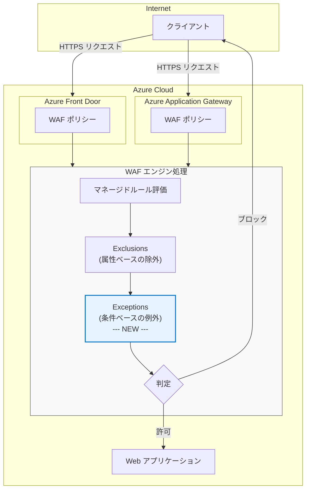

# Azure Web Application Firewall: Exceptions 機能のパブリックプレビュー (Application Gateway / Front Door)

**リリース日**: 2026-07-07

**サービス**: Azure Web Application Firewall (WAF)

**機能**: Exceptions in WAF for Azure Application Gateway and Azure Front Door

**ステータス**: In preview

[このアップデートのインフォグラフィックを見る](https://takech9203.github.io/azure-news-summary/20260707-waf-exceptions-app-gateway-front-door.html)

## 概要

Azure Web Application Firewall (WAF) において、Azure Application Gateway および Azure Front Door 向けの新しい「Exceptions (例外)」機能がパブリックプレビューとして発表された。WAF は Web アプリケーションを一般的な脅威や攻撃から保護するサービスであるが、場合によってはアプリケーションにとって安全で想定されたリクエストをブロックしてしまうことがある。

従来から存在する「Exclusions (除外)」機能は、特定のリクエスト属性を WAF の評価から除外することで誤検知を軽減する仕組みであった。今回新たに導入された「Exceptions (例外)」機能は、既存の Exclusions をさらに発展させ、より精密で条件に基づいた誤検知の制御を可能にするものである。

この新機能により、WAF ポリシーの管理者は、正当なトラフィックがブロックされるケースをより柔軟かつ正確に処理できるようになり、セキュリティ保護レベルを維持しながらアプリケーションの可用性を向上させることが期待される。

**アップデート前の課題**

- 既存の Exclusions 機能では、リクエスト属性 (ヘッダー、Cookie、クエリ文字列、ボディ) 単位での除外のみが可能で、適用範囲の細かい制御に限界があった
- 誤検知を回避するために広範な除外を設定すると、セキュリティ上の隙間が生じるリスクがあった
- 特定のルールに対する除外設定は可能であったが、条件付きの例外処理には対応していなかった

**アップデート後の改善**

- 新しい Exceptions 機能により、既存の Exclusions よりも精密な誤検知の制御が可能に
- Application Gateway と Front Door の両方で統一的に利用可能
- セキュリティ保護の品質を維持しながら、正当なリクエストの許可を柔軟に設定できる

## アーキテクチャ図

WAF エンジン内で、従来の Exclusions (属性ベースの除外) に加え、新しい Exceptions (条件ベースの例外) 機能が追加された構成を示している。両方の仕組みが連携して誤検知を軽減しつつ、セキュリティ保護を維持する。

## サービスアップデートの詳細

### 主要機能

1. **Exceptions (例外) 機能**
   - 既存の Exclusions とは異なる新しい誤検知軽減メカニズム
   - Azure Application Gateway および Azure Front Door の両方で利用可能
   - WAF がブロックする安全で想定されたリクエストに対して、より精密な例外処理を定義可能

2. **既存の Exclusions との共存**
   - Exceptions は既存の Exclusions を置き換えるものではなく、補完する機能
   - Exclusions: 特定のリクエスト属性 (ヘッダー、Cookie、クエリ文字列、ボディ) を WAF 評価から完全に除外
   - Exceptions: より精密な条件に基づいて誤検知を軽減

## 技術仕様

| 項目 | 詳細 |
|------|------|
| 対象サービス | Azure Application Gateway, Azure Front Door |
| ステータス | パブリックプレビュー |
| 既存機能との関係 | Exclusions を補完する新機能 |
| WAF ポリシーバージョン | WAF ポリシーベースの構成で利用 |

## メリット

### ビジネス面

- 誤検知によるサービス中断のリスクを低減し、アプリケーションの可用性を向上
- より精密なセキュリティ制御により、セキュリティとユーザー体験のバランスを最適化
- Application Gateway と Front Door の両方で利用可能なため、統一的な運用が可能

### 技術面

- 既存の Exclusions では対応が難しかった誤検知パターンに対応可能
- WAF ルールの無効化やグローバルな除外設定に頼らず、セキュリティ保護を維持したまま例外処理が可能
- 段階的なチューニングアプローチが可能になり、WAF ポリシーの管理効率が向上

## デメリット・制約事項

- パブリックプレビュー段階のため、本番環境での利用は SLA の対象外となる可能性がある
- プレビュー期間中に仕様が変更される可能性がある
- 既存の Exclusions からの移行パスや Exceptions との使い分けについて、運用設計の検討が必要

## ユースケース

### ユースケース 1: API リクエストの誤検知対応

**シナリオ**: REST API のリクエストボディに SQL ライクな文字列が含まれるケースで、既存の Exclusions では除外範囲が広くなりすぎてしまう場合に、Exceptions を使用してより精密な例外を定義する。

**効果**: セキュリティ保護レベルを維持しながら、正当な API リクエストがブロックされない環境を実現。

### ユースケース 2: 認証トークンの誤検知対応

**シナリオ**: Active Directory などの認証トークンに含まれる特殊文字が WAF ルールにマッチしてしまう場合に、Exceptions を使用して特定の条件下でのみ例外を適用する。

**効果**: 認証フローが中断されることなく、WAF による保護が他のリクエスト部分には引き続き適用される。

## 関連サービス・機能

- **Azure Application Gateway**: リージョナル L7 ロードバランサー。WAF v2 SKU で本機能を利用可能
- **Azure Front Door**: グローバル L7 ロードバランサー。Premium SKU で WAF を利用可能
- **WAF Exclusions (除外)**: 既存の誤検知軽減機能。リクエスト属性を WAF 評価から除外する
- **WAF マネージドルール**: OWASP CRS / DRS に基づくルールセット。Exceptions はこれらのルールとの組み合わせで使用する
- **Azure Monitor / Log Analytics**: WAF ログの分析。誤検知の特定と Exceptions 設定の判断に活用

## 参考リンク

- [インフォグラフィック](https://takech9203.github.io/azure-news-summary/20260707-waf-exceptions-app-gateway-front-door.html)
- [公式アップデート情報](https://azure.microsoft.com/updates?id=567218)
- [WAF Exclusion Lists - Application Gateway (Microsoft Learn)](https://learn.microsoft.com/en-us/azure/web-application-firewall/ag/application-gateway-waf-configuration)
- [WAF Exclusion Lists - Front Door (Microsoft Learn)](https://learn.microsoft.com/en-us/azure/web-application-firewall/afds/waf-front-door-exclusion-configure)
- [Azure WAF 概要 (Microsoft Learn)](https://learn.microsoft.com/en-us/azure/web-application-firewall/overview)

## まとめ

Azure Web Application Firewall (WAF) に新しい Exceptions (例外) 機能がパブリックプレビューとして追加された。この機能は Azure Application Gateway および Azure Front Door の両方で利用可能であり、既存の Exclusions (除外) 機能を補完するものである。

従来の Exclusions はリクエスト属性単位での除外に限られていたが、Exceptions はより精密な条件に基づいた誤検知の制御を可能にする。これにより、WAF のセキュリティ保護レベルを維持しながら、正当なリクエストがブロックされるリスクを効果的に軽減できる。

現在パブリックプレビュー段階であるため、本番環境への適用前にテスト環境での評価が推奨される。既存の Exclusions で対応が困難な誤検知パターンがある場合は、本機能のプレビュー参加を検討されたい。

---

**タグ**: #Azure #WAF #ApplicationGateway #FrontDoor #Security #Networking #WebApplicationFirewall
