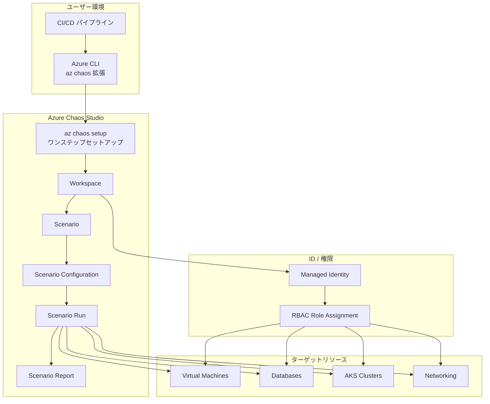

# Azure Chaos Studio: Azure CLI による管理 (パブリックプレビュー)

**リリース日**: 2026-07-09

**サービス**: Azure Chaos Studio

**機能**: Azure CLI (az chaos 拡張) による管理

**ステータス**: In preview

[このアップデートのインフォグラフィックを見る](https://takech9203.github.io/azure-news-summary/20260709-chaos-studio-azure-cli.html)

## 概要

Azure Chaos Studio が Azure CLI からの管理に対応した。新しい `az chaos` 拡張機能を使用することで、REST API の直接呼び出しや JSON ファイルの手動作成が不要になり、コマンドラインから直接レジリエンステストの Workspace 作成、Scenario の構成・実行が可能になる。

この拡張機能の最大の特徴は `az chaos setup` コマンドによるワンステップセットアップである。このコマンド一つで、リソースグループの作成、Workspace のデプロイ、マネージド ID の割り当て、RBAC 権限の付与、リソースの検出、Scenario の推奨評価までを一括で実行できる。従来は複数のステップを手動で行う必要があったが、これが大幅に簡素化された。

Azure CLI 拡張機能は Azure CLI バージョン 2.75.0 以上で利用可能であり、最初の `az chaos` コマンド実行時に自動的にインストールされる。Workspace、Scenario、Scenario Configuration、Scenario Run の管理に加え、リソースの検出やシナリオの検証など、Chaos Studio の主要機能を網羅的にカバーしている。

**アップデート前の課題**
- REST API を直接呼び出す必要があり、JSON ペイロードの構築が煩雑
- 複数の API エンドポイントを順番に呼び出す必要がある
- CI/CD パイプラインへの組み込みが困難
- セットアップ手順が多段階で、手動での権限設定が必要

**アップデート後の改善**
- `az chaos setup` でワンステップのセットアップが可能
- CLI コマンドによる直感的な操作
- スクリプトによる自動化が容易
- CI/CD パイプラインとのネイティブな統合
- RBAC 権限の自動付与機能

## アーキテクチャ図



## サービスアップデートの詳細

### 主要機能

| 機能 | コマンド | ステータス |
|------|---------|-----------|
| ワンステップセットアップ | `az chaos setup` | GA |
| Workspace 管理 | `az chaos workspace` | GA (一部 Preview) |
| Scenario 管理 | `az chaos scenario` | Preview |
| Scenario Configuration | `az chaos scenario config` | Preview |
| Scenario 実行 | `az chaos scenario run` | Preview |
| リソース検出 | `az chaos discovered-resource` | Preview |
| 権限修復 | `az chaos scenario config fix-permissions` | Preview |
| 検証 | `az chaos scenario config validate` | Preview |

### `az chaos setup` が実行する処理

1. リソースグループの作成 (存在しない場合)
2. マネージド ID を持つ Workspace の作成
3. ターゲットスコープへの Reader ロール付与
4. リソース検出と Scenario 推奨の評価
5. 検出された Scenario と次のステップの表示

## 技術仕様

| 項目 | 仕様 |
|------|------|
| 必要な Azure CLI バージョン | 2.75.0 以上 |
| 拡張機能名 | chaos |
| インストール方法 | 初回コマンド実行時に自動 |
| ID サポート | システム割り当て / ユーザー割り当てマネージド ID |
| スコープ対象 | リソースグループ / サブスクリプション / サービスグループ |
| 出力形式 | JSON, JSONC, table, TSV, YAML |

## 設定方法

### 前提条件

- Azure CLI バージョン 2.75.0 以上
- Azure サブスクリプション
- ターゲットリソースに対する適切な権限 (Reader ロール付与のための権限)

### Azure CLI によるセットアップ

```bash
# 基本的なセットアップ (システム割り当てマネージド ID)
az chaos setup \
  --name MyWorkspace \
  --resource-group MyRG \
  --location westus2 \
  --scopes "/subscriptions/<sub-id>/resourceGroups/MyRG"
```

```bash
# ユーザー割り当てマネージド ID を使用する場合
az chaos setup \
  --name MyWorkspace \
  --resource-group MyRG \
  --location westus2 \
  --scopes "/subscriptions/<sub-id>/resourceGroups/MyRG" \
  --user-assigned "/subscriptions/<sub-id>/resourceGroups/MyRG/providers/Microsoft.ManagedIdentity/userAssignedIdentities/MyIdentity"
```

```bash
# 複数のリソースグループをスコープに含める (RBAC は自前で管理)
az chaos setup \
  --name MyWorkspace \
  --resource-group MyRG \
  --location westus2 \
  --scopes "/subscriptions/<sub-id>/resourceGroups/AppRG" \
           "/subscriptions/<sub-id>/resourceGroups/DataRG" \
  --skip-permissions
```

### Scenario の管理

```bash
# Scenario 一覧の取得
az chaos scenario list --workspace-name MyWorkspace --resource-group MyRG

# Scenario Configuration の作成
az chaos scenario config create --workspace-name MyWorkspace --resource-group MyRG ...

# Scenario Configuration の検証
az chaos scenario config validate --workspace-name MyWorkspace --resource-group MyRG ...

# Scenario の実行
az chaos scenario config execute --workspace-name MyWorkspace --resource-group MyRG ...

# 実行状態の確認
az chaos scenario run show --workspace-name MyWorkspace --resource-group MyRG ...

# 実行のキャンセル
az chaos scenario run cancel --workspace-name MyWorkspace --resource-group MyRG ...
```

### CI/CD パイプラインでの使用例

```bash
# CI/CD 向けオプション: 評価の待機をスキップ
az chaos setup \
  --name MyWorkspace \
  --resource-group MyRG \
  --location westus2 \
  --scopes "/subscriptions/<sub-id>/resourceGroups/MyRG" \
  --skip-evaluation-wait
```

## メリット

### ビジネス面

- **運用効率の向上**: CLI による自動化で、レジリエンステストの実施コストが削減される
- **CI/CD 統合**: デプロイメントゲートとしてレジリエンステストを組み込み、本番環境のリスクを低減
- **コンプライアンス対応**: Scenario Report を DORA などの運用レジリエンスフレームワークのエビデンスとして活用可能
- **ゲームデイの簡素化**: スクリプト化された障害試験により、定期的なレジリエンス検証が容易に

### 技術面

- **Infrastructure as Code との親和性**: CLI コマンドを Terraform、Bicep、ARM テンプレートの後続処理として組み込み可能
- **ワンステップセットアップ**: `az chaos setup` で複雑な初期構成を一括処理
- **冪等性**: 既存リソースがある場合は再利用するため、繰り返し実行が安全
- **権限の自動管理**: Reader ロールの自動付与、権限修復コマンドの提供
- **スクリプト可能な出力**: JSON/TSV/YAML 形式の出力で他ツールとの連携が容易

## デメリット・制約事項

- パブリックプレビュー段階であり、GA までにコマンド体系が変更される可能性がある
- `az chaos setup` は GA だが、Scenario 関連コマンドの多くは Preview ステータス
- `--scopes` パラメータが必須であり、デフォルトスコープは存在しない (安全のため意図的な設計)
- Chaos Studio 自体のリージョン制限があり、全リージョンで利用可能ではない
- Azure Resource Graph の伝搬に時間がかかる場合がある (新規 Reader ロール割り当て後)
- クラシックな Experiment モデルの CLI 管理は含まれていない (Workspace/Scenario モデルのみ)

## ユースケース

1. **デプロイメントゲート**: CI/CD パイプラインにレジリエンステストを組み込み、デプロイ前に障害耐性を自動検証
2. **定期的なゲームデイ**: cron ジョブやスケジュールパイプラインで月次・四半期ごとのレジリエンステストを自動実行
3. **マルチ環境管理**: 開発、ステージング、本番の各環境に対して一貫したレジリエンステスト構成をスクリプトで管理
4. **インシデント再現**: 障害発生後に CLI で素早く Scenario を構成し、修正の有効性を検証
5. **コンプライアンスエビデンス収集**: 定期的なテスト実行と結果レポートの自動収集

## 料金

Azure Chaos Studio の詳細な料金情報については、[Azure Chaos Studio の価格ページ](https://azure.microsoft.com/pricing/details/chaos-studio/)を参照のこと。

## 関連サービス・機能

| サービス/機能 | 関連内容 |
|--------------|---------|
| Azure Monitor | Scenario 実行時のメトリクスとログの相関分析 |
| Azure Resource Graph | リソース検出に使用 |
| Azure Managed Identity | Workspace の認証・認可 |
| Azure RBAC | ターゲットリソースへのアクセス制御 |
| Chaos Studio AI Plugin | GitHub Copilot CLI / MCP サーバーとの統合 |
| Azure Kubernetes Service | コンテナ環境でのカオスエンジニアリング対象 |

## 参考リンク

- [インフォグラフィック](https://takech9203.github.io/azure-news-summary/20260709-chaos-studio-azure-cli.html)
- [公式アップデート情報](https://azure.microsoft.com/updates?id=567225)
- [Microsoft Learn - Azure Chaos Studio ドキュメント](https://learn.microsoft.com/azure/chaos-studio/)
- [az chaos CLI リファレンス](https://learn.microsoft.com/cli/azure/chaos)
- [Azure Chaos Studio 概要](https://learn.microsoft.com/azure/chaos-studio/chaos-studio-overview)
- [リージョン別利用可能状況](https://learn.microsoft.com/azure/chaos-studio/chaos-studio-region-availability)

## まとめ

Azure Chaos Studio の Azure CLI 拡張機能 (`az chaos`) のパブリックプレビューにより、レジリエンステストのセットアップと実行がコマンドラインから直接可能になった。最大の利点は `az chaos setup` によるワンステップセットアップであり、Workspace の作成からリソース検出、Scenario 推奨まで一括で完了する。CI/CD パイプラインへの統合が容易になることで、継続的なレジリエンス検証を自動化でき、本番環境の障害耐性を体系的に向上させることが可能になる。現在はパブリックプレビュー段階であるが、`az chaos setup` と Workspace 管理の主要コマンドは GA ステータスとなっており、実運用への導入を検討できる段階にある。

---

**タグ**: #Azure #ChaosStudio #CLI #Resilience #Preview
