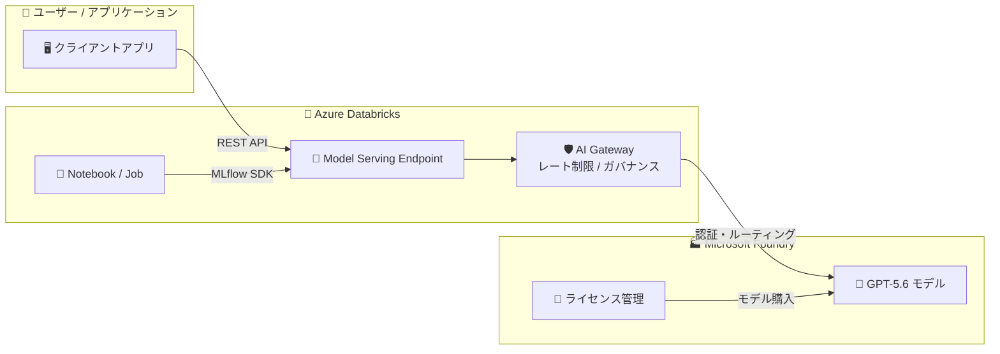

# Azure Databricks: OpenAI GPT-5.6 一般提供開始

**リリース日**: 2026-07-09

**サービス**: Azure Databricks

**機能**: OpenAI GPT-5.6 モデルサービング

**ステータス**: Launched (GA)

[このアップデートのインフォグラフィックを見る](https://takech9203.github.io/azure-news-summary/20260709-databricks-openai-gpt-56.html)

## 概要

OpenAI GPT-5.6 が Azure Databricks 上で一般提供 (GA) として利用可能になった。Microsoft Foundry で購入した GPT-5.6 モデルを、Azure Databricks の Model Serving Endpoint 経由で利用できるようになり、Foundry と Azure Databricks 間のインテグレーションを通じて、AI モデルのセキュアな構築、デプロイ、管理が可能となる。

Azure Databricks の Model Serving は、AI および ML モデルをリアルタイム推論とバッチ推論のためにデプロイするための統一インターフェースを提供するサービスである。今回のアップデートにより、GPT-5.6 が External Models (外部モデル) として Model Serving に統合され、Databricks のワークスペース内から直接 GPT-5.6 の高度な言語処理能力を活用できるようになった。

このインテグレーションにより、データサイエンティストや ML エンジニアは Databricks のエコシステム内で一貫した開発体験を維持しながら、最新の OpenAI モデルを活用したアプリケーションの構築が可能となる。AI Gateway による一元的なガバナンス、レート制限、アクセス制御といった運用面の管理機能も利用可能である。

**アップデート前の課題**

- GPT-5.6 を利用するためには Azure Databricks 外の別サービスで個別にエンドポイントを構築する必要があった
- Foundry で購入したモデルと Databricks のワークロードを連携する際に、認証やネットワーク設定が複雑だった
- 複数の LLM プロバイダーを利用する場合、API キーの管理やアクセス制御が分散していた

**アップデート後の改善**

- Microsoft Foundry で購入した GPT-5.6 を Azure Databricks の Model Serving Endpoint から直接利用可能に
- Foundry と Azure Databricks 間のシームレスなインテグレーションにより、モデルのセキュアな構築・デプロイ・管理が統一された体験で実現
- AI Gateway を通じた一元的なガバナンス (レート制限、使用量追跡、アクセス制御) の適用が可能に

## アーキテクチャ図



Azure Databricks の Model Serving Endpoint が統一的なアクセスポイントとなり、AI Gateway を経由して Microsoft Foundry 上の GPT-5.6 モデルへリクエストをルーティングする構成である。

## サービスアップデートの詳細

### 主要機能

1. **Model Serving Endpoint 経由の GPT-5.6 アクセス**
   - REST API および MLflow Deployments SDK を通じた統一的なインターフェースで GPT-5.6 を呼び出し可能
   - OpenAI 互換の API フォーマットをサポート

2. **Microsoft Foundry との統合**
   - Foundry で購入した GPT-5.6 のライセンスを Azure Databricks 上でそのまま利用可能
   - 認証情報の一元管理により、セキュアなモデルアクセスを実現

3. **AI Gateway によるガバナンス**
   - レート制限の設定 (ユーザー単位、エンドポイント単位)
   - 使用量の追跡とモニタリング
   - ガードレール (入出力フィルタリング) の適用

4. **一元的な資格情報管理**
   - API キーを Azure Databricks Secrets に安全に保存
   - コード内での鍵の露出を防止

## 技術仕様

| 項目 | 詳細 |
|------|------|
| モデル名 | GPT-5.6 |
| プロバイダー | OpenAI (Microsoft Foundry 経由) |
| 対応タスク | llm/v1/chat, llm/v1/completions, llm/v1/embeddings |
| API フォーマット | OpenAI 互換 REST API |
| 認証方式 | Azure Databricks Secrets / Microsoft Entra ID |
| スケーリング | サーバーレスコンピュートによる自動スケーリング |
| 暗号化 | AES-256 (保存時) / TLS 1.2+ (転送時) |
| SLA | 25K+ QPS 対応、オーバーヘッドレイテンシ 50ms 未満 |

## 設定方法

### 前提条件

1. Azure Databricks ワークスペース (サポートされているリージョン)
2. Microsoft Foundry での GPT-5.6 モデル購入
3. Unity Catalog が有効化されていること
4. ワークスペースのエンタイトルメント設定が完了していること
5. MLflow 1.29 以上 (MLflow Deployments SDK を使用する場合)

### Azure Databricks での設定

**Serving UI を使用する方法:**

1. Azure Databricks ワークスペースの左サイドバーから **Serving** タブを選択
2. **Create serving endpoint** をクリック
3. **Name** フィールドにエンドポイント名を入力
4. **Served entities** セクションで **Foundation models** を選択
5. **External model providers** から OpenAI を選択
6. モデル名として `gpt-5.6` を指定
7. タスクを選択 (chat / completion / embeddings)
8. Foundry 経由の認証情報を設定
9. **Create** をクリック

**MLflow Deployments SDK を使用する方法:**

```python
import mlflow.deployments

client = mlflow.deployments.get_deploy_client("databricks")

endpoint = client.create_endpoint(
    name="gpt-56-chat-endpoint",
    config={
        "served_entities": [
            {
                "name": "gpt56_chat",
                "external_model": {
                    "name": "gpt-5.6",
                    "provider": "openai",
                    "task": "llm/v1/chat",
                    "openai_config": {
                        "openai_api_key": "{{secrets/my_scope/foundry_api_key}}"
                    }
                }
            }
        ],
        "rate_limits": [
            {
                "calls": 100,
                "key": "user",
                "renewal_period": "minute"
            }
        ]
    }
)
```

**エンドポイントへのクエリ例:**

```python
from openai import OpenAI

client = OpenAI(
    api_key="<databricks-personal-access-token>",
    base_url="https://<workspace-url>/serving-endpoints"
)

response = client.chat.completions.create(
    model="gpt-56-chat-endpoint",
    messages=[
        {"role": "user", "content": "Azure Databricks の特徴を教えてください"}
    ]
)
print(response.choices[0].message.content)
```

## メリット

### ビジネス面

- **統一されたモデル管理**: 複数の LLM プロバイダーのモデルを Databricks 内で一元管理し、運用コストを削減
- **ガバナンスの強化**: AI Gateway を通じたアクセス制御とレート制限により、組織全体でのモデル利用を適切に管理
- **開発速度の向上**: 既存の Databricks ワークフローに GPT-5.6 をシームレスに統合可能

### 技術面

- **統一 API インターフェース**: OpenAI 互換 REST API により、既存コードの最小限の変更で GPT-5.6 に移行可能
- **自動スケーリング**: サーバーレスコンピュートにより負荷に応じた自動スケールが実現
- **セキュリティ**: 資格情報の暗号化管理、データの暗号化 (AES-256 / TLS 1.2+)
- **高可用性**: 25K QPS 以上の処理能力、50ms 未満のオーバーヘッドレイテンシ

## デメリット・制約事項

- External model エンドポイントの `served_entities` リストにはオブジェクトを 1 つのみ設定可能
- External model を含むエンドポイントの作成後、external model を削除する更新は不可
- Microsoft Foundry で事前にモデルを購入する必要がある
- データがワークスペースのリージョン外で処理される可能性がある (外部モデルの特性)
- Model Serving はリージョンによって利用可否が異なる

## ユースケース

### ユースケース 1: データパイプラインでのバッチ推論

**シナリオ**: 大量のテキストデータに対して GPT-5.6 を使用した要約・分類処理を Databricks Job として定期実行する。

**効果**: Databricks の分散処理基盤と GPT-5.6 の高度な言語理解を組み合わせ、大規模データの効率的な AI 処理を実現。

### ユースケース 2: RAG アプリケーションの構築

**シナリオ**: Unity Catalog で管理されたエンタープライズデータと GPT-5.6 を組み合わせ、Retrieval-Augmented Generation アプリケーションを構築する。

**効果**: 社内データに基づく正確な回答を生成する AI アシスタントを、Databricks のセキュリティ境界内で安全に運用可能。

### ユースケース 3: マルチモデル評価と AB テスト

**シナリオ**: GPT-5.6 と他の LLM モデルを同一の Model Serving 基盤上で並行稼働させ、品質・コスト・レイテンシを比較する。

**効果**: AI Gateway のトラフィック制御機能を活用し、最適なモデル選択のためのデータ駆動型意思決定が可能。

## 料金

Azure Databricks Model Serving の料金は DBU (Databricks Units) ベースの課金となる。

| GPU インスタンスサイズ | GPU 構成 | DBU/時間 |
|------|------|------|
| Small | T4 相当 | 10.48 |
| Medium | A10G x 1 GPU 相当 | 20.00 |
| Medium 4X | A10G x 4 GPU 相当 | 112.00 |
| Medium 8X | A10G x 8 GPU 相当 | 290.80 |
| Large 8X 40GB | A100 40GB x 8 GPU 相当 | 538.40 |
| Large 8X 80GB | A100 80GB x 8 GPU 相当 | 628.00 |

- 14 日間の無料トライアルが利用可能
- コミットメント利用割引あり (Databricks 営業に問い合わせ)
- GPT-5.6 を External Model として利用する場合、Model Serving の DBU 料金に加えて Microsoft Foundry でのモデル購入費用が別途必要

詳細: [Databricks Model Serving 料金ページ](https://www.databricks.com/product/pricing/model-serving)

## 関連サービス・機能

- **Microsoft Foundry**: GPT-5.6 モデルの購入・ライセンス管理プラットフォーム
- **Azure Databricks AI Gateway**: モデルエンドポイントのガバナンス、モニタリング、レート制限
- **Unity Catalog**: データとモデルの統合ガバナンス
- **MLflow**: モデルのライフサイクル管理、デプロイメント SDK
- **Azure Databricks AI Functions**: SQL からモデルを直接呼び出すためのインターフェース
- **Azure Databricks AI Playground**: モデルのテスト・プロンプト実験環境

## 参考リンク

- [インフォグラフィック](https://takech9203.github.io/azure-news-summary/20260709-databricks-openai-gpt-56.html)
- [公式アップデート情報](https://azure.microsoft.com/updates?id=567431)
- [Microsoft Learn - Model Serving 概要](https://learn.microsoft.com/azure/databricks/machine-learning/model-serving/)
- [Microsoft Learn - External Models](https://learn.microsoft.com/azure/databricks/machine-learning/foundation-models/external-models/)
- [Microsoft Learn - Foundation Model Endpoints 作成](https://learn.microsoft.com/azure/databricks/machine-learning/model-serving/create-foundation-model-endpoints)
- [Databricks Model Serving 料金](https://www.databricks.com/product/pricing/model-serving)

## まとめ

OpenAI GPT-5.6 が Azure Databricks の Model Serving Endpoint で一般提供開始されたことにより、Microsoft Foundry と Azure Databricks のエコシステムがさらに深く統合された。Solutions Architect として注目すべきポイントは、(1) Foundry で購入した GPT-5.6 を Databricks 内からシームレスに利用できるようになった点、(2) AI Gateway による一元的なガバナンスとモニタリングが適用可能な点、(3) 既存の Databricks ワークフロー (Notebook、Job、SQL) に最小限の変更で統合できる点である。既に Azure Databricks を利用している組織にとっては、GPT-5.6 の活用を開始するためのハードルが大幅に下がるアップデートと言える。

---

**タグ**: #Azure #Databricks #OpenAI #GPT56 #AI #GA
