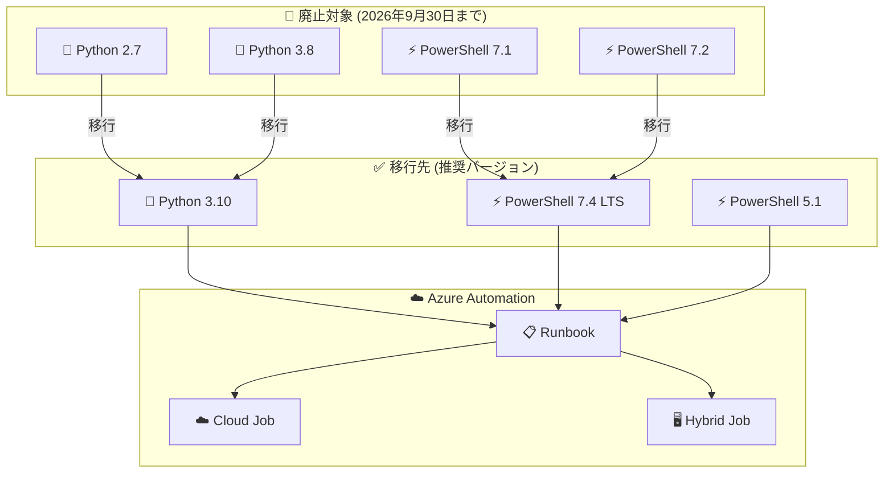

# Azure Automation: Python 2.7/3.8 および PowerShell 7.1/7.2 ランタイムの廃止

**リリース日**: 2026-07-10

**サービス**: Azure Automation

**機能**: Python 2.7/3.8 および PowerShell 7.1/7.2 ランタイムサポートの廃止

**ステータス**: Retirement

[このアップデートのインフォグラフィックを見る](https://takech9203.github.io/azure-news-summary/20260710-automation-python-powershell-retirement.html)

## 概要

2026 年 9 月 30 日をもって、Azure Automation における Python 2.7、Python 3.8、PowerShell 7.1、PowerShell 7.2 のランタイムサポートが廃止される。2026 年 10 月 1 日以降、これらのバージョンを使用する Runbook は引き続き実行可能だが、セキュリティアップデート、バグ修正、その他の改善は提供されなくなる。

これらのランタイムバージョンは、親プロダクトである Python および PowerShell において既にサポートが終了しているバージョンであり、Azure Automation としても同様にサポートを終了する形となる。影響を受ける Runbook を運用している場合は、2026 年 9 月 30 日までに推奨バージョンへの移行が必要である。

**現在の状況**

- Python 2.7 および Python 3.8 は親プロダクト Python で既にサポート終了済み
- PowerShell 7.1 および 7.2 は親プロダクト PowerShell で既にサポート終了済み
- これらのバージョンで動作する Runbook がセキュリティリスクを抱えている

**廃止後の変更**

- 2026 年 10 月 1 日以降、セキュリティパッチ、バグ修正、機能改善が提供されなくなる
- Runbook 自体は実行可能だが、サポートされない状態となる
- PowerShell は 7.4 (長期サポート版)、Python は 3.10 への移行が推奨される

## アーキテクチャ図



廃止対象のランタイムバージョンから推奨バージョンへの移行パスを示す。PowerShell 5.1 は引き続きサポートされる。

## サービスアップデートの詳細

### 主要機能

1. **ランタイム廃止スケジュール**
   - 廃止日: 2026 年 9 月 30 日
   - 対象: Python 2.7、Python 3.8、PowerShell 7.1、PowerShell 7.2
   - 廃止後も Runbook の実行は可能だが、サポートなし

2. **推奨移行先**
   - Python Runbook: Python 3.10 へアップグレード
   - PowerShell Runbook: PowerShell 7.4 (長期サポート版) へアップグレード
   - PowerShell 5.1 は引き続きサポート対象

3. **移行時の注意点**
   - PowerShell 7.x ではワークフロー (Workflow) がサポートされない
   - ソース管理統合は PowerShell 7.4 をサポートしていない
   - Python 2.7 から 3.10 への移行は構文変更を伴う大幅な改修が必要

## 技術仕様

| 項目 | 詳細 |
|------|------|
| 廃止日 | 2026 年 9 月 30 日 |
| 廃止対象 (Python) | Python 2.7、Python 3.8 |
| 廃止対象 (PowerShell) | PowerShell 7.1、PowerShell 7.2 |
| 推奨移行先 (Python) | Python 3.10 |
| 推奨移行先 (PowerShell) | PowerShell 7.4 (LTS) |
| 引き続きサポート | PowerShell 5.1 |
| Cloud Job 対応 | PowerShell 7.4 / Python 3.10 共に対応 |
| Hybrid Job 対応 | PowerShell 7.4 / Python 3.10 共に対応 |
| 対応リージョン | 全パブリックリージョン (Brazil Southeast および Gov クラウドを除く) |

## 設定方法

### 前提条件

1. Azure サブスクリプション
2. Azure Automation アカウント
3. 現在のランタイムバージョンの確認

### Azure CLI

```bash
# Automation アカウント内の Runbook 一覧を取得
az automation runbook list \
  --resource-group <リソースグループ名> \
  --automation-account-name <Automationアカウント名> \
  --output table

# 特定の Runbook の詳細情報を確認 (ランタイムバージョン含む)
az automation runbook show \
  --resource-group <リソースグループ名> \
  --automation-account-name <Automationアカウント名> \
  --name <Runbook名> \
  --query "{name:name, runbookType:runbookType, state:state}" \
  --output table

# PowerShell 7.4 ランタイム環境を作成
az automation runtime-environment create \
  --resource-group <リソースグループ名> \
  --automation-account-name <Automationアカウント名> \
  --name "PowerShell-7.4-env" \
  --location <リージョン> \
  --language "PowerShell" \
  --version "7.4"

# Python 3.10 ランタイム環境を作成
az automation runtime-environment create \
  --resource-group <リソースグループ名> \
  --automation-account-name <Automationアカウント名> \
  --name "Python-3.10-env" \
  --location <リージョン> \
  --language "Python" \
  --version "3.10"
```

### Azure Portal

1. Azure Portal で Automation アカウントに移動
2. 「プロセス オートメーション」>「Runbook」を選択
3. 各 Runbook のランタイムバージョンを確認
4. 廃止対象バージョンを使用している Runbook を特定
5. Runbook を編集し、新しいランタイム環境 (PowerShell 7.4 / Python 3.10) を選択
6. テスト実行で動作を確認後、公開

## メリット

### ビジネス面

- サポートされたランタイムへの移行によりセキュリティリスクを低減
- 長期サポート版 (LTS) の採用により安定した運用基盤を確保
- コンプライアンス要件への適合

### 技術面

- Python 3.10 の新しい言語機能 (パターンマッチング、型ヒント改善等) が利用可能
- PowerShell 7.4 の最新機能とパフォーマンス改善の恩恵
- セキュリティパッチの継続的な提供

## デメリット・制約事項

- PowerShell 7.x ではワークフロー (Workflow Runbook) がサポートされない。ワークフローを使用している場合は PowerShell 5.1 への移行、またはワークフローを使用しない形への書き換えが必要
- ソース管理統合は現時点で PowerShell 7.4 をサポートしていない
- Python 2.7 から Python 3.10 への移行は print 文の構文変更、文字列処理の変更、ライブラリ互換性など大幅なコード改修が必要
- PowerShell 7.4 / Python 3.10 は Brazil Southeast リージョンおよび Gov クラウドで利用不可
- 移行期間中にテスト環境での十分な検証が必要

## ユースケース

### ユースケース 1: PowerShell Runbook の移行

**シナリオ**: PowerShell 7.2 で動作するリソース管理用 Runbook を PowerShell 7.4 へ移行する

**実装例**:

```bash
# 現在の Runbook のランタイムバージョンを確認
az automation runbook list \
  --resource-group myResourceGroup \
  --automation-account-name myAutomationAccount \
  --query "[?runbookType=='PowerShell72'].{Name:name, Type:runbookType}" \
  --output table

# PowerShell 7.4 ランタイム環境を作成
az automation runtime-environment create \
  --resource-group myResourceGroup \
  --automation-account-name myAutomationAccount \
  --name "PS74-Runtime" \
  --location japaneast \
  --language "PowerShell" \
  --version "7.4"
```

**効果**: セキュリティアップデートの継続的な提供を受けつつ、最新の PowerShell 機能を活用可能

### ユースケース 2: Python Runbook の移行

**シナリオ**: Python 3.8 で動作する監視スクリプトを Python 3.10 へ移行する

**実装例**:

```bash
# Python 3.10 ランタイム環境を作成
az automation runtime-environment create \
  --resource-group myResourceGroup \
  --automation-account-name myAutomationAccount \
  --name "Python310-Runtime" \
  --location japaneast \
  --language "Python" \
  --version "3.10"
```

**効果**: Python 3.10 の新機能 (構造パターンマッチング等) を活用した効率的なスクリプト開発が可能

## 料金

Azure Automation の料金体系は移行前後で変更なし。

| 項目 | 料金 |
|------|------|
| ジョブ実行時間 | サブスクリプションあたり月間 500 分まで無料 |
| 超過分 | 従量課金 |

無料枠: サブスクリプションごとに毎月最初の 500 分のジョブ実行時間が無料

## 利用可能リージョン

PowerShell 7.4 および Python 3.10 は以下のリージョンで利用可能:

- 全パブリックリージョン (Brazil Southeast を除く)
- Gov クラウドは非対応

## 関連サービス・機能

- **Azure Automation**: Runbook の実行基盤。今回の廃止の直接対象
- **Azure Monitor**: Runbook の実行状態の監視に使用
- **Azure Update Manager**: OS パッチ管理で Automation と連携
- **Azure Arc**: ハイブリッド環境での Automation Hybrid Worker の管理

## 参考リンク

- [インフォグラフィック](https://takech9203.github.io/azure-news-summary/20260710-automation-python-powershell-retirement.html)
- [公式アップデート情報](https://azure.microsoft.com/updates?id=567556)
- [Azure Automation Runbook の種類 - Microsoft Learn](https://learn.microsoft.com/azure/automation/automation-runbook-types)
- [Azure Automation の料金](https://azure.microsoft.com/pricing/details/automation/)

## まとめ

Azure Automation で使用されている Python 2.7/3.8 および PowerShell 7.1/7.2 のランタイムサポートが 2026 年 9 月 30 日に廃止される。これらは親プロダクトで既にサポート終了済みのバージョンであり、セキュリティリスクの観点からも速やかな移行が推奨される。

**推奨アクション:**
1. 現在使用中の Runbook のランタイムバージョンを棚卸しする
2. 廃止対象バージョンを使用している Runbook を特定する
3. PowerShell 7.4 (LTS) または Python 3.10 への移行計画を策定する
4. PowerShell ワークフローを使用している場合は代替手段を検討する
5. テスト環境で移行後の動作を検証し、2026 年 9 月 30 日までに本番環境へ適用する

---

**タグ**: #Azure #Automation #Python #PowerShell #Retirement #Migration #Runbook
