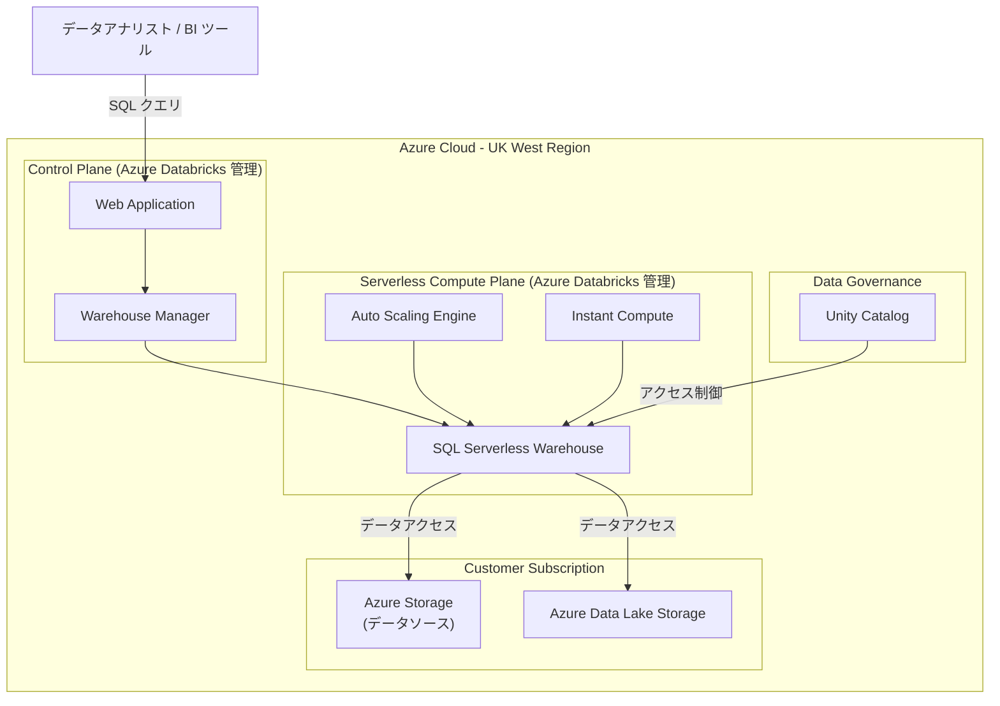

# Azure Databricks: SQL Serverless が UK West リージョンで一般提供開始

**リリース日**: 2026-07-13

**サービス**: Azure Databricks

**機能**: SQL Serverless の UK West リージョン展開

**ステータス**: Launched (GA)

[このアップデートのインフォグラフィックを見る](https://takech9203.github.io/azure-news-summary/20260713-databricks-sql-serverless-uk-west.html)

## 概要

2026 年 7 月 13 日より、Azure Databricks SQL Serverless が UK West (Cardiff, United Kingdom) リージョンで利用可能となった。これにより、UK West リージョンにワークスペースを持つ顧客は、サーバーレス SQL ウェアハウスを使用して分析ワークロードを実行できるようになる。インスタントコンピュート起動、自動スケーリング、インフラストラクチャ管理の軽減といったサーバーレスの利点を英国西部地域で直接活用可能となる。

サーバーレス SQL ウェアハウスでは、コンピュートリソースが Azure Databricks アカウント内のサーバーレスコンピュートプレーンで実行される。Azure Databricks がワークスペースのクラシックコンピュートプレーンと同じ Azure リージョンにサーバーレスコンピュートプレーンを作成するため、データレジデンシー要件を満たしながらマネージドなコンピュート環境を利用できる。

今回の拡張により、UK West リージョンのワークスペースでは、ノートブック、ジョブ、パイプライン、SQL ウェアハウスのすべてにおいてサーバーレスコンピュートが利用可能となる。これまで UK West の顧客はクラシックコンピュートプレーン (顧客サブスクリプション内の VNet) のみを使用していたが、マネージドなサーバーレス環境への移行が可能になる。

**アップデート前の課題**

- UK West リージョンのワークスペースではサーバーレスコンピュートが利用できず、クラシックコンピュートプレーンのみで SQL ウェアハウスを運用する必要があった
- クラシック SQL ウェアハウスはコンピュートの起動に時間がかかり、即座にクエリを実行できない場面があった
- インフラストラクチャの管理 (VNet 設定、クラスターサイズの手動調整等) が必要で、運用負荷が大きかった
- 英国内でのデータレジデンシー要件を満たしつつサーバーレスの利点を得るためには、UK South リージョンにワークスペースを移動する必要があった

**アップデート後の改善**

- UK West リージョンでサーバーレス SQL ウェアハウスが直接利用可能となり、インスタントコンピュート起動でクエリ待ち時間を大幅に削減
- 自動スケーリングにより負荷に応じたリソース割り当てが自動化され、手動管理が不要
- インフラストラクチャの管理が不要となり、データエンジニアやアナリストは分析業務に集中可能
- UK West にデータを保持する必要がある組織がサーバーレスの利点を享受可能

## アーキテクチャ図



サーバーレス SQL ウェアハウスは Azure Databricks が管理するサーバーレスコンピュートプレーン内で実行され、顧客のデータストレージに安全にアクセスする。コンピュートリソースの管理は完全に Azure Databricks 側で行われるため、顧客はインフラストラクチャを意識する必要がない。

## サービスアップデートの詳細

### 主要機能

1. **インスタントコンピュート起動**
   - サーバーレス SQL ウェアハウスは事前にウォームされたコンピュートリソースプールを活用し、ウェアハウス起動時の待ち時間を大幅に短縮する
   - クラシック SQL ウェアハウスと比較して、クエリ実行までの時間が大幅に削減される

2. **自動スケーリング**
   - ワークロードの増減に応じてコンピュートリソースが自動的にスケールアップ/ダウンする
   - アイドル時にはリソースが自動的に縮小され、コスト最適化が図られる

3. **インフラストラクチャ管理の軽減**
   - VNet の構成、クラスターの設定・パッチ適用、ディスク管理などのインフラ運用が不要
   - Azure Databricks がコンピュートプレーンのセキュリティ、更新、可用性を管理

4. **ネットワークセキュリティ**
   - サーバーレス SQL ウェアハウスはパブリック IP アドレスを持たない
   - ワークスペースごとのネットワーク境界で保護され、顧客間のワークロードが分離される
   - コントロールプレーンとサーバーレスコンピュートプレーン間は mTLS で通信

## 技術仕様

| 項目 | 詳細 |
|------|------|
| 対象リージョン | UK West (Cardiff, United Kingdom) |
| 必要プラン | Azure Databricks Premium プラン |
| コンピュートプレーン | サーバーレス (Azure Databricks アカウント内で管理) |
| パブリック IP | なし |
| ネットワーク分離 | ワークスペースごとのネットワーク境界 + mTLS |
| 対応ワークロード | ノートブック、ジョブ、パイプライン、SQL ウェアハウス |
| メタストア | Unity Catalog (外部 Hive メタストアは非対応) |

## 設定方法

### 前提条件

1. Azure Databricks ワークスペースが Premium プランであること
2. ワークスペースが UK West リージョンにデプロイされていること
3. ワークスペースリソースに対する Contributor または Owner 権限を持っていること

### Azure Portal

1. Azure Portal で Azure Databricks ワークスペースを開く
2. Databricks ワークスペースにログインする
3. 左メニューから「SQL Warehouses」を選択
4. 「Create SQL Warehouse」をクリック
5. Warehouse type として「Serverless」を選択
6. ウェアハウス名とサイズを設定して作成を完了する

### Databricks ワークスペース UI

1. ワークスペースの「SQL Warehouses」ページに移動
2. 「Create SQL Warehouse」を選択
3. 「Serverless」タイプを選択 (デフォルトで有効)
4. クラスターサイズ (T-shirt サイズ: 2X-Small から 4X-Large) を選択
5. オートスケーリングの最小/最大クラスター数を設定
6. 「Create」をクリックして完了

## メリット

### ビジネス面

- UK West リージョンでのデータレジデンシー要件を満たしながらサーバーレスの利点を活用可能
- インフラ管理工数の削減により、運用チームの負担が軽減される
- 自動スケーリングとアイドル時の自動停止により、コスト最適化が期待できる
- 英国西部に拠点を持つ組織のデータ主権要件への対応が容易に

### 技術面

- インスタントコンピュート起動により、BI ツールやアドホッククエリの応答性が向上
- パブリック IP を持たないアーキテクチャによりセキュリティが強化
- Unity Catalog との統合による統一的なデータガバナンスの実現
- VNet 管理やクラスター運用からの解放

## デメリット・制約事項

- 外部 Hive レガシーメタストアは非対応 (Unity Catalog の使用が必須)
- クラスターポリシー (スポットインスタンスポリシーを含む) は非対応
- VNet インジェクションは適用不可 (サーバーレスコンピュートプレーンは Azure Databricks 管理下のネットワークで実行)
- 顧客マネージドキー (CMK) によるマネージドディスクの暗号化は非対応
- 顧客構成可能なバックエンド Azure Private Link 接続は使用されない
- Azure Storage ファイアウォールを使用している場合、サーバーレスコンピュートノードからのアクセスを許可するためのネットワークセキュリティ境界 (NSP) の構成が必要

## ユースケース

### ユースケース 1: 英国公共セクターのデータ分析基盤

**シナリオ**: 英国の公共セクター組織が UK West リージョンでのデータレジデンシー要件を遵守しながら、大規模なデータ分析ワークロードをサーバーレスで実行する。

**実装例**:

```sql
-- UK West の Serverless SQL Warehouse でデータ分析クエリを実行
SELECT
    region,
    service_category,
    COUNT(*) as total_transactions,
    SUM(amount) as total_amount
FROM unity_catalog.public_services.transactions
WHERE transaction_date >= '2026-01-01'
GROUP BY region, service_category
ORDER BY total_amount DESC;
```

**効果**: インフラ管理なしで瞬時にクエリを実行可能。営業時間外はウェアハウスが自動停止し、コストを削減。

### ユースケース 2: BI ダッシュボードのバックエンド

**シナリオ**: BI ツール (Power BI、Tableau 等) から接続される SQL ウェアハウスとして、業務時間帯の負荷変動に自動対応する。

**実装例**:

```sql
-- BI ツールから接続される分析用ビュー
CREATE OR REPLACE VIEW analytics.dashboard.daily_metrics AS
SELECT
    date_trunc('day', event_time) as report_date,
    department,
    metric_name,
    AVG(metric_value) as avg_value,
    MAX(metric_value) as max_value
FROM unity_catalog.operations.metrics
GROUP BY 1, 2, 3;
```

**効果**: 朝の業務開始時にダッシュボードアクセスが集中してもインスタントコンピュートと自動スケーリングにより応答性を維持。夜間はゼロにスケールダウンしてコストを抑制。

## 料金

Azure Databricks SQL Serverless の料金は DBU (Databricks Unit) ベースで課金される。サーバーレス SQL ウェアハウスは使用した DBU 量に応じた従量課金制であり、アイドル時にはコンピュートコストが発生しない。

| 項目 | 詳細 |
|------|------|
| 課金モデル | DBU (Databricks Unit) 従量課金 |
| 必要プラン | Premium プラン |
| アイドル時コスト | コンピュートコストなし (自動停止) |

※ 具体的な DBU 単価はリージョンおよび契約形態により異なる。最新の料金は [Azure Databricks 料金ページ](https://azure.microsoft.com/pricing/details/databricks/) を参照のこと。

## 利用可能リージョン

今回のアップデートにより UK West が追加された。Azure Databricks SQL Serverless (サーバーレスコンピュート) が利用可能な主要リージョンは以下の通り:

| リージョン | ロケーション |
|------|------|
| UK West (新規追加) | Cardiff, United Kingdom |
| UK South | London, United Kingdom |
| East US / East US 2 | Virginia, United States |
| West US / West US 2 / West US 3 | United States 西部 |
| North Europe | Ireland |
| West Europe | Netherlands |
| France Central | Paris, France |
| Germany West Central | Frankfurt, Germany |
| Sweden Central | Gavle, Sweden |
| Southeast Asia | Singapore |
| Japan East | Tokyo, Japan |
| Australia East | New South Wales, Australia |
| Canada Central | Toronto, Canada |
| Brazil South | Sao Paulo, Brazil |
| Central India | Pune, India |

※ その他のリージョンについては [Azure Databricks リージョンサポートページ](https://learn.microsoft.com/azure/databricks/resources/supported-regions) を参照。

## 関連サービス・機能

- **Unity Catalog**: サーバーレス SQL ウェアハウスのデータガバナンスとアクセス制御を提供する中央メタストア
- **Azure Data Lake Storage Gen2**: サーバーレス SQL ウェアハウスからアクセスするデータレイクストレージ
- **Delta Lake**: SQL ウェアハウスで分析されるテーブルの基盤フォーマット
- **Power BI**: サーバーレス SQL ウェアハウスに接続して分析ダッシュボードを構築する BI ツール
- **Azure Network Security Perimeter (NSP)**: Storage ファイアウォール環境でサーバーレスコンピュートからのアクセスを許可するための構成

## 参考リンク

- [インフォグラフィック](https://takech9203.github.io/azure-news-summary/20260713-databricks-sql-serverless-uk-west.html)
- [公式アップデート情報](https://azure.microsoft.com/updates?id=567444)
- [Microsoft Learn - サーバーレス SQL ウェアハウスのセットアップ](https://learn.microsoft.com/azure/databricks/admin/sql/serverless)
- [Microsoft Learn - Azure Databricks リージョン](https://learn.microsoft.com/azure/databricks/resources/supported-regions)
- [Microsoft Learn - リージョン別機能対応表](https://learn.microsoft.com/azure/databricks/resources/feature-region-support)
- [料金ページ](https://azure.microsoft.com/pricing/details/databricks/)

## まとめ

Azure Databricks SQL Serverless の UK West リージョン展開は、英国西部でデータレジデンシー要件を持つ組織にとって重要なアップデートである。これにより、UK West のワークスペースでインスタントコンピュート、自動スケーリング、インフラ管理不要といったサーバーレスの利点をフルに活用できるようになる。

推奨される次のアクション:
- UK West リージョンに既存のクラシック SQL ウェアハウスがある場合は、サーバーレスへの移行を検討する
- Azure Storage ファイアウォールを使用している場合は、ネットワークセキュリティ境界 (NSP) の構成を事前に行う
- Unity Catalog への移行が未完了の場合は、サーバーレス SQL ウェアハウス活用に向けて計画を策定する

---

**タグ**: #Azure #Databricks #SQLServerless #UKWest #リージョン拡張 #GA #サーバーレス #Analytics #AI
