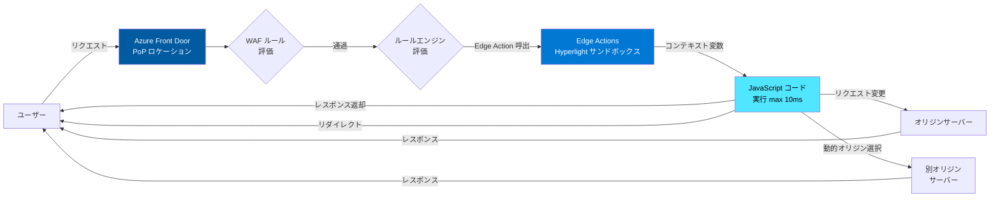

# Azure Front Door: Edge Actions (サーバーレスエッジコンピューティング)

**リリース日**: 2026-07-14

**サービス**: Azure Front Door

**機能**: Edge Actions (エッジアクション)

**ステータス**: In preview (パブリックプレビュー)

[このアップデートのインフォグラフィックを見る](https://takech9203.github.io/azure-news-summary/20260714-front-door-edge-actions.html)

## 概要

Azure Front Door に **Edge Actions (エッジアクション)** がパブリックプレビューとして追加された。Edge Actions は、Microsoft のグローバル Azure Front Door PoP (Point of Presence) ロケーション上で、カスタム JavaScript ロジックを直接実行できるサーバーレスエッジコンピューティング機能である。

この機能により、リクエスト処理中にユーザーに近い場所でリアルタイムの意思決定を実行でき、オリジンサーバーへのラウンドトリップなしに A/B テスト、URL リライト、ヘッダー操作、カスタムルーティングロジックなどのシナリオを実現できる。Hyperlight サンドボックス上でセキュアに実行されるため、安全性を維持しながら超低レイテンシのビジネスロジック実行が可能となる。

デジタルトランスフォーメーションの時代において、セキュアでスケーラブルかつインテリジェントなコンテンツ配信への需要が高まる中、Edge Actions はリクエスト・レスポンスフローの最適化、セキュリティ態勢の強化、オリジン負荷の削減を実現する強力なソリューションとして位置付けられている。

**アップデート前の課題**

- リクエスト処理のカスタマイズにはオリジンサーバーへのラウンドトリップが必要で、レイテンシが増大していた
- A/B テストやカスタムルーティングの実装に別途サーバーサイドロジックやインフラが必要だった
- Azure Front Door のルールエンジンだけでは対応できない複雑な条件分岐やロジックの実装が困難だった
- エッジでの動的な意思決定にはサードパーティの CDN やエッジコンピューティングサービスを利用する必要があった

**アップデート後の改善**

- Azure Front Door の PoP 上で JavaScript ロジックを直接実行し、超低レイテンシのリクエスト処理が可能
- オリジンサーバーへのラウンドトリップなしに A/B テスト、URL リライト、ヘッダー操作が実現可能
- Hyperlight サンドボックスによるセキュアな実行環境で安全性を確保
- バージョン管理と実行フィルターによるゼロダウンタイムのコードデプロイメントが可能

## アーキテクチャ図

この図は、Azure Front Door Edge Actions を使用したリクエスト処理フローを示している。ユーザーのリクエストは PoP に到達した後、WAF ルール評価、ルールエンジン評価を経て Edge Actions が呼び出される。Hyperlight サンドボックス内で JavaScript コードが実行され、レスポンスの直接返却、リクエストの変更・転送、リダイレクト、動的オリジン選択などの処理が行われる。

## サービスアップデートの詳細

### 主要機能

1. **クライアントリクエスト呼出 (Client Request Invocations)**
   - プレビュー期間中はクライアントリクエストの処理のみをサポート。リクエスト到着時に JavaScript ロジックを実行し、リアルタイムの意思決定を行う

2. **Hyperlight サンドボックス実行**
   - 各リクエストに対して Hyperlight サンドボックスが生成され、カスタム JavaScript ランタイム、イミュータブルなコンテキスト変数(サーバー変数、ヘルシーなオリジン一覧、ユーザーの国コード、デバイスタイプ、日時情報)、デフォルトバージョンのコードがロードされる

3. **バージョン管理**
   - Edge Action ごとに最大 3 バージョンのコードを管理可能。デフォルトバージョンの切り替えによるゼロダウンタイムの更新と、問題発生時の即座のロールバックが可能

4. **実行フィルター (Execution Filters)**
   - HTTP ヘッダーに基づいて実行するバージョンを制御可能。カナリアリリース、A/B テスト、ヘッダーベースルーティングによる安全なバージョン移行を実現

5. **診断ログ (Edge Action Logs)**
   - `EdgeActionConsoleLog` テーブルへのログ出力をサポート。`console.log` ステートメントで出力したメッセージが Log Analytics ワークスペースに送信される

## 技術仕様

| 項目 | 詳細 |
|------|------|
| 機能名 | Edge Actions (エッジアクション) |
| 対象サービス | Azure Front Door (Standard / Premium) |
| サポート言語 | JavaScript のみ |
| コードサイズ上限 | 16 KB |
| 実行時間上限 | 10 ms |
| バージョン数上限 | 3 バージョン / Edge Action |
| サブスクリプションあたりの上限 | 100 Edge Action リソース |
| 実行環境 | Hyperlight サンドボックス |
| 呼出タイミング | クライアントリクエスト (プレビュー期間中) |
| ステータス | パブリックプレビュー |

## 対応シナリオ

| シナリオ | 説明 |
|---------|------|
| A/B 実験 | リクエストヘッダーや Cookie に基づくトラフィック分割 |
| ヘッダー操作 | リクエスト/レスポンスヘッダーの追加・変更・削除 |
| リクエスト拒否 | 条件に基づくリクエストのブロック |
| 動的オリジン選択 | リクエスト属性に基づくオリジンサーバーの動的切り替え |
| URL リライト | リクエスト URL の動的書き換え |
| URL リダイレクト | 条件に基づくリダイレクトレスポンスの返却 |
| JWT トークン検証 | JWT トークンの検証とアクセス制御 |

## 設定方法

### 前提条件

1. Azure Front Door Standard または Premium プロファイルが作成済みであること
2. プレビュー期間中は専用ポータルリンク (https://aka.ms/edgeaction/publicpreview) からアクセスする必要がある
3. Edge Action リソースの作成権限を持つ Azure サブスクリプション

### Azure Portal での設定手順

**Edge Action リソースの作成:**

1. プレビューポータル (https://aka.ms/edgeaction/publicpreview) からサインイン
2. 検索ボックスで「Edge Actions」を検索し、選択
3. 「+ Create」を選択
4. 必要な情報 (サブスクリプション、リソースグループ、名前、リージョン) を入力
5. 「Review + create」から作成を実行

**コードバージョンのアップロード:**

1. Edge Action リソースの「Settings」から「Versions」を選択
2. 「+ Add」を選択し、バージョン名を入力
3. JavaScript コードファイルをアップロード
4. 必要に応じて「Set default」を選択しデフォルトバージョンに設定

**Azure Front Door ルートへのアタッチ:**

1. Azure Front Door プロファイルの「Front Door manager」からエンドポイントを選択
2. 対象のルート名を選択
3. 「Attach Edge Actions」リンクを選択
4. 利用可能な Edge Action を選択し「Associate」で確定
5. 「Update」で変更をコミット

### Visual Studio Code 拡張機能

Edge Actions の作成・アタッチは VS Code 拡張機能からも実行可能。

## メリット

### ビジネス面

- オリジンサーバーへのラウンドトリップ削減によるレイテンシの大幅な低減とユーザー体験の向上
- エッジでのリクエスト処理によるオリジンサーバー負荷の軽減とインフラコストの最適化
- A/B テストやパーソナライゼーションの即時実装による開発サイクルの短縮
- サードパーティのエッジコンピューティングサービスへの依存を排除し、Azure エコシステム内で完結

### 技術面

- Hyperlight サンドボックスによるセキュアな隔離環境での実行
- バージョン管理と実行フィルターによるゼロダウンタイムデプロイメント
- Azure Front Door の WAF・ルールエンジンとのシームレスな統合
- コンテキスト変数 (サーバー変数、ヘルシーオリジン一覧、地理情報、デバイスタイプ) を活用した高度なルーティング
- Log Analytics との統合による実行ログの一元管理

## デメリット・制約事項

- パブリックプレビュー段階のため、SLA の対象外であり本番ワークロードへの適用は慎重な判断が必要
- JavaScript のみサポートされており、他の言語 (TypeScript、WebAssembly 等) は利用不可
- コードサイズが 16 KB に制限されており、複雑なロジックの実装には不向き
- 実行時間が 10 ms に制限されており、超過した場合は Edge Action の処理なしでリクエストが転送される
- バージョン数が 3 に制限されており、多数のバージョンを並行管理することは不可能
- サブスクリプションあたり 100 Edge Action リソースの上限あり
- プレビュー期間中はクライアントリクエストの呼出のみサポート (レスポンス処理は未対応)
- Azure Portal から直接アクセスした場合、Edge Action リソースが表示されない場合がある (専用プレビューリンク経由が必要)
- コードアップロードに最大 10 分かかる場合がある (プレビュー期間中)

## ユースケース

### ユースケース 1: A/B テストとカナリアリリース

**シナリオ**: 新しい Web ページデザインを一部のユーザーにのみ表示し、コンバージョン率を比較したい。

**実装例**: Edge Actions で Cookie やヘッダーを確認し、トラフィックの一定割合を新デザインのオリジンに振り分ける。実行フィルターを活用して、特定のヘッダーを持つリクエストのみ新バージョンのコードで処理する。

**効果**: オリジンサーバー側の実装変更なしに、エッジレベルで高速にトラフィック分割を実現。レイテンシの追加なく A/B テストが可能。

### ユースケース 2: 地理ベースのカスタムルーティング

**シナリオ**: ユーザーの接続元国に基づいて、異なるオリジンサーバーやコンテンツを提供したい。

**実装例**: コンテキスト変数に含まれるユーザーの国コードを参照し、動的オリジン選択やURL リライトでリージョン固有のコンテンツを配信する。

**効果**: CDN 設定の変更なしに、エッジロジックのみで地理ベースのルーティングを実現。新規リージョン追加時もコードの更新のみで対応可能。

### ユースケース 3: JWT トークン検証とアクセス制御

**シナリオ**: API リクエストの JWT トークンをエッジで検証し、不正なリクエストをオリジンに到達させたくない。

**実装例**: Edge Actions で JWT トークンのシグネチャと有効期限を検証し、無効なトークンのリクエストを即座に拒否する。

**効果**: オリジンサーバーへの不正リクエストの到達を防ぎ、オリジン負荷の軽減とセキュリティの向上を同時に実現。

## 料金

Edge Actions は以下の 2 要素に基づく従量課金モデルを採用している:

| 課金要素 | 説明 |
|---------|------|
| 呼出回数 | Edge Action が呼び出された回数に基づく課金 |
| 実行時間 | 各呼出で 1 ms を超えた実行時間に基づく課金 |

詳細な料金情報は [Azure Front Door の価格](https://azure.microsoft.com/pricing/details/frontdoor/) を参照。課金メーターと使用量ベースの料金の詳細は [Azure Front Door の課金: Example 7](https://learn.microsoft.com/azure/frontdoor/billing#example-7-edge-actions) で確認可能。

## 利用可能リージョン

Edge Actions は Azure Front Door のグローバル PoP ロケーション上で実行される。Azure Front Door は Microsoft のグローバルエッジネットワーク上で動作するため、世界中の全ての Azure Front Door PoP ロケーションで利用可能。

## 関連サービス・機能

- **Azure Front Door ルールエンジン**: Edge Actions はルールエンジンの「Invoke Edge Action」アクションを通じて呼び出される。ルールエンジンの条件と組み合わせた柔軟な実行制御が可能
- **Azure Front Door WAF**: WAF ルールは Edge Actions よりも先に評価される。セキュリティ層としてWAF で基本的な保護を行った上で Edge Actions でビジネスロジックを実行する構成が推奨
- **Azure CDN**: 従来のキャッシュ・配信機能に加え、Edge Actions によりエッジでのカスタムロジック実行が可能に
- **Azure Functions**: サーバーレスコンピューティングのフルマネージドサービス。Edge Actions はより軽量でレイテンシに敏感なユースケースに適し、Azure Functions はより複雑な処理に適する

## 参考リンク

- [インフォグラフィック](https://takech9203.github.io/azure-news-summary/20260714-front-door-edge-actions.html)
- [公式アップデート情報](https://azure.microsoft.com/updates?id=567402)
- [Microsoft Learn ドキュメント - Edge Actions](https://learn.microsoft.com/azure/frontdoor/edge-actions)
- [Edge Actions サンプルコード (GitHub)](https://github.com/Azure/EdgeActionsSamples)
- [Azure Front Door ルーティングアーキテクチャ](https://learn.microsoft.com/azure/frontdoor/front-door-routing-architecture)
- [Azure Front Door 料金](https://azure.microsoft.com/pricing/details/frontdoor/)

## まとめ

Azure Front Door Edge Actions は、Microsoft のグローバルエッジネットワーク上でカスタム JavaScript ロジックを実行できるサーバーレスエッジコンピューティング機能である。16 KB 以内の JavaScript コードを 10 ms 以内の実行時間で処理し、A/B テスト、URL リライト、ヘッダー操作、JWT 検証、動的オリジン選択などのシナリオを、オリジンサーバーへのラウンドトリップなしに実現する。

Hyperlight サンドボックスによるセキュアな実行環境、最大 3 バージョンのコード管理、実行フィルターによるカナリアリリースなど、本番運用を見据えた機能が備わっている。パブリックプレビュー段階であるため、まずは検証環境で機能を試し、コードサイズ (16 KB) と実行時間 (10 ms) の制約内で実現可能なユースケースを検討した上で導入を計画することを推奨する。

---

**タグ**: #Azure #FrontDoor #EdgeActions #EdgeComputing #Serverless #JavaScript #CDN #Networking #Security #Preview #ABTesting #URLRewrite
