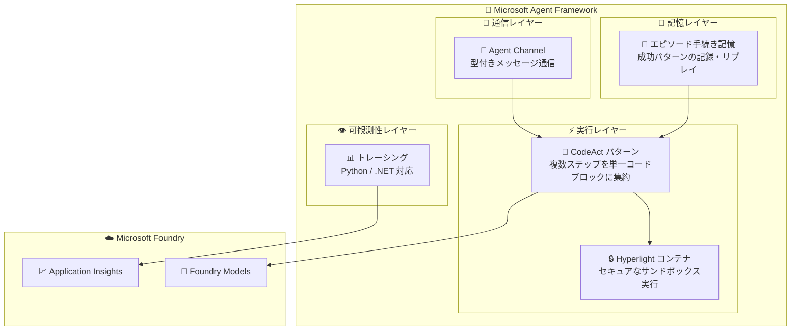

# Microsoft Agent Framework: CodeAct パターン、エピソード記憶、Agent Channel、トレーシング

**リリース日**: 2026-07-15

**サービス**: Microsoft Agent Framework (Microsoft Foundry)

**機能**: CodeAct パターン / Hyperlight コンテナ / エピソード手続き記憶 / Agent Channel / トレーシング (Python & .NET)

**ステータス**: In preview

[このアップデートのインフォグラフィックを見る](https://takech9203.github.io/azure-news-summary/20260715-agent-framework-codeact-memory-channel.html)

## 概要

Microsoft Agent Framework に 4 つのパブリックプレビュー機能が同時に追加された。これらはエージェントの実行効率、学習能力、マルチエージェント連携、可観測性をそれぞれ強化するもので、エージェント実行ライフサイクル全体をカバーする包括的な機能拡張となっている。

**CodeAct パターンと Hyperlight コンテナ** は、従来のツール呼び出しチェーンを単一の実行可能コードブロックに集約することで、エンドツーエンドのレイテンシを大幅に削減する。Hyperlight コンテナはそのコード実行をセキュアなサンドボックス環境で保護する。

**エピソード手続き記憶** は、エージェントが成功したタスクパターンを記憶し、類似のリクエストに対してリプレイできるようにする組み込みストアである。アクションシーケンス、ツール選択、中間結果が記録される。

**Agent Channel** は、エージェント間の構造化メッセージ送信を可能にするプリミティブで、カスタムルーティングコードなしにマルチエージェント通信を実現する。

**トレーシング (Python / .NET)** は、エージェントの推論過程、ツール呼び出し、モデルとのインタラクションを開発者が観測できるようにする機能である。

**アップデート前の課題**

- エージェントが複数ステップの計画を実行する際、ツール呼び出しを 1 つずつチェーンする必要があり、レイテンシが蓄積していた
- エージェントは過去の成功パターンを記憶できず、毎回ゼロから推論を行う必要があった
- マルチエージェントシステムでエージェント間通信を行うには、開発者がルーティングコードを独自に実装する必要があった
- エージェントの推論過程やツール呼び出しの内部動作を観測する標準的な手段が限られていた

**アップデート後の改善**

- CodeAct パターンにより複数ステップの計画を単一コードブロックに集約し、レイテンシを大幅に削減
- エピソード手続き記憶により、成功パターンを学習・リプレイして効率的にタスクを完了
- Agent Channel により、型付きメッセージによるエージェント間通信がフレームワーク標準機能として利用可能
- OpenTelemetry ベースのトレーシングにより、エージェント実行の全過程を可視化

## アーキテクチャ図



この図は、4 つのプレビュー機能がエージェント実行ライフサイクルの異なるレイヤーをカバーし、相互に連携する構成を示している。エピソード記憶が成功パターンを CodeAct に供給し、Agent Channel がマルチエージェント間の協調を可能にし、トレーシングが全体の動作を可視化する。

## サービスアップデートの詳細

### 主要機能

1. **CodeAct パターン**
   - 複数ステップの計画を単一の実行可能コードブロックに集約する実行パターン
   - 従来の「1 ツール呼び出しずつチェーンする」方式に代わるアプローチ
   - 代表的なワークロードにおいてエンドツーエンドのレイテンシを大幅に削減
   - Go 版では未対応 (Python / .NET で利用可能)

2. **Hyperlight コンテナ**
   - CodeAct で生成されたコードをセキュアなサンドボックス環境で実行
   - エージェントが生成するコードの実行リスクを軽減
   - 隔離された環境により、ホストシステムへの影響を防止

3. **エピソード手続き記憶 (Episodic Procedural Memory)**
   - エージェントが成功したタスクパターンを記録する組み込みストア
   - 記録対象: アクションシーケンス、ツール選択、中間結果
   - 類似のリクエストに対して過去の成功パターンをリプレイ
   - フレームワークレベルで統合されており、追加の外部ストレージ設定は不要

4. **Agent Channel (マルチエージェント通信)**
   - エージェント間で構造化メッセージを送信するための組み込みプリミティブ
   - 型付きメッセージをサポート
   - リクエスト/レスポンスパターンとファイア・アンド・フォーゲットパターンの両方に対応
   - カスタムルーティングコードが不要

5. **トレーシング (Python / .NET)**
   - エージェントの推論過程、ツール呼び出し、モデルとのインタラクションを観測
   - OpenTelemetry セマンティック規約に準拠
   - Azure Monitor Application Insights と統合
   - サーバーサイドトレーシング (コード変更不要) とクライアントサイドトレーシングの両方をサポート
   - 過去 90 日分のトレースデータを保持

## 技術仕様

| 項目 | 詳細 |
|------|------|
| フレームワーク | Microsoft Agent Framework (Semantic Kernel + AutoGen の後継) |
| 対応言語 | Python, C# (.NET), Go (一部機能は未対応) |
| CodeAct 対応言語 | Python, .NET |
| トレーシング対応言語 | Python, .NET |
| トレーシング基盤 | OpenTelemetry |
| テレメトリ送信先 | Azure Monitor Application Insights |
| トレースデータ保持期間 | 90 日 |
| Agent Channel メッセージパターン | リクエスト/レスポンス、ファイア・アンド・フォーゲット |
| ホスティング | Microsoft Foundry Agent Service (Hosted Agents) |

## 設定方法

### 前提条件

1. Microsoft Foundry プロジェクト
2. Python 3.x または .NET 環境
3. Azure Monitor Application Insights リソース (トレーシング用)
4. Azure CLI 認証情報 (AzureCliCredential)

### Python でのセットアップ

```bash
# Agent Framework のインストール
pip install agent-framework

# トレーシング用パッケージのインストール
pip install azure-ai-projects azure-identity opentelemetry-sdk azure-core-tracing-opentelemetry
```

### .NET でのセットアップ

```bash
# Agent Framework パッケージの追加
dotnet add package Microsoft.Agents.AI.Foundry --prerelease
```

### トレーシングの有効化 (Azure Portal)

1. Microsoft Foundry ポータルにサインイン
2. Foundry プロジェクトを開く
3. 左ナビゲーションで「Agents」を選択
4. 上部の「Traces」タブを選択
5. 「Connect」を選択し、Application Insights リソースを接続

## メリット

### ビジネス面

- エンドツーエンドのレイテンシ削減により、ユーザー体験が向上
- エピソード記憶による学習効果で、繰り返しタスクの処理コストが低減
- マルチエージェント連携のコーディング工数削減
- 可観測性向上による運用コストの低減とデバッグ時間の短縮

### 技術面

- CodeAct により LLM 呼び出し回数が削減され、トークン消費を最適化
- Hyperlight コンテナによるセキュアなコード実行で、安全性と柔軟性を両立
- Agent Channel の型付きメッセージにより、マルチエージェントシステムの型安全性を確保
- OpenTelemetry 準拠のトレーシングにより、既存の監視インフラとシームレスに統合

## デメリット・制約事項

- パブリックプレビュー段階のため、SLA は提供されない
- Go 言語では CodeAct パターンが未対応
- プレビュー機能のため、GA までに API の変更が発生する可能性がある
- エピソード手続き記憶の容量制限やパフォーマンス特性については詳細未公開

## ユースケース

### ユースケース 1: 複雑なデータ分析タスクの高速化

**シナリオ**: データアナリストが複数のデータソースからの集計・変換・可視化を繰り返し依頼するケース

**効果**: CodeAct パターンにより、従来は複数のツール呼び出しに分割されていた処理が単一コードブロックで実行され、レイテンシが大幅に短縮される。エピソード記憶により、類似の分析パターンが学習され、2 回目以降はさらに高速に処理される。

### ユースケース 2: マルチエージェント連携による業務自動化

**シナリオ**: 調査エージェント、要約エージェント、レポート作成エージェントが連携して業務レポートを自動生成するケース

**効果**: Agent Channel により、各エージェント間で型付きメッセージを介した構造化された通信が可能になり、カスタムルーティングコードなしにマルチエージェントパイプラインを構築できる。トレーシングにより、各エージェントの処理過程を可視化してボトルネックを特定できる。

## 関連サービス・機能

- **Microsoft Foundry Agent Service**: Agent Framework で構築したエージェントのホスティング・スケーリング基盤
- **Azure Monitor Application Insights**: トレーシングデータの保存・分析基盤
- **Microsoft Foundry Models**: エージェントが利用する LLM (GPT-4o, Llama, DeepSeek 等)
- **Agent Framework Workflows**: グラフベースのマルチエージェントオーケストレーション (Agent Channel と補完的に利用)
- **A2A Protocol**: エージェント間通信のための標準プロトコル (Agent Channel の上位レイヤー)

## 参考リンク

- [インフォグラフィック](https://takech9203.github.io/azure-news-summary/20260715-agent-framework-codeact-memory-channel.html)
- [公式アップデート情報 - CodeAct / Hyperlight](https://azure.microsoft.com/updates?id=563566)
- [公式アップデート情報 - エピソード手続き記憶](https://azure.microsoft.com/updates?id=563561)
- [公式アップデート情報 - Agent Channel](https://azure.microsoft.com/updates?id=563556)
- [公式アップデート情報 - トレーシング](https://azure.microsoft.com/updates?id=564071)
- [Microsoft Agent Framework ドキュメント](https://learn.microsoft.com/agent-framework/)
- [Microsoft Agent Framework GitHub リポジトリ](https://github.com/microsoft/agent-framework)
- [Microsoft Foundry Agent Service 概要](https://learn.microsoft.com/azure/foundry/agents/overview)
- [トレーシング設定ガイド](https://learn.microsoft.com/azure/foundry/observability/how-to/trace-agent-setup)

## まとめ

Microsoft Agent Framework に追加された 4 つのパブリックプレビュー機能は、エージェント開発の主要な課題を包括的に解決するものである。CodeAct パターンは実行効率を、エピソード記憶は学習能力を、Agent Channel はマルチエージェント連携を、トレーシングは可観測性をそれぞれ強化する。

Solutions Architect としては、特に CodeAct パターンによるレイテンシ削減効果に注目すべきである。複数ツール呼び出しが必要なワークロードでは、GA 後に大きなパフォーマンス改善が期待できる。また、Agent Channel と Workflows の組み合わせにより、複雑なマルチエージェントシステムの構築が大幅に簡素化される。

プレビュー段階のため本番ワークロードへの適用は推奨されないが、開発・検証環境での早期評価を推奨する。

---

**タグ**: #Microsoft-Agent-Framework #Microsoft-Foundry #AI #CodeAct #Multi-Agent #Preview
