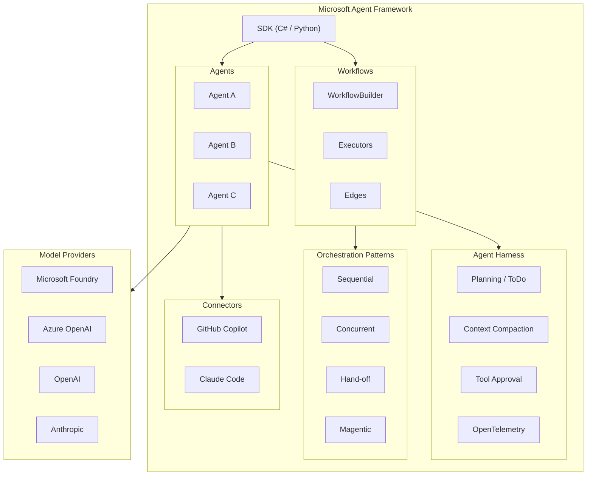

# Microsoft Agent Framework: マルチエージェントオーケストレーション SDK が GA

**リリース日**: 2026-07-15

**サービス**: Microsoft Agent Framework (Microsoft Foundry)

**機能**: マルチエージェントオーケストレーション SDK、Agent Harness、Magentic パターン、GitHub Copilot / Claude Code コネクタ

**ステータス**: Launched (GA)

[このアップデートのインフォグラフィックを見る](https://takech9203.github.io/azure-news-summary/20260715-agent-framework-multi-agent-sdk-ga.html)

## 概要

Microsoft Agent Framework が一般提供 (GA) に到達した。本リリースでは、マルチエージェントオーケストレーション SDK (C# / Python 対応)、Agent Harness (プロダクションランタイム)、Magentic パターンを含むマルチエージェントオーケストレーションパターン、および GitHub Copilot / Claude Code コネクタの 4 つの主要機能が同時に GA となった。

Microsoft Agent Framework は、AutoGen のシンプルなエージェント抽象化と Semantic Kernel のエンタープライズ向け機能 (セッションベースの状態管理、型安全性、ミドルウェア、テレメトリ) を統合し、さらにグラフベースのワークフローによるマルチエージェントオーケストレーションを追加した次世代フレームワークである。AutoGen と Semantic Kernel の両チームが開発を担当しており、両プロジェクトの直接的な後継として位置づけられている。

今回の GA リリースにより、Preview 段階でパイロット運用していたエージェントコードを、後方互換性を維持したままプロダクション環境に移行できるようになった。

**アップデート前の課題**

- マルチエージェントシステムの構築パターンが AutoGen と Semantic Kernel に分散しており、一貫した抽象化が不足していた
- プロダクション向けのエージェントランタイム (コンテキスト管理、ツール承認、オブザーバビリティ) を自前で構築する必要があった
- GitHub Copilot や Claude Code にコーディングタスクを委譲するにはカスタムアダプタコードの作成が必要だった
- マルチエージェントオーケストレーションのベンチマーク実績のあるパターンが限られていた

**アップデート後の改善**

- C# と Python で統一されたマルチエージェントオーケストレーション SDK が利用可能になった
- Agent Harness がプロダクションランタイムとして GA し、プランニング、ToDo 管理、コンテキスト圧縮、ファイルアクセス、ツール自動承認を標準搭載
- Magentic パターンが GAIA ベンチマークで 38% を達成し、AssistantBench や WebArena でも競争力のある結果を示した
- GitHub Copilot と Claude Code のコネクタにより、カスタムアダプタなしでコーディングタスクの委譲が可能になった

## アーキテクチャ図



Microsoft Agent Framework の全体アーキテクチャ。SDK が Agents、Workflows、Harness、Orchestration Patterns、Connectors を統合し、複数のモデルプロバイダーと接続する構成を示している。

## サービスアップデートの詳細

### 1. マルチエージェントオーケストレーション SDK (C# / Python)

AutoGen と Semantic Kernel に分散していたパターンを統合し、C# と Python の両言語で一貫したマルチエージェントシステム構築用の抽象化を提供する。

- **統一された Agent 抽象化**: モデルクライアント、ツール、インストラクションを組み合わせたエージェントを簡潔に定義
- **グラフベースの Workflow**: WorkflowBuilder、Executors、Edges による型安全なメッセージルーティング
- **Functional Workflow API** (Python): `@workflow` / `@step` デコレータによるネイティブ Python 制御フロー
- **複数プロバイダー対応**: Microsoft Foundry、Azure OpenAI、OpenAI、Anthropic、Ollama 等をサポート

### 2. Agent Harness (プロダクションランタイム)

エージェントをプロダクション環境で長時間・自律的に実行するためのランタイム環境。Preview で動作していたエージェントコードをそのままプロダクションに移行可能 (後方互換性あり)。

- **自動ツール呼び出しループ**: 設定可能な反復制限付き
- **コンテキストウィンドウ圧縮**: トークンバジェット対応のコンパクション戦略
- **ToDo プロバイダー**: マルチステップタスクの計画と追跡
- **Plan / Execute モード**: 対話的な計画フェーズと自律的な実行フェーズ
- **ファイルメモリ / ファイルアクセス**: セッション間で永続するメモリとファイル操作
- **ツール自動承認**: "Don't ask again" ルールとヒューリスティックによる安全な無人実行
- **OpenTelemetry 統合**: 生成 AI セマンティック規約に準拠したオブザーバビリティ
- **バックグラウンドエージェント**: サブタスクの並列委譲

### 3. マルチエージェントオーケストレーションパターン (Magentic 含む)

複数のエージェントを協調させるための組み込みパターン群が GA となった。

- **Sequential**: エージェントが順番に処理を引き継ぐ
- **Concurrent**: 複数エージェントが並列に実行
- **Hand-off**: 条件に基づくエージェント間のタスク委譲
- **Magentic**: 動的なマルチエージェントパターン。GAIA ベンチマークで 38%、AssistantBench と WebArena でも競争力のある結果を公表済み

### 4. GitHub Copilot / Claude Code コネクタ

.NET および Python エージェントから GitHub Copilot や Claude Code にコーディングタスクを委譲するための GA コネクタ。

- カスタムアダプタコードの作成が不要
- エージェントが自動的にコーディングタスクを適切なシステムに振り分け可能
- .NET と Python の両方で利用可能

## 技術仕様

| 項目 | 詳細 |
|------|------|
| 対応言語 | C#、Python (Go は Public Preview) |
| パッケージ (C#) | `Microsoft.Agents.AI.Foundry`、`Microsoft.Agents.AI.Harness` |
| パッケージ (Python) | `agent-framework` |
| 対応モデルプロバイダー | Microsoft Foundry、Azure OpenAI、OpenAI、Anthropic、Ollama 等 |
| ワークフロー API | WorkflowBuilder (グラフベース)、Functional Workflow (Python デコレータ) |
| オブザーバビリティ | OpenTelemetry (生成 AI セマンティック規約) |
| プロトコル | A2A Protocol、MCP、AG-UI |
| AutoGen からの移行 | 移行ガイドあり |
| Semantic Kernel からの移行 | 移行ガイドあり |

## 設定方法

### 前提条件

1. C# (.NET) または Python 3.x 開発環境
2. Microsoft Foundry プロジェクト (Foundry モデル利用時)
3. Azure CLI / Azure Identity 資格情報

### Python

```bash
# Agent Framework のインストール
pip install agent-framework
```

```python
from agent_framework import create_harness_agent
from agent_framework.openai import OpenAIChatClient
from azure.identity import AzureCliCredential

# Foundry クライアントの作成
client = FoundryChatClient(
    project_endpoint="https://your-foundry-service.services.ai.azure.com/api/projects/your-project",
    model="gpt-5.4-mini",
    credential=AzureCliCredential(),
)

# Harness Agent の作成
agent = create_harness_agent(
    client=client,
    max_context_window_tokens=128_000,
    max_output_tokens=16_384,
)

# 実行
session = agent.create_session()
response = await agent.run("タスクの説明", session=session)
```

### C#

```bash
dotnet add package Microsoft.Agents.AI.Foundry --prerelease
```

```csharp
using Microsoft.Agents.AI;
using Azure.AI.Projects;
using Azure.Identity;

AIAgent agent = new AIProjectClient(
        new Uri("https://your-foundry-service.services.ai.azure.com/api/projects/your-project"),
        new AzureCliCredential())
    .AsAIAgent(
        model: "gpt-5.4-mini",
        instructions: "You are a helpful assistant.");

// Harness Agent として利用
AIAgent harnessAgent = chatClient.AsHarnessAgent(new HarnessAgentOptions
{
    MaxContextWindowTokens = 128_000,
    MaxOutputTokens = 16_384,
});
```

## メリット

### ビジネス面

- AutoGen / Semantic Kernel の統合により、フレームワーク選択の迷いが解消される
- Preview からプロダクションへの移行が後方互換性によりスムーズに実施可能
- GitHub Copilot / Claude Code コネクタにより、開発生産性向上のための投資を最大活用できる

### 技術面

- 型安全なグラフベースワークフローにより、マルチエージェントの実行パスを明示的に制御可能
- Agent Harness のコンテキスト圧縮により、長時間タスクでもコンテキストウィンドウ超過を防止
- OpenTelemetry 統合により、エージェントの意思決定プロセスをトレース可能
- チェックポイント機能により、長時間実行ワークフローの中断・再開が可能

## デメリット・制約事項

- Go 言語サポートはまだ Public Preview 段階 (宣言型エージェント、RAG、CodeAct、Functional Workflow は未対応)
- AutoGen / Semantic Kernel からの移行にはコード変更が必要 (移行ガイドは提供済み)
- Agent Harness のシェル実行はセキュリティ境界ではなく UX プレフィルター (deny-list) である点に注意が必要
- サードパーティシステム (非 Azure モデル、外部 MCP サーバー等) との連携は利用者の責任下で行う必要がある

## ユースケース

### ユースケース 1: マルチエージェントによるコード生成パイプライン

**シナリオ**: 要件分析、コード生成、コードレビュー、テスト生成を複数のエージェントで分担し、GitHub Copilot / Claude Code コネクタを活用してコーディングタスクを自動化する。

**実装例**:

```python
from agent_framework import Agent, tool, create_harness_agent
from agent_framework.workflows import WorkflowBuilder

# 要件分析エージェント
analyst = Agent(name="analyst", client=client,
    instructions="ユーザー要件を分析し、技術仕様に変換する")

# コード生成エージェント (GitHub Copilot コネクタ使用)
coder = Agent(name="coder", client=client,
    instructions="技術仕様に基づきコードを生成する",
    tools=[github_copilot_connector])

# レビューエージェント
reviewer = Agent(name="reviewer", client=client,
    instructions="コードの品質とセキュリティをレビューする")

# ワークフロー構築
workflow = (WorkflowBuilder()
    .add_executor("analyze", analyst)
    .add_executor("code", coder)
    .add_executor("review", reviewer)
    .add_edge("analyze", "code")
    .add_edge("code", "review")
    .build())
```

**効果**: 人手によるコードレビューの負荷を軽減し、一貫した品質基準でのコード生成パイプラインを実現。

### ユースケース 2: 自律型リサーチエージェント

**シナリオ**: Agent Harness の Plan/Execute モード、ToDo 管理、Web 検索を活用し、複雑なリサーチタスクを自律的に遂行する。

**実装例**:

```python
from agent_framework import create_harness_agent, todos_remaining

agent = create_harness_agent(
    client=client,
    agent_instructions="あなたはリサーチアシスタントです。学術的な情報源を優先してください。",
    loop_should_continue=todos_remaining(),
    loop_max_iterations=10,
    max_context_window_tokens=128_000,
    max_output_tokens=16_384,
)
```

**効果**: 長時間のリサーチタスクを Plan/Execute モードで自律的に実行し、ToDo による進捗管理とコンテキスト圧縮により信頼性の高い調査結果を生成。

## 関連サービス・機能

- **Microsoft Foundry Agent Service**: Agent Framework で構築したエージェントを Hosted Agent としてデプロイ・スケーリングするためのマネージドプラットフォーム
- **Microsoft Foundry Models**: エージェントが利用する LLM を提供するモデルカタログ (GPT-4o、Llama、DeepSeek 等)
- **Azure OpenAI Service**: Azure 上での OpenAI モデルへのアクセスを提供
- **GitHub Copilot**: コーディングタスクの委譲先として連携
- **OpenTelemetry / Application Insights**: エージェントのトレースとモニタリング

## 参考リンク

- [インフォグラフィック](https://takech9203.github.io/azure-news-summary/20260715-agent-framework-multi-agent-sdk-ga.html)
- [公式アップデート情報 - マルチエージェントオーケストレーション SDK](https://azure.microsoft.com/updates?id=564312)
- [公式アップデート情報 - Agent Harness](https://azure.microsoft.com/updates?id=563546)
- [公式アップデート情報 - Magentic パターン](https://azure.microsoft.com/updates?id=563571)
- [公式アップデート情報 - GitHub Copilot / Claude Code コネクタ](https://azure.microsoft.com/updates?id=563701)
- [Microsoft Agent Framework ドキュメント](https://learn.microsoft.com/agent-framework/)
- [Agent Framework Overview](https://learn.microsoft.com/agent-framework/overview/)
- [Agent Harness ドキュメント](https://learn.microsoft.com/agent-framework/agents/harness)
- [Workflows ドキュメント](https://learn.microsoft.com/agent-framework/workflows/)
- [AutoGen からの移行ガイド](https://learn.microsoft.com/agent-framework/migration-guide/from-autogen/)
- [Semantic Kernel からの移行ガイド](https://learn.microsoft.com/agent-framework/migration-guide/from-semantic-kernel/)
- [GitHub リポジトリ](https://github.com/microsoft/agent-framework)

## まとめ

Microsoft Agent Framework の GA リリースは、AutoGen と Semantic Kernel の統合という長期にわたる取り組みの集大成である。C# と Python の両方で統一された抽象化を提供し、Agent Harness によるプロダクション対応のランタイム、ベンチマーク実績のある Magentic パターン、そして GitHub Copilot / Claude Code との直接連携により、エンタープライズ向けのマルチエージェントシステム構築が大幅に簡素化される。

Solutions Architect として推奨される次のアクション:
1. 既存の AutoGen / Semantic Kernel ベースのエージェントについて移行ガイドを確認する
2. Preview で運用中のエージェントについて、Agent Harness GA への移行を計画する
3. GitHub Copilot / Claude Code コネクタを活用した開発支援エージェントのプロトタイプを検討する

---

**タグ**: #Microsoft-Agent-Framework #Microsoft-Foundry #AI #Multi-Agent #GA
