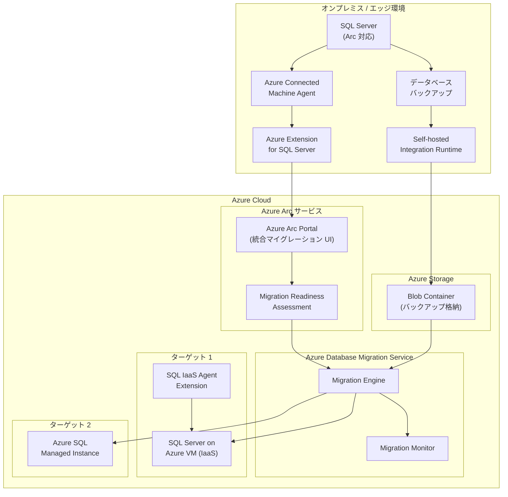

# Azure Arc SQL Server: SQL Server on Azure Virtual Machines へのマイグレーション対応が一般提供開始

**リリース日**: 2026-07-15

**サービス**: Azure Arc-enabled SQL Server / SQL Server on Azure Virtual Machines

**機能**: Azure Arc マイグレーションソリューションの SQL Server on Azure VM ターゲット対応

**ステータス**: Launched (GA)

[このアップデートのインフォグラフィックを見る](https://takech9203.github.io/azure-news-summary/20260715-arc-sql-migration-azure-vm.html)

## 概要

2026 年 7 月 15 日より、Azure Arc マイグレーションソリューションが SQL Server on Azure Virtual Machines をマイグレーションターゲットとしてサポートするようになった。これにより、Azure Arc 対応の SQL Server インスタンスから Azure SQL Managed Instance だけでなく、SQL Server on Azure VM (IaaS) への移行も同一の統合マイグレーションエクスペリエンスで実行可能となる。

従来、Azure Arc 対応 SQL Server からのデータベース移行は Azure SQL Managed Instance が主なターゲットであったが、今回のアップデートにより SQL Server on Azure Virtual Machines も移行先として選択できるようになった。これにより、アプリケーションの互換性要件や OS レベルのカスタマイズが必要なワークロードにおいて、IaaS ベースの SQL Server 環境への移行パスが統合された形で提供される。

移行には Azure Database Migration Service (Azure DMS) が活用され、オンラインおよびオフラインの両方の移行モードがサポートされる。バックアップファイルを SMB ネットワーク共有または Azure Blob Storage に配置し、Azure DMS がこれらを復元する形で移行が実行される。

**アップデート前の課題**

- Azure Arc 対応 SQL Server からの統合マイグレーションエクスペリエンスでは、Azure SQL Managed Instance のみがターゲットとして利用可能であった
- SQL Server on Azure VM への移行には、Azure Data Migration Service を直接構成する必要があり、Arc ポータルからのシームレスな操作ができなかった
- OS レベルのアクセスや SQL Server エージェントジョブなどの完全な互換性を必要とするワークロードの移行に、統一されたワークフローが存在しなかった
- 移行アセスメントと実際の移行実行が別々のツールで行われ、エンドツーエンドの体験が分断されていた

**アップデート後の改善**

- Azure Arc ポータルから SQL Server on Azure VM と Azure SQL Managed Instance の両方をターゲットとして選択し、統一されたマイグレーションウィザードで移行を実行可能
- 移行準備アセスメント (Migration Readiness Assessment) から実際の移行実行までを一貫したワークフローで実施可能
- IaaS 環境が必要なワークロード (SQL Server Agent ジョブ、SSIS パッケージ、OS レベルアクセスなど) に対応した移行パスが提供される
- 同一のマイグレーションエクスペリエンスで複数のターゲットを比較検討し、最適な移行先を選択可能

## アーキテクチャ図



Azure Arc 対応 SQL Server インスタンスは、Azure Connected Machine Agent と Azure Extension for SQL Server を通じて Azure Arc サービスに接続される。統合マイグレーション UI からアセスメントと移行を実行し、Azure DMS がバックアップファイルを利用してターゲット (SQL Server on Azure VM または Azure SQL Managed Instance) にデータベースを復元する。

## サービスアップデートの詳細

### 主要機能

1. **統合マイグレーションエクスペリエンス** - Azure Arc ポータルから SQL Server on Azure VM と Azure SQL Managed Instance の両方をターゲットとして選択し、同一のウィザードで移行を実行できる。移行アセスメントからカットオーバーまで一貫したワークフローを提供。

2. **オンライン/オフライン移行モードのサポート** - オフラインモードではダウンタイムを許容した一括移行が可能。オンラインモードではトランザクションログの継続的な復元により最小限のダウンタイムで移行を完了できる。

3. **Migration Readiness Assessment との統合** - Arc 対応 SQL Server で自動的に実行される移行準備アセスメントの結果に基づき、最適なターゲット (SQL VM vs SQL MI) の推奨と SKU サイズの提案を受けられる。

4. **Self-hosted Integration Runtime による安全なデータ転送** - オンプレミスのネットワーク共有にあるバックアップファイルを安全に Azure Storage にアップロードし、ターゲット環境に復元するアーキテクチャを提供。

5. **TDE / Always Encrypted 対応** - Transparent Data Encryption (TDE) で保護されたデータベースの移行にも対応。Always Encrypted キーは自動的にターゲットに移行される。

## 技術仕様

| 項目 | 詳細 |
|------|------|
| 対応ソース SQL Server バージョン | SQL Server 2012 以降 (64-bit のみ) |
| 対応ターゲット | SQL Server on Azure VM、Azure SQL Managed Instance |
| 移行モード | オンライン (最小ダウンタイム)、オフライン |
| バックアップ格納先 | SMB ネットワーク共有、Azure Blob Storage |
| 最大同時移行データベース数 | 同一ターゲット VM に対して 100 データベース |
| Self-hosted Integration Runtime | ネットワーク共有利用時に必要 (Azure Storage 利用時は不要) |
| 必要な権限 (ソース) | sysadmin ロールまたは CONTROL SERVER 権限 |
| 必要なリソースプロバイダー | Microsoft.DataMigration |
| SQL IaaS Agent Extension モード | Full モード (ターゲット VM) |
| 対応 OS (ソース) | Windows Server 2012 以降、Linux (Ubuntu 20.04、RHEL 8、SLES 15) |
| TDE データベース対応 | 対応 (証明書の事前移行が必要) |
| Always Encrypted 対応 | 対応 (キーの自動移行) |

## 設定方法

### 前提条件

1. ソース SQL Server に Azure Connected Machine Agent と Azure Extension for SQL Server がインストールされていること
2. Azure サブスクリプションで Microsoft.DataMigration リソースプロバイダーが登録されていること
3. ターゲット SQL Server on Azure VM が作成済みで、SQL IaaS Agent Extension が Full モードで有効化されていること
4. Contributor ロール (ターゲット VM およびストレージアカウント) が付与されていること
5. ソース SQL Server のログインが sysadmin ロールまたは CONTROL SERVER 権限を持っていること
6. バックアップファイルが SMB ネットワーク共有または Azure Blob Storage に格納されていること

### Azure Portal での移行手順

1. Azure Portal で Azure Arc 対応 SQL Server のリソースページを開く
2. 左メニューから「Migration」を選択
3. 「New migration」をクリックし、マイグレーションウィザードを起動
4. ソース詳細 (SQL Server インスタンス情報) を入力
5. ターゲットとして「SQL Server on Azure Virtual Machines」を選択
6. サブスクリプション、リソースグループ、ターゲット VM を指定
7. データソース構成 (バックアップファイルの場所) を設定
   - Azure Blob Storage の場合: ストレージアカウント、コンテナー、フォルダーを指定
   - ネットワーク共有の場合: Self-hosted Integration Runtime をセットアップし、共有パスと資格情報を入力
8. 移行サマリーを確認し「Start migration」を実行
9. 移行の進行状況をモニタリングし、完了後にカットオーバーを実施

### Azure CLI

```bash
# リソースプロバイダーの登録
az provider register --namespace Microsoft.DataMigration

# Database Migration Service の作成
az dms create \
  --resource-group <resource-group> \
  --name <dms-name> \
  --location <location>

# 移行の開始 (Azure Portal のウィザードを推奨)
# 詳細な CLI コマンドは Microsoft Learn ドキュメントを参照
```

## メリット

### ビジネス面

- 移行先の選択肢が拡大し、ワークロード要件に応じた最適なターゲットを選択可能
- 統一されたマイグレーションエクスペリエンスにより、移行プロジェクトの計画・実行が効率化される
- SQL Server on Azure VM は従来の SQL Server ライセンスの持ち込み (Azure Hybrid Benefit) に対応し、コスト最適化が可能
- 移行アセスメントから実行までの一貫したワークフローにより、プロジェクトのリスクと工数を削減

### 技術面

- OS レベルのアクセスが必要なワークロード (SQL Server Agent ジョブ、SSIS、カスタム設定) の移行パスが統合される
- オンラインモードにより最小ダウンタイムでの移行が実現可能
- Self-hosted Integration Runtime によりオンプレミスのバックアップを安全に Azure に転送
- Arc ポータルから移行の進行状況をリアルタイムでモニタリング可能
- TDE や Always Encrypted など暗号化されたデータベースにも対応

## デメリット・制約事項

- 移行機能は Windows OS 上の SQL Server のみ対応 (Linux 上の SQL Server では Database migration 機能は利用不可)
- SQL Server Agent ジョブ、資格情報、SSIS パッケージ、サーバー監査などのサーバーオブジェクトは自動移行されない (手動での再構成が必要)
- ターゲット SQL Server on Azure VM で SQL Server 2008 以前のバージョンは非サポート
- 同一ターゲット VM への移行は最大 100 データベースまで。100 データベース移行完了後、次の移行開始まで 30 分の待機が必要
- 複数のバックアップ (フルバックアップとトランザクションログ) を単一のバックアップメディアに追記する形式は非サポート
- SQL Server 2012/2014 をターゲットとする場合、バックアップはページ BLOB として Azure Storage に格納する必要がある (ブロック BLOB は SQL Server 2016 以降のみ対応)
- 高可用性/災害復旧構成のターゲットへの自動構成は非サポート
- Azure Arc 対応 SQL Server 自体が Azure Virtual Machines 上の SQL Server では非サポート (オンプレミスまたは他クラウドのみ)

## ユースケース

### ユースケース 1: レガシー SQL Server のリフト & シフト移行

**シナリオ**: オンプレミスの SQL Server 2016 で稼働する基幹業務アプリケーションを、OS レベルのカスタマイズや SQL Server Agent ジョブへの依存があるため、SQL Server on Azure VM に移行する。

**実装手順**:
1. Azure Arc でソース SQL Server を登録し、Migration Readiness Assessment を実行
2. アセスメント結果で SQL VM が推奨されていることを確認
3. Azure Portal で SQL Server on Azure VM (同一バージョンまたは上位バージョン) を作成
4. 統合マイグレーションウィザードでオンラインモードを選択し、移行を開始
5. トランザクションログの継続的復元により、カットオーバー時のダウンタイムを最小化
6. SQL Server Agent ジョブや SSIS パッケージを手動で再構成

**効果**: Arc ポータルからの統一されたワークフローにより、アセスメントから移行完了までをシームレスに実行。最小ダウンタイムでの移行により業務影響を最小化。

### ユースケース 2: ハイブリッド環境からの段階的クラウド移行

**シナリオ**: 複数のオンプレミス SQL Server インスタンスを持つ企業が、ワークロード特性に応じて SQL Server on Azure VM と Azure SQL Managed Instance に振り分けて移行する。

**実装手順**:
1. 全てのオンプレミス SQL Server を Azure Arc に登録
2. Migration Readiness Assessment の結果を一覧で確認し、各データベースの推奨ターゲットを把握
3. OS 依存が低いデータベースは Azure SQL Managed Instance へ移行
4. OS レベルのアクセスが必要なデータベースは SQL Server on Azure VM へ移行
5. 同一のマイグレーションウィザードから各ターゲットへの移行を実行

**効果**: 統一されたマイグレーションエクスペリエンスにより、複数ターゲットへの移行を効率的に管理。アセスメントに基づく最適なターゲット選定でコストとパフォーマンスを最適化。

## 料金

Azure Arc マイグレーション機能自体の利用に追加料金は発生しない。ただし、以下のリソースについては各サービスの料金が適用される:

| 項目 | 料金体系 |
|------|------|
| Azure Arc 対応 SQL Server (接続・登録) | 無料 |
| Migration Readiness Assessment | 無料 |
| Azure Database Migration Service | 無料 (Standard tier) |
| Azure Storage (バックアップ格納) | ストレージ使用量に応じた従量課金 |
| SQL Server on Azure VM (ターゲット) | VM サイズ + SQL Server ライセンス (PAYG または BYOL) |
| Self-hosted Integration Runtime | 無料 (実行するマシンのコストは別途) |

## 利用可能リージョン

Azure Arc 対応 SQL Server のマイグレーション機能は、Azure Arc がサポートする全リージョンで利用可能:

| 地域 | リージョン |
|------|------|
| Americas | East US, East US 2, Central US, North Central US, South Central US, West US, West US 2, West US 3, West Central US, Canada Central, Canada East, Brazil South |
| Asia Pacific | Australia East, Japan East, Korea Central, Southeast Asia, Central India |
| Europe | North Europe, West Europe, UK South, UK West, France Central, Norway East, Sweden Central, Switzerland North |
| Middle East & Africa | UAE North, South Africa North |
| Government | US Government Virginia |

## 関連サービス・機能

- **Azure Arc-enabled SQL Server**: オンプレミスおよびマルチクラウドの SQL Server インスタンスを Azure に接続し、一元管理するサービス
- **Azure Database Migration Service (DMS)**: データベース移行のオーケストレーションを行うマネージドサービス
- **SQL Server on Azure Virtual Machines**: Azure IaaS 上で SQL Server を実行する環境。OS レベルのアクセスが可能
- **Azure SQL Managed Instance**: フルマネージドの PaaS データベースサービス
- **Migration Readiness Assessment**: Arc 対応 SQL Server で自動実行される移行準備評価機能
- **SQL IaaS Agent Extension**: Azure VM 上の SQL Server の管理を自動化する拡張機能
- **Self-hosted Integration Runtime**: オンプレミスとクラウド間の安全なデータ転送を実現するコンポーネント

## 参考リンク

- [インフォグラフィック](https://takech9203.github.io/azure-news-summary/20260715-arc-sql-migration-azure-vm.html)
- [公式アップデート情報](https://azure.microsoft.com/updates?id=567362)
- [Microsoft Learn - SQL Server enabled by Azure Arc 概要](https://learn.microsoft.com/sql/sql-server/azure-arc/overview)
- [Microsoft Learn - SQL Server on Azure VM へのオフライン移行チュートリアル](https://learn.microsoft.com/azure/dms/tutorial-sql-server-to-virtual-machine-online-ads)
- [Microsoft Learn - Azure Database Migration Service](https://learn.microsoft.com/azure/dms/dms-overview)
- [Microsoft Learn - SQL Server on Azure VM](https://learn.microsoft.com/azure/azure-sql/virtual-machines/windows/sql-server-on-azure-vm-iaas-what-is-overview)

## まとめ

Azure Arc マイグレーションソリューションへの SQL Server on Azure Virtual Machines ターゲット対応は、ハイブリッド環境からのクラウド移行戦略において重要なアップデートである。これにより、Azure SQL Managed Instance と SQL Server on Azure VM の両方を統一されたマイグレーションエクスペリエンスから選択・実行でき、ワークロード要件に応じた最適な移行先への移行が大幅に効率化される。

推奨される次のアクション:
- オンプレミスの SQL Server インスタンスを Azure Arc に接続し、Migration Readiness Assessment を実行して最適な移行先を評価する
- OS レベルのアクセスや SQL Server Agent ジョブへの依存があるワークロードについて、SQL Server on Azure VM への移行を検討する
- Self-hosted Integration Runtime の構成とネットワーク要件 (TCP 443 のアウトバウンド通信) を事前に確認する
- ターゲット SQL Server on Azure VM の SQL IaaS Agent Extension が Full モードで有効化されていることを確認する

---

**タグ**: #Azure #AzureArc #SQLServer #Migration #SQLServerOnAzureVM #DatabaseMigration #GA #Compute #Databases #HybridCloud
