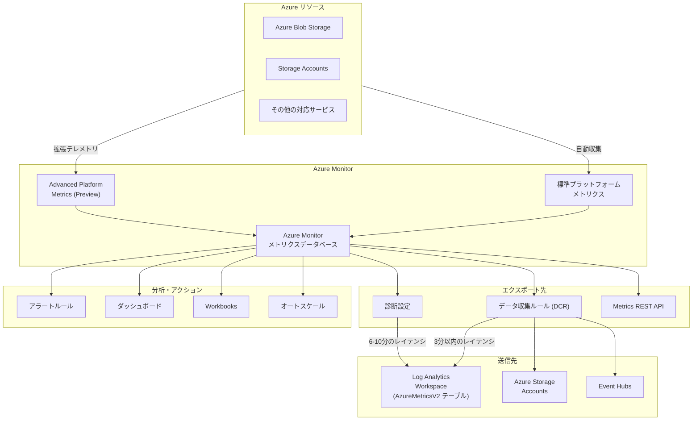

# Azure Monitor: Advanced Platform Metrics (パブリックプレビュー)

**リリース日**: 2026-07-15

**サービス**: Azure Monitor

**機能**: Advanced Platform Metrics

**ステータス**: パブリックプレビュー

[このアップデートのインフォグラフィックを見る](https://takech9203.github.io/azure-news-summary/20260715-azure-monitor-advanced-platform-metrics.html)

## 概要

2026 年 7 月 15 日より、Azure Monitor の Advanced Platform Metrics がパブリックプレビューとして利用可能になった。この機能は、Azure サービスのプラットフォームパフォーマンス、リソースヘルス、および運用トレンドに対する高度な可視性を提供するものである。

Advanced Platform Metrics により、従来のプラットフォームメトリクスでは取得できなかったより深いテレメトリデータにアクセスできるようになる。対象となる Azure サービス全体にわたり、プラットフォームレベルでの詳細なパフォーマンス指標やリソースの健全性情報を収集・分析することが可能となる。

この機能は Storage、DevOps、管理とガバナンスの各カテゴリに関連しており、Azure Blob Storage、Azure Monitor、Storage Accounts といったサービスと密接に連携する。データ収集ルール (DCR) を活用したメトリクスエクスポートの仕組みと組み合わせることで、より柔軟かつ高精度なモニタリング基盤を構築できる。

**アップデート前の課題**

- 標準のプラットフォームメトリクスでは、リソースの深い内部動作やパフォーマンス傾向を把握するには情報が限定的だった
- リソースヘルスの詳細な変化を早期に検知する手段が不十分で、問題の予兆を見逃すリスクがあった
- 複数の Azure サービスにまたがるプラットフォームレベルの運用トレンドを横断的に分析することが困難だった
- 診断設定によるメトリクスエクスポートではディメンション付きメトリクスの送信が制限されていた

**アップデート後の改善**

- プラットフォームレベルでの詳細なテレメトリデータにアクセスでき、リソースの内部動作をより深く理解できるようになった
- リソースヘルスと運用トレンドの可視性が強化され、問題の予兆を早期に検知可能になった
- 対応する Azure サービス全体にわたり一貫した高度なメトリクスが利用可能になった
- データ収集ルール (DCR) によるメトリクスエクスポートと組み合わせることで、ディメンション付きメトリクスのエクスポートやフィルタリングが可能になった

## アーキテクチャ図



この図は、Advanced Platform Metrics がプラットフォームメトリクスの収集からエクスポート、分析に至るまでの全体的なデータフローを示している。Azure リソースから標準メトリクスに加えて拡張テレメトリが収集され、DCR を経由して各送信先に配信される。

## サービスアップデートの詳細

### 主要機能

1. **拡張テレメトリデータ** - 従来のプラットフォームメトリクスでは利用できなかった、より深いレベルのパフォーマンス指標やリソースヘルス情報を提供する
2. **プラットフォームパフォーマンスの可視化** - Azure サービスのプラットフォームレベルでの動作状況を詳細に把握できる
3. **リソースヘルス監視** - リソースの健全性に関するより細かい粒度の情報を収集し、問題の早期検知を支援する
4. **運用トレンド分析** - 対応する Azure サービス全体にわたる運用傾向を横断的に分析できる
5. **複数サービス対応** - Azure Blob Storage、Storage Accounts をはじめとする対応サービスで利用可能

## 技術仕様

| 項目 | 詳細 |
|------|------|
| ステータス | パブリックプレビュー |
| 開始日 | 2026 年 7 月 15 日 |
| 関連サービス | Azure Monitor, Azure Blob Storage, Storage Accounts |
| カテゴリ | Storage, DevOps, Management and governance |
| メトリクスエクスポート方式 | データ収集ルール (DCR)、診断設定、REST API |
| DCR エクスポートレイテンシ | 約 3 分 |
| エクスポート先 | Log Analytics Workspace, Azure Storage, Event Hubs |
| データ保存テーブル | AzureMetricsV2 (Log Analytics の場合) |

## 設定方法

### 前提条件

- Azure サブスクリプション
- Azure Monitor へのアクセス権限
- 対応する Azure リソース (Azure Blob Storage, Storage Accounts 等)
- メトリクスエクスポートを行う場合、データ収集ルール (DCR) の作成権限

### Azure Portal での設定

1. Azure Portal にサインインする
2. **Monitor** メニューから **メトリクス** を選択
3. 対象リソースを選択し、Advanced Platform Metrics で新たに利用可能になったメトリクスを確認する
4. 必要に応じてダッシュボードやアラートルールを設定する

### メトリクスエクスポート (DCR) の設定

1. Azure Portal で **Monitor** > **データ収集ルール** を選択
2. **作成** をクリックし、新しい DCR 作成エクスペリエンスを使用
3. テレメトリの種類として **PlatformTelemetry** を選択
4. Storage Account や Event Hubs に送信する場合はマネージド ID を有効化
5. 対象リソースを追加し、収集するメトリクスを指定
6. 送信先 (Log Analytics Workspace, Storage Account, Event Hubs) を構成

### Azure CLI での設定

```bash
# データ収集ルールの作成
az monitor data-collection rule create \
  --name "myAdvancedMetricsDCR" \
  --resource-group "myResourceGroup" \
  --location "eastus" \
  --kind PlatformTelemetry \
  --identity "{type:'SystemAssigned'}" \
  --rule-file "./dcr-config.json"

# データ収集ルールの関連付け
az monitor data-collection rule association create \
  --name "myAssociation" \
  --rule-id "/subscriptions/{subscriptionId}/resourceGroups/{resourceGroupName}/providers/Microsoft.Insights/dataCollectionRules/myAdvancedMetricsDCR" \
  --resource "/subscriptions/{subscriptionId}/resourceGroups/{resourceGroupName}/providers/Microsoft.Storage/storageAccounts/{storageAccountName}"
```

## メリット

### ビジネス面

- リソースの問題を早期に検知することで、サービス停止のリスクを低減し、SLA 遵守を支援
- 運用トレンドの可視化により、キャパシティプランニングの精度が向上
- プラットフォームレベルの詳細情報により、根本原因分析 (RCA) の迅速化が可能

### 技術面

- 従来のメトリクスでは見えなかったプラットフォーム内部の動作を把握できる
- DCR によるメトリクスエクスポートでディメンション付きデータを活用した高度な分析が可能
- 約 3 分のエクスポートレイテンシにより、ほぼリアルタイムでの監視を実現
- Log Analytics Workspace への格納により、KQL を使った柔軟なクエリ分析が可能

## デメリット・制約事項

- パブリックプレビュー段階のため、SLA は提供されない
- プレビュー中に仕様が変更される可能性がある
- 対応するリソースタイプが限定される場合がある
- DCR でのメトリクスエクスポートでは 1 リソースあたり最大 5 つの DCR まで関連付け可能
- DCR による時間粒度 (hourly grain) メトリクスのエクスポートは非対応
- 1 つの DCR につき 1 つの送信先タイプのみ指定可能

## ユースケース

1. **ストレージパフォーマンスの詳細監視**: Azure Blob Storage や Storage Accounts のプラットフォームレベルのパフォーマンス指標を深く分析し、ボトルネックを特定する
2. **プロアクティブなリソースヘルス管理**: リソースの健全性に関する詳細なメトリクスを活用して、障害の予兆を早期に検知しアラートを設定する
3. **運用トレンドに基づくキャパシティプランニング**: 長期的な運用トレンドを分析し、将来のリソース増強計画に活用する
4. **クロスサービスの相関分析**: 複数の Azure サービスにまたがる Advanced Platform Metrics を Log Analytics に集約し、サービス間の影響を分析する

## 料金

パブリックプレビュー期間中の料金体系については、公式アナウンスに詳細な記載がない。一般に、Azure Monitor のプラットフォームメトリクスの収集は無料であるが、以下の場合に費用が発生する可能性がある:

- Log Analytics Workspace へのメトリクスエクスポート: Log Analytics のデータインジェスト・保持料金が適用
- Storage Account へのエクスポート: ストレージ料金が適用
- Event Hubs へのエクスポート: Event Hubs 料金が適用

プレビュー期間中は一部機能が無料で提供される場合があるが、正式な料金は GA 時に確定する見込みである。

## 関連サービス・機能

- **Azure Monitor メトリクス**: プラットフォームメトリクスの収集・表示基盤
- **データ収集ルール (DCR)**: メトリクスのエクスポートと変換を制御するルール
- **Log Analytics Workspace**: エクスポートされたメトリクスの分析基盤 (AzureMetricsV2 テーブル)
- **Azure Blob Storage**: Advanced Platform Metrics の対応サービスの一つ
- **Storage Accounts**: Advanced Platform Metrics の対応サービスの一つ
- **診断設定**: 従来のメトリクスエクスポート方式 (DCR 非対応リソース用)

## 参考リンク

- [インフォグラフィック](https://takech9203.github.io/azure-news-summary/20260715-azure-monitor-advanced-platform-metrics.html)
- [公式アップデート情報](https://azure.microsoft.com/updates?id=567726)
- [Azure Monitor サポートされるメトリクス](https://learn.microsoft.com/en-us/azure/azure-monitor/reference/metrics-index)
- [データ収集ルールによるメトリクスエクスポート](https://learn.microsoft.com/en-us/azure/azure-monitor/data-collection/metrics-export-create)

## まとめ

Azure Monitor の Advanced Platform Metrics は、プラットフォームレベルでの拡張テレメトリを提供し、Azure リソースのパフォーマンス、ヘルス、運用トレンドに対する可視性を大幅に強化するパブリックプレビュー機能である。Azure Blob Storage や Storage Accounts をはじめとする対応サービスにおいて、従来のメトリクスでは得られなかった深い洞察を提供する。DCR を活用したメトリクスエクスポートと組み合わせることで、ディメンション付きデータの低レイテンシでの配信や柔軟なフィルタリングが可能となり、プロアクティブな監視体制の構築を支援する。プレビュー段階であるため SLA は提供されないが、運用環境への本格導入に向けた評価を早期に開始することが推奨される。

---

**タグ**: #Azure #AzureMonitor #PlatformMetrics #パブリックプレビュー #Storage #DevOps #ManagementAndGovernance #AzureBlobStorage #StorageAccounts #監視 #テレメトリ
