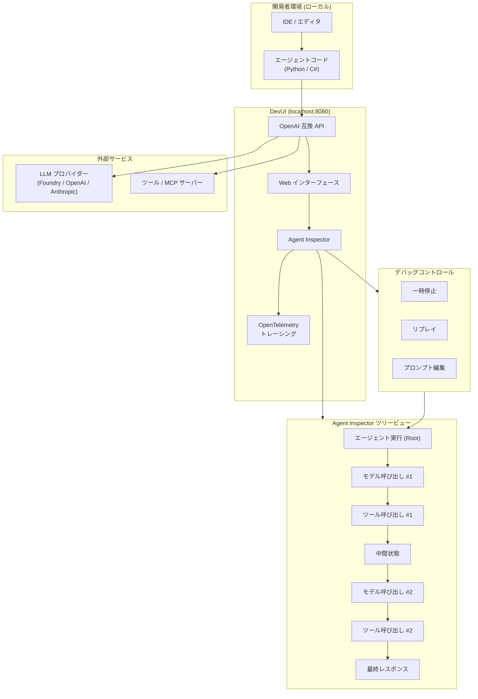

# Microsoft Agent Framework: DevUI Agent Inspector がパブリックプレビューとして提供開始

**リリース日**: 2026-07-15

**サービス**: Microsoft Agent Framework / Microsoft Foundry

**機能**: DevUI Agent Inspector

**ステータス**: Public Preview

[このアップデートのインフォグラフィックを見る](https://takech9203.github.io/azure-news-summary/20260715-foundry-devui-agent-inspector.html)

## 概要

2026 年 7 月 15 日、Microsoft は Microsoft Agent Framework の DevUI に新機能「Agent Inspector」をパブリックプレビューとして追加したことを発表した。Agent Inspector は、エージェントの実行をナビゲート可能なツリー構造として可視化するローカルデバッグサーフェスであり、モデル呼び出し、ツール呼び出し、中間状態を階層的に表示する。

DevUI は Microsoft Agent Framework 向けの軽量なスタンドアロンサンプルアプリケーションであり、エージェントやワークフローの対話的テストを行うための Web インターフェースと OpenAI 互換 API バックエンドを提供する。今回追加された Agent Inspector 機能により、開発者はエージェントの実行を一時停止 (pause)、リプレイ (replay)、プロンプトの編集 (edit prompts mid-run) が可能となり、エージェントアプリケーションの開発効率が大幅に向上する。

Microsoft Agent Framework は、AutoGen のシンプルなエージェント抽象化と Semantic Kernel のエンタープライズ機能を統合した次世代フレームワークであり、Python、C#、Go で利用可能である。Agent Inspector はこのフレームワークの開発者体験を強化する重要なツールとして位置づけられる。

**アップデート前の課題**

- エージェントの実行フローを可視化する手段が限られており、モデル呼び出しやツール呼び出しの連鎖をデバッグするのが困難だった
- エージェントの中間状態を確認するためには、コードにログ出力を追加するなど手動での対応が必要だった
- 実行中のプロンプトを編集して再実行するには、コードの変更と再起動が必要で、イテレーション速度が遅かった
- マルチステップのエージェント実行において、問題箇所の特定に時間がかかっていた

**アップデート後の改善**

- エージェントの実行をツリー構造で階層的に可視化し、モデル呼び出し、ツール呼び出し、中間状態を一目で把握可能
- 実行の一時停止とリプレイにより、特定のステップを詳細に分析可能
- 実行中のプロンプトをその場で編集して再実行でき、イテレーション速度が大幅に向上
- OpenTelemetry トレーシングとの連携により、エンドツーエンドの可観測性を実現

## アーキテクチャ図



Agent Inspector は DevUI の Web インターフェース上で動作し、エージェントの実行をツリー構造として可視化する。開発者はデバッグコントロールを使用して実行の一時停止、リプレイ、プロンプト編集を行い、LLM プロバイダーやツールとの相互作用をステップバイステップで検証できる。

## サービスアップデートの詳細

### 主要機能

1. **ナビゲート可能なツリービュー**
   - エージェントの実行をモデル呼び出し、ツール呼び出し、中間状態のツリー構造として表示
   - 各ノードをクリックして詳細な入出力データを確認可能
   - マルチエージェントワークフローの実行パスを視覚的に追跡

2. **一時停止 (Pause) 機能**
   - エージェントの実行を任意のポイントで一時停止
   - 一時停止中に中間状態やコンテキストの内容を詳細に検査可能
   - ステップバイステップでの実行制御

3. **リプレイ (Replay) 機能**
   - 過去の実行を再生して動作を確認
   - 特定のステップから再実行を開始し、異なるパスを探索可能
   - 問題の再現と修正の検証に活用

4. **プロンプト編集 (Edit Prompts Mid-Run)**
   - 実行中のプロンプトをその場で編集して即座に再実行
   - システムプロンプト、ユーザープロンプトの両方を編集可能
   - コード変更なしでプロンプトエンジニアリングのイテレーションを高速化

5. **OpenTelemetry トレーシング統合**
   - 実行のトレースデータを OpenTelemetry 形式で記録
   - レイテンシ、トークン使用量などのメトリクスを可視化
   - 既存の可観測性スタックとの統合が可能

## 技術仕様

| 項目 | 詳細 |
|------|------|
| ステータス | パブリックプレビュー |
| 対応言語 | Python (C# は近日対応予定、Go は開発中) |
| インストール方法 | `pip install agent-framework-devui --pre` |
| デフォルトポート | 8080 |
| デフォルトホスト | 127.0.0.1 (ローカルのみ) |
| API 互換性 | OpenAI Responses API 互換 |
| トレーシング | OpenTelemetry 対応 |
| 動作要件 | ローカル開発環境 (本番利用非推奨) |
| フレームワーク | Microsoft Agent Framework |

## 設定方法

### 前提条件

1. Python 環境 (Python 3.10 以上推奨)
2. Microsoft Agent Framework がインストール済みであること
3. LLM プロバイダーの認証情報 (Microsoft Foundry、OpenAI、Anthropic 等)

### インストールと起動

```bash
# DevUI のインストール (プレリリース版)
pip install agent-framework-devui --pre

# オプション 1: プログラムによる起動
python -c "
from agent_framework import Agent
from agent_framework.openai import OpenAIChatClient
from agent_framework.devui import serve

agent = Agent(
    name='MyAgent',
    client=OpenAIChatClient(),
    tools=[]
)

serve(entities=[agent], auto_open=True)
"

# オプション 2: CLI による起動 (トレーシング有効)
devui ./agents --port 8080 --tracing
```

### CLI オプション

```bash
devui [directory] [options]

Options:
  --port, -p      ポート番号 (デフォルト: 8080)
  --host          ホスト (デフォルト: 127.0.0.1)
  --headless      API のみ (UI なし)
  --no-open       ブラウザを自動的に開かない
  --tracing       OpenTelemetry トレーシングを有効化
  --reload        自動リロードを有効化
  --mode          developer|user (デフォルト: developer)
  --auth          Bearer トークン認証を有効化
  --auth-token    カスタム認証トークン
```

## メリット

### ビジネス面

- エージェント開発のイテレーション速度が向上し、開発期間の短縮とコスト削減に寄与
- プロンプトの試行錯誤をコード変更なしで実施でき、プロンプトエンジニアリングの効率化を実現
- エージェントの動作を可視化できることで、ステークホルダーへのデモや説明が容易に
- 問題の早期発見により、本番環境でのインシデントリスクを低減

### 技術面

- ツリービューにより複雑なマルチステップ実行のデバッグが容易
- 一時停止・リプレイ機能で従来困難だった非決定的なエージェント動作の再現と分析が可能
- OpenAI 互換 API により、既存の OpenAI SDK を使用したテスト自動化が可能
- OpenTelemetry 統合で既存の可観測性基盤 (Grafana、Jaeger 等) との連携が容易

## デメリット・制約事項

- パブリックプレビュー段階であり、本番環境での利用は非推奨 (サンプルアプリケーションとしての位置づけ)
- C# 向けのドキュメントおよび機能は準備中であり、現時点では Python のみが完全サポート
- Go サポートは開発中であり、利用可能時期は未定
- ローカル開発環境での使用を前提としており、チーム間での共有やリモートデバッグには追加の構成が必要
- Agent Inspector の具体的な機能仕様はプレビュー期間中に変更される可能性がある

## ユースケース

### ユースケース 1: マルチツールエージェントのデバッグ

**シナリオ**: 複数のツール (データベースクエリ、API 呼び出し、ファイル操作) を組み合わせたエージェントが期待通りの順序でツールを呼び出しているか検証する。

**実装例**:

```python
from agent_framework import Agent
from agent_framework.openai import OpenAIChatClient
from agent_framework.devui import serve

def query_database(sql: str) -> str:
    """Execute SQL query."""
    # ...
    return "results"

def call_api(endpoint: str) -> str:
    """Call external API."""
    # ...
    return "response"

agent = Agent(
    name="MultiToolAgent",
    client=OpenAIChatClient(),
    tools=[query_database, call_api]
)

# DevUI で Agent Inspector を使用してデバッグ
serve(entities=[agent], auto_open=True)
```

**効果**: Agent Inspector のツリービューでツール呼び出しの順序と各ステップの入出力を確認し、一時停止して中間状態を検査可能。

### ユースケース 2: プロンプト最適化

**シナリオ**: エージェントのシステムプロンプトを調整し、回答の品質や一貫性を向上させたい。

**効果**: Agent Inspector のプロンプト編集機能により、実行中にプロンプトを変更して即座に結果を確認。コードの変更・再起動なしで複数のプロンプトバリエーションを迅速に試行可能。

### ユースケース 3: ワークフロー実行パスの検証

**シナリオ**: グラフベースのマルチエージェントワークフローにおいて、条件分岐が正しく動作しているか確認する。

**効果**: ツリービューでワークフロー全体の実行パスを可視化し、リプレイ機能で特定の分岐条件を変更した場合の動作を探索可能。

## 料金

DevUI Agent Inspector はローカル開発ツールとして提供されるため、ツール自体の利用料金は発生しない。ただし、エージェントの実行に伴う LLM プロバイダーへの API 呼び出し (Microsoft Foundry Models、OpenAI 等) については通常の利用料金が適用される。

## 関連サービス・機能

- **Microsoft Agent Framework**: エージェントおよびマルチエージェントワークフローを構築するためのオープンソースフレームワーク
- **Microsoft Foundry**: AI アプリケーションとエージェントを大規模に構築・最適化・管理するためのプラットフォーム
- **Foundry Agent Service**: エージェントのホスティングとデプロイを行うマネージドサービス
- **DevUI Web Interface**: エージェントとワークフローの対話的テストを行う Web UI
- **OpenTelemetry**: 分散トレーシングとメトリクスの標準規格であり、Agent Inspector のトレーシング基盤

## 参考リンク

- [インフォグラフィック](https://takech9203.github.io/azure-news-summary/20260715-foundry-devui-agent-inspector.html)
- [公式アップデート情報](https://azure.microsoft.com/updates?id=563551)
- [Microsoft Learn - DevUI Overview](https://learn.microsoft.com/en-us/agent-framework/devui/)
- [Microsoft Learn - Microsoft Agent Framework Overview](https://learn.microsoft.com/en-us/agent-framework/overview/)
- [Microsoft Agent Framework GitHub リポジトリ](https://github.com/microsoft/agent-framework)

## まとめ

Microsoft Agent Framework の DevUI Agent Inspector は、エージェント開発者にとって待望のデバッグツールである。エージェントの実行をツリー構造で可視化し、一時停止、リプレイ、プロンプト編集といった対話的なデバッグ機能を提供することで、複雑なエージェントアプリケーションの開発効率を大幅に向上させる。

推奨される次のアクション:
- Microsoft Agent Framework を使用したエージェント開発を行っている場合は、`pip install agent-framework-devui --pre` で即座に試用可能
- 既存のエージェントコードに対して DevUI を起動し、Agent Inspector でツール呼び出しやプロンプトの最適化を検証する
- パブリックプレビュー段階のため、本番ワークフローへの組み込みは GA を待つことを推奨

---

**タグ**: #Azure #MicrosoftFoundry #AgentFramework #DevUI #AgentInspector #AI #MachineLearning #パブリックプレビュー #デバッグ #開発ツール
