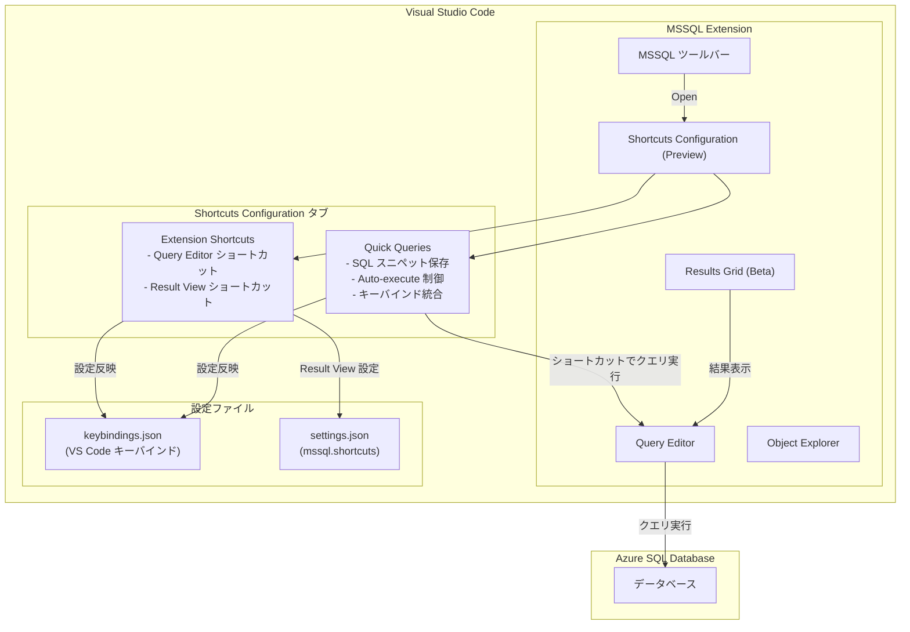

# Azure SQL Database: 2026 年 7 月中旬アップデート - Shortcuts Configuration、Results Grid 改善

**リリース日**: 2026-07-15

**サービス**: Azure SQL Database

**機能**: Visual Studio Code 向け MSSQL 拡張機能のキーボードショートカット設定 (Shortcuts Configuration) およびエディタ改善

**ステータス**: Public Preview

[このアップデートのインフォグラフィックを見る](https://takech9203.github.io/azure-news-summary/20260715-sql-database-mid-july-updates.html)

## 概要

2026 年 7 月中旬、Azure SQL に関連する複数のアップデートが発表された。主要な機能として、Visual Studio Code 向け MSSQL 拡張機能に「Shortcuts Configuration (プレビュー)」が追加され、Quick Queries、Results Grid、Query Editor のキーボードショートカットを Visual Studio Code 内で直接カスタマイズできるようになった。

Shortcuts Configuration は、MSSQL 拡張機能ツールバーから「Open Shortcuts Configuration」を選択して起動する。2 つのタブ「Quick Queries」と「Extension Shortcuts」が提供され、それぞれ SQL スニペットの保存・実行と、エディタ/結果ビューのショートカット管理を担う。Quick Queries では、複数の SQL クエリエントリを設定・保存し、キーボードショートカットでの即時実行やエディタでの展開を選択できる。Extension Shortcuts では、Query Editor と Result View の主要コマンドのキーバインドをグループごとに確認・変更できる。

また、Results Grid のプレビュー版 (Beta Results Grid) では、状態管理の改善、パフォーマンス向上、列のフリーズ・表示/非表示といったカスタマイズ機能が追加されている。これらの改善により、Azure Data Studio から Visual Studio Code への移行がさらにスムーズになる。

**アップデート前の課題**

- MSSQL 拡張機能のキーボードショートカット変更には `keybindings.json` や `settings.json` の手動編集が必要だった
- 頻繁に使用する SQL クエリを素早く実行するための統合的なメカニズムがなかった
- Results Grid の列カスタマイズ (フリーズ、非表示) ができなかった
- Azure Data Studio のショートカットに慣れたユーザーが VS Code に移行する際、キーバインドの再設定が煩雑だった

**アップデート後の改善**

- GUI ベースの Shortcuts Configuration から直感的にキーボードショートカットを管理可能
- Quick Queries タブで SQL スニペットを保存し、ショートカットキーで即時実行または展開
- Extension Shortcuts タブで Query Editor と Result View のショートカットをグループ別に確認・編集
- Beta Results Grid で列のフリーズ・表示/非表示、パフォーマンス改善を提供

## アーキテクチャ図



## サービスアップデートの詳細

### 主要機能

1. **Shortcuts Configuration (Preview)** - MSSQL 拡張機能ツールバーから起動できる GUI ベースのショートカット管理画面。Quick Queries と Extension Shortcuts の 2 つのタブで構成される

2. **Quick Queries** - SQL スニペットを複数保存し、キーボードショートカットで実行または展開できる機能。Auto-execute オプションにより、ショートカット押下時にクエリを即時実行するか、エディタに展開するかを選択可能

3. **Extension Shortcuts** - Query Editor (クエリ実行、接続、その他) と Result View (ナビゲーション、結果操作) のショートカットをグループごとに表示・編集する機能

4. **Beta Results Grid** - 状態管理の改善、パフォーマンス向上に加え、列のフリーズ、表示/非表示などのカスタマイズ機能を提供するプレビュー版 Results Grid

5. **MSSQL Database Management Keymap** - SSMS や Azure Data Studio で使い慣れたショートカット (F5 でクエリ実行、Ctrl+N で新規クエリなど) を VS Code で使用できるコンパニオン拡張機能

## 技術仕様

| 項目 | 詳細 |
|------|------|
| 対象拡張機能 | MSSQL Extension for Visual Studio Code |
| ステータス | Public Preview |
| ショートカット設定方式 | keybindings.json (VS Code キーバインド) + mssql.shortcuts (settings.json) |
| Quick Queries | 複数の SQL クエリスロット、Auto-execute オプション |
| Extension Shortcuts グループ | Query Execution / Connection / Others / Navigation / Results |
| Beta Results Grid 設定 | mssql.preview.betaResultsGrid = true |
| クロスプラットフォーム対応 | ctrlcmd キーワードで Windows/Linux (Ctrl) と macOS (Cmd) を統一 |
| 対応 OS | Windows 10/11 (x64, Arm64)、macOS (Intel/Apple Silicon)、Linux (x64, Arm64) |

## 設定方法

### 前提条件

1. Visual Studio Code がインストールされていること
2. MSSQL 拡張機能 (ms-mssql.mssql) がインストールされていること
3. Azure SQL Database または SQL Server への接続が構成済みであること

### Shortcuts Configuration の起動

1. VS Code で MSSQL 拡張機能のアクティビティバーアイコンを選択
2. MSSQL 拡張機能ツールバーの「Open Shortcuts Configuration」ボタンをクリック
3. Shortcuts Configuration 画面が開き、Quick Queries タブと Extension Shortcuts タブを使用可能

### Quick Queries の設定

1. Shortcuts Configuration の「Quick Queries」タブを開く
2. クエリスロットに使用する SQL スニペットを入力
3. Auto-execute オプションを設定 (オンで即時実行、オフでエディタに展開)
4. 「Keybinding」のリンクから VS Code Keyboard Shortcuts エディタで任意のキーバインドを割り当て

### Beta Results Grid の有効化

1. VS Code の設定 (Ctrl+, / Cmd+,) を開く
2. `mssql.preview.betaResultsGrid` を検索
3. `true` に設定して有効化

### Result View ショートカットの手動設定 (上級)

settings.json に以下のように記述:

```json
{
    "mssql.shortcuts": {
        "event.queryResults.switchToResultsTab": "ctrl+alt+r",
        "event.queryResults.switchToMessagesTab": "ctrl+alt+y",
        "event.resultGrid.copySelection": "ctrlcmd+c",
        "event.resultGrid.selectAll": "ctrlcmd+a",
        "event.resultGrid.toggleSort": "alt+shift+o"
    }
}
```

## メリット

### ビジネス面

- Azure Data Studio の廃止 (2026 年 2 月) に伴う VS Code 移行時のユーザー体験を改善し、移行コストを低減
- 頻繁に実行する SQL クエリのショートカット化により、日常的なデータベース運用の生産性が向上
- GUI ベースの設定画面により、JSON ファイルの手動編集が不要となり、学習コストが低下

### 技術面

- Quick Queries による SQL スニペットのショートカット実行で、繰り返し作業の効率が大幅に向上
- Result View ショートカットの統一的な管理により、グリッドナビゲーションやデータコピーの操作が高速化
- Beta Results Grid の列フリーズ・非表示機能により、大量カラムを持つ結果セットの視認性が向上
- クロスプラットフォーム対応 (ctrlcmd キーワード) により、OS 間で統一的なショートカット定義が可能

## デメリット・制約事項

- Shortcuts Configuration は Public Preview であり、今後の変更や機能追加が予想される
- Beta Results Grid は `mssql.preview.betaResultsGrid` フラグによる有効化が必要で、デフォルトでは無効
- MSSQL Database Management Keymap は一部の VS Code デフォルトショートカットを上書きする可能性がある
- Azure Data Studio のユーザーカスタムキーバインドは自動移行されず、手動での再設定が必要
- Result View ショートカット (`mssql.shortcuts`) は VS Code 標準の keybindings.json とは別の設定体系であり、2 つの仕組みを理解する必要がある

## ユースケース

### ユースケース 1: DBA の日常運用効率化

**シナリオ**: データベース管理者が、サーバーステータス確認やインデックス状態チェックなど毎日実行するクエリをショートカットで即時実行する。

**実装例**:

Quick Queries タブで以下のクエリを登録し、Auto-execute を ON に設定:

```sql
-- スロット 1: データベースサイズ確認
SELECT DB_NAME(database_id) AS DatabaseName,
       SUM(size * 8 / 1024) AS SizeMB
FROM sys.master_files
GROUP BY database_id
ORDER BY SizeMB DESC;
```

キーバインドに `Ctrl+Alt+1` を割り当てることで、ワンキーでクエリ結果を取得。

**効果**: 毎日の定型作業がキーボードショートカット一つで完了し、手動でのクエリ入力・実行の手間を削減。

### ユースケース 2: Azure Data Studio からの移行

**シナリオ**: Azure Data Studio 廃止に伴い、SSMS スタイルのショートカット (F5 で実行など) に慣れたチームが VS Code に移行する。

**実装例**:

1. MSSQL Database Management Keymap 拡張機能をインストール
2. Shortcuts Configuration の Extension Shortcuts タブでカスタマイズを確認・調整
3. チーム共通の settings.json を共有し、Result View ショートカットを統一

**効果**: 既存の操作習慣を維持しながら VS Code への移行が完了し、チーム全体の生産性低下を最小化。

## 料金

Shortcuts Configuration および MSSQL 拡張機能の利用に追加料金は発生しない。Azure SQL Database の料金は既存の DTU / vCore ベースのモデルに従う。

## 利用可能リージョン

本アップデートは Visual Studio Code の MSSQL 拡張機能に対する機能追加であり、Azure SQL Database が利用可能なすべてのリージョンで使用できる。リージョンの制約はない。

## 関連サービス・機能

- **Azure SQL Database**: ショートカットで操作対象となるクラウドデータベースサービス
- **MSSQL Extension for Visual Studio Code**: ショートカット設定機能を含む VS Code 拡張機能
- **MSSQL Database Management Keymap**: SSMS / Azure Data Studio スタイルのショートカットを提供するコンパニオン拡張機能
- **Azure Data Studio (廃止済み)**: 2026 年 2 月に廃止された前身ツール。VS Code + MSSQL 拡張機能が後継
- **Query Plan Visualizer**: 実行プランの可視化機能。ショートカットでの起動も可能
- **Schema Designer**: VS Code 内でのビジュアルスキーマ設計ツール

## 参考リンク

- [インフォグラフィック](https://takech9203.github.io/azure-news-summary/20260715-sql-database-mid-july-updates.html)
- [公式アップデート情報](https://azure.microsoft.com/updates?id=567426)
- [Microsoft Learn - MSSQL Extension for Visual Studio Code](https://learn.microsoft.com/sql/tools/visual-studio-code-extensions/mssql/mssql-extension-visual-studio-code)
- [Microsoft Learn - Customize Keyboard Shortcuts](https://learn.microsoft.com/sql/tools/visual-studio-code-extensions/mssql/mssql-keyboard-shortcuts)
- [MSSQL Database Management Keymap](https://marketplace.visualstudio.com/items?itemName=ms-mssql.mssql-database-management-keymap)

## まとめ

2026 年 7 月中旬の Azure SQL アップデートでは、Visual Studio Code 向け MSSQL 拡張機能に Shortcuts Configuration (プレビュー) が追加され、キーボードショートカットの管理が GUI ベースで可能になった。Quick Queries による SQL スニペットのショートカット実行、Extension Shortcuts による Query Editor と Result View のキーバインド管理、さらに Beta Results Grid の列カスタマイズ機能により、VS Code でのデータベース開発体験が大幅に向上する。

推奨される次のアクション:
- MSSQL 拡張機能を最新バージョンに更新し、Shortcuts Configuration を試用する
- Azure Data Studio から移行中のチームは MSSQL Database Management Keymap の導入を検討する
- 頻繁に使用する SQL クエリを Quick Queries に登録し、日常業務の効率化を図る
- Beta Results Grid (`mssql.preview.betaResultsGrid: true`) を有効化し、改善されたグリッド体験を試す

---

**タグ**: #Azure #SQLDatabase #VSCode #MSSQL拡張機能 #ShortcutsConfiguration #QuickQueries #ResultsGrid #キーボードショートカット #Preview #開発者ツール
