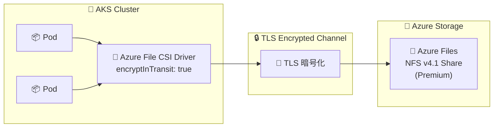

# Azure Kubernetes Service: Azure Files NFS 共有の転送中暗号化 一般提供開始

**リリース日**: 2026-07-17

**サービス**: Azure Kubernetes Service (AKS) / Azure Files

**機能**: NFS v4.1 ボリュームの転送中暗号化 (Encryption in Transit)

**ステータス**: Launched (GA)

[このアップデートのインフォグラフィックを見る](https://takech9203.github.io/azure-news-summary/20260717-aks-azure-files-nfs-encryption-in-transit.html)

## 概要

Azure Kubernetes Service (AKS) において、Azure Files NFS v4.1 ボリュームの転送中暗号化 (Encryption in Transit: EiT) が一般提供 (GA) となった。Azure File CSI ドライバーを通じて、AKS ワークロードと Azure Files NFS 共有間で転送されるデータが TLS を使用して暗号化される。この機能により、アプリケーションレベルの変更を必要とせず、データの機密性が確保される。

従来、Azure Files の NFS プロトコルでの接続は暗号化されておらず、仮想ネットワーク内のトラフィックは平文で送受信されていた。金融、医療、政府機関など規制の厳しい業界のワークロードでは、保存時 (at-rest) だけでなく転送中 (in-transit) のデータ暗号化も必須要件となることが多い。今回の GA により、StorageClass パラメータに `encryptInTransit: "true"` を設定するだけで、NFS 通信が TLS で暗号化されるようになった。

**アップデート前の課題**

- Azure Files NFS 共有への通信が暗号化されず、仮想ネットワーク内でデータが平文で転送されていた
- 転送中のデータ暗号化が必要な場合、アプリケーション側で独自の暗号化実装が必要だった
- コンプライアンス要件を満たすために NFS ではなく SMB (TLS 対応) を選択せざるを得ないケースがあった

**アップデート後の改善**

- StorageClass または PersistentVolume の設定で `encryptInTransit: "true"` を指定するだけで TLS 暗号化が有効になる
- アプリケーションコードの変更が不要で、透過的に暗号化が適用される
- NFS v4.1 のパフォーマンス特性を維持しつつ、セキュリティ要件を満たすことが可能になった

## アーキテクチャ図



AKS Pod から Azure Files NFS 共有へのデータ転送が、CSI ドライバーにより透過的に TLS 暗号化される。アプリケーション側の変更は不要。

## サービスアップデートの詳細

### 主要機能

1. **透過的な TLS 暗号化**
   - Azure File CSI ドライバーが NFS v4.1 通信を自動的に TLS で暗号化
   - アプリケーションレベルの変更が不要

2. **StorageClass パラメータによる簡易設定**
   - `encryptInTransit: "true"` パラメータを StorageClass または PersistentVolume の volumeAttributes に設定するだけで有効化
   - 動的プロビジョニングと静的プロビジョニングの両方に対応

3. **既存 PV への適用**
   - 暗号化なしで作成された既存の PersistentVolume に対しても、volumeAttributes に `encryptInTransit: "true"` を設定することで暗号化を有効化可能

## 技術仕様

| 項目 | 詳細 |
|------|------|
| プロトコル | NFS v4.1 |
| 暗号化方式 | TLS |
| CSI ドライバー | file.csi.azure.com |
| 最低 AKS バージョン | 1.33 以降 |
| サポート OS | Linux (Ubuntu 22.04 以降) |
| 非サポート OS | Ubuntu 20.04、Windows ノード |
| ストレージ SKU | SSD (PremiumV2_LRS, PremiumV2_ZRS, Premium_LRS, Premium_ZRS) |
| パラメータ名 | `encryptInTransit` |

## 設定方法

### 前提条件

1. AKS クラスターのバージョンが 1.33 以降であること
2. Azure Files CSI ドライバーがクラスターで有効化されていること
3. NFS ファイル共有には SSD ストレージアカウント (Premium) が必要
4. 仮想ネットワーク対応のストレージアカウントが構成されていること
5. AKS クラスターのコントロールプレーン ID に VNet と NetworkSecurityGroup の Contributor ロールが付与されていること

### 動的プロビジョニング (StorageClass)

```yaml
apiVersion: storage.k8s.io/v1
kind: StorageClass
metadata:
  name: azurefile-csi-premiumv2-eit
provisioner: file.csi.azure.com
allowVolumeExpansion: true
parameters:
  protocol: nfs
  skuName: PremiumV2_LRS
  encryptInTransit: "true"
mountOptions:
  - nconnect=4
  - noresvport
  - actimeo=30
```

### 既存 PersistentVolume への適用

```yaml
apiVersion: v1
kind: PersistentVolume
metadata:
  name: pv-azurefile-eit
spec:
  capacity:
    storage: 100Gi
  accessModes:
    - ReadWriteMany
  persistentVolumeReclaimPolicy: Retain
  mountOptions:
    - nconnect=4
    - noresvport
    - actimeo=30
  csi:
    driver: file.csi.azure.com
    volumeHandle: "{resource-group-name}#{account-name}#{file-share-name}"
    volumeAttributes:
      protocol: nfs
      encryptInTransit: "true"
      resourceGroup: "{resource-group-name}"
      storageAccount: "{account-name}"
      shareName: "{file-share-name}"
```

## メリット

### ビジネス面

- 金融・医療・政府機関など規制産業のコンプライアンス要件 (HIPAA、PCI-DSS、SOC 2 等) への対応が容易になる
- NFS のパフォーマンス特性を維持しながらセキュリティ要件を満たせるため、SMB への移行が不要
- アプリケーション改修コストゼロで暗号化を導入可能

### 技術面

- CSI ドライバーレベルでの透過的な暗号化により、アプリケーションの変更が不要
- 動的・静的両方のプロビジョニングに対応し、既存環境への導入が容易
- `nconnect=4` 等のパフォーマンス最適化オプションと併用可能
- NFS v4.1 の ReadWriteMany (RWX) アクセスモードを活用した複数 Pod からの同時アクセスを暗号化状態で実現

## デメリット・制約事項

- Ubuntu 20.04 ノードはサポートされていない
- Windows ノードはサポートされていない
- AKS バージョン 1.33 以降が必要 (古いクラスターではアップグレードが必要)
- NFS ファイル共有には SSD (Premium) ストレージアカウントが必須であり、Standard SKU では利用不可
- TLS 暗号化のオーバーヘッドにより、暗号化なしの場合と比較してわずかなレイテンシ増加の可能性がある
- `vers`、`minorversion`、`sec` のマウントオプションは CSI ドライバーが自動設定するため、マニフェストでの手動指定は非サポート

## ユースケース

### ユースケース 1: 医療データ処理パイプライン

**シナリオ**: 医療機関が HIPAA 準拠のデータ処理パイプラインを AKS 上で運用。患者データを含むファイルを複数の処理 Pod 間で共有する必要がある。

**実装例**:

```yaml
apiVersion: storage.k8s.io/v1
kind: StorageClass
metadata:
  name: hipaa-compliant-nfs
provisioner: file.csi.azure.com
allowVolumeExpansion: true
parameters:
  protocol: nfs
  skuName: PremiumV2_LRS
  encryptInTransit: "true"
  networkEndpointType: privateEndpoint
mountOptions:
  - nconnect=4
  - noresvport
  - actimeo=30
```

**効果**: 転送中の暗号化とプライベートエンドポイントを組み合わせることで、HIPAA のデータ保護要件を満たしつつ NFS の高スループットを活用可能。

### ユースケース 2: 金融機関の共有ストレージ

**シナリオ**: 金融機関のトレーディングシステムで、複数のマイクロサービスが同一のファイル共有にアクセスし、取引ログや市場データを読み書きする。

**効果**: NFS の ReadWriteMany アクセスモードで複数 Pod からの同時アクセスを維持しつつ、PCI-DSS 要件の転送中暗号化を自動的に適用。

## 料金

Encryption in Transit 機能自体に追加料金は発生しない。ただし、NFS ファイル共有には Premium (SSD) ストレージアカウントが必要となるため、Standard ストレージと比較して高いストレージコストが発生する。

詳細な料金については [Azure Files 料金ページ](https://azure.microsoft.com/pricing/details/storage/files/) を参照。

## 利用可能リージョン

SSD Azure ファイル共有をサポートするすべての Azure リージョンで利用可能。

## 関連サービス・機能

- **Azure Files CSI ドライバー**: AKS で Azure Files を使用するためのストレージドライバー。EiT はこのドライバーの機能として実装されている
- **Azure Files SMB**: SMB プロトコルでの Azure Files 接続。従来から TLS 暗号化をサポートしていた
- **Azure Private Link / Private Endpoint**: ストレージアカウントへのプライベート接続。EiT と組み合わせてさらにセキュリティを強化可能
- **Azure Disk CSI ドライバー**: ブロックストレージ向けの CSI ドライバー。単一ノードからのアクセス (ReadWriteOnce) に適する
- **Azure Container Storage**: フルマネージドのブロックレベルストレージソリューション

## 参考リンク

- [インフォグラフィック](https://takech9203.github.io/azure-news-summary/20260717-aks-azure-files-nfs-encryption-in-transit.html)
- [公式アップデート情報](https://azure.microsoft.com/updates?id=567787)
- [Microsoft Learn ドキュメント - Azure Files CSI ドライバー](https://learn.microsoft.com/azure/aks/azure-csi-files-storage-provision)
- [Microsoft Learn ドキュメント - CSI ストレージドライバー](https://learn.microsoft.com/azure/aks/csi-storage-drivers)
- [料金ページ](https://azure.microsoft.com/pricing/details/storage/files/)

## まとめ

Azure Files NFS v4.1 共有の転送中暗号化 (EiT) が GA となったことで、AKS ユーザーは NFS のパフォーマンス特性を維持しつつ、ストレージ通信の暗号化を実現できるようになった。StorageClass に `encryptInTransit: "true"` を追加するだけで有効化でき、アプリケーション側の変更は不要である。

Solutions Architect への推奨アクション:
- セキュリティ要件で転送中暗号化が求められるワークロードにおいて、NFS を積極的に検討する
- 既存の NFS ボリュームについても PV の volumeAttributes 更新で暗号化を有効化する
- AKS クラスターのバージョンが 1.33 以降であることを確認し、必要に応じてアップグレードを計画する

---

**タグ**: #Azure #AKS #AzureFiles #NFS #EncryptionInTransit #Security #GA
