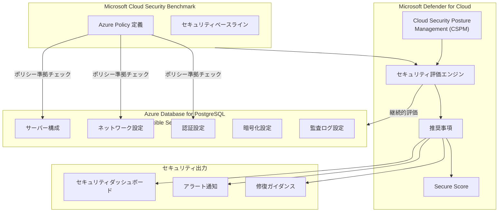

# Microsoft Defender for Cloud: Azure Database for PostgreSQL Flexible Server セキュリティ評価 一般提供開始

**リリース日**: 2026-07-17

**サービス**: Microsoft Defender for Cloud / Azure Database for PostgreSQL

**機能**: CSPM セキュリティ評価

**ステータス**: Launched (GA)

[このアップデートのインフォグラフィックを見る](https://takech9203.github.io/azure-news-summary/20260717-defender-postgresql-security-assessments.html)

## 概要

Microsoft Defender for Cloud の Cloud Security Posture Management (CSPM) による Azure Database for PostgreSQL Flexible Server 向けセキュリティ評価機能が一般提供 (GA) となった。本機能により、PostgreSQL Flexible Server インスタンスのセキュリティ態勢を継続的に評価し、構成ミスの特定と優先度付きの推奨事項を受け取ることが可能になる。

CSPM は Defender for Cloud のコア機能であり、クラウド資産のセキュリティ状態に対する継続的な可視性を提供する。今回の GA リリースにより、PostgreSQL Flexible Server に特化したセキュリティ評価が正式にサポートされ、データベースレイヤーでのセキュリティ強化が体系的に実施できるようになった。評価項目には、SSL/TLS 接続の強制、ネットワークアクセス制御、Microsoft Entra 認証、監査ログ設定、バックアップ冗長性など、包括的なセキュリティベストプラクティスが含まれる。

本機能は Microsoft Cloud Security Benchmark (MCSB) に基づくセキュリティ推奨事項を提供し、Secure Score と連携してセキュリティ態勢の改善を定量的に追跡できる。

**アップデート前の課題**

- PostgreSQL Flexible Server のセキュリティ構成を手動で確認する必要があり、見落としが発生しやすかった
- セキュリティ評価が体系化されておらず、どの設定を優先的に修正すべきか判断が困難だった
- 継続的なセキュリティ態勢の監視が標準化されていなかった
- コンプライアンス要件への適合状況を一元的に確認する手段が限られていた

**アップデート後の改善**

- PostgreSQL Flexible Server のセキュリティ態勢が自動的かつ継続的に評価される
- 優先度付きの推奨事項により、最もリスクの高い構成ミスから対処できる
- Secure Score との連動により、セキュリティ改善の進捗を定量的に把握可能
- Azure Policy との統合により、組織全体でセキュリティポリシーを一貫して適用可能

## アーキテクチャ図



Defender for Cloud の CSPM エンジンが Microsoft Cloud Security Benchmark に基づき PostgreSQL Flexible Server の各設定項目を継続的に評価し、推奨事項と Secure Score を通じてセキュリティ態勢の可視化と改善を支援する。

## サービスアップデートの詳細

### 主要機能

1. **継続的セキュリティ評価**
   - PostgreSQL Flexible Server インスタンスのセキュリティ構成を自動的に評価
   - Microsoft Cloud Security Benchmark (MCSB) に基づく標準的な評価基準を適用
   - 構成変更時に自動的に再評価を実施

2. **構成ミスの検出**
   - SSL/TLS 接続の未強制 (`require_secure_transport` 設定)
   - パブリックネットワークアクセスの有効化
   - Microsoft Entra 認証の未設定
   - Private Endpoint の未構成
   - 監査ログ (pgaudit) の不適切な設定
   - 接続スロットリングの無効化
   - geo 冗長バックアップの未設定

3. **優先度付き推奨事項**
   - 各推奨事項に High / Medium / Low の重要度を付与
   - 攻撃ベクトルとリスクの説明を含む詳細な推奨事項
   - 具体的な修復手順の提供

4. **Secure Score 連携**
   - セキュリティ評価結果が Secure Score に反映
   - 改善アクションの優先順位付けを支援
   - 時系列でのセキュリティ態勢改善の追跡

## 技術仕様

### 評価対象の主要カテゴリと推奨事項

| カテゴリ | 推奨事項 | 重要度 |
|---|---|---|
| 認証 | Microsoft Entra 管理者のプロビジョニング | Medium |
| 認証 | Microsoft Entra のみの認証の有効化 | Medium |
| 暗号化 (転送中) | `require_secure_transport` = on | High |
| ネットワーク | Private Endpoint の有効化 | High |
| ネットワーク | パブリックネットワークアクセスの無効化 | Medium |
| ネットワーク | 「Azure サービスへのアクセスを許可」の無効化 | High |
| 監査 | `pgaudit.log` に role, ddl, misc を含める | High |
| 監査 | `pgaudit.log_level` = log | Medium |
| 監査 | `pgaudit.log_statement` = on | Medium |
| バックアップ | geo 冗長バックアップの有効化 | Low |
| DoS 対策 | `connection_throttle` = on | Medium |
| ログ保持 | `logfiles.retention_days` > 3 | Medium |

### 対応プラン

| プラン | セキュリティ評価 | 追加機能 |
|---|---|---|
| Foundational CSPM (無料) | 基本的な推奨事項、Secure Score | Asset Inventory |
| Defender CSPM (有料) | 全推奨事項 + 攻撃パス分析、リスク優先順位付け | Security Explorer、規制コンプライアンス |

## 設定方法

### 前提条件

- Azure サブスクリプション
- Microsoft Defender for Cloud が有効化されていること
- Azure Database for PostgreSQL Flexible Server インスタンスが存在すること
- サブスクリプションに対する所有者または共同作成者ロール

### Azure Portal

1. Azure Portal で **Microsoft Defender for Cloud** を開く
2. **環境設定** から対象のサブスクリプションを選択
3. **Defender plans** で CSPM プランが有効であることを確認
4. **推奨事項** ページで PostgreSQL 関連の評価結果を確認
5. 各推奨事項の詳細を確認し、修復アクションを実行

### Azure CLI

```bash
# Defender for Cloud の CSPM プラン状態を確認
az security pricing show --name CloudPosture

# セキュリティ評価の一覧を取得
az security assessment list \
  --query "[?contains(resourceDetails.id, 'Microsoft.DBforPostgreSQL')]"

# 特定のサブスクリプションで Defender CSPM を有効化
az security pricing create \
  --name CloudPosture \
  --tier Standard
```

### Azure Policy による適用

```bash
# PostgreSQL に関するセキュリティポリシーの割り当て
az policy assignment create \
  --name "postgresql-security-baseline" \
  --policy-set-definition "Microsoft Cloud Security Benchmark" \
  --scope "/subscriptions/{subscription-id}"
```

## メリット

### ビジネス面

- **コンプライアンス対応の効率化**: 規制要件 (PCI DSS、HIPAA、SOC 2 など) へのデータベースセキュリティ準拠状況を自動的に可視化
- **リスクの定量化**: Secure Score により経営層へのセキュリティ態勢レポートが容易に
- **運用コストの削減**: 手動でのセキュリティ監査作業を自動化し、人的リソースを節約
- **インシデント予防**: 構成ミスの早期発見により、データ侵害リスクを事前に低減

### 技術面

- **継続的監視**: 構成変更に対するリアルタイムに近い検出と評価
- **標準ベースライン**: MCSB に基づく業界標準のセキュリティ基準を自動適用
- **修復ガイダンス**: 各推奨事項に具体的な対処手順が付属
- **Azure Policy 統合**: ポリシーによる予防的制御と検出的制御の両方をサポート
- **マルチクラウド対応**: Defender CSPM は Azure だけでなく AWS、GCP にも対応

## デメリット・制約事項

- Foundational CSPM (無料) では基本的な推奨事項のみ提供され、攻撃パス分析やリスク優先順位付けなどの高度機能は Defender CSPM (有料) が必要
- セキュリティ評価は構成の静的分析であり、実行時の脅威検出 (異常なクエリパターンなど) には別途 Defender for Open-Source Relational Databases プランが必要
- 評価結果の反映にはタイムラグが発生する場合がある (構成変更後、数時間以内に反映)
- Azure Database for PostgreSQL Single Server は対象外 (Flexible Server のみサポート)
- カスタム評価基準の追加には Defender CSPM プランが必要

## ユースケース

1. **金融業界のコンプライアンス対応**
   - PCI DSS 要件に基づくデータベースセキュリティ構成の継続的な準拠確認
   - 監査レポートの自動生成による監査対応工数の削減

2. **医療機関のデータ保護**
   - HIPAA 要件に基づく PHI (Protected Health Information) を格納する PostgreSQL の暗号化設定確認
   - ネットワーク分離とアクセス制御の適切性評価

3. **SaaS プロバイダーのマルチテナント環境**
   - 複数の PostgreSQL インスタンスに対するセキュリティポリシーの一貫した適用
   - テナント間のセキュリティベースラインの標準化

4. **DevSecOps パイプライン統合**
   - インフラストラクチャデプロイ後のセキュリティ評価自動チェック
   - セキュリティ推奨事項に基づく CI/CD パイプラインでのゲート制御

## 料金

### Foundational CSPM (無料)

- 基本的なセキュリティ推奨事項と Secure Score は無料で利用可能
- Azure サブスクリプションで Defender for Cloud を有効化するだけで自動的に適用

### Defender CSPM (有料)

- Defender CSPM の課金対象リソースとして、PostgreSQL サーバーが含まれる
- 攻撃パス分析、リスク優先順位付け、規制コンプライアンス評価などの高度機能を提供
- 具体的な料金は [Defender for Cloud 料金ページ](https://azure.microsoft.com/pricing/details/defender-for-cloud/) を参照

### Defender for Open-Source Relational Databases (別途)

- 実行時の脅威検出 (異常なアクセスパターン、ブルートフォース攻撃検出) には別途 Defender for Open-Source Relational Databases プランが必要
- CSPM のセキュリティ評価 (構成評価) とは異なる機能

## 利用可能リージョン

- Azure Database for PostgreSQL Flexible Server が利用可能な全ての Azure 商用リージョンでサポート
- Azure Government クラウドでも利用可能
- Defender CSPM は Azure、AWS、GCP のマルチクラウド環境に対応

## 関連サービス・機能

| サービス/機能 | 関連性 |
|---|---|
| Microsoft Defender for Open-Source Relational Databases | 実行時の脅威検出 (ブルートフォース攻撃、異常なクエリなど) |
| Azure Policy | セキュリティポリシーの定義と適用 |
| Microsoft Cloud Security Benchmark (MCSB) | セキュリティ評価の基準フレームワーク |
| Microsoft Sentinel | セキュリティアラートの SIEM 連携と調査 |
| Azure Resource Graph | セキュリティ評価結果のクエリと分析 |
| Defender CSPM 攻撃パス分析 | PostgreSQL を含む攻撃経路の可視化 |

## 参考リンク

- [インフォグラフィック](https://takech9203.github.io/azure-news-summary/20260717-defender-postgresql-security-assessments.html)
- [公式アップデート情報](https://azure.microsoft.com/updates?id=567527)
- [Microsoft Defender for Open-Source Relational Databases の概要](https://learn.microsoft.com/azure/defender-for-cloud/defender-for-databases-introduction)
- [Cloud Security Posture Management (CSPM) とは](https://learn.microsoft.com/azure/defender-for-cloud/concept-cloud-security-posture-management)
- [データベース向けセキュリティ推奨事項リファレンス](https://learn.microsoft.com/azure/defender-for-cloud/recommendations-reference-data)
- [料金ページ](https://azure.microsoft.com/pricing/details/defender-for-cloud/)

## まとめ

Microsoft Defender for Cloud の CSPM セキュリティ評価が Azure Database for PostgreSQL Flexible Server に対して一般提供 (GA) となった。本機能により、PostgreSQL Flexible Server の構成を Microsoft Cloud Security Benchmark に基づいて継続的に評価し、SSL/TLS 強制、ネットワーク分離、認証設定、監査ログなどの重要なセキュリティ設定における構成ミスを自動的に検出できる。Foundational CSPM (無料) で基本的な推奨事項を利用可能であり、Defender CSPM (有料) を有効化することで攻撃パス分析やリスク優先順位付けなどの高度な機能も活用できる。データベースセキュリティの体系的な管理とコンプライアンス対応の効率化を実現する重要なアップデートである。

---

**タグ**: #Azure #MicrosoftDefender #PostgreSQL #Security #CSPM #GA
