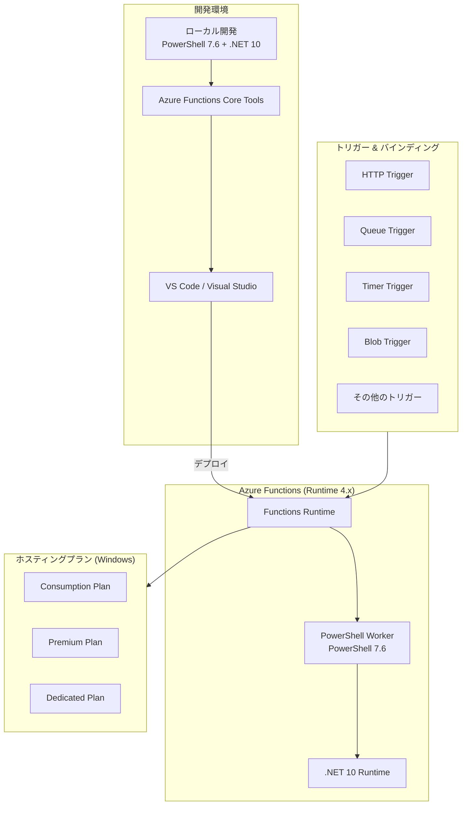

# Azure Functions: PowerShell 7.6 サポート (パブリックプレビュー)

**リリース日**: 2026-07-17

**サービス**: Azure Functions

**機能**: PowerShell 7.6 サポート

**ステータス**: Launched (Public Preview)

[このアップデートのインフォグラフィックを見る](https://takech9203.github.io/azure-news-summary/20260717-functions-powershell-76.html)

## 概要

Azure Functions における PowerShell 7.6 のサポートがパブリックプレビューとして利用可能になりました。これにより、開発者は PowerShell 7.6 を使用してローカルでアプリケーションを開発し、Azure Functions プランにデプロイできるようになります。PowerShell 7.6 は .NET 10 ランタイム上で構築されており、最新の .NET エコシステムの恩恵を受けることができます。

PowerShell 7.6 は Azure Functions ランタイム バージョン 4.x でサポートされ、現時点では Windows ホスティングプラン（Consumption、Premium、Dedicated）でのみ利用可能です。これは、既存の PowerShell 7.4 (GA) サポートに加えて提供される新しいランタイムオプションです。

本アップデートにより、PowerShell 7.6 で導入された多数の改善点（タブ補完の強化、コマンドレットの改善、エンジンの最適化など）を Azure Functions のサーバーレス環境で活用できるようになります。

**アップデート前の課題**
- Azure Functions で利用可能な PowerShell バージョンは 7.4 (GA) が最新であった
- .NET 10 の新機能やパフォーマンス改善を PowerShell 関数で活用できなかった
- PowerShell 7.6 で追加された新しいコマンドレット機能やタブ補完の改善を利用できなかった

**アップデート後の改善**
- PowerShell 7.6 (.NET 10 ベース) を使用した関数開発が可能に
- タブ補完の大幅な改善による開発効率の向上
- 新しいコマンドレット機能（`Get-Clipboard` の `-Delimiter` パラメータ、`Get-Command` の `-ExcludeModule` パラメータなど）
- エンジンの最適化による実行パフォーマンスの向上
- PSResourceGet v1.2.0、PSReadLine v2.4.5 などの最新モジュールの利用

## アーキテクチャ図



## サービスアップデートの詳細

### 主要機能

| 項目 | 詳細 |
|------|------|
| PowerShell バージョン | 7.6.3 |
| .NET ランタイム | .NET 10.0.9 |
| Functions ランタイム | 4.x |
| サポートレベル | Public Preview |
| 対応 OS | Windows のみ |

### PowerShell 7.6 の主な新機能

- **タブ補完の大幅な改善**: エイリアスの展開、パラメータのツールチップ表示、変数型推論の改善など多数
- **コマンドレットの改善**: `Get-Clipboard` に `-Delimiter` パラメータ追加、`Get-Command` に `-ExcludeModule` パラメータ追加
- **エンジンの改善**: PSRP プロトコルの更新、`SearchValues<char>` による効率的な文字検索
- **モジュールの更新**: PSResourceGet v1.2.0、PSReadLine v2.4.5、Microsoft.PowerShell.ThreadJob v2.2.0
- **実験的機能の正式化**: PSFeedbackProvider、PSNativeWindowsTildeExpansion、PSRedirectToVariable、PSSubsystemPluginModel

### 破壊的変更

- `Microsoft.PowerShell.ThreadJob` が `ThreadJob` モジュールを置き換え
- `WildcardPattern.Escape` の単独バッククォートのエスケープ修正
- `Join-Path` の `-ChildPath` パラメータが `string[]` に変更
- イベントソース名の末尾スペースの削除

## 技術仕様

| 仕様 | 値 |
|------|-----|
| 対応ランタイムバージョン | Azure Functions 4.x |
| 必須 .NET バージョン | .NET 10 |
| 対応ホスティング | Windows (Consumption, Premium, Dedicated) |
| Linux Consumption | 非対応 |
| Flex Consumption | 未確認 |
| 並行処理 | PSWorkerInProcConcurrencyUpperBound で制御（デフォルト: 1000） |
| マネージド依存関係 | requirements.psd1 で管理 |

## 設定方法

### 前提条件

- Azure Functions Core Tools (最新版)
- PowerShell 7.6 がローカルにインストールされていること
- .NET 10 SDK
- Azure Functions ランタイム 4.x

### ローカル開発設定

`local.settings.json` に以下を設定:

```json
{
  "IsEncrypted": false,
  "Values": {
    "AzureWebJobsStorage": "",
    "FUNCTIONS_WORKER_RUNTIME": "powershell",
    "FUNCTIONS_WORKER_RUNTIME_VERSION": "7.6"
  }
}
```

### Azure Portal

1. Azure Portal で Function App に移動
2. **設定** > **構成** を選択
3. **全般設定** タブで **PowerShell バージョン** を選択
4. **PowerShell Core version** で 7.6 を選択し **保存** をクリック
5. 再起動の警告が表示されたら **続行** を選択

### Azure PowerShell

```powershell
Set-AzResource -ResourceId "/subscriptions/<SUBSCRIPTION_ID>/resourceGroups/<RESOURCE_GROUP>/providers/Microsoft.Web/sites/<FUNCTION_APP>/config/web" -Properties @{ powerShellVersion = '7.6' } -Force -UsePatchSemantics
```

## メリット

### ビジネス面

- **最新技術の活用**: .NET 10 ベースの最新ランタイムによるパフォーマンス向上
- **開発効率の向上**: 改善されたタブ補完や新コマンドレットにより、スクリプト開発の生産性が向上
- **将来への準備**: PowerShell 7.4 のサポート終了 (2026-11-10) に向けた移行準備が可能

### 技術面

- **.NET 10 エコシステム**: 最新の .NET ライブラリやパフォーマンス最適化を活用可能
- **セキュリティの強化**: テレメトリのプライバシー設定対応、PSRP プロトコルの改善
- **開発体験の向上**: PSReadLine v2.4.5 による改善されたインタラクティブ体験
- **モジュール管理**: PSResourceGet v1.2.0 による効率的なモジュール管理

## デメリット・制約事項

- **プレビュー段階**: 本番環境での使用は推奨されない。SLA の保証なし
- **Windows のみ**: 現時点では Windows ホスティングプランでのみサポート。Linux は非対応
- **破壊的変更あり**: PowerShell 7.4 からの移行時に互換性の問題が発生する可能性
- **Linux Consumption 非対応**: PowerShell 7.4 が Linux Consumption プランでサポートされる最後のバージョン
- **Managed Dependencies の制限**: Flex Consumption プランでは Managed Dependencies 機能は未サポート
- **サポート期間未定**: プレビューのためサポート終了日が TBD (未定)

## ユースケース

| シナリオ | 説明 |
|----------|------|
| インフラ自動化 | Azure リソースのプロビジョニング・設定をサーバーレスで自動化 |
| 運用タスクの自動化 | Timer トリガーによる定期的なメンテナンスタスクの実行 |
| イベント駆動処理 | Queue/Blob トリガーによるファイル処理やデータ変換 |
| API エンドポイント | HTTP トリガーによる PowerShell ベースの REST API の構築 |
| セキュリティ監査 | Azure リソースのコンプライアンスチェックの自動化 |
| レポート生成 | スケジュールベースでのレポート生成・通知の自動化 |

## 料金

Azure Functions の料金は選択するホスティングプランに依存します。PowerShell 7.6 の使用による追加料金はありません。

| プラン | 特徴 |
|--------|------|
| Consumption Plan | 実行回数と実行時間に基づく従量課金。月間 100 万回の実行と 400,000 GB-s の無料枠あり |
| Premium Plan | 常時ウォームインスタンス、VNet 統合、無制限の実行時間 |
| Dedicated (App Service) Plan | App Service プランの料金体系に準拠 |

※ 最新の料金情報は [Azure Functions 料金ページ](https://azure.microsoft.com/pricing/details/functions/) を参照してください。

## 利用可能リージョン

Windows ホスティングプラン (Consumption, Premium, Dedicated) が利用可能な全リージョンで利用可能です。Linux ホスティングプランでは現時点で非対応です。

## 関連サービス・機能

| サービス/機能 | 関連性 |
|---------------|--------|
| Azure Functions Runtime 4.x | PowerShell 7.6 を実行するための基盤ランタイム |
| .NET 10 | PowerShell 7.6 の基盤ランタイム |
| Azure Functions Core Tools | ローカル開発・デバッグ用ツール |
| Azure PowerShell (Az モジュール) | Functions 内で Azure リソースを管理するためのモジュール |
| Application Insights | Functions の監視・ログ分析 |
| Durable Functions | 長時間実行ワークフローのオーケストレーション |

## 参考リンク

- [インフォグラフィック](https://takech9203.github.io/azure-news-summary/20260717-functions-powershell-76.html)
- [公式アップデート情報](https://azure.microsoft.com/updates?id=567651)
- [Microsoft Learn - Azure Functions PowerShell 開発者リファレンス](https://learn.microsoft.com/azure/azure-functions/functions-reference-powershell)
- [What's New in PowerShell 7.6](https://learn.microsoft.com/powershell/scripting/whats-new/what-s-new-in-powershell-76)
- [Azure Functions ランタイムバージョン](https://learn.microsoft.com/azure/azure-functions/functions-versions)
- [料金ページ](https://azure.microsoft.com/pricing/details/functions/)

## まとめ

Azure Functions の PowerShell 7.6 サポート (パブリックプレビュー) は、.NET 10 上に構築された最新の PowerShell ランタイムをサーバーレス環境で利用可能にするアップデートです。タブ補完の大幅な改善、新しいコマンドレット機能、エンジンの最適化により、PowerShell を使用した Azure Functions 開発の生産性とパフォーマンスが向上します。

現時点ではプレビュー段階であり Windows ホスティングプランのみの対応ですが、PowerShell 7.4 のサポート終了 (2026年11月) に向けた移行計画を早期に検討することが推奨されます。既存の PowerShell 7.4 アプリケーションからの移行時には破壊的変更の確認が必要です。

---
**タグ**: #Azure #AzureFunctions #PowerShell #ServerlessComputing #Preview
