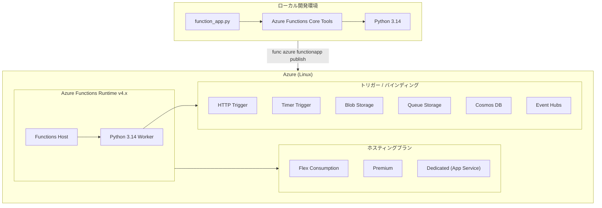

# Azure Functions: Python 3.14 サポート一般提供開始

**リリース日**: 2026-07-17

**サービス**: Azure Functions

**機能**: Python 3.14 ランタイムサポート

**ステータス**: Launched (GA)

[このアップデートのインフォグラフィックを見る](https://takech9203.github.io/azure-news-summary/20260717-functions-python-314.html)

## 概要

Azure Functions で Python 3.14 のサポートが一般提供 (GA) として開始された。これにより、開発者はローカル環境で Python 3.14 を使用して関数を開発し、Linux 上の Azure Functions プランにデプロイできるようになった。Python 3.14 は Azure Functions でサポートされる最新の Python バージョンであり、2030 年 10 月までのサポートが予定されている。

Python 3.14 のサポートは Azure Functions ランタイム v4.x 上で動作する。Python 3.13 以降で導入された依存関係の完全分離、ランタイムバージョン制御、HTTP ストリーミングの簡素化といった改善が Python 3.14 でも継続して利用可能である。なお、Python 3.12 が Linux Consumption プランでサポートされる最後の Python バージョンであるため、Python 3.14 を利用するには Flex Consumption プラン、Premium プラン、または Dedicated (App Service) プランが必要となる。

既存のアプリケーションを Python 3.14 にアップグレードすることで、セキュリティの強化、より長いサポートウィンドウ、Azure Functions ランタイムとの継続的な互換性を享受できる。

**アップデート前の課題**

- Azure Functions でサポートされる Python の最新バージョンが 3.13 までに限定されていた
- Python 3.13 のサポート終了は 2029 年 10 月であり、長期運用プロジェクトではサポート期間の制約があった
- Python 3.14 の新機能やパフォーマンス改善を Azure Functions で活用できなかった

**アップデート後の改善**

- Python 3.14 をローカル開発環境および Azure 上のプロダクション環境で利用可能になった
- サポート期間が 2030 年 10 月まで延長され、長期運用プロジェクトに適した選択肢が追加された
- Python 3.14 のセキュリティ強化と言語機能改善を Azure Functions 上で活用できるようになった
- 依存関係の完全分離が標準で有効化されており、パッケージ競合のリスクが低減されている

## アーキテクチャ図



## サービスアップデートの詳細

### 主要機能

1. **Python 3.14 ランタイムサポート**: Linux 上の Azure Functions プランで Python 3.14 を使用した関数の実行が可能
2. **ローカル開発対応**: Azure Functions Core Tools を使用して Python 3.14 でのローカル開発・テストが可能
3. **依存関係の完全分離**: Python 3.13 以降と同様に、アプリケーションの依存関係がワーカーの依存関係から完全に分離される (PYTHON_ISOLATE_WORKER_DEPENDENCIES 設定は不要)
4. **ランタイムバージョン制御**: `azure-functions-runtime` パッケージを requirements.txt に追加することで、Python ランタイムバージョンのピン留めや最新版への追従が選択可能
5. **HTTP ストリーミング簡素化**: 特別なアプリ設定なしで HTTP ストリーミングが利用可能
6. **v2 プログラミングモデル対応**: デコレータベースのプログラミングモデル (v2) で Python 3.14 を利用可能

## 技術仕様

| 項目 | 詳細 |
|------|------|
| サポートバージョン | Python 3.14 |
| サポートレベル | GA (一般提供) |
| サポート終了予定 | 2030 年 10 月 |
| Functions ランタイム | v4.x |
| 対応 OS | Linux |
| プログラミングモデル | v1 (configuration-based) / v2 (decorator-based) |
| 対応ホスティングプラン | Flex Consumption, Premium, Dedicated (App Service) |
| Linux Consumption プラン | 非対応 (Python 3.12 が最後のサポートバージョン) |
| 依存関係分離 | 標準で有効 |
| ODBC ドライバ | ODBC Driver 18 対応 |

## 設定方法

### 前提条件

- Azure Functions Core Tools v4.x 以降
- Python 3.14 がローカルにインストール済み
- Azure CLI (最新版推奨)
- Linux ベースの Azure Functions プラン (Flex Consumption, Premium, または Dedicated)

### Azure CLI

```bash
# リソースグループの作成
az group create --name myResourceGroup --location japaneast

# ストレージアカウントの作成
az storage account create \
  --name mystorageaccount \
  --location japaneast \
  --resource-group myResourceGroup \
  --sku Standard_LRS

# Python 3.14 で Function App を作成 (Flex Consumption プラン)
az functionapp create \
  --resource-group myResourceGroup \
  --name myFunctionApp \
  --storage-account mystorageaccount \
  --runtime python \
  --runtime-version 3.14 \
  --os-type Linux \
  --functions-version 4

# 既存アプリの Python バージョンを 3.14 に変更
az functionapp config set \
  --resource-group myResourceGroup \
  --name myFunctionApp \
  --linux-fx-version "Python|3.14"
```

### ローカル開発

```bash
# 新規プロジェクトの作成
func init myProject --python --model V2

# Python 3.14 仮想環境の作成
python3.14 -m venv .venv
source .venv/bin/activate

# 依存関係のインストール
pip install -r requirements.txt

# ローカルでの実行
func start
```

### requirements.txt の設定例

```text
azure-functions
azure-functions-runtime
```

### Azure Portal

1. Azure Portal で Function App リソースを開く
2. 「設定」>「構成」>「全般設定」を選択
3. 「Python バージョン」で「3.14」を選択
4. 「保存」をクリックしてアプリを再起動

## メリット

### ビジネス面

- **長期サポート**: 2030 年 10 月までのサポートにより、長期プロジェクトの安定運用が可能
- **セキュリティ強化**: 最新の Python バージョンによるセキュリティパッチと脆弱性修正の継続的な提供
- **人材確保**: 最新技術スタックの採用により、開発者の採用・リテンションに有利
- **コスト最適化**: パフォーマンス改善による実行時間短縮の可能性

### 技術面

- **依存関係の完全分離**: ワーカーとアプリケーションの依存関係競合を完全に排除
- **ランタイムバージョン制御**: プロダクション環境でのランタイムバージョンのピン留めが可能
- **HTTP ストリーミング簡素化**: 追加設定なしで HTTP ストリーミングを利用可能
- **最新 Python 機能**: Python 3.14 の言語機能やパフォーマンス改善を活用可能
- **デコレータベースモデル**: v2 プログラミングモデルにより、トリガーとバインディングをコード内で宣言的に定義

## デメリット・制約事項

- **Linux Consumption プラン非対応**: Python 3.12 が Linux Consumption プランでサポートされる最後のバージョン。Python 3.14 を利用するには Flex Consumption プラン以上への移行が必要
- **再ビルドが必要**: Python バージョンを変更した場合、アプリの再ビルドと再デプロイが必要。既存のデプロイアーティファクトは自動的に再ビルドされない
- **依存パッケージの互換性**: 一部のサードパーティパッケージが Python 3.14 に対応していない可能性がある
- **Worker Extensions 非サポート**: Python 3.13 以降と同様に、Worker Extensions と共有メモリ機能はサポートされない
- **Windows 非対応**: Python ベースの Azure Functions は Linux 上でのみ動作する

## ユースケース

1. **長期運用の API バックエンド**: 2030 年までのサポートを活かし、長期的に安定したサーバーレス API を構築
2. **IoT データ処理パイプライン**: Event Hubs や IoT Hub からのストリーミングデータを Python 3.14 の改善されたパフォーマンスで処理
3. **機械学習推論エンドポイント**: 最新の ML ライブラリと Python 3.14 の互換性を活かした推論 API の構築
4. **イベント駆動型データ処理**: Blob Storage や Cosmos DB のトリガーを使用したリアクティブなデータ処理ワークフロー
5. **マイクロサービスアーキテクチャ**: HTTP トリガーと Durable Functions を組み合わせたサーバーレスマイクロサービスの構築

## 料金

Azure Functions の料金は選択するホスティングプランによって異なる。Python 3.14 の利用に追加料金は発生しない。

| プラン | 課金モデル | 特徴 |
|--------|-----------|------|
| Flex Consumption | 実行回数 + リソース消費量 | オンデマンドスケーリング、Python 3.14 対応 |
| Premium (Elastic Premium) | vCPU/メモリ秒単位 | 常時ウォーム、VNet 統合、無制限実行時間 |
| Dedicated (App Service) | App Service プラン料金 | 予測可能な課金、既存リソースの活用 |

※ 最新の料金情報は [Azure Functions 料金ページ](https://azure.microsoft.com/pricing/details/functions/) を参照。

## 利用可能リージョン

Azure Functions の Python 3.14 サポートは、Linux 上で Azure Functions v4.x をサポートする全リージョンで利用可能。日本リージョンを含む主要リージョンで利用できる。

## 関連サービス・機能

- **Azure Functions Flex Consumption プラン**: Python 3.14 を利用可能な推奨ホスティングプラン
- **Azure Functions Core Tools**: ローカル開発・テスト・デプロイに使用する CLI ツール
- **Azure Application Insights**: Functions の監視・ログ収集
- **OpenTelemetry**: 標準化されたテレメトリの収集
- **Azure DevOps / GitHub Actions**: CI/CD パイプラインによる自動デプロイ
- **Durable Functions**: ステートフルなワークフローの構築

## 参考リンク

- [インフォグラフィック](https://takech9203.github.io/azure-news-summary/20260717-functions-python-314.html)
- [公式アップデート情報](https://azure.microsoft.com/updates?id=567646)
- [Microsoft Learn: Azure Functions Python 開発者リファレンス](https://learn.microsoft.com/azure/azure-functions/functions-reference-python)
- [Microsoft Learn: サポートされている言語](https://learn.microsoft.com/azure/azure-functions/supported-languages)
- [料金ページ](https://azure.microsoft.com/pricing/details/functions/)

## まとめ

Azure Functions における Python 3.14 サポートの GA により、開発者は最新の Python バージョンを使用したサーバーレスアプリケーションの構築が可能になった。2030 年 10 月までの長期サポート、セキュリティ強化、依存関係の完全分離といったメリットがある。

**推奨アクション**:

1. 新規プロジェクトでは Python 3.14 の採用を検討する
2. 既存アプリケーションの Python バージョンアップグレードを計画する (再ビルド・再デプロイが必要)
3. Linux Consumption プランを使用している場合は、Flex Consumption プランへの移行を検討する (Python 3.12 が Consumption プランの最後のサポートバージョン)
4. requirements.txt に `azure-functions-runtime` を追加し、ランタイムバージョン制御を有効化することを検討する

---

**タグ**: #Azure #AzureFunctions #Python #ServerlessComputing #GA
