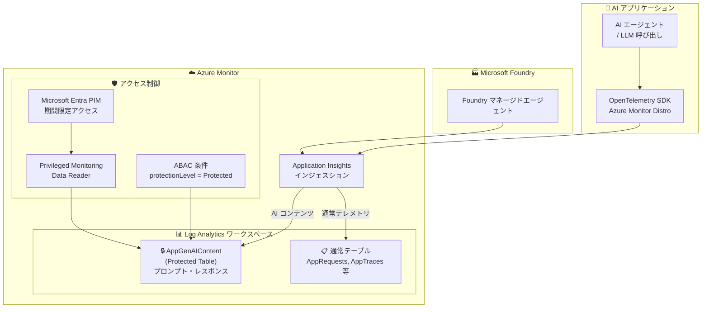

# Azure Monitor Application Insights: 生成 AI テレメトリのセンシティブデータ保護

**リリース日**: 2026-07-20

**サービス**: Azure Monitor Application Insights

**機能**: 生成 AI コンテンツの専用テーブル (GenAIContent / AppGenAIContent) によるアクセス制御

**ステータス**: In preview

[このアップデートのインフォグラフィックを見る](https://takech9203.github.io/azure-news-summary/20260720-application-insights-genai-telemetry-protection.html)

## 概要

Azure Monitor Application Insights において、生成 AI コンテンツが専用の GenAIContent テーブル (Log Analytics では AppGenAIContent テーブル) に格納されるようになった。これにより、センシティブな AI テレメトリ (プロンプト、レスポンス、システムメッセージなど) に対して、新たに利用可能となったアクセス制御を適用できるようになる。

Application Insights はこれまでも生成 AI エージェントのトレーシングをサポートしていたが、プロンプトやレスポンスなどのセンシティブなコンテンツが通常のテレメトリデータと同じテーブルに格納されていた。今回のアップデートにより、AI コンテンツが専用テーブルに分離され、Protected Tables (プレビュー) 機能を活用したきめ細かなアクセス制御が可能になった。

この機能は Microsoft Foundry との連携も対象としており、Azure AI Foundry で管理されるエージェントやワークフローから発生する AI テレメトリの保護にも活用できる。

**アップデート前の課題**

- 生成 AI のプロンプト・レスポンスデータが通常のアプリケーションテレメトリと同じテーブルに格納され、分離できなかった
- AI コンテンツに含まれる機密情報 (PII、企業秘密、ユーザーとの対話内容) へのアクセスを選択的に制限する手段がなかった
- Log Analytics ワークスペースへの読み取り権限を持つ全ユーザーが AI の入出力内容を閲覧可能だった

**アップデート後の改善**

- 生成 AI コンテンツが GenAIContent (AppGenAIContent) 専用テーブルに格納され、他のテレメトリから分離される
- Protected Tables 機能により「deny by default」モデルでテーブルレベルのアクセス制御を適用可能
- Privileged Monitoring Data Reader ロールや ABAC 条件付きカスタムロールによる、きめ細かな権限管理が可能
- Microsoft Entra Privileged Identity Management (PIM) と組み合わせた期間限定のジャストインタイムアクセスが実現可能

## アーキテクチャ図



AI アプリケーションや Microsoft Foundry エージェントからのテレメトリが Application Insights に送信され、生成 AI コンテンツは自動的に AppGenAIContent テーブルに格納される。このテーブルは Protected Table として設定でき、RBAC/ABAC による厳密なアクセス制御が適用される。

## サービスアップデートの詳細

### 主要機能

1. **GenAIContent 専用テーブル**
   - 生成 AI のプロンプト、レスポンス、システムメッセージなどのコンテンツが専用テーブルに自動格納される
   - Application Insights では GenAIContent テーブル、Log Analytics では AppGenAIContent テーブルとして利用可能
   - 通常のアプリケーションテレメトリ (リクエスト、トレース、例外等) とは物理的に分離される

2. **Protected Tables によるアクセス制御**
   - テーブルの protectionLevel を「Protected」に設定することで、「deny by default」モデルを適用
   - 非特権ロール (Reader, Monitoring Reader 等) ではデータにアクセスできなくなる
   - クエリは成功するが、権限のないユーザーには結果が 0 行で返される (エラーは発生しない)

3. **Privileged Monitoring Data Reader ロール**
   - Protected テーブルへのアクセスを許可する組み込みロール
   - サブスクリプション、リソースグループ、ワークスペース、リソースの各スコープで割り当て可能
   - Microsoft Entra PIM と連携して期間限定アクセスを付与可能

4. **ABAC (属性ベースアクセス制御) 条件**
   - 特定の Protected テーブルのみへのアクセスを許可するカスタムロールを作成可能
   - テーブル名と protectionLevel 属性の組み合わせでアクセス条件を定義
   - DataActions (`Microsoft.OperationalInsights/workspaces/tables/data/read`) を使用

5. **DataActionsOnly モード**
   - ワークスペースの dataAuthorizationMode を DataActionsOnly に設定可能
   - コントロールプレーンロール (Reader 等) による暗黙的なデータアクセスを遮断
   - DataActions のみがデータアクセスを制御するようになり、Protected Tables の保護を強化

## 技術仕様

| 項目 | 詳細 |
|------|------|
| テーブル名 (Application Insights) | GenAIContent |
| テーブル名 (Log Analytics) | AppGenAIContent |
| 保護モデル | Protected Tables (deny by default) |
| アクセス制御方式 | Azure RBAC + ABAC 条件 |
| 必要な DataActions | `Microsoft.OperationalInsights/workspaces/tables/data/read` |
| ABAC 属性 | `Microsoft.OperationalInsights/workspaces/tables:protectionLevel` |
| 組み込みロール | Privileged Monitoring Data Reader |
| PIM 対応 | 対応 (期間限定アクセス可能) |
| API バージョン | 2025-02-01 以降 |

## 設定方法

### 前提条件

1. Log Analytics ワークスペースが存在すること
2. ワークスペースに対する Owner または Log Analytics Contributor ロール (`Microsoft.OperationalInsights/workspaces/tables/protectionLevel/write` アクション)
3. Azure RBAC および ABAC 条件の基本的な理解

### Azure CLI

```bash
# AppGenAIContent テーブルの protectionLevel を Protected に設定
subscriptionId="<your-subscription-id>"
resourceGroupName="<your-resource-group>"
workspaceName="<your-workspace-name>"
tableName="AppGenAIContent"

apiEndpoint="https://management.azure.com"
path="/subscriptions/$subscriptionId/resourceGroups/$resourceGroupName"
provider="Microsoft.OperationalInsights/workspaces/$workspaceName/tables/$tableName"
url="$apiEndpoint$path/providers/$provider?api-version=2025-02-01"

az rest --method patch --url "$url" \
  --body '{"properties": {"protectionLevel": "Protected"}}'
```

```bash
# Privileged Monitoring Data Reader ロールの割り当て
assigneeObjectId="<user-or-group-object-id>"
scope="/subscriptions/$subscriptionId/resourceGroups/$resourceGroupName/providers/Microsoft.OperationalInsights/workspaces/$workspaceName"

az role assignment create \
  --assignee "$assigneeObjectId" \
  --role "Privileged Monitoring Data Reader" \
  --scope "$scope"
```

### Azure Portal

1. **テーブルの保護設定**:
   - Log Analytics ワークスペースを開く
   - [設定] > [テーブル] で AppGenAIContent テーブルを選択
   - [...] メニューから [テーブルの管理] を選択
   - [Protection level] を [Protected] に変更して保存

2. **アクセス権の付与**:
   - 対象スコープで [アクセス制御 (IAM)] > [追加] > [ロールの割り当ての追加]
   - [Privileged Monitoring Data Reader] ロールを選択
   - 対象ユーザー/グループ/マネージド ID を選択して割り当て

## メリット

### ビジネス面

- AI アプリケーションのプロンプトやレスポンスに含まれる機密データ (PII、企業秘密) のアクセスを厳密に制限できる
- コンプライアンス要件 (GDPR、HIPAA 等) への対応が容易になる
- インシデント対応時にのみ PIM で一時的なアクセスを付与するワークフローが実現可能

### 技術面

- AI テレメトリの可観測性を維持しつつ、センシティブデータへのアクセスを最小権限の原則に基づいて制御できる
- 既存の Azure RBAC/ABAC インフラストラクチャを活用するため、新たなツール導入が不要
- DataActionsOnly モードによりコントロールプレーンからの暗黙的アクセスを完全に遮断可能
- エラーが発生しない設計 (権限なしの場合は 0 行返却) により、アプリケーションへの影響を最小化

## デメリット・制約事項

- プレビュー段階のため、GA までに仕様が変更される可能性がある
- クロスワークスペースクエリ (`app()`, `workspace()` 関数) は Protected テーブルに対して未サポート
- テーブル保護はワークスペース単位の設定であり、リソース単位の粒度では設定できない
- アラートルールで Protected テーブルにアクセスする場合、マネージド ID の設定と適切なロール割り当てが必要
- Azure Portal では組み込みロールへの ABAC 条件追加がサポートされていない (ARM テンプレート、REST API 等のプログラム的手法が必要)
- スキーマ (列名、型) は保護レベルに関係なく可視のままとなる (データ行のみが制限される)

## ユースケース

### ユースケース 1: エンタープライズ AI チャットボットの監視

**シナリオ**: 顧客対応 AI チャットボットを運用しているが、会話内容には顧客の個人情報が含まれるため、SRE チームには AI のパフォーマンスメトリクスのみを見せ、AI コンテンツ (プロンプト・レスポンス) は AI 品質管理チームのみに限定したい。

**効果**: SRE チームは通常テーブル (AppRequests, AppDependencies 等) でレイテンシーやエラー率を監視可能。AI 品質管理チームのみが AppGenAIContent テーブルにアクセスして会話品質を評価できる。

### ユースケース 2: インシデント対応時の一時アクセス

**シナリオ**: AI モデルの出力に問題が報告された場合、調査担当者に PIM を通じて一時的に AppGenAIContent テーブルへのアクセスを付与し、問題のプロンプト・レスポンスを確認する。

**効果**: 通常時はセンシティブデータへのアクセスが遮断され、インシデント時のみ時間制限付きでアクセスが許可されるため、最小権限の原則を維持できる。

## 料金

Application Insights および Log Analytics の料金体系に従う。GenAIContent / AppGenAIContent テーブルへのデータインジェストは通常の Log Analytics データインジェスト料金が適用される。Protected Tables 機能自体に追加の課金はない。

詳細は [Azure Monitor の料金ページ](https://azure.microsoft.com/pricing/details/monitor/) を参照。

## 関連サービス・機能

- **Azure Monitor Log Analytics**: GenAIContent テーブルのホストとなるワークスペース。Protected Tables 機能を提供
- **Microsoft Foundry (Azure AI Foundry)**: AI エージェントのトレーシングとテレメトリ送信元
- **Azure RBAC / ABAC**: テーブルレベルのアクセス制御を実現する基盤
- **Microsoft Entra Privileged Identity Management (PIM)**: 期間限定のジャストインタイムアクセスを提供
- **OpenTelemetry**: AI テレメトリのデータ収集フレームワーク (Azure Monitor OpenTelemetry Distro)
- **Application Insights Agents View**: AI エージェントの監視ダッシュボード

## 参考リンク

- [インフォグラフィック](https://takech9203.github.io/azure-news-summary/20260720-application-insights-genai-telemetry-protection.html)
- [公式アップデート情報](https://azure.microsoft.com/updates?id=567594)
- [Microsoft Learn - Configure Protected Tables in Azure Monitor Logs](https://learn.microsoft.com/en-us/azure/azure-monitor/logs/protected-tables-configure)
- [Microsoft Learn - Manage access to Log Analytics workspaces](https://learn.microsoft.com/en-us/azure/azure-monitor/logs/manage-access)
- [Microsoft Learn - Application Insights OpenTelemetry overview](https://learn.microsoft.com/en-us/azure/azure-monitor/app/app-insights-overview)
- [料金ページ](https://azure.microsoft.com/pricing/details/monitor/)

## まとめ

Azure Monitor Application Insights の GenAIContent テーブル (Log Analytics の AppGenAIContent テーブル) により、生成 AI アプリケーションのプロンプト・レスポンスなどのセンシティブなコンテンツが通常のテレメトリから分離され、Protected Tables 機能を通じたきめ細かなアクセス制御が可能になった。AI アプリケーションの可観測性を犠牲にすることなく、機密データの保護とコンプライアンス要件への対応を実現するアップデートである。Solutions Architect としては、既存の AI ワークロードにおけるテレメトリのアクセス制御ポリシーを見直し、AppGenAIContent テーブルの保護設定を早期に検討することを推奨する。

---

**タグ**: #AzureMonitor #ApplicationInsights #GenerativeAI #Security #RBAC #LogAnalytics #ProtectedTables #MicrosoftFoundry #OpenTelemetry
