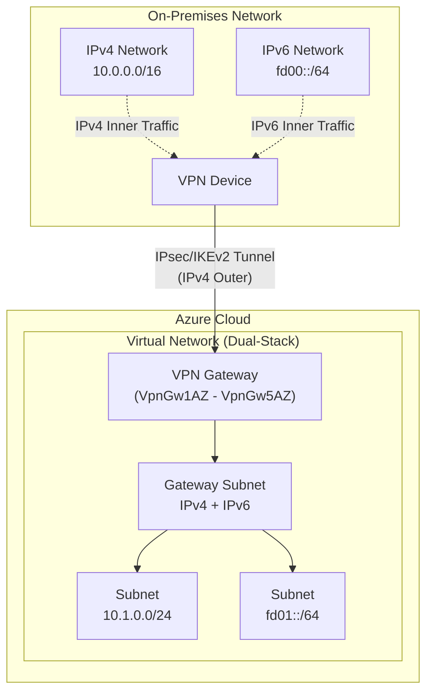

# Azure VPN Gateway: IPv6 デュアルスタックサポートの一般提供 (GA)

**リリース日**: 2026-07-20

**サービス**: Azure VPN Gateway

**機能**: IPv6 support for Azure VPN Gateway

**ステータス**: Launched (GA)

[このアップデートのインフォグラフィックを見る](https://takech9203.github.io/azure-news-summary/20260720-vpn-gateway-ipv6-support.html)

## 概要

Azure VPN Gateway における IPv6 サポートが一般提供 (GA) として正式にリリースされた。この機能により、VPN トンネル内で IPv6 インナートラフィックをデュアルスタック構成で実行することが可能となる。IPv6 はスタンダードパブリック IP を使用するすべてのプロダクション SKU ゲートウェイでサポートされる。

デュアルスタック構成により、オンプレミスやリモートユーザーデバイスから Azure VPN Gateway への接続において、IPv4 と IPv6 の両方のトラフィックをシームレスに VPN トンネル内で送受信できるようになった。サイト間 (S2S)、ポイント対サイト (P2S)、VNet 間 (VNet-to-VNet) の各接続タイプで IPv6 インナートラフィックを構成可能である。

この GA リリースにより、IPv6 ネイティブなワークロードを Azure 上で運用する企業にとって、オンプレミスとのハイブリッド接続やリモートアクセスの IPv6 対応が本番環境で利用可能となった。

**アップデート前の課題**

- VPN Gateway 経由のトラフィックは IPv4 のみに制限されており、IPv6 ネイティブなワークロードには別途ルーティングやトンネリングが必要だった
- オンプレミスの IPv6 ネットワークと Azure VNet 間で IPv6 トラフィックを直接転送する手段がなかった
- IPv6 移行を進める企業では、VPN 接続部分が IPv4 ボトルネックとなっていた

**アップデート後の改善**

- VPN トンネル内で IPv6 インナートラフィックをネイティブに転送可能
- デュアルスタック (IPv4 + IPv6) 構成によりシームレスな移行パスを提供
- サイト間、ポイント対サイト、VNet 間のすべての主要接続タイプで IPv6 に対応
- Standard パブリック IP を使用するプロダクション SKU (VpnGw1AZ - VpnGw5AZ) で利用可能

## アーキテクチャ図

Azure VPN Gateway のデュアルスタック構成を示す図。VPN トンネルの外部は IPv4 で確立され、内部で IPv4 と IPv6 の両方のトラフィックが転送される。

## サービスアップデートの詳細

### 主要機能

1. **IPv6 デュアルスタック VPN トンネル**
   - VPN トンネル内で IPv4 と IPv6 の両方のインナートラフィックを同時に転送
   - オンプレミスの IPv6 ネットワークと Azure VNet 間でネイティブ IPv6 通信を実現

2. **複数接続タイプのサポート**
   - サイト間 (Site-to-Site) VPN: IKEv2 プロトコルで IPv6 インナートラフィックをサポート
   - ポイント対サイト (Point-to-Site) VPN: IKEv2 および OpenVPN プロトコルで IPv6 をサポート
   - VNet 間 (VNet-to-VNet) 接続: デュアルスタック VNet 間の IPv6 トラフィック転送

3. **プロダクション SKU 対応**
   - VpnGw1AZ から VpnGw5AZ まで全てのゾーン冗長 SKU で利用可能
   - Standard パブリック IP アドレスを使用するゲートウェイが対象

4. **Azure Portal/PowerShell/CLI 対応**
   - Azure Portal でのグラフィカルな構成
   - PowerShell および Azure CLI による自動化構成をサポート

## 技術仕様

| 項目 | 詳細 |
|------|------|
| サポート SKU | VpnGw1AZ, VpnGw2AZ, VpnGw3AZ, VpnGw4AZ, VpnGw5AZ |
| 非対応 SKU | Basic SKU (IPv6 非サポート) |
| パブリック IP 要件 | Standard SKU パブリック IP アドレス |
| サポートプロトコル (S2S) | IKEv2 (IKEv1 は IPv6 非サポート) |
| サポートプロトコル (P2S) | IKEv2, OpenVPN (SSTP は IPv6 非サポート) |
| IPv6 トラフィック範囲 | インナートラフィックのみ (アウタートンネルは IPv4) |
| VPN タイプ | Route-based (ルートベース) |
| デュアルスタック→IPv4 のみへの変更 | 不可 (デュアルスタックで展開後、IPv4 のみに戻せない) |

## 設定方法

### 前提条件

1. Azure サブスクリプション
2. VpnGw1AZ 以上の SKU を使用する VPN Gateway (Standard パブリック IP)
3. IPv4 と IPv6 の両方のアドレス空間を持つ仮想ネットワーク
4. サイト間接続の場合: IKEv2 対応の VPN デバイス
5. ポイント対サイト接続の場合: IKEv2 または OpenVPN 対応クライアント

### Azure Portal

1. **仮想ネットワークの作成**: IPv4 と IPv6 の両方のアドレス範囲を指定

2. **ゲートウェイサブネットの作成**: IPv4 と IPv6 の両方のアドレス範囲を持つゲートウェイサブネットを構成

3. **仮想ネットワークゲートウェイの作成**: IPv4 と IPv6 の構成設定を含むゲートウェイを作成

4. **ローカルネットワークゲートウェイの作成**: オンプレミスの IPv4 と IPv6 アドレス空間を定義

5. **VPN 接続の作成**: IKEv2 プロトコルを選択して接続を確立

### Azure PowerShell / Azure CLI

PowerShell および CLI を使用した構成では、IPv4 と IPv6 のアドレスを同時に指定して構成を行う。詳細は Microsoft Learn のドキュメントを参照。

## メリット

### ビジネス面

- IPv6 移行戦略の一環として、ハイブリッド接続の IPv6 対応を段階的に実施可能
- デュアルスタック構成により既存の IPv4 インフラとの互換性を維持しつつ IPv6 を導入可能
- IPv6 ネイティブなクライアントやサービスとの接続要件に対応

### 技術面

- VPN トンネル内でネイティブ IPv6 ルーティングが可能となり、トンネリングのオーバーヘッドを削減
- BGP を使用した IPv6 ルート交換により動的ルーティングを実現
- ゾーン冗長 SKU (AZ) との組み合わせにより高可用性を確保
- Active-Active 構成と組み合わせることで冗長性の高いデュアルスタック接続を構築可能

## デメリット・制約事項

- **外部トンネルの IPv6 非対応**: IPv6 はインナートラフィックのみでサポートされ、VPN トンネルの外部 (アウター) は IPv4 で確立される
- **Basic SKU 非対応**: Basic SKU ゲートウェイでは IPv6 を使用できない
- **SSTP プロトコル非対応**: ポイント対サイト接続で SSTP を使用する場合は IPv6 をサポートしない
- **IKEv1 非対応**: サイト間接続で IKEv1 プロトコルを使用する場合は IPv6 をサポートしない
- **不可逆的な変更**: デュアルスタックモードで展開した VPN Gateway は IPv4 のみの構成に戻すことができない
- **非 AZ SKU の廃止予定**: VpnGw1-5 (非 AZ) は統合・移行が予定されており、新規作成には AZ SKU の使用が推奨される

## ユースケース

### ユースケース 1: IPv6 移行中の企業のハイブリッド接続

**シナリオ**: オンプレミスネットワークを IPv6 に段階的に移行中の企業が、Azure 上のワークロードとの IPv6 接続を確立する必要がある。

**効果**: デュアルスタック構成により、IPv4 と IPv6 の両方のトラフィックを単一の VPN トンネルで処理でき、移行期間中の運用複雑性を低減できる。

### ユースケース 2: IPv6 ネイティブ IoT デバイスのリモートアクセス

**シナリオ**: IPv6 アドレスのみを持つ IoT デバイスや次世代サービスが、ポイント対サイト VPN を通じて Azure VNet 内のリソースにアクセスする。

**効果**: IKEv2 または OpenVPN プロトコルを使用したポイント対サイト接続で、IPv6 デバイスからの直接アクセスが可能となる。

### ユースケース 3: マルチリージョン VNet 間のデュアルスタック接続

**シナリオ**: 複数リージョンにまたがる Azure VNet 間で IPv6 トラフィックを VPN Gateway 経由で転送する。

**効果**: VNet-to-VNet 接続でデュアルスタックをサポートし、IPv6 ネイティブなアプリケーション間通信を実現する。

## 料金

VPN Gateway の料金は SKU に基づくゲートウェイの時間料金とデータ転送料金で構成される。IPv6 デュアルスタック構成による追加料金は発生しない。

詳細は [VPN Gateway 料金ページ](https://azure.microsoft.com/pricing/details/vpn-gateway/) を参照。

## 利用可能リージョン

IPv6 デュアルスタック構成は、VpnGw1AZ - VpnGw5AZ SKU が利用可能なすべてのリージョンで使用可能。リージョンの可用性については [Azure リージョン別の製品提供状況](https://azure.microsoft.com/explore/global-infrastructure/products-by-region/) を参照。

## 関連サービス・機能

- **Azure Virtual Network (デュアルスタック)**: IPv4 と IPv6 の両方のアドレス空間を持つ VNet の基盤
- **Azure ExpressRoute**: プライベート接続での IPv6 サポート (別サービス)
- **Azure Virtual WAN**: 大規模ネットワーク接続のための VPN ゲートウェイ
- **Azure Firewall**: デュアルスタック VNet でのネットワークセキュリティ
- **BGP (Border Gateway Protocol)**: IPv6 ルートの動的交換に使用

## 参考リンク

- [インフォグラフィック](https://takech9203.github.io/azure-news-summary/20260720-vpn-gateway-ipv6-support.html)
- [公式アップデート情報](https://azure.microsoft.com/updates?id=567847)
- [Microsoft Learn - Configure IPv6 in Dual Stack for VPN Gateway](https://learn.microsoft.com/en-us/azure/vpn-gateway/ipv6-configuration)
- [Microsoft Learn - About VPN Gateway SKUs](https://learn.microsoft.com/en-us/azure/vpn-gateway/about-gateway-skus)
- [Microsoft Learn - VPN Gateway FAQ (IPv6)](https://learn.microsoft.com/en-us/azure/vpn-gateway/vpn-gateway-vpn-faq)
- [料金ページ](https://azure.microsoft.com/pricing/details/vpn-gateway/)

## まとめ

Azure VPN Gateway の IPv6 デュアルスタックサポートが GA となり、VPN トンネル内で IPv6 インナートラフィックを本番環境で利用可能となった。VpnGw1AZ から VpnGw5AZ の全プロダクション SKU で対応し、サイト間、ポイント対サイト、VNet 間の主要接続タイプをカバーする。IPv6 への移行を計画している組織は、既存の VPN Gateway をデュアルスタック構成に更新するか、新規作成時にデュアルスタックを有効化することを推奨する。ただし、デュアルスタック展開後は IPv4 のみへの戻しができない点、外部トンネルが IPv4 のみである点に注意が必要である。

---

**タグ**: #Azure #VPNGateway #IPv6 #DualStack #Networking #Security #GA
