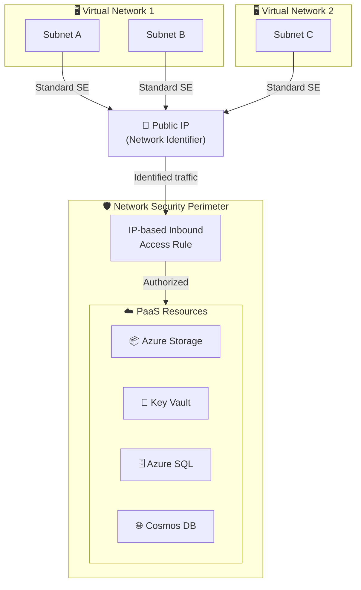

# Azure Private Link: Standard Service Endpoint (パブリックプレビュー)

**リリース日**: 2026-07-22

**サービス**: Azure Private Link / Azure Virtual Network

**機能**: Standard Service Endpoint

**ステータス**: In preview

[このアップデートのインフォグラフィックを見る](https://takech9203.github.io/azure-news-summary/20260722-standard-service-endpoint.html)

## 概要

Azure Standard Service Endpoint がパブリックプレビューとして提供開始された。これは Private Link ファミリーの新しいコネクティビティオプションであり、IaaS ワークロードから Azure PaaS サービスへのスケーラブルかつセキュアな接続を実現する。

従来の (Basic) Service Endpoint が抱えていたスケールと管理の制限を克服し、Network Security Perimeter およびネットワーク識別子 (Network Identifier) の概念を導入することで、大規模環境での IaaS-to-PaaS 接続を大幅に簡素化する。

Standard Service Endpoint は、パブリック IP アドレスを「ネットワーク識別子」としてサブネットのサービスエンドポイントに関連付ける仕組みで動作する。1 つのネットワーク識別子を複数の VNet やサブネットで共有できるため、ACL エントリ数を劇的に削減できる。

**アップデート前の課題**

- Basic Service Endpoint はスケーラビリティの制限があり、大規模環境でリソースプロバイダーのスロットリングに達する問題があった
- サブネットごとに個別の ACL 設定が必要で、VNet やサブネットのライフサイクル変更時にサービス側のアクセスルールの更新が必要だった
- 数千の接続を管理する場合の運用負荷が高かった

**アップデート後の改善**

- 1 つのパブリック IP をネットワーク識別子として複数のサブネット・VNet に関連付け可能になり、ACL エントリを大幅削減
- サブネットのライフサイクル変更時にサービス側のアクセスルールの更新が不要に
- Network Security Perimeter と統合し、一元的なアクセス制御が可能に
- サブスクリプション間での共有もサポート (同一テナント内)

## アーキテクチャ図



1 つのパブリック IP (ネットワーク識別子) で複数の VNet/サブネットを代表し、Network Security Perimeter の IP ベースのインバウンドルールでトラフィックを認可する構成。従来のように個別サブネットごとの ACL 管理が不要となる。

## サービスアップデートの詳細

### 主要機能

1. **ネットワーク識別子 (Network Identifier)**
   - パブリック IP アドレスをサブネットのサービスエンドポイントに関連付ける
   - パブリック IP はトラフィック識別のみに使用され、実際のデータ送信には使われない
   - 同じリージョン・サブスクリプション内で複数の VNet/サブネットに同一 IP を割り当て可能

2. **Network Security Perimeter 統合**
   - PaaS リソースを Network Security Perimeter 内で保護
   - IP ベースのインバウンドアクセスルールでネットワーク識別子に基づくトラフィックを認可
   - 最大 200 プレフィックス、1,000 PaaS リソース/ペリメーター

3. **クロスサブスクリプション対応**
   - 同一テナント内であればサブスクリプションを跨いでパブリック IP をネットワーク識別子として再利用可能
   - クロステナント・クロスリージョンの共有は未サポート

4. **スケーラビリティ**
   - 数千の接続をスロットリングなしで処理可能
   - サブネットのライフサイクル変更がサービス側のアクセスルールに影響しない

## 技術仕様

| 項目 | 詳細 |
|------|------|
| デプロイモデル | Azure Resource Manager のみ |
| サポート対象サービス | Azure Storage (GA)、Azure Key Vault (GA)、Azure SQL Database (プレビュー)、Azure Cosmos DB (プレビュー) |
| ネットワーク識別子 | パブリック IP アドレスまたはパブリック IP プレフィックス |
| NSP 制限 | 100 ペリメーター/サブスクリプション、200 プロファイル/ペリメーター、1,000 リソース/ペリメーター |
| サブネット制約 | 1 サブネット内のすべてのサービスエンドポイントは同じネットワーク識別子を参照する必要あり |
| リージョン対応 | パブリッククラウド + Mooncake、Fairfax、UsSec、UsNAT |
| クロスリージョン | Azure Cosmos DB、Key Vault、Storage はサポート。SQL Database は非サポート (プレビュー期間中) |

## 設定方法

### 前提条件

1. Azure Resource Manager デプロイモデルの Virtual Network
2. パブリック IP アドレス (ネットワーク識別子用)
3. Network Security Perimeter の構成
4. Network Contributor ロールまたは `Microsoft.Network/publicIPAddresses/joinServiceEndpointNetworkIdentifier/action` アクセス許可

### Azure CLI

```bash
# パブリック IP の作成 (ネットワーク識別子用)
az network public-ip create \
  --name myNetworkIdentifier \
  --resource-group myResourceGroup \
  --location eastus \
  --sku Standard

# サブネットにネットワーク識別子付きの Standard Service Endpoint を構成
az network vnet subnet update \
  --name mySubnet \
  --vnet-name myVNet \
  --resource-group myResourceGroup \
  --service-endpoints Microsoft.Storage \
  --network-identifier myNetworkIdentifier

# Network Security Perimeter の作成と IP ベースのアクセスルール追加
az network security-perimeter create \
  --name myNSP \
  --resource-group myResourceGroup \
  --location eastus
```

### Azure Portal

1. Virtual Network > サブネット > Service Endpoints で Standard タイプを選択
2. ネットワーク識別子として使用するパブリック IP を指定
3. Network Security Perimeter を作成し、PaaS リソースを関連付け
4. IP ベースのインバウンドアクセスルールを追加 (ネットワーク識別子の IP を指定)

## メリット

### ビジネス面

- 大規模環境での運用コストの削減 (個別 ACL 管理の排除)
- マルチサブスクリプション環境での統合的なネットワークセキュリティ管理
- Private Link よりも低コストな PaaS セキュア接続オプション (DNS 構成や承認プロセス不要)

### 技術面

- 1 つのネットワーク識別子で数千の VNet/サブネットをカバー可能
- サブネットの追加・削除時にサービス側の設定変更不要
- Network Security Perimeter による一元的なアクセス制御
- Basic Service Endpoint からの移行が容易 (同じサブネット設定モデル)

## デメリット・制約事項

- プライベート接続ではない (パブリックエンドポイント経由のまま) - 完全なプライベート接続が必要な場合は Private Link を使用
- オンプレミスからのトラフィックには使用不可
- データ漏洩防止 (Data Exfiltration Protection) は非サポート
- サポート対象サービスが限定的 (4 サービスのみ、Private Link の 70+ サービスと比較)
- 同一サブネット内のすべてのサービスエンドポイントが同じネットワーク識別子を参照する必要あり
- ネットワーク識別子の追加・変更時にアクティブな接続がリセットされる
- クロステナント・クロスリージョンでのネットワーク識別子共有は非サポート

## ユースケース

### ユースケース 1: 大規模マルチ VNet 環境のセキュア接続

**シナリオ**: 100+ の VNet を持つエンタープライズ環境で、すべての VNet から Azure Storage と Key Vault にセキュアにアクセスしたい。Basic Service Endpoint ではスケーラビリティの制限に達していた。

**実装例**:

```bash
# 1 つのパブリック IP で全 VNet をカバー
az network public-ip create --name enterprise-network-id --resource-group hub-rg --sku Standard

# 各 VNet のサブネットに同じネットワーク識別子を設定
for vnet in $(az network vnet list --query "[].name" -o tsv); do
  az network vnet subnet update \
    --name default --vnet-name $vnet --resource-group $rg \
    --service-endpoints Microsoft.Storage Microsoft.KeyVault \
    --network-identifier enterprise-network-id
done
```

**効果**: ACL エントリが数百から 1 つに削減。サブネットの追加・削除がサービス側の設定に影響しない。

### ユースケース 2: Private Link が過剰なワークロード

**シナリオ**: 開発/テスト環境でセキュアな PaaS 接続が必要だが、Private Link のコスト (プライベートエンドポイント課金 + DNS 構成) が見合わない。

**効果**: Private Link より低コストかつ簡易な設定で、Service Endpoint よりもスケーラブルなセキュリティを実現。

## 料金

2026 年 7 月現在、Standard Service Endpoint はパブリックプレビュー期間中のため**無料**。課金開始は 2026 年 8 月以降を予定。

| 項目 | 料金 (プレビュー期間) |
|------|------|
| Standard Service Endpoint | 無料 |
| パブリック IP (ネットワーク識別子) | 標準パブリック IP 料金 |
| Network Security Perimeter | プレビュー期間中無料 |

※ GA 後の料金体系は未発表

## 利用可能リージョン

パブリッククラウドの全リージョン、および以下のナショナルクラウドで利用可能:
- Mooncake (Azure China)
- Fairfax (Azure Government)
- UsSec
- UsNAT

**未対応**: Bleu、Delos、GovSG

## 関連サービス・機能

- **[Azure Private Link](https://learn.microsoft.com/azure/private-link/private-link-overview)**: 完全なプライベート接続が必要な場合の推奨オプション。70+ サービス対応
- **[Basic Service Endpoint](https://learn.microsoft.com/azure/virtual-network/virtual-network-service-endpoints-overview)**: 従来のサービスエンドポイント。Standard SE はこの拡張版
- **[Network Security Perimeter](https://learn.microsoft.com/azure/private-link/network-security-perimeter-concepts)**: Standard SE と連携し、PaaS リソースへのペリメーターベースのアクセス制御を提供
- **[Virtual Network Service Endpoint Policies](https://learn.microsoft.com/azure/virtual-network/virtual-network-service-endpoint-policies-overview)**: サービスエンドポイント経由のトラフィックをフィルタリングするポリシー

## 参考リンク

- [インフォグラフィック](https://takech9203.github.io/azure-news-summary/20260722-standard-service-endpoint.html)
- [公式アップデート情報](https://azure.microsoft.com/updates?id=561475)
- [Microsoft Learn - Standard Service Endpoint 概要](https://learn.microsoft.com/azure/private-link/service-endpoint-standard-overview)
- [Microsoft Learn - Azure Portal での構成](https://learn.microsoft.com/azure/private-link/configure-service-endpoint-standard-portal)
- [Microsoft Learn - Azure CLI での構成](https://learn.microsoft.com/azure/private-link/configure-service-endpoint-standard-cli)
- [Microsoft Learn - Network Security Perimeter](https://learn.microsoft.com/azure/private-link/network-security-perimeter-concepts)
- [Microsoft Learn - Virtual Network Service Endpoints 概要](https://learn.microsoft.com/azure/virtual-network/virtual-network-service-endpoints-overview)

## まとめ

Standard Service Endpoint は、Basic Service Endpoint のスケーラビリティ制限を解決する新しいコネクティビティオプションである。ネットワーク識別子と Network Security Perimeter の導入により、大規模環境での IaaS-to-PaaS 接続管理を大幅に簡素化する。

**推奨アクション:**
- 大規模環境で Basic Service Endpoint のスケーラビリティに課題を感じている場合は、プレビューへの参加を検討
- Private Link のコストが過剰な開発/テスト環境での代替オプションとして評価
- ただし、データ漏洩防止やプライベート接続が必要な本番環境では引き続き Private Link を推奨
- GA 後の料金体系が発表されるまで、コスト比較は保留

---

**タグ**: #Azure #PrivateLink #ServiceEndpoint #NetworkSecurity #VirtualNetwork #Preview #Networking
