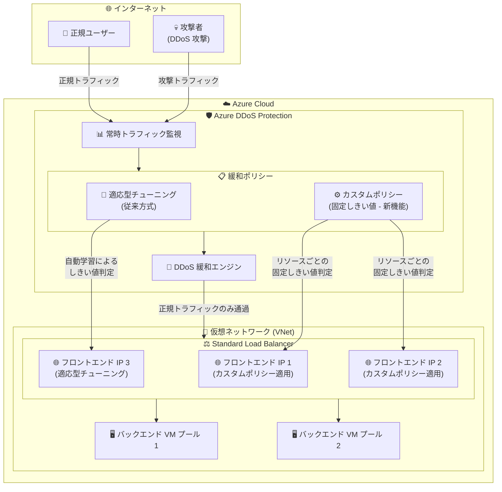

# Azure DDoS Protection: カスタムポリシー (Custom Policy)

**リリース日**: 2026-07-23

**サービス**: Azure DDoS Protection

**機能**: カスタムポリシー (Custom Policy) - リソースごとの DDoS 緩和しきい値制御

**ステータス**: In preview

[このアップデートのインフォグラフィックを見る](https://takech9203.github.io/azure-news-summary/20260723-ddos-protection-custom-policy.html)

## 概要

Azure DDoS Protection カスタムポリシーがパブリックプレビューとして発表された。この新機能により、保護対象の Standard Load Balancer フロントエンド IP 構成に対して、リソースごとに DDoS 緩和しきい値をきめ細かく制御できるようになる。

従来の Azure DDoS Protection では、トラフィックパターンを学習し適応型リアルタイムチューニング (Adaptive Real-time Tuning) により自動的に緩和プロファイルを選択する仕組みが提供されていた。しかし、特定のワークロードにおいては自動チューニングによるしきい値が最適でないケースがあり、正規のトラフィックスパイクが誤って攻撃と判定される、あるいは低レートの攻撃が検出されないといった課題が存在していた。

カスタムポリシーでは、顧客が固定のインバウンド検出しきい値を明示的に設定できるため、アプリケーションのトラフィック特性に合わせた精密な DDoS 保護構成が可能となる。これにより、ワークロードの特性を熟知した管理者が、適応型チューニングに依存せず独自のしきい値を定義し、より予測可能な保護動作を実現できる。

**アップデート前の課題**

- DDoS 緩和しきい値は適応型チューニングに完全に依存しており、顧客が個別のリソースに対してしきい値を明示的に設定する手段がなかった
- トラフィックパターンが変動するワークロードでは、適応型チューニングの学習期間中に誤検知や検出漏れが発生する可能性があった
- Standard Load Balancer のフロントエンド IP ごとに異なるトラフィック特性を持つ環境で、一律の保護ポリシーでは最適な防御が困難だった
- 特定のビジネスイベント (セール、キャンペーン等) による計画的なトラフィック急増時に、適応型しきい値が誤って緩和を発動するリスクがあった

**アップデート後の改善**

- リソースごとに固定のインバウンド検出しきい値を明示的に設定でき、アプリケーション特性に合わせた精密な保護が可能になった
- Standard Load Balancer フロントエンド IP 構成単位での粒度の細かい制御が実現した
- 計画的なトラフィック変動に対して事前にしきい値を調整し、誤検知を防止できるようになった
- 適応型チューニングとカスタムしきい値を使い分けることで、保護戦略の柔軟性が向上した

## アーキテクチャ図

カスタムポリシーにより、Standard Load Balancer の各フロントエンド IP に対して個別の DDoS 緩和しきい値を設定できる。一部のフロントエンド IP にはカスタムポリシー (固定しきい値) を適用し、他のフロントエンド IP には従来の適応型チューニングを継続利用するという柔軟な構成が可能である。

## サービスアップデートの詳細

### 主要機能

1. **リソースごとの DDoS 緩和しきい値制御**
   - Standard Load Balancer フロントエンド IP 構成に対して、個別に DDoS 緩和しきい値を設定可能
   - 固定のインバウンド検出しきい値を顧客が明示的に定義でき、適応型チューニングに依存しない保護を実現

2. **固定インバウンド検出しきい値の構成**
   - トラフィック量ベースのしきい値を固定値として設定可能
   - ワークロードの正常なトラフィックパターンに基づいて最適なしきい値を決定し、誤検知を最小化

3. **Standard Load Balancer フロントエンド IP 単位の適用**
   - ポリシーの適用粒度は Standard Load Balancer のフロントエンド IP 構成単位
   - 同一 Load Balancer 内の異なるフロントエンド IP に異なるポリシーを適用可能

## 技術仕様

| 項目 | 詳細 |
|------|------|
| 対象リソース | Standard Load Balancer フロントエンド IP 構成 |
| しきい値タイプ | 固定インバウンド検出しきい値 |
| プレビューステータス | パブリックプレビュー |
| 前提サービス | Azure DDoS Protection (Network Protection または IP Protection) |
| 保護レイヤー | L3/L4 (ネットワーク層) |

## 設定方法

### 前提条件

1. Azure サブスクリプションが必要
2. Azure DDoS Protection プラン (Network Protection) または DDoS IP Protection が有効化された仮想ネットワーク
3. Standard Load Balancer が DDoS Protection で保護された仮想ネットワーク内にデプロイされていること
4. ネットワーク共同作成者ロール以上の権限

### Azure Portal

1. Azure Portal にサインイン
2. DDoS Protection プランまたは保護対象のリソースに移動
3. カスタムポリシーの設定セクションにアクセス
4. 対象の Standard Load Balancer フロントエンド IP 構成を選択
5. 固定インバウンド検出しきい値を設定
6. 保存して適用

※ パブリックプレビュー段階のため、設定画面の詳細は今後変更される可能性がある。最新の手順は Microsoft Learn ドキュメントを参照のこと。

## メリット

### ビジネス面

- 計画的なトラフィック増加 (セール、プロモーション、メディア露出等) 時の誤検知を事前に防止でき、ビジネス機会の損失を回避
- リソースごとに最適な保護レベルを設定することで、サービスの可用性と信頼性を向上
- 誤検知によるインシデント対応の運用負荷を軽減

### 技術面

- アプリケーションのトラフィック特性を熟知したエンジニアが最適なしきい値を定義可能
- 適応型チューニングの学習期間に依存しない即座の保護構成が可能
- フロントエンド IP 単位の粒度で異なるワークロードに最適化された保護を実現
- 予測可能な緩和動作により、運用チームがインシデント発生時の対応を計画しやすくなる

## デメリット・制約事項

- パブリックプレビュー段階であり、SLA は提供されない
- 対象リソースが Standard Load Balancer フロントエンド IP 構成に限定されている (現時点)
- 固定しきい値の設定には、ワークロードの正常なトラフィックパターンの十分な理解が必要
- しきい値の設定が不適切な場合、攻撃の検出漏れまたは正規トラフィックの誤ブロックのリスクがある
- VPN Gateway や Virtual Network Gateway など適応型チューニングが未サポートのリソースへの対応は未確認
- PaaS サービス (マルチテナント)、NAT Gateway に接続されたパブリック IP は DDoS Protection 自体のサポート外

## ユースケース

### ユースケース 1: EC サイトの大規模セールイベント対応

**シナリオ**: EC サイトが年に数回実施する大規模セール (ブラックフライデー等) において、通常の 10-50 倍のトラフィック急増が予想される。適応型チューニングでは直近のトラフィックパターンに基づくしきい値が設定されるため、急激なトラフィック増を攻撃と誤判定するリスクがある。

**実装例**: セール開始前にカスタムポリシーで固定しきい値を通常時の 50 倍に引き上げ、セール終了後に元に戻す。

**効果**: 正規のトラフィックスパイクによる DDoS 緩和の誤発動を防止し、セール期間中のサービス可用性を確保する。

### ユースケース 2: マルチテナント SaaS プラットフォーム

**シナリオ**: 複数の顧客 (テナント) がそれぞれ異なるフロントエンド IP を使用する SaaS プラットフォームにおいて、テナントごとにトラフィック量が大きく異なる。大規模テナントは高いしきい値、小規模テナントは低いしきい値が最適。

**実装例**: Standard Load Balancer の各フロントエンド IP に対して、対応するテナントのトラフィック特性に合わせた個別のカスタムポリシーを設定する。

**効果**: テナントごとに最適化された DDoS 保護を提供し、小規模テナントへの低レート攻撃も適切に検出しつつ、大規模テナントの正常トラフィックを誤ブロックしない。

## 料金

カスタムポリシー機能自体の追加料金については、プレビュー時点で公式情報が確認できていない。Azure DDoS Protection の基本料金は以下のとおり。

| 項目 | 料金 |
|------|------|
| DDoS Network Protection (月額、100 パブリック IP まで) | サブスクリプション単位の固定月額 |
| DDoS Network Protection 超過分 (100 IP 超) | リソースあたり月額 |
| DDoS IP Protection (パブリック IP あたり) | $199/月 |

- 15 個未満のパブリック IP リソースを保護する場合は IP Protection ティアがコスト効率が高い
- 15 個以上のパブリック IP を保護する場合は Network Protection ティアがコスト効率が高い
- DDoS 攻撃中のスケールアウトコストはコストクレジットでカバーされる (Network Protection のみ)
- 無料枠: Azure DDoS Protection 固有の無料枠はなし (Azure の 30 日間 $200 クレジットは利用可能)

## 利用可能リージョン

パブリックプレビュー段階のため、利用可能リージョンの詳細は公式ドキュメントを確認のこと。Azure DDoS Protection 自体は、DDoS Protection プランをリージョンに関連付ける必要があるが、異なるリージョンの仮想ネットワークおよび複数サブスクリプションにまたがって保護を適用可能である。

## 関連サービス・機能

- **Azure DDoS Protection (Network Protection / IP Protection)**: カスタムポリシーの前提となる DDoS 保護サービス。L3/L4 レイヤーの常時監視と自動緩和を提供
- **Azure Standard Load Balancer**: カスタムポリシーが適用される対象リソース。フロントエンド IP 構成単位でポリシーを割り当て
- **Azure Web Application Firewall (WAF)**: L7 レイヤーの DDoS 保護を補完。DDoS Protection と組み合わせた多層防御を実現
- **Azure Firewall Manager**: DDoS Protection プランの一元管理に利用可能
- **Microsoft Sentinel**: DDoS Protection のデータコネクタとワークブックにより、攻撃の検出と相関分析を提供
- **Azure Monitor**: DDoS Protection メトリクスと診断ログの監視・アラート設定

## 参考リンク

- [インフォグラフィック](https://takech9203.github.io/azure-news-summary/20260723-ddos-protection-custom-policy.html)
- [公式アップデート情報](https://azure.microsoft.com/updates?id=568063)
- [Microsoft Learn - Azure DDoS Protection の概要](https://learn.microsoft.com/en-us/azure/ddos-protection/manage-ddos-protection)
- [Microsoft Learn - DDoS Protection ティア比較](https://learn.microsoft.com/en-us/azure/ddos-protection/ddos-protection-sku-comparison)
- [Microsoft Learn - ベストプラクティス](https://learn.microsoft.com/en-us/azure/ddos-protection/fundamental-best-practices)
- [料金ページ](https://azure.microsoft.com/en-us/pricing/details/ddos-protection/)

## まとめ

Azure DDoS Protection カスタムポリシーは、DDoS 緩和における顧客の制御性を大幅に向上させる重要なアップデートである。従来の適応型チューニングに加えて、リソースごとに固定しきい値を明示的に設定できるようになったことで、トラフィック特性が明確なワークロードや計画的なトラフィック変動があるシナリオにおいて、より精密で予測可能な DDoS 保護が実現する。

Solutions Architect への推奨アクション:
- Standard Load Balancer を使用しており、DDoS Protection が有効なワークロードで、適応型チューニングの動作に課題を感じている場合はプレビューの評価を検討
- 大規模なトラフィック変動が予測されるワークロード (EC サイトのセール、メディアイベント等) での活用を計画
- プレビュー段階のため本番環境への直接適用は推奨せず、テスト環境での検証から開始すること

---

**タグ**: #Azure #DDoS-Protection #Custom-Policy #Networking #Security #Public-Preview #Standard-Load-Balancer #Per-Resource-Configuration
