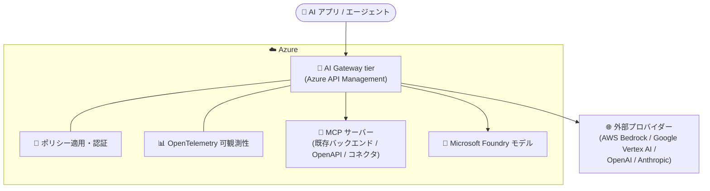

# Azure API Management: AI Gateway tier (Public Preview)

**リリース日**: 2026-07-27

**サービス**: Azure API Management

**機能**: AI Gateway tier (AI ワークロード専用の新しいサービス tier)

**ステータス**: In preview (Public Preview)

[このアップデートのインフォグラフィックを見る](https://takech9203.github.io/azure-news-summary/20260727-api-management-ai-gateway-tier.html)

## 概要

Azure API Management に、AI ワークロード専用に最適化された新しいサービス tier「AI Gateway」がパブリックプレビューとして登場した。既存の API Management 各 tier で利用可能だった AI gateway 機能 (トークン制限ポリシー、セマンティックキャッシュ、コンテンツセーフティなど) を基盤としつつ、AI 資産の管理に特化した専用の体験を提供する。

組織が AI を本番運用へ移行する中で、プラットフォームチームには AI モデル、MCP サーバー、ツールといった AI 資産を安全に公開する一貫した方法が求められている。新しい AI Gateway tier は、一貫したセキュリティ、ポリシー、認証、可観測性、運用管理を AI ワークロード全体に適用することを目的としている。Microsoft Foundry でホストされるモデルに加え、AWS Bedrock、Google Vertex AI、OpenAI、Anthropic といったマルチプロバイダーのモデルを管理でき、既存の MCP バックエンド、OpenAPI 定義、コネクタから MCP サーバーを作成することも可能。

エンタープライズグレードの Azure API Management プラットフォーム上に構築されており、ポータル (https://ai.gateway.azure.com/) とプログラマティック (API 経由) の両方の利用体験に対応する。

**アップデート前の課題**

- AI gateway 機能は API Management の汎用 tier の一機能として提供されており、AI ワークロード専用に最適化された tier は存在しなかった
- モデル、MCP サーバー、ツールといった AI 資産の発見・公開・保護・監視を、汎用の API 管理体験の中で個別に構成する必要があった

**アップデート後の改善**

- モデル、MCP サーバー、ツールを中心とした AI 中心 (AI-centric) の専用体験により、AI 資産の発見・公開・保護・監視が容易になった
- ポリシー適用、OpenTelemetry ベースの可観測性、エンタープライズ認証が組み込みで提供される
- Microsoft Foundry、AWS Bedrock、Google Vertex AI、OpenAI、Anthropic のマルチプロバイダーモデルを一貫した方法で管理できる

## アーキテクチャ図

AI アプリやエージェントからのトラフィックは AI Gateway tier を経由し、ポリシー適用・認証・可観測性が一元的に適用されたうえで、Microsoft Foundry のモデル、MCP サーバー、外部プロバイダーのモデルへルーティングされる。

## サービスアップデートの詳細

### 主要機能

1. **AI 中心の専用体験**
   - モデル、MCP サーバー、ツールを中心とした設計で、AI 資産の発見・公開・保護・監視が容易

2. **マルチプロバイダーモデル対応**
   - Microsoft Foundry でホストされるモデルに加え、AWS Bedrock、Google Vertex AI、OpenAI、Anthropic のモデルを管理可能

3. **MCP サーバーのサポート**
   - 既存の MCP バックエンド、OpenAPI 定義、コネクタから MCP サーバーを作成可能

4. **組み込みのガバナンス機能**
   - ポリシー適用 (policy enforcement)
   - OpenTelemetry ベースの可観測性
   - エンタープライズ認証

5. **ポータルとプログラマティックの両対応**
   - 専用ポータル (https://ai.gateway.azure.com/) と API 経由の両方で利用可能

## 技術仕様

| 項目 | 詳細 |
|------|------|
| ステータス | Public Preview (GA 時期は未発表) |
| 基盤 | エンタープライズグレードの Azure API Management プラットフォーム |
| 対応モデルプロバイダー | Microsoft Foundry、AWS Bedrock、Google Vertex AI、OpenAI、Anthropic |
| MCP サーバー作成元 | 既存 MCP バックエンド、OpenAPI 定義、コネクタ |
| 可観測性 | OpenTelemetry ベース |
| 利用方法 | ポータル (ai.gateway.azure.com) / プログラマティック (API) |

## 設定方法

### 前提条件

1. Azure サブスクリプション

### 開始方法

最初の AI Gateway リソースは専用ポータル (https://ai.gateway.azure.com/) から作成できる。ドキュメントは https://ai.gateway.azure.com/docs で提供されている。

## メリット

### ビジネス面

- AI モデル、MCP サーバー、ツールを安全に公開する一貫した方法が得られ、組織の AI 運用化 (operationalization) を加速できる
- セキュリティ、ポリシー、認証、可観測性、運用管理を AI ワークロード全体に一元適用でき、ガバナンスを強化できる

### 技術面

- 汎用 API 管理の体験ではなく、AI 資産に最適化された専用の管理体験を利用できる
- OpenTelemetry ベースの可観測性が組み込みで提供される
- マルチプロバイダー (Foundry / Bedrock / Vertex AI / OpenAI / Anthropic) のモデルを単一のゲートウェイで統制できる

## デメリット・制約事項

- パブリックプレビュー段階のため、本番環境での利用は推奨されない (プレビューは非本番用途・テスト向け)
- GA (一般提供) の時期は未発表
- 利用可能リージョンの情報は現時点で確認できていない

## ユースケース

### ユースケース 1: マルチプロバイダー AI モデルの統合ガバナンス

**シナリオ**: 複数のチームが Microsoft Foundry、OpenAI、AWS Bedrock など異なるプロバイダーのモデルを利用しており、認証・ポリシー・監視の統制がバラバラになっている。

**効果**: AI Gateway tier を単一の入口とすることで、一貫したセキュリティ、認証、ポリシー、可観測性をすべての AI トラフィックに適用できる。

### ユースケース 2: MCP サーバーによる社内ツールのエージェント公開

**シナリオ**: 既存の REST API (OpenAPI 定義) や社内バックエンドを AI エージェントから利用可能なツールとして公開したい。

**効果**: 既存の MCP バックエンド、OpenAPI 定義、コネクタから MCP サーバーを作成し、ゲートウェイ経由でガバナンスを適用した状態でエージェントに公開できる。

## 料金

API Management の料金ページには、現時点で AI Gateway tier 専用の料金表は掲載されていない。なお、v2 tier の注記として「Azure AI Foundry で AI Gateway として作成した場合、100,000 リクエストまで無料」という記載がある。

最新の料金情報は公式料金ページを参照: https://azure.microsoft.com/pricing/details/api-management/

## 利用可能リージョン

公式情報でリージョンの記載は確認できなかった。最新情報は公式ドキュメント (https://ai.gateway.azure.com/docs) を参照。

## 従来の AI gateway 機能との関係

従来から Azure API Management の全 tier では、AI gateway 機能として以下が提供されている (これらは既存 tier の機能であり、引き続き利用可能):

- **トークン制限ポリシー (llm-token-limit)**: サブスクリプションキーや IP アドレスなどの単位で TPM 制限やトークンクォータを適用
- **セマンティックキャッシュ (llm-semantic-cache-store / lookup)**: プロンプトのベクトル近接性に基づき応答を再利用し、トークン消費とレイテンシを削減
- **コンテンツセーフティポリシー (llm-content-safety)**: Azure AI Content Safety によるプロンプトの自動モデレーション
- **バックエンドのロードバランサー / サーキットブレーカー**: 複数 AI エンドポイント間の負荷分散と障害時の遮断
- **トークンメトリック (llm-emit-token-metric)**: Azure Monitor / Application Insights へのトークン使用量の記録
- **統合モデル API (プレビュー)**: 複数の LLM バックエンドを単一の OpenAI 互換エンドポイントで公開

新しい AI Gateway tier は、これらの AI gateway 機能を基盤としつつ、AI ワークロードに最適化された専用の tier として提供されるものである。

## 関連サービス・機能

- **Microsoft Foundry (Azure AI Foundry)**: Foundry でホストされるモデルを AI Gateway 経由で管理可能。Foundry 環境内から AI gateway を統合し、モデル・エージェント・ツールを統制する機能 (プレビュー) も提供されている
- **Azure AI Content Safety**: LLM プロンプトの自動モデレーションポリシーで連携
- **Azure Monitor / Application Insights**: トークン使用量メトリックやプロンプト・応答ログの分析に利用
- **Azure API Center**: API、MCP サーバーなどの組織カタログへの登録・発見に利用
- **Azure Managed Redis**: セマンティックキャッシュの外部キャッシュとして利用

## 参考リンク

- [インフォグラフィック](https://takech9203.github.io/azure-news-summary/20260727-api-management-ai-gateway-tier.html)
- [公式アップデート情報](https://azure.microsoft.com/updates?id=568184)
- [発表ブログ (Tech Community)](https://techcommunity.microsoft.com/blog/integrationsonazureblog/ai-gateway-tier-of-api-management-now-in-public-preview/4540170)
- [AI Gateway ドキュメント](https://ai.gateway.azure.com/docs)
- [AI Gateway ポータル](https://ai.gateway.azure.com/)
- [Microsoft Learn: AI gateway capabilities in Azure API Management](https://learn.microsoft.com/azure/api-management/genai-gateway-capabilities)
- [料金ページ](https://azure.microsoft.com/pricing/details/api-management/)

## まとめ

Azure API Management の AI Gateway tier は、AI ワークロード専用に最適化された新しいサービス tier のパブリックプレビューである。マルチプロバイダーモデル (Foundry / Bedrock / Vertex AI / OpenAI / Anthropic) と MCP サーバーを、一貫したセキュリティ・ポリシー・認証・可観測性のもとで統制できる点が特徴で、AI の本番運用を進める組織のプラットフォームチームにとって重要なアップデートといえる。現時点ではプレビュー段階のため、まずは非本番環境で専用ポータル (ai.gateway.azure.com) から評価を開始し、既存 tier の AI gateway 機能との使い分けを検討することを推奨する。

---

**タグ**: Azure API Management, AI Gateway, Public Preview, MCP, Microsoft Foundry, LLM, Integration
