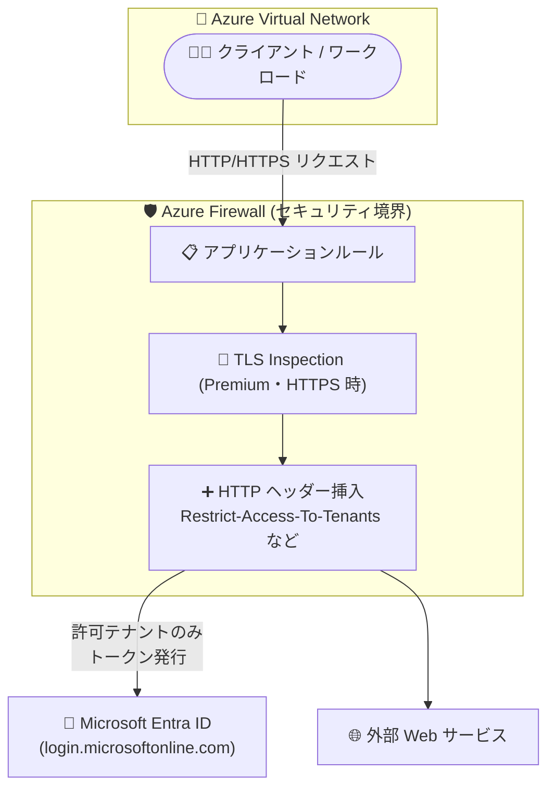

# Azure Firewall: HTTP ヘッダー挿入 (HTTP Header Insertion) が一般提供開始 (GA)

**リリース日**: 2026-07-27

**サービス**: Azure Firewall

**機能**: HTTP header insertion (HTTP ヘッダー挿入)

**ステータス**: Launched (GA)

[このアップデートのインフォグラフィックを見る](https://takech9203.github.io/azure-news-summary/20260727-azure-firewall-http-header-insertion.html)

## 概要

Azure Firewall で HTTP ヘッダー挿入機能が一般提供 (GA) になりました。Azure Firewall のアプリケーションルールから、HTTP/HTTPS リクエストヘッダーを直接追加または上書きできるようになります。

この機能により、組織はセキュリティポリシーの適用、認証トークンの埋め込み、バックエンドサービスとの統合をファイアウォールレイヤーで実現できます。代表的なユースケースが Microsoft Entra ID のテナント制限 (tenant restrictions) で、`Restrict-Access-To-Tenants` / `Restrict-Access-Context` ヘッダーを Azure Firewall が挿入することで、ユーザーが組織の許可したテナントにのみサインインできるよう制御できます。

ヘッダー挿入はアプリケーションルール単位で構成し、トラフィックがそのルールにマッチした際に Azure Firewall が構成済みのヘッダーを挿入します。Premium SKU では TLS inspection と組み合わせることで HTTPS トラフィックにも対応します。

**アップデート前の課題**

- Azure Firewall はヘッダー挿入に対応していなかったため、Entra ID テナント制限のようにヘッダー挿入を必要とするシナリオでは、TLS インスペクションと HTTP ヘッダー挿入が可能なプロキシインフラ (オンプレミスプロキシやサードパーティ製プロキシ) を別途用意する必要があった
- クライアント情報の伝達などでヘッダー付与が必要な場合、Azure Application Gateway や Azure Front Door などのリバースプロキシで接続を終端して転送する構成が回避策とされていた

**アップデート後の改善**

- Azure Firewall のアプリケーションルールで HTTP/HTTPS リクエストヘッダーの追加・上書きを直接構成できるようになった
- 追加のプロキシアプライアンスなしで、テナント制限などのヘッダーベースのセキュリティ制御をファイアウォールに集約できる
- Azure Portal / Azure CLI / Azure PowerShell から構成でき、Firewall Policy の Draft + Deployment にも対応

## アーキテクチャ図



クライアントからの HTTP/HTTPS トラフィックがアプリケーションルールにマッチすると、Azure Firewall が構成済みのヘッダーを挿入して宛先へ転送します。HTTPS の場合は Premium SKU の TLS inspection で復号したうえでヘッダーを挿入します。

## サービスアップデートの詳細

### 主要機能

1. **アプリケーションルールでのヘッダー追加・上書き**
   - HTTP/HTTPS リクエストヘッダーの名前と値をアプリケーションルール単位で構成。ルールにマッチしたトラフィックにヘッダーが挿入される
   - クライアントが独自に付与したヘッダーを上書きできるため、ユーザーによる制御のバイパスを防止できる

2. **SKU ごとの対応プロトコル**
   - Premium SKU: HTTP トラフィックに加え、TLS inspection で復号した HTTPS トラフィックに対応
   - Standard / Basic SKU: HTTP トラフィックに対応

3. **複数の構成手段**
   - Azure Portal、Azure CLI (`--http-headers-to-insert`)、Azure PowerShell (`New-AzFirewallPolicyApplicationRuleCustomHttpHeader`) で構成可能
   - Azure Firewall Policy の Draft + Deployment にも対応

## 技術仕様

| 項目 | 詳細 |
|------|------|
| 構成単位 | Firewall Policy のアプリケーションルール |
| 対応トラフィック | HTTP (全 SKU)、HTTPS (Premium + TLS inspection) |
| ヘッダー名の最大長 | 100 文字 |
| ヘッダー値の最大長 | 16,000 文字 |
| 1 アプリケーションルールあたりのヘッダー合計サイズ上限 | 16 KB (16,384 バイト、名前 + 値の合計) |
| 挿入不可の予約ヘッダー | `host`、`connection`、`content-length` などの一般/接続系、`authorization`、`cookie` などの認証系、`content-security-policy` などのセキュリティ系、`x-forwarded-for` などの転送系、`metadata` |

## 設定方法

### 前提条件

1. Azure Firewall Policy が構成済みであること
2. HTTPS トラフィックにヘッダーを挿入する場合は、Premium SKU で TLS inspection が有効であること

### Azure CLI

```bash
# ルールコレクショングループを作成
az network firewall policy rule-collection-group create \
    --name rcg-c \
    --policy-name fw-policy \
    --resource-group test-rg \
    --priority 10000

# ヘッダー挿入付きのアプリケーションルールを追加
az network firewall policy rule-collection-group collection add-filter-collection \
    --policy-name "fw-policy" \
    --resource-group "test-rg" \
    --rcg-name "rcg-c" \
    --name "app_collection_1" \
    --collection-priority 10003 \
    --action Allow \
    --rule-name "app_rule_1" \
    --rule-type ApplicationRule \
    --target-fqdns "*.microsoft.com" "*.azure.com" \
    --source-addresses "10.0.0.5" "10.0.0.6" \
    --protocols Http=80 \
    --http-headers-to-insert "Restrict-Access-To-Tenants=contoso.com,fabrikam.onmicrosoft.com" "Restrict-Access-Context=aaaabbbb-0000-cccc-1111-dddd2222eeee"
```

### Azure Portal

1. 既存の Firewall Policy を開く (または新規作成)
2. **Rules** > **Application rules** を選択
3. アプリケーションルールを新規作成または編集
4. ルール構成ペインの **HTTP Header Insertion** セクションでヘッダー名と値を追加 (複数追加可)
5. ルールを保存し、再度開いてヘッダーが構成されていることを確認

## メリット

### ビジネス面

- テナント制限用の専用プロキシインフラが不要になり、運用コストと構成の複雑さを削減できる
- 許可テナント以外へのサインインをネットワークレイヤーで遮断し、データ漏えいリスク (未承認テナントへのアクセス) を低減できる

### 技術面

- ヘッダーベースのセキュリティ制御を Azure Firewall に集約でき、ポリシー管理を一元化できる
- クライアントが付与した既存ヘッダーを上書きできるため、エンドユーザーによるポリシーバイパスを防げる
- Portal / CLI / PowerShell / Policy Draft + Deployment に対応し、IaC・運用フローに組み込みやすい

## デメリット・制約事項

- HTTPS トラフィックへのヘッダー挿入は Premium SKU + TLS inspection が必要 (Standard / Basic は HTTP のみ)
- `x-forwarded-for` や `authorization`、`cookie` などの予約ヘッダーは挿入できない
- ヘッダー挿入を使うとルールの JSON サイズが増え、ルールコレクショングループに格納できるルール数が減る場合がある。上限に達した場合は新しいルールコレクショングループを作成する必要がある
- ヘッダー名は最大 100 文字、値は最大 16,000 文字、ルールあたりの合計は 16 KB まで

## ユースケース

### ユースケース 1: Microsoft Entra ID テナント制限の適用

**シナリオ**: 企業ネットワークから Microsoft 365 へのアクセスを許可しつつ、個人テナントや他組織テナントへのサインインをブロックしたい。Entra ID のテナント制限は、`login.microsoftonline.com` などへのトラフィックに `Restrict-Access-To-Tenants` / `Restrict-Access-Context` ヘッダーを挿入することで実現するが、従来は TLS インスペクション対応のプロキシインフラが必要だった。

**実装例**:

```bash
az network firewall policy rule-collection-group collection add-filter-collection \
    --policy-name "fw-policy" \
    --resource-group "test-rg" \
    --rcg-name "rcg-c" \
    --name "tenant_restrictions" \
    --collection-priority 10003 \
    --action Allow \
    --rule-name "entra_login" \
    --rule-type ApplicationRule \
    --target-fqdns "login.microsoftonline.com" "login.microsoft.com" "login.windows.net" \
    --source-addresses "10.0.0.0/24" \
    --protocols Https=443 \
    --http-headers-to-insert \
        "Restrict-Access-To-Tenants=contoso.com" \
        "Restrict-Access-Context=<自組織のテナント ID>"
```

**効果**: 許可テナント以外へのトークン発行が Entra ID 側で拒否され、未承認テナントへのサインインを防止できる。ブロックされたサインインは Entra 管理センターのレポートで確認できる (要 Entra ID P1/P2 ライセンス)。なお HTTPS への挿入のため Premium SKU + TLS inspection が必要。

### ユースケース 2: バックエンドサービス向けの識別ヘッダー付与

**シナリオ**: 特定のヘッダーによるアクセス制御や識別を要求するアプリケーション・バックエンドサービスに対し、ファイアウォール通過時に認証トークンや識別子をヘッダーとして埋め込む。

**効果**: アプリケーション側の改修なしで、ネットワーク経路上で一貫したヘッダー付与を実施できる。

## 料金

HTTP ヘッダー挿入自体の追加料金に関する記載は確認できませんでした。Azure Firewall の料金は SKU (Basic / Standard / Premium) ごとの固定時間課金 (デプロイあたり) とデータ処理量 (GB あたり) の従量課金の組み合わせです。具体的な金額は料金ページを参照してください。

- [Azure Firewall 料金ページ](https://azure.microsoft.com/pricing/details/azure-firewall/)

## 関連サービス・機能

- **Microsoft Entra ID テナント制限**: 本機能の代表的ユースケース。`Restrict-Access-To-Tenants` / `Restrict-Access-Context` ヘッダーの挿入により許可テナントのみへのサインインを強制する (Entra ID P1/P2 が必要)
- **Azure Firewall Premium (TLS inspection)**: HTTPS トラフィックへのヘッダー挿入に必要。アウトバウンド TLS の復号・再暗号化を行う
- **Azure Firewall Manager / Firewall Policy**: ヘッダー挿入はアプリケーションルールとして Firewall Policy で一元管理。Draft + Deployment にも対応
- **Azure Application Gateway / Azure Front Door**: 従来ヘッダー書き換えが必要な場合の回避策とされてきたリバースプロキシサービス。インバウンド側のヘッダー操作では引き続きこれらを利用

## 参考リンク

- [インフォグラフィック](https://takech9203.github.io/azure-news-summary/20260727-azure-firewall-http-header-insertion.html)
- [公式アップデート情報](https://azure.microsoft.com/updates?id=568115)
- [Azure Firewall HTTP Header Insertion Configuration (Microsoft Learn)](https://learn.microsoft.com/azure/firewall/configure-http-header-insertion)
- [Azure Firewall features by SKU (Microsoft Learn)](https://learn.microsoft.com/azure/firewall/features-by-sku)
- [Microsoft Entra ID テナント制限 (Microsoft Learn)](https://learn.microsoft.com/entra/identity/enterprise-apps/tenant-restrictions)
- [料金ページ](https://azure.microsoft.com/pricing/details/azure-firewall/)

## まとめ

Azure Firewall の HTTP ヘッダー挿入が GA となり、アプリケーションルールから HTTP/HTTPS リクエストヘッダーの追加・上書きが可能になりました。特に Entra ID テナント制限を専用プロキシなしで実現できる点は、Microsoft 365 を利用する企業のセキュリティアーキテクチャを簡素化します。HTTPS への挿入には Premium SKU + TLS inspection が必要なため、テナント制限用途を検討する場合は Premium SKU の採用とヘッダーサイズ・予約ヘッダーの制約を確認したうえで、Firewall Policy への組み込みを進めることを推奨します。

---

**タグ**: Azure Firewall, Networking, Security, HTTP Header Insertion, Tenant Restrictions, Microsoft Entra ID, TLS Inspection, GA
