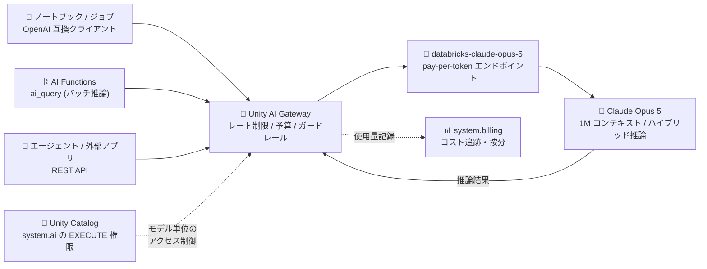

# Azure Databricks: Anthropic Claude Opus 5 の一般提供開始

**リリース日**: 2026-07-27

**サービス**: Azure Databricks

**機能**: Claude Opus 5 on Azure Databricks (AI Model Serving)

**ステータス**: Launched (GA)

[このアップデートのインフォグラフィックを見る](https://takech9203.github.io/azure-news-summary/20260727-databricks-claude-opus-5.html)

## 概要

Microsoft は、Azure Databricks の AI Model Serving を通じて Anthropic の Claude Opus 5 が一般提供 (GA) されたことを発表した。Claude Opus 5 は Anthropic の最新モデルであり、高度な推論、コーディング、エージェント型ワークフロー、専門的なナレッジワークを対象に設計されている。

Claude Opus 5 は Databricks ホスト型ファウンデーションモデルとして Foundation Model APIs のカタログに追加され、エンドポイント名 `databricks-claude-opus-5` で pay-per-token モードから即座に呼び出せる。Microsoft Learn のドキュメントでは、Claude Opus 5 は「Anthropic の最も高性能なハイブリッド推論モデル」として位置付けられ、エージェント型コーディング、コードレビュー、長時間にわたる自律作業にフォーカスしている点が特徴として挙げられている。具体的には、大規模リファクタリングや機能のエンドツーエンド開発といった複数ファイルにまたがるソフトウェアタスク、高精度なバグ検出、マルチエージェントの協調、チャート・ドキュメント・UI の理解といったビジョンタスクに強みを持つ。

さらに Claude Opus 5 は 100 万トークンのコンテキストウィンドウを備え、ウィンドウ全体にわたって指示追従・ツール呼び出し・推論の品質を維持する。加えて low / medium といった低めの推論エフォートでもトップに近い品質を発揮するため、長コンテキストかつコストに敏感なエンタープライズ ワークフローに適するとドキュメントに明記されている。エンドポイントは Databricks のセキュリティ境界内でホストされ、リクエストは Unity AI Gateway (Beta) を経由してレート制限・予算・ガードレールの適用を受ける。

**アップデート前の課題**

- Azure Databricks 上で最新世代の Opus を使うには Claude Opus 4.8 / 4.7 など前世代のモデルを選択する必要があった
- Claude Opus 4.5 世代までは 200K トークンのコンテキストウィンドウが上限で、長大なコードベースや大量ドキュメントを一括で扱いにくかった
- 前世代の Opus はハイブリッド推論と高精度な抽出に強みを持つ一方、複数ファイルにまたがるエージェント型コーディングや長時間の自律タスクという用途で明示的に最適化されたモデルではなかった
- Claude Opus 4.6 では最も要求の高いタスク向けに max エフォートが導入され、高い品質を得るには高いエフォート設定 (= より多い推論トークン) を前提とする運用になりやすかった

**アップデート後の改善**

- `databricks-claude-opus-5` として Databricks ホスト型モデルに追加され、既存ワークスペースからエンドポイント作成なしで pay-per-token 利用を開始できる
- 100 万トークンのコンテキストウィンドウをウィンドウ全体で有効に活用でき、指示追従・ツール呼び出し・推論の品質が長コンテキストでも維持される
- エージェント型コーディング、コードレビュー、長時間の自律作業に焦点を当てた設計となり、大規模リファクタリングや機能のエンドツーエンド開発、高精度なバグ検出、マルチエージェント協調に対応する
- low / medium の推論エフォートでもトップに近い品質が得られるため、長コンテキスト・コスト重視のエンタープライズ ワークフローに適用しやすい
- テキストに加えて画像入力をサポートし、チャート・ドキュメント・UI の理解といったビジョンタスクを同一エンドポイントで扱える

## アーキテクチャ図



ノートブック / AI Functions / 外部アプリからのリクエストは Unity AI Gateway を経由して `databricks-claude-opus-5` の pay-per-token エンドポイントに到達し、モデルは Databricks のセキュリティ境界内で実行される。どのモデルを呼び出せるかは Unity Catalog の `system.ai` スキーマおよびモデルオブジェクトの `EXECUTE` 権限で制御される。

## サービスアップデートの詳細

### 主要機能

1. **エージェント型コーディングと長時間の自律作業にフォーカス**
   - Claude Opus 5 は Anthropic の最も高性能なハイブリッド推論モデルとして、エージェント型コーディング、コードレビュー、長時間にわたる自律作業に焦点を当てて設計されている
   - 大規模リファクタリングや機能のエンドツーエンド開発といった複数ファイルにまたがる複雑なソフトウェアタスク、高精度なバグ検出、マルチエージェントの協調に優れる

2. **100 万トークンのコンテキストウィンドウ**
   - コンテキストウィンドウ全体にわたって、指示追従・ツール呼び出し・推論の品質を維持する
   - 大規模なコードベースや長大なドキュメント群を分割せずに投入するワークフローに適する

3. **低い推論エフォートでの高品質**
   - low および medium の推論エフォートでもトップに近い品質を発揮する
   - 長コンテキストかつコストに敏感なエンタープライズ ワークフローに適用しやすい

4. **テキストと画像の入力サポート**
   - 対応入力はテキストと画像 (`Supported inputs: text, image`)
   - チャート、ドキュメント、UI の理解といったビジョンタスクに対応する
   - Microsoft Learn の分類上、Claude Opus 5 は「General purpose」「Vision」「Reasoning」いずれのタスクタイプでもサポート対象モデルとして掲載されている

5. **Databricks ホスト型モデルとしての提供とガバナンス**
   - エンドポイント名 `databricks-claude-opus-5` で pay-per-token モードのプリコンフィグ済みエンドポイントとして提供され、外部 API キーの管理が不要
   - エンドポイントは Databricks のセキュリティ境界内でホストされる
   - リクエストは Unity AI Gateway (Beta) を経由し、レート制限・予算・ガードレールを適用できる
   - AI Functions によるバッチ推論もサポート対象 (プロビジョニング済みスループット モードは Claude モデルでは非対応)

6. **ハイブリッド推論・Function Calling・構造化出力・プロンプトキャッシュ**
   - ハイブリッド推論モデルとして `thinking` および `budget_tokens` パラメーターで内部思考の予算を制御できる (`budget_tokens` は `max_tokens` より小さい値であること)
   - Function Calling と Structured Outputs はいずれも OpenAI 互換仕様で Foundation Model APIs の一部として利用可能
   - Databricks ホスト型 Claude モデルではプロンプトキャッシュがサポートされ、`cache_control` パラメーターでテキスト・thinking・画像・tools をキャッシュ対象にできる

## 技術仕様

| 項目 | 詳細 |
|------|------|
| エンドポイント名 | `databricks-claude-opus-5` |
| モデルサービス名 (Unity AI Gateway) | `system.ai` スキーマ配下のモデルオブジェクトとして参照 |
| プロバイダー | Anthropic |
| モデルタイプ | ハイブリッド推論 (Hybrid reasoning) |
| コンテキストウィンドウ | 100 万トークン |
| 対応入力 | テキスト、画像 |
| タスクタイプ分類 | General purpose / Vision / Reasoning |
| 提供モード | Foundation Model APIs pay-per-token、AI Functions (バッチ推論) |
| プロビジョニング済みスループット | 非対応 (Claude モデルは対象外) |
| API 形式 | OpenAI 互換 REST API (chat completions) |
| 推論制御パラメーター | `thinking`、`budget_tokens` (`budget_tokens` < `max_tokens`) |
| Function Calling | 対応 (OpenAI 互換) |
| Structured Outputs | 対応 (Foundation Model APIs の機能として) |
| プロンプトキャッシュ | 対応 (`cache_control`) |
| 認証 | Databricks API トークン (本番は M2M OAuth トークン推奨) |
| ホスティング | Databricks のセキュリティ境界内 |

### レート制限 (pay-per-token / Enterprise ティア)

| 項目 | 制限値 |
|------|--------|
| ITPM (入力トークン / 分) | 200,000 |
| OTPM (出力トークン / 分) | 20,000 |
| QPH (クエリ / 時間) | 360,000 |
| ペイロードサイズ | 1 リクエストあたり 4 MB |
| QPS (ワークスペースあたり) | 200 |
| モデル実行時間 | 1 リクエストあたり 597 秒 |

ITPM / OTPM / QPH のうち最も厳しい制限が随時適用され、超過時は 429 エラーが返る。`max_tokens` を指定した場合は事前に出力トークン枠が予約され、実際の消費が予約を下回った差分は即座に払い戻される。

## 設定方法

### 前提条件

1. Azure Databricks ワークスペースが Foundation Model APIs pay-per-token のサポート対象リージョンに存在すること
2. エンドポイント リクエストを認証するための Databricks API トークン (本番環境では M2M OAuth トークンを推奨)
3. Unity Catalog の `system.ai` スキーマまたは対象モデルオブジェクトに対する `EXECUTE` 権限 (既定では全ユーザーに `system.ai` の `EXECUTE` が付与されている)
4. OpenAI クライアントを利用する場合は `databricks-openai` パッケージのインストール

```bash
pip install -U databricks-openai
```

### Databricks ワークスペース UI からの確認

1. Azure Databricks ワークスペースにログインする
2. 左サイドバーの **Serving** を選択する
3. エンドポイント一覧の先頭にある Foundation Model APIs のプリコンフィグ済みエンドポイントから `databricks-claude-opus-5` を確認する
4. **Query endpoint** から JSON 形式の入力を送信して動作確認する。または AI Playground でチャット形式のテスト・プロンプト調整・モデル比較を行う

### OpenAI 互換クライアントからのクエリ (ハイブリッド推論あり)

```python
import os
from openai import OpenAI

client = OpenAI(
    api_key=os.environ.get("DATABRICKS_TOKEN"),
    base_url=os.environ.get("DATABRICKS_BASE_URL"),
)

response = client.chat.completions.create(
    model="databricks-claude-opus-5",
    messages=[
        {
            "role": "user",
            "content": "このリポジトリの認証モジュールを段階的にリファクタリングする計画を立ててください。",
        }
    ],
    max_tokens=20480,
    extra_body={
        "thinking": {
            "type": "enabled",
            "budget_tokens": 10240,
        }
    },
)

msg = response.choices[0].message
print("Reasoning:", msg.content[0]["summary"][0]["text"])
print("Answer:", msg.content[1]["text"])
```

### SQL (AI Functions) からのバッチ推論

```sql
-- Unity Catalog テーブルの各行に対してモデルを適用する
SELECT
  id,
  ai_query(
    'databricks-claude-opus-5',
    'この変更差分をレビューし、想定される不具合を列挙してください: ' || diff_text
  ) AS review
FROM main.dev.pull_request_diffs;
```

### モデル単位のアクセス制御 (Unity Catalog)

利用可能なモデルを組織のポリシーで制限する場合は、`system.ai` スキーマの既定の `EXECUTE` 権限を取り消し、承認済みモデルにのみ `EXECUTE` を付与する。

1. **Catalog** から `system` カタログ → `ai` スキーマ → **Permissions** タブを開く
2. All Users (または全グループ) から `EXECUTE` を取り消す
3. `system` → `ai` → `models` 配下の対象モデル (Claude Opus 5) を選択し、**Permissions** タブで必要なグループに `EXECUTE` を付与する

この制御は pay-per-token とバッチ推論 (AI Functions) で自動的に適用される。なお、この機能は GA だが利用には Databricks アカウントチームによる有効化が必要である。

## メリット

### ビジネス面

- 追加のインフラ構築や外部 API キー契約なしに、Anthropic の最新モデルを Azure Databricks の課金体系のまま利用できる
- low / medium の推論エフォートでトップに近い品質が得られるため、長コンテキスト処理を伴うワークロードのコスト最適化余地が大きい
- pay-per-token 方式のため初期投資が不要で、使用量に応じたコスト管理ができる
- `system.billing` によるコスト追跡・按分と AI Gateway による予算設定を組み合わせ、部門単位の AI コスト ガバナンスを実現できる

### 技術面

- OpenAI 互換 API のため、既存の OpenAI クライアントやツールチェーンのモデル名を差し替えるだけで移行できる
- 100 万トークンのコンテキストで指示追従とツール呼び出しの品質が維持されるため、大規模コードベースや長大ドキュメントの分割戦略を単純化できる
- ノートブック・SQL (`ai_query`)・REST API・MLflow Deployments SDK・Databricks Python SDK と、複数の呼び出し経路が同一エンドポイントに統一される
- プロンプトキャッシュにより、共通のシステムプロンプトやツール定義を繰り返し送るエージェント型ワークロードの入力コストを抑えられる
- エンドポイントが Databricks のセキュリティ境界内でホストされるため、外部プロバイダーへの直接送信を伴う構成に比べてデータ経路の管理が容易

## デメリット・制約事項

- Claude モデルはプロビジョニング済みスループット モードの対象外であり、スループット保証や HIPAA などのコンプライアンス認証付きエンドポイントを前提とする本番要件には合致しない場合がある
- pay-per-token のレート制限 (ITPM 200,000 / OTPM 20,000 / QPH 360,000、Enterprise ティア) を超えると 429 エラーとなるため、指数バックオフによるリトライ設計が必要
- OTPM が 20,000 と入力側より小さいため、長い出力を大量に生成するワークロードではスロットリングが発生しやすい
- 一部のリージョン (brazilsouth、canadacentral、centralindia、eastasia、koreacentral、southeastasia、uaenorth など) ではクロスジオ ルーティングの有効化が必要で、データ処理リージョンとレイテンシーに影響する
- Foundation Model APIs は Databricks Designated Service であり、顧客コンテンツの処理時のデータ所在は Databricks Geos によって管理される点を事前に確認する必要がある
- Databricks の REST API は OpenAI 互換仕様のため、Anthropic ネイティブ API とはレスポンス構造 (`choices`) や停止理由 (`stop` / `length` / `tool_calls`) が異なり、Anthropic SDK 前提のコードはそのまま流用できない
- Model Serving のペイロードサイズ上限は 1 リクエストあたり 4 MB で、1 MB を超えるリクエスト / レスポンスはログに記録されない
- モデル単位の Unity Catalog 権限を使う場合、Databricks アカウントチームによる機能有効化が必要

## ユースケース

### ユースケース 1: 大規模リポジトリのリファクタリングとコードレビュー自動化

**シナリオ**: プラットフォームチームがモノレポの認証周りを横断的にリファクタリングしたい。関連ファイルが多く、変更の影響範囲をレビューで見落とすリスクが高い。

**実装例**:

```python
from openai import OpenAI

client = OpenAI(api_key=DATABRICKS_TOKEN, base_url=DATABRICKS_BASE_URL)

response = client.chat.completions.create(
    model="databricks-claude-opus-5",
    messages=[
        {
            "role": "system",
            "content": "あなたはシニアソフトウェアエンジニアです。変更の影響範囲と潜在的な不具合を指摘してください。",
        },
        {
            "role": "user",
            "content": [
                {
                    "type": "text",
                    "text": REPO_CONTEXT,  # 複数ファイルのソースをまとめて投入
                    "cache_control": {"type": "ephemeral"},
                },
                {"type": "text", "text": "この差分をレビューしてください:\n" + DIFF},
            ],
        },
    ],
    max_tokens=16384,
)
```

**効果**: 100 万トークンのコンテキストに複数ファイルのソースをまとめて投入でき、ウィンドウ全体で指示追従が維持されるため、ファイル横断の影響範囲を踏まえたレビューが可能になる。共通のリポジトリコンテキストは `cache_control` でキャッシュし、レビュー実行ごとの入力コストを抑えられる。

### ユースケース 2: ドキュメント・チャート理解を含むバッチ処理

**シナリオ**: 分析チームが Unity Catalog に蓄積した報告書 (テキストとチャート画像) から要点と数値を抽出し、テーブル化したい。

**実装例**:

```sql
CREATE OR REPLACE TABLE main.analytics.report_findings AS
SELECT
  doc_id,
  ai_query(
    'databricks-claude-opus-5',
    '次の報告書本文から主要な結論と根拠となる数値を JSON で抽出してください: ' || body
  ) AS findings
FROM main.analytics.reports;
```

**効果**: AI Functions によるバッチ推論がサポートされているため、SQL パイプライン内で完結した抽出処理を構築できる。テキストに加えて画像入力にも対応するため、チャートやドキュメントの理解を要する処理も同一モデルで扱える。

### ユースケース 3: 長時間稼働するマルチエージェント ワークフロー

**シナリオ**: データ プラットフォーム チームが、障害調査から修正案作成までを複数のエージェントに分担させて自律実行させたい。

**効果**: Claude Opus 5 はマルチエージェントの協調と長時間にわたる自律作業に焦点を当てて設計されており、Function Calling と Structured Outputs で他エージェントやツールとの受け渡しを型付きで扱える。Unity AI Gateway のレート制限・予算・ガードレールを併用することで、自律実行時のコストと安全性の上限を設定できる。

## 料金

Claude Opus 5 は Foundation Model APIs の pay-per-token (トークン消費量ベースの従量課金) で提供される。

| 項目 | 内容 |
|------|------|
| 課金方式 | pay-per-token (入力 / 出力トークン数に基づく従量課金) |
| 提供形態 | Databricks ホスト型ファウンデーションモデル |
| priority pay-per-token | リクエストごとに `service_tier: "priority"` を指定すると標準のベストエフォート トラフィックより優先して受け付けられ、コミットメントなしで利用できる。標準よりも高いトークン単価で課金される |
| バッチ推論 | AI Functions 経由のバッチ推論もサポート対象 |
| コスト追跡 | `system.billing` によるコスト追跡・按分、AI Gateway による予算設定 |

Claude Opus 5 の具体的な DBU レートおよびトークン単価は本レポート作成時点で参照した Microsoft Learn ドキュメントに記載がないため、[Databricks Model Serving 料金ページ](https://www.databricks.com/product/pricing/model-serving) および [Azure Databricks 料金ページ](https://azure.microsoft.com/pricing/details/databricks/) を参照すること。レート制限はワークスペースのプラットフォーム ティアによって変動する。

## 利用可能リージョン

Microsoft Learn の「Foundation models hosted on Databricks」に記載された `databricks-claude-opus-5` の対応状況は以下のとおり (pay-per-token および AI Functions)。

### ネイティブ提供 (クロスジオ ルーティング不要)

- australiaeast
- centralus
- eastus
- eastus2
- francecentral
- germanywestcentral
- japaneast
- northcentralus
- northeurope
- southcentralus
- swedencentral
- switzerlandnorth
- westeurope
- westus
- westus2

### クロスジオ ルーティングの有効化が必要

- brazilsouth
- canadacentral
- centralindia
- eastasia
- koreacentral
- southeastasia
- uaenorth
- uksouth (pay-per-token)

最新のリージョン対応状況は [Foundation models hosted on Databricks](https://learn.microsoft.com/azure/databricks/machine-learning/model-serving/foundation-model-overview) を参照。

## 関連サービス・機能

- **Mosaic AI Model Serving / AI Model Serving**: Azure Databricks のモデル提供基盤。Foundation Model APIs と外部モデルを OpenAI 互換の統一 API で提供する
- **Foundation Model APIs**: Databricks ホスト型のファウンデーションモデルを pay-per-token / プロビジョニング済みスループット / AI Functions 最適化の各モードで提供する機能。Databricks Designated Service として Databricks Geos によりデータ所在を管理する
- **Unity AI Gateway (Beta)**: ファウンデーションモデルへのリクエスト経路。レート制限、予算、ガードレールを適用してコストとアクセスを制御する
- **Unity Catalog**: `system.ai` スキーマおよびモデルオブジェクトに対する `EXECUTE` 権限で、組織が利用できるモデルを制限する
- **AI Functions (`ai_query`)**: SQL からモデル推論を呼び出す機能。バッチ推論パイプラインの構築に利用する
- **AI Playground**: ワークスペース内で LLM をチャット形式でテスト・比較できる環境
- **system.billing**: モデル利用コストの追跡・按分に使用するシステムテーブル
- **他の Databricks ホスト型 Claude モデル**: `databricks-claude-opus-4-8`、`databricks-claude-sonnet-5`、`databricks-claude-fable-5`、`databricks-claude-haiku-4-5` など、用途とコストに応じて選択できる

## 参考リンク

- [インフォグラフィック](https://takech9203.github.io/azure-news-summary/20260727-databricks-claude-opus-5.html)
- [公式アップデート情報](https://azure.microsoft.com/updates?id=568316)
- [Microsoft Learn - Databricks ホスト型ファウンデーションモデル (supported models)](https://learn.microsoft.com/azure/databricks/machine-learning/foundation-model-apis/supported-models)
- [Microsoft Learn - Databricks Foundation Model APIs 概要](https://learn.microsoft.com/azure/databricks/machine-learning/foundation-model-apis/)
- [Microsoft Learn - Foundation models hosted on Databricks (リージョン / 機能対応)](https://learn.microsoft.com/azure/databricks/machine-learning/model-serving/foundation-model-overview)
- [Microsoft Learn - Foundation Model APIs limits and quotas](https://learn.microsoft.com/azure/databricks/machine-learning/foundation-model-apis/limits)
- [Microsoft Learn - Use foundation models (クエリ方法)](https://learn.microsoft.com/azure/databricks/machine-learning/model-serving/score-foundation-models)
- [Microsoft Learn - Query reasoning models](https://learn.microsoft.com/azure/databricks/machine-learning/model-serving/query-reason-models)
- [Microsoft Learn - Foundation model Unity Catalog permissions](https://learn.microsoft.com/azure/databricks/machine-learning/foundation-model-apis/model-uc-permissions)
- [Databricks Model Serving 料金](https://www.databricks.com/product/pricing/model-serving)

## まとめ

Azure Databricks の AI Model Serving で Anthropic Claude Opus 5 が一般提供 (GA) となり、`databricks-claude-opus-5` エンドポイントから pay-per-token で利用できるようになった。Claude Opus 5 は Anthropic の最も高性能なハイブリッド推論モデルとして、エージェント型コーディング、コードレビュー、長時間の自律作業に焦点を当てており、大規模リファクタリング、高精度なバグ検出、マルチエージェント協調、チャート / ドキュメント / UI 理解といったビジョンタスクに強みを持つ。100 万トークンのコンテキストウィンドウ全体で指示追従・ツール呼び出し・推論の品質が維持され、low / medium の推論エフォートでもトップに近い品質が得られるため、長コンテキストかつコストに敏感なエンタープライズ ワークフローに適する。既存の Opus 4.8 / 4.7 世代を利用している場合は、OpenAI 互換 API のモデル名を差し替えるだけで検証を開始できる。ただし Claude モデルはプロビジョニング済みスループット モードの対象外であり、pay-per-token のレート制限 (ITPM 200,000 / OTPM 20,000 / QPH 360,000) とクロスジオ ルーティングが必要なリージョンの制約を踏まえた設計が必要である。導入時は AI Playground での品質検証、Unity AI Gateway でのレート制限・予算設定、`system.ai` の Unity Catalog 権限によるモデル利用範囲の定義を順に進めることを推奨する。

---

**タグ**: #Azure #AzureDatabricks #Anthropic #ClaudeOpus5 #AI #MachineLearning #LLM #ModelServing #FoundationModelAPIs #UnityCatalog #GA
