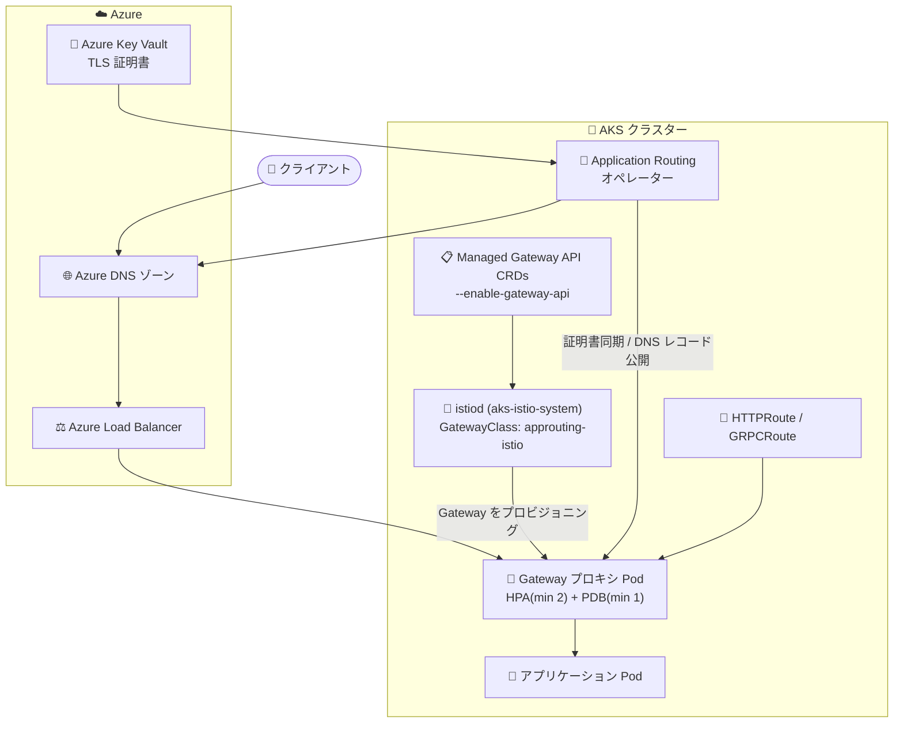

# Azure Kubernetes Service (AKS): Application Routing with Gateway API が一般提供開始

**リリース日**: 2026-07-28

**サービス**: Azure Kubernetes Service (AKS)

**機能**: Application Routing with Gateway API (application routing Gateway API 実装)

**ステータス**: Launched (GA)

[このアップデートのインフォグラフィックを見る](https://takech9203.github.io/azure-news-summary/20260728-aks-application-routing-gateway-api.html)

## 概要

AKS の **Application Routing with Gateway API** が一般提供 (GA) となった。これは AKS の application routing アドオンに、Kubernetes Gateway API ベースの Ingress トラフィック管理機能を追加するものである。公式アップデートでは「サービスメッシュを必要とせずに Kubernetes Gateway API を Ingress 管理にもたらす (bringing the Kubernetes Gateway API to ingress management without requiring a service mesh)」と説明されている。

背景として、Kubernetes SIG Network と Security Response Committee が [Ingress NGINX プロジェクトの廃止](https://www.kubernetes.dev/blog/2025/11/12/ingress-nginx-retirement/) を発表しており、アップストリームのメンテナンスは **2026 年 3 月** で終了する。AKS はこれに合わせて **Gateway API を Ingress および L7 トラフィック管理の長期的な標準** とする方針を明確にしており、既存の NGINX ベース application routing アドオン (Ingress API ベース) の後継として、この Gateway API 実装が位置づけられている。既存の NGINX ベース実装に対する Azure の公式サポート (重要なセキュリティパッチの提供) は **2026 年 11 月まで** で、それ以降は Gateway API 実装などのサポート対象実装への移行が必要になる。

実装面では、この機能は Gateway API リソース (Gateway / HTTPRoute など) のインフラを管理するために **Istio コントロールプレーンをデプロイする** が、Istio サービスメッシュアドオンとは異なりサイドカーインジェクションや Istio CRD はサポートせず、Gateway API リソースのためのインフラ管理に限定される。GatewayClass 名は `approuting-istio` である。また、**AKS 1.36 以降の新規 AKS Automatic クラスターでは、application routing アドオン経由の Kubernetes Gateway API がデフォルトで有効** になり、本番ワークロードにおける AKS Automatic の推奨デフォルト Ingress モデルとなっている。

**アップデート前の課題**

- 従来の application routing アドオンは Kubernetes **Ingress API** ベースの NGINX Ingress コントローラーであり、Ingress API には高度なトラフィックルーティングのための統一的かつプロバイダー非依存な仕組みが欠けていた
- 高度なルーティング機能は NGINX 固有のアノテーションやスニペットアノテーションに依存しがちで、ポータビリティが低かった。しかも add-on では `load_module`、`lua_package`、`_by_lua`、`location`、`root`、`proxy_pass`、`serviceaccount` などのスニペットアノテーションがブロックされており、`app-routing-system` namespace の ingress-nginx `ConfigMap` の編集もサポートされていなかった
- Ingress API は Kubernetes のロール分離 (クラスター運用者とアプリ開発者の責務分担) を表現しづらく、role-oriented な運用モデルを取りにくかった
- アップストリームの Ingress NGINX プロジェクトが 2026 年 3 月にメンテナンス終了予定であり、NGINX ベースの Ingress を使い続けることが長期的な選択肢にならなくなった
- Gateway API ベースの Ingress を AKS のマネージド機能として使うには、Istio サービスメッシュアドオンを導入する (＝サービスメッシュを前提とする) か、自前で Gateway API 実装を運用する必要があった

**アップデート後の改善**

- サービスメッシュ全体を導入せずに、標準化・role-oriented・拡張可能な Kubernetes Gateway API (Gateway / HTTPRoute / GRPCRoute) で HTTP/HTTPS Ingress を構成できる
- `approuting-istio` GatewayClass によるマネージドな Gateway インフラが提供され、Gateway ごとに **HorizontalPodAutoscaler (最小 2 レプリカ)** と **PodDisruptionBudget (最小可用性 1)** が自動的にデプロイされ、アップグレード時の中断を最小化する運用ガードレールが組み込まれている
- Istio コントロールプレーンのマイナー/パッチバージョンアップグレードが AKS のクラスターバージョンに追随してインプレースで実施され、プラットフォームのライフサイクル管理が AKS 側に寄せられる
- Envoy アクセスログが Gateway プロキシ Pod で **デフォルト有効** になり、追加設定なしで HTTP メソッド、パス、レスポンスコード、上流サービス、リクエスト/レスポンスサイズを含むログを `kubectl logs` で確認できる
- Application Routing オペレーターによる Azure DNS / Azure Key Vault 統合が Gateway API リソースにも適用され、`SecretProviderClass`、TLS Secret、リスナーの `certificateRefs`、`external-dns` デプロイの手動管理が不要になる
- 既存の Ingress リソースからの移行には、オープンソースの **ingress2gateway** ツールを利用して段階的に移行できると公式アップデートで案内されている

## アーキテクチャ図



Managed Gateway API CRD 上で `istiod` が `approuting-istio` GatewayClass の Gateway プロキシをプロビジョニングし、Application Routing オペレーターが Azure Key Vault の証明書同期と Azure DNS へのレコード公開を自動化する構成を示している。クライアントのトラフィックは Azure DNS → Load Balancer → Gateway プロキシ → HTTPRoute の宛先アプリ Pod へと流れる。

## サービスアップデートの詳細

### 主要機能

1. **Kubernetes Gateway API ネイティブな HTTP/HTTPS Ingress**
   - `gatewayClassName: approuting-istio` を指定した `Gateway` リソースと `HTTPRoute` / `GRPCRoute` でルーティングを定義する
   - Gateway API は Ingress API の後継・進化として設計された、標準化され role-oriented で拡張可能なトラフィック管理フレームワーク

2. **マネージドな Gateway インフラのプロビジョニング**
   - `Gateway` を作成すると、AKS が `Deployment`、`Service` (LoadBalancer)、`HorizontalPodAutoscaler`、`PodDisruptionBudget` を自動生成する
   - 生成されるリソース名にはデフォルトで GatewayClass 名 `approuting-istio` が付加される (例: `httpbin-gateway-approuting-istio`)。`gateway.istio.io/name-override` アノテーションで上書き可能 (63 文字未満かつ有効な DNS 名であること)

3. **サービスメッシュ不要 (Istio CRD/サイドカー非依存)**
   - Gateway API リソースのインフラ管理のために Istio コントロールプレーンを使うが、サイドカーインジェクションと Istio CRD はサポート対象外
   - Istio サービスメッシュアドオンとの同時有効化は不可

4. **Envoy アクセスログのデフォルト有効化**
   - すべてのマネージド `Gateway` プロキシ Pod で Envoy アクセスログが標準出力にデフォルト形式で書き出される
   - `kubectl logs deployment/<gateway-name>-approuting-istio` で参照可能
   - ただしログ形式・スコープ・プロバイダーは Istio `Telemetry` API でカスタマイズできない

5. **Azure Key Vault による TLS 終端の自動化**
   - リスナーの TLS オプションに `kubernetes.azure.com/tls-cert-keyvault-uri` と `kubernetes.azure.com/tls-cert-service-account` を指定すると、Application Routing オペレーターが `SecretProviderClass` (`kv-gw-cert-<gateway-name>-<listener-name>`) を作成し、Secrets Store CSI Driver 経由で `kubernetes.io/tls` Secret を同期し、リスナーの `tls.certificateRefs` にパッチを当てる
   - バージョンなし (unversioned) の証明書 URI を指定すると、Key Vault 側の証明書ローテーションを自動的に取り込む

6. **Azure DNS レコードの自動公開 (external-dns 統合)**
   - `ClusterExternalDNS` (クラスタースコープ) と `ExternalDNS` (namespace スコープ) のカスタムリソースで、マネージド `external-dns` インスタンスを宣言的に構成する
   - `Gateway` / `HTTPRoute` / `GRPCRoute` のホスト名に対する A レコードを Azure DNS ゾーンに公開する
   - `filters.gatewayLabels` / `filters.routeAndIngressLabels` でスコープを絞り込める
   - 認証は Microsoft Entra Workload Identity (アドオンのマネージド ID ではない) を使用する

7. **AKS のバージョンに追随した Istio バージョン管理**
   - Istio バージョンはクラスターの AKS バージョンに対してサポートされる最大 Istio マイナーバージョンとなる (例: AKS 1.34 の場合、2026 年 3 月時点では Istio 1.28)
   - リビジョニングはされず、マイナー/パッチともにインプレースアップグレード。パッチは AKS リリースの一部として自動適用される

8. **AKS Automatic のデフォルト Ingress モデル**
   - AKS 1.36 以降の新規 AKS Automatic クラスターでは、この Gateway API 実装がデフォルトで有効
   - 本番ワークロードにおける推奨デフォルト Ingress モデル

9. **istiod HPA のカスタマイズ**
   - `istiod` の HPA は既定で最小 2 / 最大 5 レプリカ、CPU 使用率 80%。パッチや直接編集で変更可能 (ただし `minReplicas` を 2 未満にはできない)

### NGINX ベース application routing との比較

| 項目 | application routing (NGINX) | application routing Gateway API |
|------|------------------------------|----------------------------------|
| API | Kubernetes Ingress API | Kubernetes Gateway API |
| データプレーン | ingress-nginx | Envoy (Istio 管理の Gateway プロキシ) |
| 識別子 | IngressClass `webapprouting.kubernetes.azure.com` | GatewayClass `approuting-istio` |
| 有効化フラグ | `--enable-app-routing` | `--enable-app-routing-istio` |
| Azure サポート期限 | 重要なセキュリティパッチを 2026 年 11 月まで | 長期的な標準として継続 |
| DNS/証明書の認証方式 | アドオンのユーザー割り当てマネージド ID (`--attach-kv` / `--attach-zones`) | Microsoft Entra Workload Identity (`ExternalDNS` / TLS オプション) |
| アクセスログ | - | Envoy アクセスログがデフォルト有効 |
| Gateway ごとの可用性設定 | - | HPA (min 2) + PDB (min 1) を自動デプロイ |

### Istio サービスメッシュアドオンとの比較

| 機能 | application routing Gateway API | Istio サービスメッシュアドオン |
|------|----------------------------------|-------------------------------|
| GatewayClass 名 | `approuting-istio` | `istio` |
| サイドカーインジェクション / Istio CRD | 非サポート (Gateway API リソースのインフラ管理のみ) | サポート |
| リビジョニングとアップグレード | 非リビジョン。マイナー/パッチともインプレース | リビジョン管理。マイナーは canary アップグレード、パッチはインプレース |

## 技術仕様

| 項目 | 詳細 |
|------|------|
| ステータス | 一般提供 (GA) |
| GatewayClass 名 | `approuting-istio` |
| コントロールプレーン namespace | `aks-istio-system` (`istiod` Deployment) |
| 有効化フラグ | `--enable-app-routing-istio` (無効化は `--disable-app-routing-istio`) |
| 必要な Azure CLI バージョン | 2.86.0 以降 |
| 必須の前提機能 | Managed Gateway API インストール (`--enable-gateway-api`) |
| サポートされる Gateway API リソース | `Gateway`、`HTTPRoute`、`GRPCRoute` (CRD には `GatewayClass`、`ReferenceGrant` を含む) |
| Gateway API CRD チャネル | `standard` のみ (`experimental` は不可) |
| Gateway API バンドルバージョン | v1.2.1 (K8s v1.26.0–v1.33.x) / v1.3.0 (v1.34.x) / v1.4.1 (v1.35.x) / v1.5.1 (v1.36.0+) |
| Gateway ごとの生成リソース | `Deployment`、`Service`、`HorizontalPodAutoscaler`、`PodDisruptionBudget` |
| Gateway HPA/PDB 既定値 | HPA 最小 2 レプリカ、PDB 最小可用性 1 |
| istiod HPA 既定値 | 最小 2 / 最大 5 レプリカ、CPU 80% |
| Istio バージョン | AKS クラスターバージョンに対応する最大サポート Istio マイナーバージョン |
| アクセスログ | Envoy アクセスログをデフォルト有効 (テキスト形式、標準出力) |
| TLS 統合 | Azure Key Vault + Secrets Store CSI Driver + Workload Identity |
| DNS 統合 | `ClusterExternalDNS` / `ExternalDNS` (`approuting.kubernetes.azure.com/v1alpha1`) |
| DNS ゾーン上限 | 1 つの CR あたり最大 7 ゾーン (同一サブスクリプション・同一リソースグループ・同一種別) |
| AKS Automatic デフォルト | AKS 1.36 以降の新規 AKS Automatic クラスターで既定有効 |

## 設定方法

### 前提条件

1. サポートされる Kubernetes バージョンの AKS クラスター (AKS Standard または AKS Automatic)
2. Azure CLI 2.86.0 以降 (`az --version` で確認、`az upgrade` で更新)
3. Managed Gateway API インストールの有効化 (`--enable-gateway-api`)。自己管理の Gateway API CRD との併用は非サポート。既存 CRD がある場合は `standard` チャネルかつクラスターの Kubernetes バージョンに対応したバンドルバージョンであること
4. Istio サービスメッシュアドオンが有効な場合は先に無効化し、Istio CRD と `istio` GatewayClass を削除しておくこと
5. (Azure DNS / TLS 統合を使う場合) application routing アドオン本体 (`--enable-app-routing`)、Microsoft Entra Workload Identity と OIDC issuer、Azure Key Vault provider for Secrets Store CSI Driver アドオン、およびロール割り当て・フェデレーション ID 資格情報を作成できる Azure RBAC 権限 (`Owner`、または `Role Based Access Control Administrator` + `Managed Identity Contributor`)

### Azure CLI

```bash
# 環境変数の設定
export CLUSTER=<cluster-name>
export RESOURCE_GROUP=<resource-group-name>

# 前提: Managed Gateway API CRD を有効化 (既存クラスター)
az aks update --resource-group ${RESOURCE_GROUP} --name ${CLUSTER} --enable-gateway-api

# 新規 AKS Standard クラスター作成時に有効化
az aks create --resource-group ${RESOURCE_GROUP} --name ${CLUSTER} --enable-app-routing-istio

# 既存クラスターで有効化
az aks update --resource-group ${RESOURCE_GROUP} --name ${CLUSTER} --enable-app-routing-istio
```

```bash
# 有効化の確認: istiod Pod と GatewayClass 用 ConfigMap
kubectl get pods -n aks-istio-system
kubectl get cm -n aks-istio-system        # istio-gateway-class-defaults が存在
kubectl get validatingwebhookconfiguration # azure-service-mesh-ccp-validating-webhook

# インストールされた Gateway API CRD の確認
kubectl get crds | grep "gateway.networking.k8s.io"

# バンドルバージョンの確認
kubectl get crd gateways.gateway.networking.k8s.io -ojsonpath={.metadata.annotations} | jq
```

```bash
# Gateway と HTTPRoute のデプロイ
kubectl apply -f - <<EOF
apiVersion: gateway.networking.k8s.io/v1
kind: Gateway
metadata:
  name: httpbin-gateway
spec:
  gatewayClassName: approuting-istio
  listeners:
  - name: http
    port: 80
    protocol: HTTP
    allowedRoutes:
      namespaces:
        from: Same
---
apiVersion: gateway.networking.k8s.io/v1
kind: HTTPRoute
metadata:
  name: httpbin
spec:
  parentRefs:
  - name: httpbin-gateway
  hostnames: ["httpbin.example.com"]
  rules:
  - matches:
    - path:
        type: PathPrefix
        value: /get
    backendRefs:
    - name: httpbin
      port: 8000
EOF

# Gateway が Programmed になるまで待ち、疎通確認
kubectl wait --for=condition=programmed gateways.gateway.networking.k8s.io httpbin-gateway
export INGRESS_HOST=$(kubectl get gateways.gateway.networking.k8s.io httpbin-gateway \
  -ojsonpath='{.status.addresses[0].value}')
curl -s -I -HHost:httpbin.example.com "http://$INGRESS_HOST/get"
```

```bash
# 無効化
az aks update --resource-group ${RESOURCE_GROUP} --name ${CLUSTER} --disable-app-routing-istio
```

### Istio サービスメッシュアドオンから移行する場合

Istio アドオンを無効化しても Istio CRD は残るため、そのままでは application routing Gateway API の Istio コントロールプレーンが起動に失敗する。無効化後に以下を実行する (既存の VirtualService / DestinationRule などのカスタムリソースも削除される点に注意)。

```bash
kubectl delete crd $(kubectl get crd -o name | grep -E 'istio\.io')
kubectl delete gatewayclass istio
```

## メリット

### ビジネス面

- アップストリームで廃止が決まった Ingress NGINX への依存を解消し、Kubernetes 標準である Gateway API に沿った長期的にサポートされる Ingress 基盤へ移行できる
- Azure による NGINX ベース実装のサポート期限 (2026 年 11 月) までの移行先が、追加のサービスメッシュ導入コストなしで確保される
- Gateway ごとの HPA / PDB、インプレースアップグレード、デフォルト有効のアクセスログといった運用ガードレールが AKS 側で提供され、Ingress 基盤の運用負荷と要員コストを抑えられる
- ベンダー固有アノテーションから標準 API へ寄せることで、実装間のポータビリティが高まりロックインリスクが下がる

### 技術面

- `Gateway` (インフラ担当) と `HTTPRoute` (アプリ開発担当) の分離により、role-oriented なマルチテナント運用が API レベルで表現できる
- `GRPCRoute` を含む Gateway API リソースをサポートし、Ingress API では表現しにくかったルーティングを標準リソースで記述できる
- サイドカーインジェクションを伴わないため、サービスメッシュのデータプレーンのオーバーヘッドや運用複雑性を持ち込まずに Envoy ベースの Gateway を利用できる
- Azure Key Vault の証明書を unversioned URI で参照することで、証明書ローテーションが自動的に反映される
- `ClusterExternalDNS` / `ExternalDNS` によりホスト名の DNS レコード公開を宣言的に管理でき、ラベルセレクターでスコープを制御できる
- Managed Gateway API により、AKS クラスターのマイナーバージョンアップグレードに合わせて Gateway API CRD のバンドルバージョンも自動更新される

## デメリット・制約事項

- **Istio サービスメッシュアドオンとの同時有効化は不可**。切り替えには一方を無効化する別オペレーションが必要で、Istio → application routing Gateway API の場合は Istio CRD と `istio` GatewayClass の削除が必須 (既存の Istio カスタムリソースも失われる)
- **`TLSRoute` による SNI パススルー (HTTPS サービスへの HTTPS Ingress) は現時点で非サポート**。AKS が Istio 1.30 をサポートした時点で対応予定 (その際コントロールプレーンは自動アップグレードされる)
- **Egress トラフィック管理は非サポート**
- `Gateway` リソースの ConfigMap カスタマイズは Istio アドオンと同じ許可リストに従い、リストにないカスタマイズはアドオン管理の Webhook によってブロックされる
- **Envoy アクセスログの形式・スコープ・プロバイダーはカスタマイズ不可**。カスタマイズが必要な場合は Istio サービスメッシュアドオンの Gateway API Ingress を使う必要がある
- Microsoft 管理外のサイドカー (カスタムテレメトリ、ロギング、セキュリティエージェントなど) を Gateway プロキシ Pod にインジェクトすることは公式サポート外 (ベストエフォート対応のみ)
- Istio コントロールプレーンはリビジョニングされず**インプレースアップグレード**のため、アップグレード中にトラフィックの中断が発生し得る (HPA/PDB で影響を最小化)
- フル Istio サービスメッシュの挙動 (サイドカーベースのトラフィック管理、広範な Istio CRD 利用) が必要な場合は本実装は適さない
- 自己管理の Gateway API CRD や BYO プロキシとの併用は AKS のサポート対象外。`experimental` チャネル CRD は事前にアンインストールが必要
- DNS 統合の制約: 1 つの `ClusterExternalDNS` / `ExternalDNS` が参照できる Azure DNS ゾーンは最大 7 個、同一サブスクリプション・同一リソースグループ・同一種別 (public または private) に限られる。CR を削除しても DNS レコードは自動削除されない。`TLSRoute` からの DNS レコード調整も非サポート
- TLS 統合は `gatewayClassName: approuting-istio` の `Gateway` のみが対象。Istio サービスメッシュアドオンの GatewayClass など他の GatewayClass では未サポート
- 旧 NGINX 体験向けの `az aks approuting update --attach-kv` / `--attach-zones` および `az aks approuting zone` サブコマンドは Gateway API 統合では使われない。Workload Identity ベースの構成 (ユーザー割り当てマネージド ID、ロール割り当て、フェデレーション ID 資格情報) を自分で用意する必要がある
- `externalTrafficPolicy` を `Local` に設定する場合、AKS が付与する Azure Load Balancer のヘルスプローブ用アノテーション (`service.beta.kubernetes.io/port_80_health-probe_*`) を GatewayClass レベルまたは Gateway ごとの ConfigMap で明示的に解除する必要がある

## ユースケース

### ユースケース 1: NGINX ベース application routing からの移行 (2026 年 11 月のサポート期限対応)

**シナリオ**: 既存の AKS クラスターで application routing アドオン (IngressClass `webapprouting.kubernetes.azure.com`) を使って Ingress を運用している。Azure の公式サポートが 2026 年 11 月で終了するため、期限までに Gateway API ベースへ移行したい。

**実装例**:

```bash
# 1. Managed Gateway API CRD と Gateway API 実装を有効化
az aks update --resource-group ${RESOURCE_GROUP} --name ${CLUSTER} --enable-gateway-api
az aks update --resource-group ${RESOURCE_GROUP} --name ${CLUSTER} --enable-app-routing-istio

# 2. 既存 Ingress を Gateway API リソースへ変換 (OSS: ingress2gateway)
#    公式アップデートで段階的な移行手段として案内されているツール

# 3. 変換後の Gateway / HTTPRoute を適用し、Programmed 状態を確認
kubectl wait --for=condition=programmed gateways.gateway.networking.k8s.io <gateway-name>
```

**効果**: NGINX ベースの Ingress と Gateway API ベースの Gateway を並行稼働させながら、ルートごとに段階的にトラフィックを切り替えられる。移行完了後は廃止予定の ingress-nginx への依存がなくなる。

### ユースケース 2: マルチテナントクラスターでのロール分離された Ingress 運用

**シナリオ**: プラットフォームチームが Ingress 基盤を所有し、複数のアプリチームがそれぞれの namespace でルーティングを定義する。従来の Ingress API では両者の責務境界を API レベルで表現しづらかった。

**実装例**:

```bash
# プラットフォームチーム: Gateway とリスナー、許可するルートの範囲を定義
kubectl apply -f - <<EOF
apiVersion: gateway.networking.k8s.io/v1
kind: Gateway
metadata:
  name: shared-gateway
  namespace: platform
spec:
  gatewayClassName: approuting-istio
  listeners:
  - name: https
    port: 443
    protocol: HTTPS
    tls:
      mode: Terminate
      options:
        kubernetes.azure.com/tls-cert-keyvault-uri: <unversioned-cert-uri>
        kubernetes.azure.com/tls-cert-service-account: <service-account>
    allowedRoutes:
      namespaces:
        from: Selector
        selector:
          matchLabels:
            tenant: "true"
EOF

# アプリチーム: 自 namespace で HTTPRoute のみを管理し Gateway に紐づける
```

**効果**: Gateway (インフラ) と HTTPRoute (アプリ) の所有権が分離され、`allowedRoutes` によってどの namespace のルートを受け付けるかをプラットフォーム側で制御できる。TLS 証明書は Key Vault で集中管理される。

### ユースケース 3: AKS Automatic での本番 Ingress デフォルト構成

**シナリオ**: 本番ワークロードを AKS Automatic で運用し、Ingress 基盤の運用オーバーヘッドを最小化したい。

**実装例**:

```bash
# AKS 1.36 以降の新規 AKS Automatic クラスターでは既定で有効なため、
# 追加の有効化コマンドは通常不要。Gateway を作るだけで利用開始できる。
kubectl get gatewayclass approuting-istio

# 生成される可用性リソースの確認
kubectl get hpa,pdb <gateway-name>-approuting-istio
```

**効果**: Gateway ごとに HPA (最小 2 レプリカ) と PDB (最小可用性 1) が自動構成され、Istio コントロールプレーンのパッチ適用も AKS リリースの一部として自動化されるため、Ingress の可用性維持とパッチ運用の手作業を削減できる。

## 料金

application routing Gateway API 実装そのものの追加課金についての明示的な記載は、公式ドキュメントおよびアップデートでは確認できなかった。以下は AKS の一般的な課金モデル (料金ページで確認できた範囲) である。実際の金額はリージョン・通貨によって動的に表示されるため、料金ページまたは料金計算ツールで確認が必要。

| 項目 | 料金 |
|------|------|
| AKS Free レベル | コントロールプレーンは無償 (SLA なし)。基盤リソースのみ課金 |
| AKS Standard レベル | クラスターあたりの時間課金 (API サーバー稼働時間 SLA 付き、最大 5,000 ノード) |
| AKS Premium レベル | Standard に加えて Long-Term Support (LTS) を提供するクラスター単位課金 |
| ノード (VM) | AKS が起動・管理する VM の種類と稼働時間に応じて課金 |
| Load Balancer / パブリック IP | ロードバランサー VIP、予約 IP、インスタンスレベルのパブリック IP は別途課金 |

この機能を使うと `Gateway` ごとに Azure Load Balancer の Service とプロキシ Pod (既定で最小 2 レプリカ) が作成されるため、ロードバランサー/パブリック IP の課金とノードのコンピューティング消費が発生する点に注意する。Azure DNS ゾーンや Azure Key Vault を統合する場合は、それぞれのサービスの料金も別途発生する。

## 利用可能リージョン

公式アップデートおよび Microsoft Learn ドキュメントでは、この機能に固有のリージョン制限は確認できなかった。リージョン別の提供状況は以下で確認する。

- [Azure リージョン別の提供状況](https://azure.microsoft.com/explore/global-infrastructure/products-by-region/)
- [AKS リリーストラッカー](https://learn.microsoft.com/azure/aks/release-tracker) (Istio 新バージョンのリージョン展開状況の確認にも利用)

## 関連サービス・機能

- **Managed Gateway API installation (AKS)**: Gateway API CRD (`standard` チャネル) を AKS が管理する形でインストールする機能。application routing Gateway API 実装の必須前提であり、クラスターの Kubernetes バージョンに応じてバンドルバージョンが自動更新される
- **application routing アドオン (NGINX)**: 本機能の前身となる Ingress API ベースの実装。Azure の公式サポート (重要なセキュリティパッチ) は 2026 年 11 月まで。移行元となる
- **Istio サービスメッシュアドオン (AKS)**: 同じ Istio ベースだが、サイドカーインジェクションと Istio CRD をサポートし、リビジョン管理付きの canary アップグレードを提供する。フルメッシュ機能やアクセスログのカスタマイズが必要な場合の代替。同時有効化は不可
- **Application Gateway for Containers**: Ingress API と Gateway API の両方をサポートする Azure マネージドのもう一つの選択肢。ingress-nginx からの移行先候補として公式ドキュメントに挙げられている
- **Azure Key Vault + Azure Key Vault provider for Secrets Store CSI Driver**: TLS 証明書の格納と Kubernetes Secret への同期。TLS 統合の必須コンポーネント
- **Azure DNS**: `ClusterExternalDNS` / `ExternalDNS` 経由でマネージド `external-dns` が A レコードを公開する先 (public / private ゾーン)
- **Microsoft Entra Workload Identity / OIDC issuer**: Gateway API 統合における Azure DNS / Key Vault へのアクセス認証方式。旧 NGINX 体験のアドオンマネージド ID 方式を置き換える
- **AKS Automatic**: AKS 1.36 以降の新規クラスターで本実装がデフォルト有効になる本番向けの運用モード
- **ingress2gateway (OSS)**: 既存 Ingress リソースを Gateway API リソースへ変換する移行支援ツール。公式アップデートで段階的移行の手段として案内されている

## 参考リンク

- [インフォグラフィック](https://takech9203.github.io/azure-news-summary/20260728-aks-application-routing-gateway-api.html)
- [公式アップデート情報: Generally Available: Application Routing with Gateway API](https://azure.microsoft.com/updates?id=567944)
- [Microsoft Learn: AKS Application Routing Add-On with the Kubernetes Gateway API](https://learn.microsoft.com/en-us/azure/aks/app-routing-gateway-api)
- [Microsoft Learn: Configure Azure DNS and TLS with the Application Routing Gateway API Implementation](https://learn.microsoft.com/en-us/azure/aks/app-routing-gateway-api-dns-tls)
- [Microsoft Learn: AKS managed NGINX ingress with the application routing add-on](https://learn.microsoft.com/en-us/azure/aks/app-routing)
- [Microsoft Learn: AKS Managed Gateway API Installation](https://learn.microsoft.com/en-us/azure/aks/managed-gateway-api)
- [Microsoft Learn: Istio-based service mesh add-on for AKS](https://learn.microsoft.com/en-us/azure/aks/istio-about)
- [Microsoft Learn: Service mesh add-on release calendar (サポート Istio バージョン)](https://learn.microsoft.com/en-us/azure/aks/istio-support-policy)
- [Kubernetes: Ingress NGINX retirement のアナウンス](https://www.kubernetes.dev/blog/2025/11/12/ingress-nginx-retirement/)
- [Kubernetes Gateway API 公式サイト](https://gateway-api.sigs.k8s.io/)
- [料金ページ: Azure Kubernetes Service](https://azure.microsoft.com/pricing/details/kubernetes-service/)

## まとめ

Application Routing with Gateway API の GA は、単なる新機能追加ではなく **AKS における Ingress 管理の標準の切り替え** を意味する。アップストリームの Ingress NGINX が 2026 年 3 月にメンテナンス終了し、AKS の NGINX ベース application routing に対する Azure の公式サポートも 2026 年 11 月で終わるため、現在 application routing アドオン (NGINX) や OSS ingress-nginx を使っている環境は、期限を持った移行プロジェクトとして扱う必要がある。

技術的な要点は「サービスメッシュを導入せずに Gateway API ネイティブな Ingress を得られる」ことにある。内部的には Istio コントロールプレーンを利用するが、サイドカーや Istio CRD は関与せず、Gateway ごとに HPA (最小 2) と PDB (最小可用性 1) が自動構成され、Envoy アクセスログもデフォルトで有効になる。Azure DNS / Key Vault との統合も Workload Identity ベースに刷新され、証明書と DNS レコードの管理を宣言的に扱える。

一方で制約も明確である。Istio サービスメッシュアドオンとの同時有効化は不可、`TLSRoute` による SNI パススルーは Istio 1.30 対応まで未サポート、Egress 管理は対象外、アクセスログのカスタマイズも不可である。フルメッシュ機能やログ形式の制御が必要なら Istio アドオン、Ingress API と Gateway API の併存が必要なら Application Gateway for Containers という選択肢も検討対象になる。

推奨される次のアクションは、(1) Azure CLI を 2.86.0 以降に更新し、検証クラスターで `--enable-gateway-api` と `--enable-app-routing-istio` を有効化する、(2) `ingress2gateway` で既存 Ingress の変換結果を確認し、NGINX 固有アノテーションに依存した設定を洗い出す、(3) `TLSRoute` や Istio CRD への依存があれば代替実装を含めた移行先を早めに判断する、(4) 新規の本番クラスターは AKS Automatic (1.36 以降) を前提に本実装をデフォルト Ingress として設計する、という流れになる。

---

**タグ**: Azure Kubernetes Service, AKS, Application Routing, Gateway API, HTTPRoute, GRPCRoute, Istio, ingress-nginx, Ingress, GA, Compute, Containers, AKS Automatic, Azure DNS, Azure Key Vault, Workload Identity, ingress2gateway
